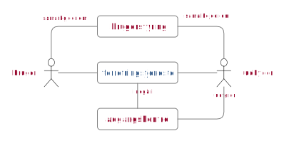
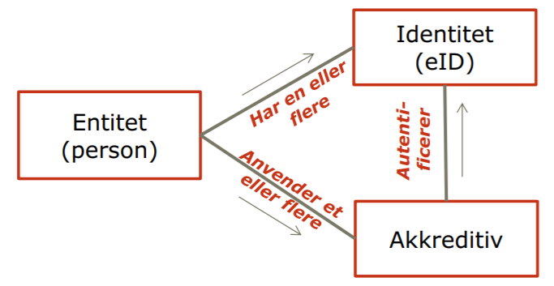
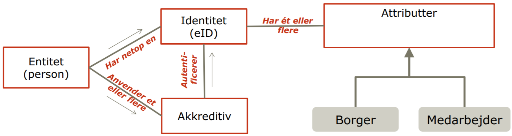
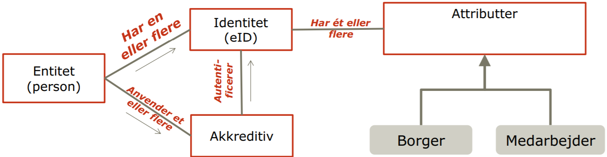
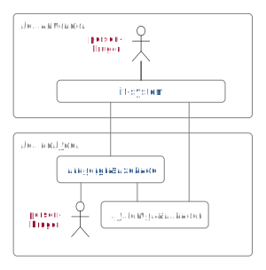

% Referencearkitektur for brugerstyring 2020
% Digitaliseringsstyrelsen
% December 2019

<pre class="metadata">
Title: arkitektur.digst.dk Brugerstyring
Status: LD
URL: http://github.com/digst/trust/index.md
Editor: Digitaliseringsstyrelsen http://arkitektur.digst.dk

Abstract: Fællesoffentlig referencearkitektur for brugerstyring. Denne version opdateres med use cases for 'non-person entities, IoT'
Boilerplate: copyright no, conformance no, abstract no
Shortname: trust
Max ToC Depth: 3
Markup Shorthands: markdown yes
Repository: digst/trust
Inline Github Issues: full
Logo: digst...
Slim Build Artifact:
</pre>

<h1>Fællesoffentlig  referencearkitektur for  brugerstyring</h1>

<h2 class="no-num">Forord</h2>
Denne referencearkitektur er udarbejdet i sammenhæng med den fællesoffentlige strategi for brugerstyring [Denne skal opdateres eller fjernes, selv strategien passser godt nok, men der direkte link til kan, skal og bør, plus kapitler.] og for at understøtte implementeringen af Den fællesoffentlige digitaliseringsstrategi 2016-2020. Målet er, at referencearkitekturen skal fungere som et teknisk pejlemærke for udvikling af brugerstyringsløsninger i den offentlige sektor. Dermed har den en tæt relation til den fællesoffentlige rammearkitektur, der er affødt af Digitaliseringsstrategiens initiativ 8.1 og bidrager til realiseringen af ”En digitalt sammenhængende offentlig sektor: Hvidbog om arkitektur for digitalisering” [1].

2017-udgaven af referencearkitekturen omfattede brugerstyring af personer. I denne udgave af referencearkitekturen er der yderligere behandlet applikationer som brugere og i noget omfang ting i form af IoT - Internet of Things eller NPE – Non person entities. Brugen af føderationer og tillidstjenester er uddybet.

Siden første udgave af referencearkitekturen er De fællesoffentlige regler for begrebs- og datamodellering blevet godkendt og udgivet. Derfor er begreberne i denne udgave opdateret og modelleret jfr. disse regler [Figurnr. indsættes]. Øvrige figurer, der illustrerer referencearkitekturen, følger begrebsmodellen mht. anvendelse af begreber, men indgår ikke som en del af begrebsmodellen.

<h2 class="no-num">Summary (in english)</h2>
<h2 class="no-num">Resume</h2>
[Skrives midt januar]

# Introduktion

## Formål, anvendelse og målgrupper
Den fællesoffentlige referencearkitektur for brugerstyring skal målrette og strukturere indsatsen for at skabe sammenhængende, effektive, sikre og brugervenlige løsninger på tværs af domæner, nationalt og transnationalt. Fokus er på det tværgående dvs. adgang til tjenester på tværs af organisationer, herunder føderationer på tværs af sikkerhedsdomæner med gensidig tillid.
Referencearkitekturens formål er at skabe en arkitekturmæssig ramme for, hvordan man skal indrette løsninger, så systemer understøttet af forskellige sikkerhedsløsninger kan kommunikere med hinanden. Herved bliver løsninger enklere at etablere og drive, brugerne undgår at skulle logge på flere gange, og oplysninger om brugere skal ikke vedligeholdes flere steder.

Referencearkitekturen skal kunne anvendes til at udpege standarder, der understøtter arkitekturen og dermed understøtte udarbejdelse af løsningsarkitektur i konkrete projekter. Arkitekturen anviser ikke i detaljer, hvordan myndigheder og virksomheder skal bygge løsninger, men fastlægger rammer og anviser standarder for løsninger, jfr. Hvidbog om arkitektur og digitalisering [1], hvor det fremgår, at fællesoffentlige referencearkitekturer "...definerer genbrugelige arkitekturbyggeblokke, som projekterne skal tage bestik af."
Referencearkitekturen kan anvendes i sammenhæng med andre fællesoffentlige referencearkitekturer, enten direkte eller ved domænearkitekturer, der bygger på de fællesoffentlige.

Dette dokument har tre målgrupper, som vil have forskelligt fokus i forhold til referencearkitekturens kapitler:

- Strategiske beslutningstagere inden for digitalisering og it, typisk digitaliseringschefer, it-chefer, afdelings- og kontorchefer og andre med rollen som systemejer. Kapitel 1 og 2, der indeholder introduktion til brugerstyring, strategi, centrale begreber og principper er særligt rettet mod denne målgruppe.
- Projektledere, arkitekter og udviklere hos myndigheder, virksomheder og leverandører, der har til opgave at kravspecificere, designe eller udvikle løsninger, hvor der indgår eller anvendes tværoffentlig brugerstyring. Ud over de to første kapitler er kapitel 3 og 4, der handler om forretningsarkitektur og teknisk arkitektur særligt rettet mod denne målgruppe.
- Arkitekter der udarbejder domænearkitekturer på basis denne referencearkitektur. De vil have særlig opmærksomhed på kapitel 3 og 4.

## Omfang og afgrænsning
Referencearkitekturen for brugerstyring omfatter offentlige tjenester, men referencearkitekturen kan desuden med fordel anvendes til ikke offentlige tjenester og til at understøtte tværgående brugerforløb med det offentlige.

Arkitekturen omfatter også rollen som leverandør af tillidstjenester - registreringstjenester, akkreditivtjenester, autentifikationstjenester, identitetsbrokere, attributtjenester mv. Arkitekturen omfatter desuden private virksomheders mulighed for at anvende bruger- og rolledata samt login-systemer.

Arkitekturen omfatter både brugeradministration og adgangskontrol, herunder det der på engelsk betegnes Credential and Identity Management (CIM), Identity Rights Management (IRM), Access Control (AC) og Identity and Access Management (IAM/IdAM).

Referencearkitekturen definerer, hvad en føderation omhandler i rammerne af brugerstyring, og den beskriver de opgaver, en føderation løser i denne ramme.

Denne version 1.1 af Referencearkitektur for brugerstyring er udvidet med de særlige aspekter vedrørende brugerstyring for ting, organisationer og applikationer - samlet betegnet som Non-Person Entities (NPE).

Med udspring i Digitaliseringspagten er der parallelt med opdateringen af denne referencearkitektur igangsat en analyse af håndtering af samtykke på tværs af den offentlige sektor med henblik på at afdække behov og muligheder inden for dette område. Samtykkeområdet er af denne årsag kun overordnet behandlet i nærværende udgave af referencearkitekturen.

## Centrale begreber
Referencearkitekturen beskriver administrationen og kontrollen med brugeres adgang til digitale tjenester. Tjenester udbydes af private og offentlige virksomheder, og anvendes af borgere eller andre virksomheder og deres ansatte.

Intentionen i denne version af referencearkitekturen er at skabe et fælles sprog om brugerstyring, som kan bidrage til at gøre samarbejdet om løsninger lettere. Desuden tilstræbes det, at området bliver mere tilgængeligt - også for det ledelsesniveau der har det endelige ansvar for adgangspolitikker og håndhævelsen af dem i forretningstjenester.

En forretningstjeneste er "eksternt synligt funktionalitet, der giver mening for omgivelserne". [ARCHI, check om EIRA rammer bedre] Hos offentlige myndigheder vil det typisk være en digital selvbetjening, som anvendes af borgere eller virksomheders ansatte, men termen dækker også over digitale tjenester der anvendes af it-systemer hos andre organisationer.

En udbyder udfører adgangskontrol, som indgår i en forretningstjeneste. Det gør udbyderen for at sikre sig, at brugerne får den korrekte adgang til at anvende tjenesten i henhold til tjenestens adgangspolitik. Adgangspolitikken kan være underlagt krav i lovgivning, fx hvis tjenesten giver adgang til personoplysninger.

En bruger og en udbyder vil samarbejde om hvordan adgangskontrollen udføres i praksis. Det kan omhandle aftaler om, hvem af en virksomheds medarbejder der må anvendes en tjeneste hos myndighed. Eller det kan være mere generelle aftaler om hvilke elektroniske identifikationsmidler en udbyder vil acceptere.

<figure>

<figcaption>Centrale begreber omkring brugerstyring</figcaption>
</figure>

<dfn>Forretningstjeneste</dfn> eksternt synligt funktionalitet, der giver mening for omgivelserne [ARCHI].

<dfn>Adgangskontrol</dfn> Håndhævelse af en tjenestes adgangspolitik. Adgangskontrollen styrer, hvilke handlinger brugere må udføre i en tjeneste, eller hvilke informationer brugere må få adgang til.

<dfn>Brugerstyring</dfn>, administration og kontrol af brugere og deres adgang til tjenester.

Det Europæiske Interoperabilitets Rammeværk, EIRA [2], Den Fælles Offentlige Digitaliseringsstrategi 2016-2020 [3] og Den fællesoffentlige digitale arkitektur (FDA) [4] beskriver en model for 'integrated service delivery' eller 'sammenhænge offentlige tjenester'. Grundideen er et opgør med isolerede digitale tjenester hos den enkelte myndighed, og et skift til bedre og bredere tjenester hvor en bruger oplever en samlet service på tværs af mange offentlige myndigheder. Et eksempel herpå er den sammenhængende brugerrejse Flytteguiden på borger.dk, der samler informationer og gøremål fra forskellige myndigheder og private virksomheder, som borgerne skal tage stilling til, når de flytter.

<figure>

<figcaption>Sammenhængende tjenester</figcaption>
</figure>

En sådan vision stiller særlige krav til brugerstyring. Brugerstyring sker ikke alene, når en bruger anvender den tværgående tjeneste, men vil gentages hos hver af de understøttende services.

Denne referencearkitektur beskriver hvordan tværgående tjenester kan understøttes af særlige tjenester med fokus på at etablere tillid og sikkerhed på tværs af tjenester i en form for fællesskab.

Føderationer er en forudsætning for referencearkitekturens adskillelse af brugerstyring i tillidstjenester og forretningstjenester, hvor tillidstjenesterne typisk er generelle og leveres af andre end dem der leverer forretningstjenesterne.

<dfn>Tillidstjeneste</dfn> udbydes særskilt, anvendes af bruger og forretningstjenesteudbyder i fælleskab... aftaler om tillidspolitikker

<dfn>Føderationer</dfn>, sammenslutning af tjenester med gensidig tillid.

## Tilblivelse, styring og andre referencearkitekturer

Denne version 1.1 af Referencearkitektur for brugerstyring er udarbejdet i Center for teknik og datastrategi (CTD) i Digitaliseringsstyrelsen med konsulentbistand fra ITCrew og Capgemini.

En følgegruppe af arkitekter fra den offentlige sektor har bidraget til opdateringen gennem en række af workshops. Følgende organisationer har været repræsenteret i gruppen: Kommunernes Landsforening, Danske Regioner, Styrelsen for Dataforsyning og Effektivisering, Styrelsen for It og Læring, Naturstyrelsen, Miljøstyrelsen, KOMBIT, Energistyrelsen, Energinet, Sønderborg Kommune og Københavns Kommune.

Inden godkendelse er referencearkitekturen blevet reviewet i regi af FDA ligesom der har været en offentlig høring af dokumentet med inddragelse af relevante offentlige og private interessenter.

Referencearkitektur for brugerstyring godkendtes i version 1.1 af Styregruppe for Data og Arkitektur under Den fællesoffentlige digitaliseringsstrategi 2016-2020 [3] i maj 2020. Styregruppen er herefter ejer af dokumentet, med CTD som ansvarlig for vedligehold af referencearkitekturen, der indgår i FDA.[Skal opdateres ved godkendelse]

Referencearkitekturen publiceres på arkitektur.digst.dk, hvor man kan finde beslægtede dokumenter vedrørende FDA.

En række offentlige domæner har udfærdiget egne arkitekturer på brugerstyringsområdet. Her kan nævnes sundhedsdatastyrelsens "Målbillede for tillidstjenester[check]" og [Kommunernes?]

[I bilag [XX] kan se liste over identificerede offentlige it-løsninger der realisere nogle af de applikationsroller og -services der beskrives i dette dokument]

## Anvendt metode, notation og signaturforklaring

Metodemæssigt er referencearkitekturen udarbejdet inden for rammerne af FDA og følger så vidt muligt den fælles skabelon for referencearkitekturer, som er udarbejdet i Sekretariatet for Styregruppen for Data og Arkitektur under Den fællesoffentlige digitaliseringsstrategi 2016-2020 [3].

I forhold til ejerskab af de elementer, der indgår i dokumentets figurer og definitioner, markerer:

-	Rød tekst: At et element eller en relation ejes og defineres i denne referencearkitekturs begrebsmodel
-	Blå tekst: At et element eller en relation er kendt, men ejes og defineres et andet, nærmere angivet sted, fx i andre referencearkitekturer
-	Grå tekst: At et element eller en relation er identificeret, men ikke nærmere defineret i denne referencearkitektur.

# Strategi

Referencearkitekturen udmønter og understøtter beslutninger i Den fællesoffentlige digitaliseringsstrategi 2016-2020 [3]. Strategien har tre, overordnede målsætninger:

- Det digitale skal være let, hurtigt og sikre god kvalitet

- Offentlig digitalisering skal give gode vilkår for vækst

- Tryghed og tillid skal i centrum

De tre målsætninger er understøttet af en række, specifikke initiativer, hvoraf Initiativ 8.1: Gode data og
effektiv datadeling er det konkrete ophæng for denne referencearkitektur.

## Forretningsmæssige behov
Forretningsbehovene tager udgangspunkt i de udfordringer, offentlige virksomheder skal være i stand til at håndtere. Fokus for referencearkitekturen for brugerstyring er især understøttelse af behov vedrørende sammenhængende, effektive, sikre og brugervenlige løsninger på tværs af domæner, nationalt og transnationalt.

### Lettilgængelige sammenhængende tjenester
Borgere og medarbejdere forventer, at tjenester er let tilgængelige og sammenhængende. Let tilgængeligt hvor tjenester kan nås med samme identifikation og med samme login. Ekstra login giver kun mening for brugeren hvis sikkerhedsniveauet skal hæves i forhold til et tidligere login.
Hvis en tjeneste gør brug af en anden tjeneste, er der behov for nem og sikker adgang til denne tjeneste. Da brug af tjenester fra andre tjenester er stigende, er der behov for ensartede metoder til at tilgå disse tjenester.
eIDAS forordningen [5] stiller krav om, at hvis en myndighed stiller en digital service til rådighed for borgerne og virksomhederne med anvendelse af en såkaldt notificeret eID-løsning, skal det være muligt at autentificere sig med notificerede eID-løsninger fra andre EU-lande med samme eller højere sikringsniveau.

### Retten til privatliv

Der skal være mulighed for en højere grad af kontrol over, hvilke data tjenester får adgang til og indsigt i, hvilke aktiviteter der udføres med en elektronisk identitet og mulighed for anonymitet mv.
En tjeneste har ikke altid behov for at kende identifikation af brugeren for at kunne afgøre dennes adgang til en service. Tillidstjensten skal her nøjes med at sende relevante attributter til tjenesten, dataminimeringsprincippet.

- Ved et køb af billet til bus eller tog er der, et behov for at levere et bevis for betaling, men ikke for kundens identitet.
- Nogle tjenester har blot brug for oplysninger om hvorvidt brugeren er myndig (alder>18) eller vedkommendes bopælskommune.

I forbindelse med det nye MitId, kan private og erhvervsmæssige identiteter forbindes. For at sikre retten til privatliv er denne funktionalitet beskyttet af et dobbelt frivillighedsprincip, hvor forbindelsen kun kan bruges, hvis både medarbejder og virksomhed siger god for det. Ref[Se datatilsynets vejledning, udspring af GDPR][6]

### Sikkerhed og tillid
Tjenester skal til enhver tid bygge på tilstrækkelig sikkerhed, så borgernes data ikke kompromitteres eller tjenesterne misbruges. Mange offentlige tjenester rummer fortrolige data, som kræver høj sikkerhed, mens andre er mindre kritiske og derfor ikke med lavere sikkerhedsbehov.
Det er helt centralt for realiseringen af en effektiv digitalisering, at brugerne har tillid til de tjenester, der udbydes og den sikkerhed, de beskyttes med. Når tjenester bliver mere sammensatte skal denne tillid kunne opfyldes af alle tjenester der er omfattet.  

### Delegering og fuldmagt
En del borgere har behov for at kunne give andre fuldmagt til at løse opgaver for sig.
Myndigheder er omfattet af reglerne om partsrepræsentation, og deres tjenester skal derfor understøtte anvendelse af fuldmagt. Ellers skal myndigheden etablere manuelle løsninger til partsrepræsentation.
I forhold automatiseringsrobotter er der et behov for, at en person eller en organisation kan delegere rettigheder til en automatiseringsrobots identitet.

### Effektivitet

Offentlige tjenester skal leve op til kravene om forvaltningsrevision, hvor det vurderes om systemer og processer understøtter sparsommelighed, produktivitet og effektivitet. Private tjenester vil på den anden side være underlagt et ønske om profit. Alle tjenester har derfor et behov for at være effektive, hvilket kan udtrykkes i behov som:

- Enkel og samlet administration af brugere.
- Sammenhæng imellem brugerstyring i forskellige organisation både private og offentlige.
- En sammenhængende brugerstyring, så tjenester kan implementeres effektivt.
- Kontrol af medarbejdernes anvendelse af elektronisk identitet på virksomhedens vegne, da det både juridisk og kommercielt kan være forpligtende for brugerorganisationen.

Når man bygger en forretningstjeneste, er det dyrt selv at bygge brugerstyring. Der er derfor en god business case i, at udvikle forretningstjenesten for sig og tilgå brugerstyring som en tjeneste.

## Principper

Principperne der benyttes i denne referencearkitektur er dels fra den Fællesoffentlige Digitale Arkitektur (FDA), hvorfra en række principper er fremhævet og dels principper fastlagt i forbindelse med denne arkitektur.

Vi understøtter særligt...: 3, 4, 5

Derudover kan en række af de øvrige arkitekturregler udfoldes og konkretiseres i forhold til denne referencearkitektur:

### Samlet? brugeradministration

Princip der fastlægger at brugeradministration er en tværgående funktion og sker i dedikerede systemer uden for fag- og selvbejtningssystemer... (se mere under afsnittet forretningsfunktioner).

### Føderation

Princip der fastlægger at tjenesteanvender og tjenesteudbyder indgår i forpligtigende fællesskaber om udformning af tillidspolitikker og adgangspolitikker. (Se mere under afsnittet om forretningsmønstre)

### Harmoniserede tillidstjenester

Princip om at føderationer baserer sig på harmoniserede krav til tillidstjenester for at sikre et konkurencebaseret marked. (Se mere under afsnittet områder for standardisering)

## Vision

Digitaliseringsstyrelsen udgav i april 2017 "Fællesoffentlig strategi for brugerstyring" [7] efter godkendelse i Styregruppen for udbud af fællesoffentlige komponenter. Her fastlægges en vision med tre elementer:

1. Borgere, virksomheder og myndigheder har adgang til en let og effektiv brugerstyring på tværs af løsninger.

2. Løsningerne bindes sammen på tværs af domæner.

3. Brugerstyring sker på en måde som fremmer sikkerhed, tillid, privatlivsbeskyttelse, valgmuligheder, innovation, og som øger anvendelsen af tjenester.

Denne version af referencearkitektur for brugerstyring ligger i forlængelse af denne vision.

[Beskriv hvordan hvert enkelt element er understøttet af temaer og strategiske principper fra dette dokument]

## Værdiskabelse
Ved af efterleve principper og mønstre i denne referencearkitektur opnås værdiskabelse på en række områder:

- Det bliver hurtigere og billigere at etablere forretningstjenester med en høj grad af sikkerhed, fordi kompleks håndtering af brugerstyring tilvejebringes som en service af tillidstjenester, der er specialiserede i området.
- Tab som følge af svindel og misbrug nedbringes, når sikkerheden øges gennem profesionelle, dedikerede tillidstjenester.
- De adminstrative udgifter til administration af brugere reduceres, når brugere kan administreres samlet og effektivt frem for i en række adskilte siloer.
- Udgifterne til systemintegration og sikring af sammenhængende arbejdsgange reduceres, når de underliggende forretningstjenester er baseret på de samme arkitektoniske principper for brugerstyring. Ofte er uheldigt udformet brugerstyring et stort praktisk problem for integration af systemer og processer.
- Brugerne spilder mindre tid på at udføre deres opgaver i forretningstjenester, når skift mellem disse kan ske sømløst (fx via single sign on) og identifikationsmidler kan genbruges på tværs. Brugerne vil således opleve færre barrierer for udførelse af deres egentlige arbejde og kan dermed være mere effektive.  

## Juridiske rammer

De mest relevante love og forordninger, der har særligt fokus på brugerstyring og adgangskontrol, er:

- eIDAS forordningen [5] (electronic IDentification, Authentication and trust Services) som regulerer tillidstjenester og elektroniske identifikationsordninger.
- Lov om NemID og MitID.
- EU-databeskyttelsesforordningen (GDPR) som beskriver pligter og rettigheder ved behandling af persondata.
- Databeskyttelsesloven som i dansk kontekst supplerer GDPR.
- Forvaltningsloven som indeholder regler om borgernes retsstilling over for den offentlige forvaltning. I forbindelse med sagsbehandling i offentlige forvaltninger regulerer loven blandt andet retten til partsrepræsentation.

Dertil kan der være særregulering inden for visse domæner som fx sundhedsområdet.

Som eksempler på hvordan ovennævnte regulering påvirker brugerstyring kan nævnes:
- Databestyttelsesforordningen stiller krav om, at dataansvarlige træffer relevante sikkerhedsforanstaltninger ved behandling af persondata på baggrund af en risikovurdering.
- eIDAS-forordningen stiller i artikel 6 krav om, at en række tjenester udstillet af offentlige myndigheder skal kunne tilgås af borgere og virksomheder i andre EU-lande ved brug af de elektroniske identifikationsmidler, som det enkelte EU-land har udstedt. Uden brug af føderationer og eksterne tillidstjenester ville dette være en helt uoverskuelig opgave for den enkelte forretningstjeneste at skulle integrere med alle øvrige EU-landes nationale identifikationsordninger.
- Forvaltningsloven stiller krav om at den, der er part i en sag med det offentlige, skal kunne lade sig partsrepræsentere. Dette kan betyde, at en myndighed, som udstiller fuldt digitale løsninger, er nødt til at kunne håndtere digitale fuldmagter.

## Sikkerhed
Fastlæggelse af niveau for og håndtering af informationssikkerhed skal foretages af alle offentlige organisationer og tage udgangspunkt i ISO/IEC 27001-standarden for styring af informationssikkerhed. ISO 27001 er valgt som statslig sikkerhedsstandard og har været obligatorisk at følge for statslige institutioner siden januar 2014, og også kommunerne er forpligtet til at følge principperne.

Realiseringen skal ske gennem et ledelsessystem for informationssikkerhed (Information Security Management System, ISMS). Digitaliseringsstyrelsen har udarbejdet vejledninger, værktøjer og skabeloner hertil, som er placeret her: http://www.digst.dk/Informationssikkerhed.

Hovedindholdet i ISO/IEC 27001 er, at niveau for og håndtering af informationssikkerhed tager udgangspunkt i en risikovurdering. Organisationens ledelse fastlægger på baggrund af en risikovurdering et sikkerhedsniveau, som svarer til den forretningsmæssige betydning af de aktiver (fx informationer), som organisationen ejer, vedligeholder og har dataansvaret for, og de tjenester som den stiller til rådighed for andre organisationer af alle typer. Organisationen skal gennemføre en afbalanceret risiko- og konsekvensvurdering under hensyntagen til de økonomiske forhold og herudfra fastlægge:

- retningslinjer
- forretningsgange og instrukser
- sikkerhedsforanstaltninger, som beskytter organisationen på de risikoniveauer, der er valgt. De vil ofte være forskellige, afhængigt af de konkrete informationer og tjenester.

ISO/IEC 27001 standarden er opdelt i 14 domæner, hvor brugerstyring særligt er relevant for domænet 'Access Control' og for management delen en del af domænet 'Information Security Policies'.

### Risici vedr. brugere
Indenfor domænet 'brugerstyring' er det særligt relevant at beskæftige sig med risici knyttet til håndtering af digitale identiteter, rettigheder og identifikationsmidler - herunder risikoen for, at 'forkerte' brugere tilgår en forretningstjeneste eller opnår forkerte adgange. National Standard for Identiteters Sikringsniveauer (NSIS) er her et afgørende element i den samlede risikostyring, som gør det muligt at udtrykke graden af tillid til en autentificeret identitet på en tre-trinsskala: Lav, Betydelig, Høj. NSIS kan benyttes både af brugerstyringstjenester, som leverer autentificerede identiteter, og af forretningstjenester som aftager identiteter. NSIS er en standard, som er udarbejdet og aftalt fællesoffentligt efter en bred offentlig høring, og den er en dansk pendant til eIDAS forordningens retsakt om sikringsniveauer.

NSIS giver mulighed for:

- Sammenhængende løsninger på tværs af domæner og føderationer via gensidig tillid.
- En fælles forståelse samt koordinering/styring af sikringsniveauer.
- Transparens gennem tydelig beskrivelse af krav til parterne og regler for deres adfærd.
- En flerleverandørstrategi baseret på outsourcing af funktioner med mulighed for private aktører - hvor det er ønskeligt og økonomisk fordelagtigt.
- Veldefineret kontrol og styring gennem anmeldelse, revision og tilsyn.

Når en bruger autentificerer sig mod en forretningstjeneste, vil det aktuelle sikringsniveau for autentifikationen typisk blive fastlagt og kommunikeret til forretningstjenesten. Forretningstjenesten kan så på baggrund af sikringsniveauet, samt øvrige attributter om brugeren, beslutte, hvilken adgang brugeren kan få i tjenesten.

# Forretningsarkitektur

Brugerstyring dækker opgaver og funktioner i forbindelse med håndtering af brugere af digitale løsninger. Det er således en fælles betegnelse for de foranstaltninger, som sikrer, at de rette brugere får adgang til de rette it-systemer (herunder data) - og at alle andre afvises. Brugerstyring involverer dels *administration* af brugeridentiteter (før de tilgår it-systemer), herunder registrering og udstedelse af identifikationsmidler, beskrivelse af attributter i form af egenskaber, roller, relationer mv. og dels en 'run-time' del, når brugere tilgår it-systemer, som bl.a. involverer autentifikation og udførelse af adgangskontrol.

Figuren herunder viser de væsentligste elementer i brugerstyringsdomænet (røde kasser) og kontekst i form af blå og grå kasser.

<figure>

<figcaption>Oversigt over brugerstyringsdomænet</figcaption>
</figure>
 

Det øverste lag i figuren omhandler styringen i form af ledelse af informationssikkerhed. Det er her ledelsen i en organisation godkender sikkerhedspolitikker, og giver mandat til det sikkerhedsniveau, der skal opnås, hvordan identificerede risici håndteres, og hvordan persondata beskyttes. Her er organisationen dels underlagt lovgivning og regulering (som fx databeskyttelsesforordningen) og dels egne forretningsmæssige vurderinger af risici, risikoappetit mv.

På baggrund heraf udformes dels politikker for adgang til egne tjenester (adgangspolitikker), som beskriver kriterier og sikkerhedsniveauer for adgang, og dels politikker for anvendelse af eksterne parter i forbindelse med brugerstyring (tillidspolitikker).

For at realisere politikkerne opereres der med en række tillidstjenester, der udfører betroede funktioner i brugerstyringen. Disse omfatter udstedelse elektroniske identifikationsmidler, som brugerne kan autentificere sig med, de omfatter beskrivelse af attributter ved brugerne (fx navn, egenskaber, roller, relationer, bemyndigelser osv.), og de omfatter endelig autentifikation af brugere. *Tillidstjenester* udfører som nævnt betroede funktioner, der understøtter forretningstjenesterne - herunder særligt den adgangskontrol, som forretningstjenesterne skal varetage, før der gives adgang til systemer og data.

I den tekniske arkitektur, der er beskrevet i næste kapitel, nævnes en række supplerende funktioner (fx billetudstedelse, brokering, discovery), som ikke optræder på forretningsniveau.

En tjeneste og et it-system er i denne kontekst synonymer for det samme: et stykke it, der kan levere informationer og funktionaliteter. Et stykke it, der optræder som leverandør, kaldes en tjeneste eller tjeneste*udbyder*. Et stykke it, der optræder som den bruger, der efterspørger informationer og funktionalitet, kaldes en tjenestekonsument. Det samme stykke it kan optræde både som leverandør (være en tjeneste) og i sin udførelse af tjenesten optræde som bruger (være en tjenestekonsument) over for andre tjenester.

## Om tillidstjenester og eIDAS
I denne referencearkitektur anvendes betegnelsen 'tillidstjeneste' i bred forstand om en tjeneste, der udfører betroede funktioner til  understøttelse af brugerstyring. Med denne terminologi opnås et tydeligt skel til forretningstjenester.
Anvendelsen af termen 'tillidstjeneste' er dermed væsentligt bredere her end i eIDAS-forordningen, som regulerer nogle specifikke former for tillidstjenester (hovedsageligt) indenfor PKI-området:
- Certifikatudstedere (CA)
- Tidsstemplingsservices
- Valideringstjenester for validering af elektroniske signaturer, elektroniske segl og tidsstempler
- Tjenester til bevaring af signaturer, segl og certifikater
- Elektroniske registrerede leveringstjenester.

eIDAS-forordningen stiller en række krav til udbydere (PKI)-tillidstjenester, som ikke skal forveksles med tillidstjenesterne i denne referencearkitektur. For eIDAS tillidstjenesterne findes endvidere et særligt niveau (kvalificerede tillidstjenester), som er er underlagt særlige krav og tilsyn - men også har særlige privilegier. Eksempelvis vil en kvalificeret signatur udstedt på baggrund af et kvalificeret certifikat have samme retsvirkninger som en papirbaseret underskrift (eIDAS artikel 25).

De forskellige typer af tillidstjenester er illustreret på nedenstående figur:

<figure>

<figcaption>Oversigt over de forskellige typer af tillidstjenester</figcaption>
</figure>
 

Det er som tidligere nævnt vigtigt at være opmærksom på, at eIDAS-forordningen stiller krav om, at hvis en myndighed stiller en digital service til rådighed for borgerne og virksomhederne med anvendelse af en national eID-løsning, skal det være muligt at autentificere sig med anmeldte eID-løsninger fra andre EU-lande med samme eller højere sikringsniveau. I kontekst af figuren ovenfor kan man sige, at eIDAS dikterer nogle elementer af visse (offentlige) tjenesters adgangspolitik, nemlig at tjenesterne skal være tilgængelige for andre EU-landes borgere og virksomheder. [[eIDAS]]

## Forretningsmæssig kontekst
Et helt centralt tema i denne referencearkitektur er, at forretningstjenester og tillidstjenester arbejder sammen om at udføre brugerstyring - såkaldt *shared use cases*. Her opfattes tillidstjenesterne ofte som noget infrastruktur, der muliggør en sikker forretningsmæssig anvendelse af et it-system.  Grundlaget for samarbejdet er baseret på tillid, som gør det muligt for forretningstjenesten at uddelegere betroede funktioner til en tillidstjeneste udbudt af en tredjepart. Tilliden kan være rodfæstet i lovgivning, i standarder og rammeværk med indbygget kontrol og styring eller i aftaler (herunder databehandleraftaler). Et vigtigt eksempel er National Standard for Identiteters Sikringsniveauer (NSIS), som gennem krav og kontrol via revisionserklæringer gør det muligt at have tillid til (og kvantificere risici for) autentificerede identiteter, der er håndteret af en ekstern part (tillidstjeneste). NSIS definerer tre sikringsniveauer for en autentificeret identitet (Lav, Betydelig, Høj), og gør det dermed muligt både at klassificere tillidstjenester i forhold til disse og indrette tjenesters adgangspolitikker differentieret.

Nedenstående figur viser et funktionelt overblik med fokus på samarbejdet mellem udbydere af tillidstjenester og forretningstjenester.

<figure>

<figcaption>Samarbejde mellem tillidstjenester og forretningstjenester</figcaption>
</figure>

 

Bemærk at figurerne ovenfor er udtryk for abstrakte forretningsbeskrivelser, og at man i en konkret arkitektur fx kan have flere forskellige parter, som udfører fx attributbeskrivelse i et konkret scenarie. Det kan således variere betydeligt, hvilke attributter forskellige tjenester har behov for at kunne håndhæve deres adgangspolitik, samt de mekanismer attributter tilvejebringes med (fx push eller pull).

I det efterfølgende kapitel om den tekniske arkitektur beskrives det mere konkret, hvordan attributter kan håndteres i brugerstyring. Ofte formidles de fx af sikkerhedshensyn som signerede data (*security tokens* eller *billetter* på dansk), og ofte er der tekniske komponenter (brokere), som orkestrerer indsamling og formidling af attributter fra forskellige kilder for at lette byrden for forretningstjenester. Det er således ikke ligegyldigt, hvordan forretningsfunktioner udmøntes i en teknisk arkitektur - særligt når der er et ønske om at opnå et sikkert, sammenhængende og brugervenligt økosystem.

## Tillidstjenester
I dette afsnit beskrives tillidstjenester fra ovenstående figur i lidt større detaljer.

[Vi skal lige overveje forholdet mellem forretningstjenester, funktioner og applikationsservice. Det ser ud til attributregistrering og attestation er to funktioner hos den samme forretningstjeneste. Gælder det også for id-midler]

[Er der virkelighed tale om to forskellige forretningsprocesser: Brugerstyring(administration), "Anvendelse af forretningstjeneste, med adgangskontrol". Og måske er det princippet... at der sker i en særskilt proces og ikke ved første brug af servicen... Vi mangler nogle gode overordnede generiske processer... /madsh ]

### Tillidstjenesten udstedelse af identifikationsmidler

Formålet med at udstede identifikationsmidler til brugerne er, at de kan autentificere sig som en entydig identitet, når de interagerer med forretningstjenester (og evt. tillidstjenester). National Standard for Identiteters Sikringsniveau (NSIS) beskriver og stiller krav til delprocesserne under udstedelse:

- Ansøgning og registrering
- Verifikation af identitet
- Levering og aktivering af identifikationsmidler
- Suspendering, spærring og genaktivering
- Fornyelse og udskiftning.

I brugerstyring er det en forudsætning, at brugerne registreres og tildeles en identitet, som forbindes til et identifikationsmiddel. **Registreringen** af identiteten kan varetages af en underfunktion (registreringstjeneste), som også verificerer identiteten (identitetssikring). Eksempelvis agerer banker & borgerservice som registreringstjenester for NemID/MitID løsningerne. Processen for udstedelse af identifikationsmidler kan variere betydeligt i kvalitet, i forhold til hvilke attributter der valideres og scope for den efterfølgende anvendelse.

I NSIS opereres der med, at identiteten kan valideres på tre forskellige sikringsniveauer (fx i forhold til om brugeren har gennemført en on-line registrering, er mødt fysisk op, har præsenteret pas/kørekort osv.). Kvaliteten af en identitetssikring betegnes ofte *Identity Assurance Level*.

> Personer registrerer selv deres Facebook-identitet, hvor kun e-mail adressen verificeres, mens NemID/MitID-identiteter får valideret navn og CPR-nummer.

Efter oprettelse af den elektroniske identitet skal et **identifikationsmiddel** (fx kodeord, PIN, fingeraftryk) **tilknyttes** til identiteten. Identifikationsmidler anvendes til at autentificere identiteten i modsætning til attributter, som beskriver identiteten. En udsteder af identifikationsmidler skal dels sikre sammenhængen mellem identifikationsmidlet og identiteten, og dels stå inde for identifikationsmidlets tekniske styrke (se næste afsnit). Udstederen kan knytte allerede udstedte identifikationsmidler til identiteten eller udstede et nyt identifikationsmiddel og tilknytte dette til identiteten. Styrken af identifikationsmidler er ligeledes klassificeret i NSIS og tager afsæt i bl.a. antallet af autentifikationsfaktorer, hvor resistent det er mod angreb, samt andre sikkerhedsmæsige egenskaber.

Det er centralt i denne referencearkitektur, at der opereres med en *løs* kobling mellem identiteter og identifikationsmidler. Eksempelvis kan et identifikationsmiddel benyttes til at autentificere flere forskellige identiteter (hørende til samme entitet). Et eksempel på dette i fællesoffentlig kontekst er, når samme private NemID/MitID både kan bruges til autentificere både en privatperson og en ejer (fuldt ansvarlig deltager) for en enkeltmandsvirksomhed. Brugeren skal altid i brugssituationen være oplyst om, hvilken elektronisk identitet vedkommende optræder med.

CPR-nummeret er en attribut, som desværre også historisk er brugt som identifikationsmiddel - dvs. som bevis for identitet. Denne anvendelse af CPR-nummeret er imod regler fra CPR-kontoret, men anvendes stadig i et vist omfang.

I forbindelse med registreringen eller efter denne kan identitetens karakteristika og egenskaber **beskrives i form af attributter** (fx køn, adresse, alder, et nummer i form af fx personalenummer). For medarbejderidentiteter foretages en del af registreringen typisk af en administrator, der er udpeget af virksomhedens ledelse. En central del af registreringen består i at sikre relationen mellem virksomheden (som juridisk enhed) og medarbejderen (som fysisk person). For IoT-enheder kan en del af registreringen ske af brugeren eller ejeren - fx når en person tilknytter en elektronisk blodtryksmåler til sin profil på en sundhedstjeneste og giver den adgang til at indberette på denne.

### Tillidstjenesten autentifikation

Autentifikation er en proces, som genkender og verificerer en identitet (tilknyttet en entitet) gennem anvendelse af et identifikationsmiddel, der er koblet til identiteten som beskrevet ovenfor. Ved flerfaktor autentifikation forstås en autentifikationsproces, hvor det anvendte elektroniske identifikationsmiddel er baseret på flere autentifikationsfaktorer fra forskellige kategorier (noget kun brugeren ved, er, eller er i besiddelse af). Et eksempel her på findes i NemID/MitID, hvor brugerne kan logge på med en kombination af et hemmeligt kodeord og 'swipe' i en App.

Autentikationsfunktionen varetages i nogle tilfælde af den part, der har udstedt identifikationsmidlet (fx fordi denne kender brugerens password eller en afledt værdi heraf), men den kan også være separat for udstederen (fx kan man i PKI-baseret autentifikation verificere brugerens kontrol over den private nøgle op mod det tilhørende certifikat).

Styrken af en autentifikationsproces klassificeres i NSIS som AAL (Authenticator Assurance Level) og indplaceres på den sædvanlig tretrins skala (Lav, Betydelig, Høj), og kan dermed indgå i adgangspolitikker for tjenester.

I praksis kombineres autentifikationsfunktionen ofte med attributbeskrivelse, således at den identitet, som formidles til tjenesten, er beriget med yderligere oplysninger - og den kombinerede funktion betegnes ofte som *broker* eller *identitetsbroker*. En anden vigtig egenskab ved autentifikationstjenester er, at de kan afkoble forretningstjenester fra at kende til detaljerne i validering af brugernes identifikationsmidler. I føderationer er det bærende princip, at forretningstjenester ikke må udføre autentifikation selv. Ved at delegere denne funktion til en ekstern tillidstjeneste opnås en lang række fordele som fx en mere sammenhængende, sikker og skalerbar arkitektur, hvor brugerne kan genbruge deres identifikationsmidler på tværs af forretningstjenester.

### Tillidstjenesten registrering af attributter
Som tidligere nævnt bruges termen *attributter* i denne referencearkitektur som en generalisering over 'data om brugere', som i praksis kan dække over en lang række forskellige typer oplysninger. Funktionerne, som omhandler attributter, opdeles typisk i registrering og *attestering*.

Eksempler på opgaver inden for området kan være:
- Administration af brugere i et brugerkatalog (fx et AD) med navn, titel, email, afdeling osv. underlagt governance og ledelse i en organisation.
- Tildeling (og udstilling) af roller og fuldmagter til brugere.
- Udstilling af autoritative data der beskriver brugere som fx CPR-registret, CVR-registret, Sundhedsstyrelsens autorisationsregister mv.
- Autoritativ beskrivelse af relationer mellem brugere og andre objekter/subjekter (ansat i, forælder til, tegningsberettiget for, ejer af, værge for).

Der er som tidligere nævnt både et aspekt, som vedrører administration, og et aspekt vedrørende udstilling. Førstnævnte handler fortrinsvis om datakvalitet og autoritative kilder, hvor sidstnævnte handler om at gøre attributter tilgængelige for forretningstjenesters adgangskontrol samt sikre deres integritet mens de kommunikeres i en infrastruktur.

Traditionelt har ordet 'autorisation' også været anvendt i brugerstyring i forskellige betydning om det at have rettigheder til en tjeneste og/eller til data i tjenesten:
I denne referencearkitektur benyttes attributbeskrivelse som en bredere og mere generel term end 'autorisation' for bedre at kunne dække den mangfoldighed af adgangspolitikker, der eksisterer.

Formålet med attributbeskrivelsen er i sidste ende at tilvejebringe grundlaget for den adgangskontrol, der udføres i en forretningstjeneste. En forretningstjeneste kan således have brug for at kende brugerens alder, køn og bopælskommune for at kunne afgøre, hvilket adgang der skal gives. Udførsel af adgangskontrol beskrives nedenfor.

### Tillidstjenesten attestering af attributter
Termen attestering dækker over, at attributter ikke blot udstilles som almindelige data, men at en tillidstjeneste står på mål for dem, således at forretningstjenester kan fæstne lid til dem og anvende dem til beslutninger i deres adgangskontrol. På en engelsk benyttes ofte betegnelsen 'verified claims'.

Tillidsbegrebet er således vigtigt for attributter, idet de indgår som væsentligt input til beslutninger i adgangskontrollen. I en adgangspolitik bør man derfor forholde sig hvilke kilder til attributter (attributtjenester), der er tillid til, og i hvilken grad. I visse tilfælde kan attributter kan endda være oplyst af brugeren selv (*self-asserted claims*), hvilket kan være helt på sin plads, forudsat at dette er beskrevet i adgangspolitikken, og dermed har været genstand for en risikovurdering.

## Forretningsfunktioner

### Forretningsfunktionen udforme adgangspolitik
Tjenesteudbydere bør udarbejde en adgangspolitik for deres forretningstjenester, som definerer betingelser for adgang til funktioner og data. En adgangspolitik kan fx udtrykke, at en tjeneste kun må tilgås af identiteter autentificeret på NSIS sikringsniveau Høj, som er tilknyttet et bestemt CVR-nummer, og er tildelt en bestemt rolle. Adgangspolitikker kan i praksis være formuleret mere eller mindre eksplicit (og adskilt fra implementeringen). Eksempelvis kan en borgerrettet selvbetjeningsløsning have en meget simpel politik om, at hver borger (udpeget ved CPR) får adgang til egne data. Det afgørende er, at adgangspolitikken er i overensstemmelse med ledelsens anvisninger i form af informationssikkerhedspolitik, risikovurderinger mv.

For at sikre overensstemmelse mellem adgangspolitik og den efterfølgende adgangskontrol, som håndhæver politikken, kan adgangspolitikken med fordel udtrykkes i termer af attributter, der er tilgængelige via attributbeskrivelsen. Dette er fx særligt relevant i token-baserede realiseringer, hvor adgang opnås på baggrund af attributter beskrevet i et security token. Jo mere standardiserede adgangspolitikker er på tværs af tjenester, jo lettere er det for brugere og brugerorganisationer at administrere i overensstemmelse med adgangspolitikkerne. Fællesoffentligt er visse attributter standardiseret (fx i OIOSAML profilerne), og nogle domæner har standardiseret en række attributter (dette gælder fx på sundhedsområdet).

<figure>

<figcaption>Adgangsrettigheder – Samspil mellem bruger og tjenesteudbyder</figcaption>
</figure>
 

Adgangspolitikker kan benytte roller som basis (Role Based Access Control – RBAC), eller man kan arbejdet direkte med attributter (Attribute Based Access Control - ABAC). I begge tilfælde vil en fælles forståelse kunne udtrykkes med en klassifikation, der systematisk beskriver roller eller andre attributsæt, evt. i form af et hierarki.

### Forretningsfunktionen udforme tillidspolitik
Udformning af tillidspolitikker handler om at gøre det eksplicit, hvilke tillidstjenester der vurderes som troværdige til forskellige anvendelser ud fra en risikovurdering. En forretningstjeneste kan fx beslutte, at den kun vil anvende autentifikationstjenester, som er NSIS anmeldte (som identitetsbrokere) på et givet sikringsniveau, mens en anden forretningstjeneste kan beslutte, at den stoler på autentifikationer fra en bestemt broker, der ikke er NSIS anmeldt - fx på baggrund af en aftale eller kontrakt med den pågældende broker. Et andet eksempel på en tillidspolitik kan være, hvorvidt en cloud-baseret tillidstjeneste anerkendes af en bestemt forretningstjeneste.

Det er vigtigt, at til og fravalg af tillidstjenester sker ud fra en informeret stillingtagen og forretningsmæssig vurdering af sikkerhed, tillid og andre former for garantier (SLA, lovkrav, revisionserklæringer).

### Forretningsfunktionen adgangskontrol

**Adgangskontrol** er den proces, hvor en tjenesteudbyder (på baggrund af forudgående autentifikation og attributbeskrivelse) sikrer, at der gives adgang til funktionalitet og data i overensstemmelse adgangspolitikken. Man taler også om håndhævelse af adgangspolitikken - og nogle tekniske standarder (XACML) opererer med begrebet 'Policy Enforcement Point'. Adgangskontrollen kan endvidere benytte attributter om den aktuelle brugerkontekst (fx brugerens IP-adresse, geolokation, tidspunktet på dagen, data om brugerens enhed osv.) til yderligere kvalificering af risikoen ved at tillade adgang.

Adgangskontrol er altid forretningstjenestens ansvar (herunder den dataansvarliges ansvar, hvis tjenesten giver adgang til personoplysninger), men dele af den kan udføres af hjælpefunktioner.

### Forretningsfunktionen forebyggelse og kontrol
Forebyggelse af svindel og kontrol med brugeridentiteter er relevant i alle systemer, både i forretningstjenester og i tillidstjenester. Aftaler om og standarder for kontrol og audits kan være beskrevet lovgivning, standarder (fx NSIS), vilkår, aftaler, regler i føderationers grundlag mv. Tillidstjenester indgår typisk som en del af sikkerheden i mange forretningstjenester, og skal have ekstra fokus på kontrol og forebyggelse.

Staten har i december 2014 offentliggjort (og senere revideret) en strategi for cyber- og informationssikkerhed, som har til formål fremover at professionalisere statens arbejde med informationssikkerhed og øge samfundets robusthed mod cyberangreb. Strategien omfatter 27 konkrete initiativer, der skal bidrage til at øge informationssikkerheden og styrke beskyttelsen mod cyberangreb.

Strategien sætter fokus på udfordringerne og skaber en klar retning for den fremadrettede indsats. Truslerne på cyber- og informationssikkerhedsområdet er dog en dynamisk størrelse, og der vil derfor løbende være fokus på effekten af de 27 initiativer.

Strategien indeholder en lang række initiativer på tværs af seks indsatsområder:

1. Professionalisering og styrket it-tilsyn
2. Klare krav til leverandører
3. Styrket cybersikkerhed og mere viden på området
4. Robust infrastruktur i energisektoren og telesektoren
5. Danmark som stærk international medspiller
6. Stærk efterforskning og klar information til borgere, virksomheder og myndigheder.

Med den stadigt stigende hackeraktivitet kloden over bliver arbejdet med at sikre kvaliteten af kontrol og forebyggelse af sikkerhedsbrud mere og mere vigtigt. Det skal ske i forbindelse med den registrering, autentifikation, billetudstedelse og adgangskontrol, der er kernen i brugerstyring. Dermed er det også et emne for informationssikkerhedspolitikken og dennes udmøntning i en tværgående fællesoffentlig føderation.

Flere af de angreb mod organisationers it-infrastruktur som opleves, er rettet mod at forfalske identiteter, identifikationsmidler og adgangsbilletter, eller at give sig ud for at være den rette ihændehaver af identiteter, identifikationsmidler og adgangsbilletter. Det centrale i forhold til brugerstyring er derfor hurtigt at kunne reagere ud fra den mest aktuelle viden gennem sikkerhedsforanstaltninger. Andre angreb forsøger at begrænse tilgængeligheden gennem Distributed Denial of Service-angreb mod kritiske elementer i it-infrastrukturen, herunder fællesoffentlige identitetssystemer. Center for Cybersikkerhed udsender jævnligt en opdatering af det aktuelle trusselsbillede for cyberangreb.

Til at styrke området har staten samlet kræfterne i Center for Cybersikkerhed (CFCS), og nogle private organisationer udstiller deres CERT eller CSIRT-funktion. Disse organisationer håndterer sikkerhedshændelser og arbejder på at forebygge sikkerhedshændelser:

- Netsikkerhedstjenesten i CFCS rummer statens Computer Emergency Response Team (CERT)
- NC3 er statens National Cyber Crime Center under Rigspolitiet
- DKCERT er Danmarks akademiske Computer Emergency Response Team under Danish e-Infrastructure Cooperation (DeIC), der overvåger netsikkerheden på forskningsnettet
- Finanssektoren har etableret en nordisk FinansCERT, der deler oplysninger om cybertrusler på tværs af de nordiske banker.
- Flere større virksomheder har deres eget computer security incident response team (CSIRT), et synonym for CERT.

Der stilles desuden i højere grad krav om notifikation til relevante myndigheder i forbindelse med sikkerhedshændelser. Fx skal tillidstjenesteudbydere, jf. eIDAS, notificere Digitaliseringsstyrelsen, og i medfør af persondataforordningen (GDPR), skal dataansvarlig notificere Datatilsynet ved sikkerhedshændelser. Som led i et beredskab skal man således sikre sig, at man kan informere de rette myndigheded inden for fastlagte tidsrammer.

En af de forebyggende aktiviteter, en tjenesteudbyder kan udføre, er at sikre en solid logning af al aktivitet, og herefter kan en kontrol kontinuerligt monitorere for angrebsforsøg med automatiserede værktøjer suppleret med menneskelig, analytisk kapacitet. Et andet eksempel er anvendelsen af 'risk data' i MitID-løsningen, som ud fra en række data om brugerens udstyr, adfærd, geolokation, netværk og andet forsøger at identificere risikofyldte transaktioner på tværs af tjenesteudbydere og brokere i infrastrukturen. Eksempelvis vil en bruger, der logger på fra to forskellige lande inden for et kort tidsrum, kunne give udslag i en høj risikoscore, som forretningstjenesten herefter kan reagere på.

Et andet væsentligt element i sikkerheden er, at alle processerne i administration og vedligeholdelse af brugerstyring implementeres. Det gælder såvel identiteters karakteristika gennem brugeres livscyklus som tjenesters adgangsrettigheder, når tjenester videreudvikles. Undervejs i identiteters livscyklus sker der ændringer i registreringspraksis, i valg af anvendte identifikationsmidler og i beskrivelse af attributter, herunder roller og sletning af alle rettigheder for en bruger ved fx jobskifte, dødsfald og lign. I jo højere grad dette kan automatiseres, jo mere sikker er man på, at data ajourføres.

## Forretningsmæssige arkitekturmønstre
De ovenfor beskrevne tillidstjenester og forretningsfunktioner kan udføres af forskellige parter i forskellige konstellationer med varierende kompleksitet. I simple scenarier kan alle funktionerne ligge inden for samme organisation, og tilliden følger af, at der er en fælles ledelse, mens der i komplekse scenarier kan være mange forskellige parter i spil i et økosystem, hvor der er brug for at håndtere tillidskæder i flere led, discovery og orkestrering af services mv.

Dette giver anledning til en række forretningsarkitekturmønstre, som er temaet for dette afsnit. Der beskrives 5 mønstre i stigende kompleksitet men også med bedre skaleringsevne og sammenhæng. De første mønstre kan nærmest betegnes som ”anti-patterns”, da der en række udfordringer relateret til sammenhæng, brugervenlig, skalerbarhed og sikkerhed. Ikke desto mindre er de hyppigt forekommende (særligt i legacy-systemer), og det er derfor vigtigt at eksplicitere deres begrænsninger og vise, hvordan disse håndteres i de mere generelle mønstre.

### Mønster 1: Forretningstjenester med egen autentifikationstjenester

Dette mønster er karakteriseret ved en legacy forretningstjeneste (applikation) med sin egen applikationsspecifikke brugerdatabase, hvor alle brugere vedligeholdes både i forhold til identifikationsmidler (typisk brugernavn+kodeord) og i forhold til rettigheder.

I dette (anti)mønster håndterer forretningstjenesten de fleste funktioner i brugerstyring selv herunder udstedelse af identifikationsmidler, autentifikation, vedligehold af brugerattributter og adgangskontrol. Tjenesteudbyder og brugerorganisation er med andre ord samme organisation, men det kan være forskellige organisatoriske enheder som er ansvarlighed for hhv. at forvalte applikationen og administrere brugerne. Tilliden mellem disse følger som oftest af, at der er en fælles ledelse.

<figure>

<figcaption>Mønster 1 - Forretningstjeneste med egne autentifikationstjenester</figcaption>
</figure>
 

Der er en lang række udfordringer knyttet til dette mønster bl.a.:
- Brugerne får typisk tildelt et nyt brugernavn+kodeord, som ikke kan benyttes til andre applikationer - og med sin egen cyklus for fornyelse, password reset osv.. Dette leder til en usammenhængende brugeroplevelse.
- 	Brugeradministratorer får (endnu) et nyt administrationsinterface, hvor roller og rettigheder manuelt skal vedligeholdes med heraf følgende risiko for, at de ikke holdes ajour når en medarbejder stopper, skifter afdeling osv. Samtidig stiger administrationsbyrden uforholdsmæssigt med antallet af applikationer – eksempelvis er situationen uholdbar for organisationer med hundreder eller tusinder af applikationer, som ikke er unormalt i store organisationer.
- Alle brugere oprettes i samme brugerdatabase, hvilket er meget lidt skalérbart. Når en applikation skal udbredes fra én organisation til flere bryder arkitekturen ofte sammen, eller når applikationer fordrer samarbejde mellem flere organisationer.
- Forretningsapplikationer har typisk ikke fokus på sikkerhed eller har dette som kernekompetence. Fokus på at brugerne har adgang til funktionaliteten. Det er derfor ofte dyrt at opgradere sikkerheden fx med to-faktor autentifikation eller bedre overvågning, når det skal håndteres applikation for applikation.

På baggrund af ovenstående kan mønstret ikke anbefales og må betragtes som et antimønster.

### Mønster 2: Delt, intern autentifikationstjeneste
Dette mønster er karakteriseret ved, at en brugerorganisation har etableret et fælles directory (brugerkatalog og autentifikationstjeneste), som benyttes af flere interne applikationer – evt. med synkronisering mellem brugerkataloget og legacy applikationer (mønster 1), der ikke kan håndtere directories, via et IdM-system. Der er stadig tale om, at tjenesteudbyder og brugerorganisation er inden for samme organisation.

<figure>

<figcaption>Mønster 2 - Intern delt autentifikationstjeneste</figcaption>
</figure>
 

I forhold til mønster 1 opnås der en række fordele:
-	Brugerne skal kun vedligeholdes ét sted – i det fælles brugerkatalog.
-	Brugerne kan med ét identifikationsmiddel tilgå alle applikationer, der anvender det fælles directory.

Der er dog stadig nogle centrale begrænsninger i mønster 2:
-	Mønstret skalerer stadig ikke til scenarier, hvor tjenesteudbyder og brugerorganisation ikke tilhører én og samme organisation. Der er stadig kun en autentifikationstjeneste og et administrationsinterface.
-	Mønstret håndterer ikke scenarier med borgere som slutbrugere.
-	Mønstret fordrer en homogenitet i de adgangspolitikker, der kan understøttes (typisk snævert baseret på attributter fx om medlemskab af grupper i brugerkataloget). Al viden om brugerne relevant for adgangskontrol skal således findes i brugerkataloget.
-	Mulighederne for håndtering af forskellige identifikationsmidler og differentierede sikringsniveauer er typisk begrænset.

På baggrund af ovenstående kan mønstret kun anbefales i mindre og strengt interne applikationer, hvor der ikke forventes interaktion med eksterne organisationer.

### Mønster 3: National føderation med central autentifikationstjeneste
Dette mønster er det første, hvor bruger og tjenesteudbyder kan tilhøre forskellige organisationer, og der derfor er behov for mere eksplicit tillid, end når alle parter er under samme ledelse. Der er tale om en såkaldt ’3-corner model’, hvor brugeren har et identifikationsmiddel udstedt til en autentifikationstjeneste som tjenesteudbyderen kender og har tillid til – dvs. bruger og tjeneste har et fælles ’trust-anker’. Udstederen af identifikationsmidlet kan være sammenfaldende med udbyderen af autentifikationstjenesten (som det fx kendes fra NemID), men funktionerne kan også være adskilt. Det væsentlige er her, at forretningstjenesten stoler på autentifikationstjenesten.

Mønstret er kendt fra NemLog-in, der som fællesoffentlig log-in tjeneste kan autentificere danske borgere og virksomheder til (stort set) alle offentlige tjenester med behov for sikker autentifikation – herunder alle tjenester på fx Borger.dk og Virk.dk. Som følge heraf betegnes dette også som ’den fællesoffentlige føderation’, og grundlaget for tillid i denne er National Standard for Identiteters Sikringsniveauer (NSIS) og i en vis udstrækning OCES certifikatpolitikkerne, der med krav til sikkerhed, revision og andet sætter et veldefineret kvalitetsniveau.

<figure>

<figcaption>Mønster 3 - National autentifikationstjeneste</figcaption>
</figure>
 

Fordele:
- Forretningstjenesterne afkobles teknisk fra at kende til detaljerne i validering af brugernes identifikationsmidler, idet dette sker i autentifikationstjenesten. Med et fælles tillidsrammeværk (som fx NSIS) kan autentifikationstjenesten blot oplyse det opnåede sikringsniveau til forretningstjenesten, som herefter kan reagere på dette i henhold til sin adgangspolitik. Dette gør det let at indføre nye identifikationsmidler eller ændre på eksisterende uden at påvirke forretningstjenesterne, og generelt giver afkoblingen en fleksibilitet i arkitekturen, som i praksis er meget værdifuld.
- Mønstret kan skalere til nationalt plan og understøtte forretningstjenester, der skal tilgås af samtlige borgere eller samtlige virksomheder i landet. Dette skyldes bl.a., at
de centrale autentikationstjenester i Danmark etableres og finansieres fællesoffentligt og dermed får national udbredelse. I mange andre lande er situationen langt mere broget med en række overlappende autentifikationstjenester og som følge deraf en mere kompleks arkitektur (se fx mønster 5).
- Autentifikationstjenesten er enkel at udvide med attributbeskrivelse (fx roller, rettigheder, fuldmagter) og kan dermed give ekstra funktionalitet til samtlige, tilsluttede tjenester.

### Mønster 4: Fælles domænebroker for decentrale autentifikationstjenester
Et andet velkendt mønster (særligt for medarbejderidentiteter) optræder, når alle forretningstjenester anvender en fælles autentifikationstjeneste, der agerer som broker for et antal bagvedliggende og decentrale autentifikationstjenester (IdP’er) inden for et bestemt domæne. Dette betegnes ofte som en ’hub-and-spoke’ føderation og er naturligt, når brugerorganisationer ønsker (og er i stand til) at agere som autentifikationstjeneste for egne medarbejdere.

Mønstret anvendes bl.a. i den fælleskommunale infrastruktur etableret af KOMBIT, hvor en såkaldt ContextHandler agerer som central broker/hub, og hvor hver kommune udstiller en autentifikationstjeneste (kaldet IdP) for egne medarbejdere. Mønstret er ligeledes kendt fra WAYF-føderationen på forsknings- og uddannelsesområdet, hvor den enkelte institution er IdP for egne medarbejdere/studerende.

<figure>

<figcaption>Mønster 4 - Fælles broker for decentrale autentifikationstjenester</figcaption>
</figure>
 

Fordele:
- Der er kun ét integrationspunkt for forretningstjenester og ét integrationspunkt for en brugerorganisation med egen IdP, hvilket gør det enkelt at tilslutte sig føderationen og samtidig opnå adgang til et stort økosystem.
- Brugere i en brugerorganisation kan genbruge et lokalt log-in både til interne tjenester og til eksterne tjenester – og endda opnå single sign-on på tværs af disse.
- Brokeren kan indkapsle variationer i lokale IdP’er, så de er usynlige for tjenesterne – fx ved at foretage protokoltransformation, attributomveksling og berigelse af tokens.
- Den centrale hub giver ofte mulighed for stærk styring herunder fastlæggelse af attributter, protokoller mv. der kan give en stor homogenitet og et økosystem med rige tjenester. Som eksempel kan nævnes, at både det kommunale domæne og sundhedsområdet har defineret egne attributprofiler, som beskriver særlige karakteristika ved domænet: på sundhedsområdet er det fx attributter vedr. sundhedsfaglige autorisationer og på det kommunale område er det anvendelse af kommunale emnesystematik (KLE), der er en taksonomi til at beskrive kommunale fagområder.

Ulemper:
- Mønstret er begrænset til situationer, hvor alle relevante tjenester for brugerne er koblet til samme ’hub’. Anvendelsen er derfor ofte begrænset til specifikke domæner – som fx det kommunale område. Hvis man skal på tværs af domæner / føderationer er det i stedet relevant at anvende mønster 5.
- Brugerne kan komme ud for at skulle angive deres lokale IdP i en liste blandt mange (såkaldt home realm discovery) første gang de logger på, således at brokeren kan finde ud af, hvilken lokal IdP der skal anvendes til autentifikation.

Variationer over mønstret kan optræde ved at attributbeskrivelser kobles på forskellige steder i tillidskæden.

### Mønster 5: Interføderation mellem domæner
Det femte og sidste mønster er karakteriseret ved, at brugerorganisation og forretningstjeneste er koblet til hver deres broker/føderation (som beskrevet i mønster 4) hørende til hver deres domæne. Der er med andre ord tale om interføderation mellem to domæner. Brugerorganisation og forretningstjeneste forbindes således via de to brokere, der på ’bagsiden’ forbinder og oversætter mod deres eget domæne. Mønstret er uden for brugerstyringsverdenen kendt som en ’four-corner’ modellen og anvendes grundet sin skalérbarhed i en lang række store infrastrukturer som fx OpenPEPPOL, ved indløsning af kreditkort mv.

Inden for brugerstyring er mønstret bl.a. kendt fra eIDAS-føderationen, der har til formål at gøre det muligt at foretage autentikation på tværs af landegrænser i EU. Her etablerer hvert land en såkaldt ’eID-gateway’, der dels er broker og opkoblingspunkt for nationale autentifikationstjenester og dels broker for nationale forretningstjenester. Herved kan en bruger med et identifikationsmiddel fra ét EU-land autentificere sig over for tilsluttede tjenester i alle andre EU-lande (forudsat identifikationsmidlet klassificeret på det nødvendige sikringsniveau).

Mønstret kendes også på nationalt niveau, når eksempelvis en kommunal bruger via den kommunale ContextHandler tilgår en national sundhedstjeneste udstillet gennem sundhedsområdets broker (SEB). Her etableres forbindelsen således mellem brokere fra to forskellige domæner.

<figure>

<figcaption>Mønster 5 - Interføderation mellem domæner</figcaption>
</figure>
 

[Bør figuren også omfatte attributter ?]

Fordel:
- Mønstret kan håndtere store føderationer uden centrale ankre. Der er mao. stor skalérbarhed.
- Brokerne håndterer kompleksiteten i infrastrukturen for forretningstjenesten og brugerorganisationen.

Ulemper:
- Der kan være stor kompleksitet med flere lag af discovery.
- Governance er typisk noget svagere på tværs af føderationer og domæner.
- Det fælles forståede attributsæt er typisk mere begrænset, når tillidskæden er lang:
 -	Dette er fx en kendt udfordring i eIDAS føderationen, hvor det garanterede minimumsæt af attributter for en fysisk person på tværs af EU er meget fattigt og kun rummer navn, fødselsdato, og en unik ID (ikke meningsbærende).  Det er således en udfordring for mange forretningstjenester at levere en meningsfuld tjeneste til brugerne baseret på dette attributsæt, enten fordi der ikke kan laves et sikkert match til en lokal repræsentation af brugeren, eller fordi en tjeneste er konstrueret til at kræve flere oplysninger som fx et dansk CPR-nummer.
 -	Et mere simpelt eksempel på dette er, at tjenester på sundhedsområdet som regel kræver CPR nummer for brugeren, da sundhedsfaglige autorisationer er knyttet til dette, mens det i den kommunale verden ikke er sædvanligt at benytte CPR numre som grundlag for brugerstyring. Dette betyder konkret, at der er behov for ekstra opslag og omvekslinger, når en kommunal bruger skal tilgå en tjeneste under sundhedsdomænet.

### Tillid gennem NSIS
I National Standard for Identiteters Sikringsniveauer (NSIS) skal elektroniske identifikationsordninger (udstedere af identifikationsmidler) og identitetsbrokere anmeldes til Digitaliseringsstyrelsen, før de må benytte NSIS, herunder påstemple NSIS sikringsniveauer på en brugerautentifikation. Kravene til dokumentation for compliance stiger gennem sikringsniveauerne:
- På niveau Lav kan man benytte ‘selvdeklarering’, hvor anmelder selv indestår for opfyldelse af krav.
- På niveau Betydelig og Høj skal der vedlægges en ISAE 3000 revisionserklæring fra en uafhængig, statsautoriseret revisor. Erklæringens formål er at konkludere, hvorvidt en anmelder samlet set har etableret alle relevante kontroller og procedurer for sin løsning.

Revisionen er dermed en tillidsskabende foranstaltning, som gentages årligt, og derudover skal der afgives en ledelseserklæring første gang ved anmeldelsen.

Digitaliseringsstyrelsen gennemgår anmeldelsen og publicerer herefter denne på sin hjemmeside med angivelse af anmeldt sikringsniveau. Styrelsen er kun forpligtet til at kontrollere formalia, idet revisor skal verificere implementeringen. Digitaliseringsstyrelsen kan desuden afmelde en ID-tjeneste, som ikke lever op til kravene.

NSIS stiller ikke krav til forretningstjenesten med stiller sikringsniveauerne til rådighed for deres adgangspolitikker og -kontroller. Det anbefales at forretningstjenester på baggrund af en risikovurdering fastlægger hvilket sikringsniveau, der som minimum kræves for at få adgang til tjenesten.

----

## Principper
<dfn>Samlet? brugeradministration</dfn> Princip der fastlægger at brugeradministration er en tværgående funktion og sker i dedikerede systemer uden for fag- og selvbetjningssystemer...

Historisk har fagapplikationer, der anvendes på tværs, selv forvaltet brugeres identiteter, akkreditiver og attributter med det resultat, at den samme bruger har mange forskellige elektroniske identiteter og akkreditiver, og at disse identiteter ikke kan anvendes på tværs af tjenester. Fagapplikationerne skal i stedet kunne indgå i føderationer på tværs af organisationsenheder og myndigheder - og agere som konsument af identitet leveret af andre.

*Rationale*

- Det giver mindre overlap, sub-optimering og dublering af løsninger, hvilket sparer penge ved udvikling og drift af applikationerne og resulterer i mere effektive løsninger.
- Brugeradministrationen effektiviseres, idet brugerne ikke skal vedligeholdes mange forskellige steder.
- Muliggør adgangsstyring på tværs af løsninger i de forskellige domæner.
- Sikkerheden øges, idet erfaringen er, at brugere der forlader en organisation, sjældent får ændret status rettidigt og derfor bliver til en sårbarhed for den organisation, vedkommende forlader. Et arbejdsophør kan automatisk udløse, at identiteten bliver suspenderet eller spærret, og at alle rettigheder bliver blokeret for denne identitet.

*Implikationer*

- Brugernes identiteter, akkreditiver og attributter administreres ikke i de enkelte fagapplikationer. Information om identiteter og attributter leveres i stedet til applikationen af identitetsbrokere i en adgangsbillet.
- Der skal etableres fællesoffentlige føderationer baseret på valg af fælles politikker, regler og obligatoriske standarder inden for et område, hvor dette giver gevinster.
- [rettigheder og adgangspolitikker fra tjenesteudbydere skal være synlige for brugerorganisationer]

*Relationer*
[Beskriv hvilke af hvidbogens principper dette princip særligt understøtter]

-----

<dfn>Føderation</dfn> Princip der fastlægger at tjenesteanvender og tjenesteudbyder indgår i forpligtigende fællesskaber om udformning af tillidspolitikker og adgangspolitikker.

Aktørerne bør overholde en række fælles standarder for identiteter, fælles sikkerhedspolitikker og aftaler, og tilbyde servicekald på tværs af føderationernes grænser, således at aktører i forskellige organisationer kan indgå i føderationer. I denne sammenhæng omfatter aktører både myndigheder og virksomheder i rollerne som brugerorganisationer, tjenesteudbydere og udbydere af brugerstyringstjenester. Aktører kan også omfatte private tjenesteudbydere og brugerstyringstjenesteudbydere, såfremt de ansvarlige for føderationen vælger dette.
I brugerstyring, hvor opgaverne løses af forskellige aktører i føderationer, og som bygger på en kæde af tillid og aftaler mellem parterne, er sikkerheden afhængig af den enkelte aktørs interne sikkerhed samt af sikkerheden i samspillet mellem aktører.

*Rationale*

- Gennem etablering af føderationer vil man over en årrække kunne fjerne nogle stærke sikkerheds- og teknologiske barrierer for udnyttelse af digitalisering.
- Den fødererede model muliggør, at brugeradministrationen (oprettelse og nedlæggelse af brugere samt tildeling af attributter) udføres lokalt i organisationens egen brugerstyringsløsning (fx Active Directory eller anden Identity Management-løsning). Herved kan organisationer af en vis størrelse og modenhed vælge en løsning, så de undgår dobbelt vedligehold af de samme brugere, og administrationen sker tættest på brugerne med størst viden om deres jobfunktioner og med størst sikkerhed for korrekthed og hurtig respons på ændringer.
- En fødereret model gør det muligt for private aktører at indgå i eller i samspil med offentlige føderationer, såfremt dette vælges af føderationen.
- Der er klare regler for den enkelte aktørs ansvar for sikkerheden, og tilsynet hermed varetages af overliggende myndigheder og revision (fx Rigsrevisionen).
- Der er behov for præcisering af, hvilket ansvar for den enkelte aktør der følger af, at denne aktør er afhængig af og påvirker sikkerheden hos andre aktører.
- Der er behov for vurdering af samspillet mellem aktørerne i føderationer, fx for hvordan sikkerhedsrisici og -hændelser skal formidles til andre aktører i føderationer.

*Implikationer*

- En føderation definerer klart og entydigt såvel rammer som indhold af de former for elektroniske identiteter, autentifikationer og adgangskontroller, som en gensidig tillid baseres herpå. Det gælder både teknisk og organisatorisk.
- For føderationen defineres en styringsmodel (governance) for, hvorledes føderationens rammer og indhold vedligeholdes, og for kvalitetskrav til og ansvarsforpligtigelser hos de organisationers brugerstyringsadministration, som indgår i føderationen.
- Der udarbejdes et trust framework med evt. akkreditering og certificering baseret på en risikovurdering.
- Der udøves kontrol og defineres sanktionsmuligheder.
- De risici, der beror på arbejdsdeling mellem aktørerne, skal håndteres ved, at hver enkelt aktør skal vurdere samspillet med andre aktører i sin sikkerhedsmæssige risikovurdering i henhold til fx ISO/IEC 27001.
- Aktører i føderationer skal i relevant omfang informere andre aktører i føderationen om risikovurderinger og sikkerhedshændelser.

-----

## Forretningsroller og aktører

[Hvem kan spille hvad....]

## Forretningsobjekter og begrebsmodel

<figure>

<figcaption>Udvalgte forretningsobjekter med særlig relevans for brugerstyring og adgangskontrol </figcaption>
</figure>

<dfn>Entitet</dfn> Person, juridisk enhed, ting eller applikation som ønsker adgang til en tjeneste. En entitet kan have flere identiteter – for eksempel kan en fysisk person både have en privatidentitet og flere erhvervsidentiteter. Enhver entitet der skal have adgang til tjenester skal optræde som bruger med sin egen identitet.

<dfn>Identitet</dfn> Bruger repræsenteret ved et sæt af attributter der identificerer identiteten entydigt. En identitet kan være stærkere eller svagere bundet til entiteten afhængigt af den proces, hvor identiteten udstedes - Identitetssikring.

<dfn>Identifikationsmiddel</dfn> som en entitet får udstedt eller registreret til brug for autentifikation af en identitet. Midlet kan både være fysisk og virtuelt, og skal være under entitetens kontrol. Velkendte eksempler er brugernavn og password, NemID nøglekort, certifikater, fingeraftryk mv.

**Type af entiteter**

[genskriv med princip om entiteter og identitets typer hænger sammen mht til adgangskontrol]

[entiteterne får adgang, men det er identiteter der tilgå tjeneste]

Entiteter ses som et subjekt, med rettigheder og pligter, eller et objekt, der kan arve rettigheder fra et subjekt.

<figure>

<figcaption>[Entitetsformer]</figcaption>
</figure>

<dfn>Person</dfn> Fysisk person der kan have identiteter som borger, medarbejder eller deltage i fællesskaber, som for eksempel Facebook.

<dfn>Juridisk enhed</dfn> Organisation med adgange og rettigheder der kan delegeres til medarbejder eller applikation.

<dfn>Ting</dfn> Fysiske ting med indbygget program der kan optræde som bruger eller tjeneste. Her er programmet underlagt tingen og kan, i modsætning til en applikation, ikke optræde selvstændigt.

<dfn>Applikation</dfn> Et selvstændigt program der kan afvikles på en platform. Til forskel fra programmet i en ting, er en applikation ikke bundet til den platform det kører på. En applikation kan optræde både som bruger og tjeneste og skal have sin egen identitet med tilhørende identifikationsmidler.
En automatiseringsrobot vil være en applikation og skal derfor have egen identitet og aldrig låne en personbrugers identitet. Bemærk, at automatiseringer en bruger selv afvikler efter at være logget ind på de nødvendige systemer, i brugerstyringssammenhæng ikke betragtes som en robot.

**Relationer imellem identiteter**

Entiteter kan have indbyrdes relationer af betydning for brugerstyring.

<figure>

<figcaption>[Entitetsrelationer]</figcaption>
</figure>

**Fuldmagt** der gives fra person til person. Afhængigt af fuldmagten, kan alle eller dele af en persons rettigheder videregives til den person der har fuldmagt.

**Tilhør** imellem person og juridisk enhed. Tilhøret i sig selv giver implicit en række rettigheder fra organisationen til personen. For eksempel har en borger i Danmark implicit adgang til en række tjenester som for eksempel Borger.dk og e-Boks.

**Rettighed** der eksplicit gives fra en juridisk enhed til en person. Dette kan være adgang til systemer eller steder, eller prokura til at handle på organisationens vegne.

**Bruger af** en ting. For eksempel brugeren af en mobiltelefon eller en blodtryksmåler. I begge tilfælde er det en mulighed, at tingen arver rettigheder fra brugeren.

**Delegering** af rettigheder fra en person eller juridisk enhed til en applikation. For eksempel en automatiseringsrobot, der får delegeret rettigheder til at håndtere en givet sagsforløb.

En applikation der **afvikles på** en enhed, kan få særlige rettigheder på grund af enheden den afvikles på. *< eksempel >*.

Juridisk enhed der har **ansvar for** hvad en applikation gør.

Øvrige begreber uddybes i referencearkitekturens bilag A (ordliste) eller forklares undervejs.

"kun elektroniske identiteter kan anvende elektroniske tjenester".

Brugere, her entiteter, får udstedt en identitet af en identitetsgarant. Til identiteten knyttes en række loginmidler, som identiteten kan bruge til at bevise sin identitet. Når identiteten er bevist, kan oplysninger fra identiteten, eventuelt suppleret med eksterne adgangsrettigheder, styre brugerens adgang til tjenester.

I en digital sammenhæng defineres brugere som dels den entitet de virkelig er og dels den tildelte identitet, de har fået som adgang til digitale tjenester.

[På et teknisk niveau har vi identitets baseret adgangskontrol, men loven peger nogle gange på entiteter...]

----

I denne liste gives kun definitioner for de begreber, som referencearkitekturen for brugerstyring autoritativt definerer, og som er markeret på figur 6 (nedenfor) med røde rammer.

<table>
<tr>
<th>Begreb</th>
<th>Definition</th>
<th>Eksempler</th>
</tr>
<tr>
<td>Entitet </td>
<td>Noget værende, der kan repræsenteres ved en digital identitet, og som ønsker adgang til en forretningstjeneste gennem autentifikation med elektroniske identifikationsmidler. En entitet kan have flere elektroniske identiteter – fx kan en fysisk person både have en privatidentitet og flere erhvervsidentiteter.</td>
<td>En person (borger, medarbejder), organisation (myndighed, virksomhed, forening), ting (sensor, apparat) eller tjeneste (system, app, applikation, paskontor).</td>
</tr>
<tr>
<td>Identitet</td>
<td>En digital persona repræsenteret entydigt i en kontekst ved et sæt af attributter. En entitet kan have mere end en identitet.</td>
<td>Den repræsentation i et sæt attributter, som man giver en entitet gennem brugerstyring, er målrettet de tjenester, som entiteten skal have adgang til.</td>
</tr>
<tr>
<td>Identifikationsmiddel</td>
<td> Et middel som en entitet får udstedt til brug for on-line autentifikation. Midlet kan både være fysisk og virtuelt, og skal være under entitetens kontrol. Også benævnt elektronisk akkreditiv.</td>
<td>Et elektronisk identifikationsmiddel kan være et brugernavn, et brugernavn og password, en PIN-kode, et SmartCard, et certifikat, et (hardware) token, et fingeraftryk, et pas osv. Identifikationsmidlet kan også karakteriseres ved sikringsniveauer (AAL).</td>
</tr>
<tr>
<td>Attribut</td>
<td>Karakteristika eller egenskaber ved en identitet. På engelsk betegnes attributter som claims.</td>
<td>Navn, adresse, køn, alder, UUID, PID, CPR-nummer, CVR-nummer, EAN nummer, Serienummer, URL, titel, uddannelse, kompetencer, ansvarsområde, specifik funktion, rolle, specifik kvalitet, specifik information osv. Når man vil tilgå en tjeneste, samler man de attributter tilhørende den elektroniske identitet, som tjenestens adgangspolitik kræver for at give adgang, og udsteder en adgangsbillet. Attributter kan vedligeholdes i kataloger som fx LDAP og AD. De kan også vedligeholdes af en attributtjeneste eller tildeles af en akkreditivtjeneste, samtidig med at der udstedes et akkreditiv. Når attributter attesteres af en tillidstjeneste taler man på engelsk om såkaldte 'verified claims'.</td>
</tr>
<tr>
<td>Adgangsbillet (token)</td>
<td>Et elektronisk objekt, der beskriver attributter vedr. en identitet og er udstedt af en tillidstjeneste (autentifikationstjeneste, attributtjeneste eller identitetsbroker). En adgangsbillet betegnes på engelsk som 'security token' og er ofte signeret af udstederen for at sikre mod manipulering og forfalskning.</td>
<td>For at opfylde adgangspolitikken for en tjeneste (levere et sæt claims), skal der ofte indhentes en eller flere billetter hos tillidstjenester, som forretningstjenesten har tillid til. Eksempelvis kan en borger få en SAML assertion (token) udstedt hos NemLog-in, der indeholder brugerens CPR-nummer, hvorefter borgeren kan få adgang til eksempelvis SKAT’s Tast Selv Borger-løsning. Her virker NemLog-in som en autentifikationstjeneste og identitetsbroker.</td>
</tr>
<tr>
<td>Adgangspolitik </td>
<td>En adgangspolitik beskriver betingelserne for at udføre en eller flere funktioner eller give adgang til alle informationer (data) eller en afgrænset mængde af informationer (data) i en tjeneste.</td>
<td>En adgangspolitik for en tjeneste fastlægges af den dataansvarlige tjenesteudbyder baseret på tjenesteudbyderens informationssikkerhedspolitik. En adgangspolitik kan have to repræsentationer: -En repræsentation i almindelig tekst beregnet på personer, der informerer om, hvilke attributter en identitet skal møde op med for at kunne få adgang til hvilke funktioner og informationer. -En repræsentation i struktureret format, der kan læses maskinelt af en tjeneste, der undersøger betingelserne til at få adgang til funktioner og informationer. Når en bruger præsenterer en eller flere adgangsbilletter, konsulteres adgangspolitikken til at afgøre, hvilke data og funktioner, der skal gives adgang til. Hvis ikke adgangsbilletten indeholder attributter, der modsvarer, hvad adgangspolitikken kræver, afvises adgang.</td>
</tr>
</table>

Der henvises i øvrigt til NSIS for en mere detaljeret gennemgang af begreber relateret til brugerstyring.

Begrebsmodellen illustrerer begrebernes relationer til hinanden. De røde begreber er referencearkitekturens kernebegreber og defineres af denne. De anvendes  til at identificere og beskrive de centrale tjenester og roller, som er relevante i referencearkitekturen. De blå begreber er i princippet eksterne i forhold til referencearkitekturen. De er med som (udvalgte eksempler på) støttebegreber, der viser kontekst, relaterer til kernebegreberne og kan bruges til at pege på væsentlige støttetjenester.

<figure>

<figcaption>Begrebsmodel for brugerstyring</figcaption>
</figure>
[Den er vist helt gal... De skal ikke beskrives som en relation i en bregebsmodel, men som en aktivitet i en process]

<table>
<tr>
<th>Relation</th>
<th>Definition</th>
</tr>
<tr>
<td>En entitet registres med en eller flere identiteter.</td>
<td>En identitet fastlægges og valideres af en registreringstjeneste</td>
</tr>
<tr>
<td>En entitet får tildelt et eller flere identifikationsmidler knyttet til identiteter.</td>
<td>En udsteder af identifikationsmidler udstyrer entiteten med identifikationsmidler, der kan autentificere identiteten over for den tjeneste, der forestår autentifikationen.</td>
</tr><tr>
<td>En identitet kan associeres med (knyttes til) flere akkreditiver, og et akkreditiv kan associeres med flere identiteter.</td>
<td>Ved at koble identitet og identifikationsmidler løst kan identiteten være vedvarende over tid med mulighed for at skifte identifikationsmiddel. Det giver også mulighed for, at brugeren kan indrullere flere identifikationsmidler som supplement til et udleveret identifikationsmiddel (fx indrullere fingeraftryk).</td>
</tr><tr>
<td>En identitet associeres med en eller flere attributter (claims) og en attribut kan associeres med flere identiteter.</td>
<td>En identitet tilknyttes attributter, der karakteriserer den specifikke identitet, til brug for en tjenestes vurdering af, om tjenesten kan give denne identitet adgang. Et givet antal attributter hos en identitet skal matche adgangspolitikken hos tjenesten, for at tjenesten giver identiteten adgang.</td>
</tr><tr>
<td>En adgangsbillet indeholder et eller flere sæt attributter.</td>
<td>En anmodning om adgang behandles af autentifikationstjeneste eller identitetsbroker, som udsteder en adgangsbillet med en eller flere attributter, der beskriver identiteten. </td>
</tr><tr>
<td>En adgangsbillet matches med en adgangspolitik.</td>
<td>Adgang gives af en tjeneste på grundlag af de attributter, der fremgår af adgangsbilletten, samt et tillidsforhold til den tjeneste, som har udstedt billetten. Adgangskontrollen følger tjenesteudbyderens vedtagne adgangspolitik for den pågældende tjeneste.</td>
</tr><tr>
<td>En tjeneste har en adgangspolitik.</td>
<td>En tjenesteudbyders tjeneste stiller funktionalitet og informationer (data) til rådighed, som er underlagt en adgangspolitik, der specificerer, hvilke attributter identiteten skal demonstrere for at få adgang til specifikke funktioner og informationer. Denne adgangspolitik fastlægger niveauet for funktionaliteters og informationers (datas) tilgængelighed og beskyttelse, herunder de sikringsniveau for identitet og akkreditiver, som tjenesten accepterer, og den kvalitet i attributter den forventer.</td>
</tr>
</table>

Afsnit 12: Bilag C giver en begrundelse for valget af denne begrebsmodel

# Teknisk arkitektur
I dette afsnit beskrives tekniske og praktiske forhold, der er relevante for realisering af forretningsfunktioner og mønstre for tillidstjenester. Dette omhandler eksempelvis på støttefunktioner som discovery [?] og billetomveksling, håndtering af apps på mobile enheder, softwarerobotter og identitetsbaserede services.

De strategiske temaer, principper og forretningsbehov, der er beskrevet i kapitel 2 og 3, peger entydigt frem mod en løst koblet arkitektur, hvor forretningstjenester understøttes af tillidstjenester og hvor forretnings- og tillidstjenester indgår i en føderation. Her vil de enkelte forretningstjenester håndhæve adgang baseret på oplysninger attesteret af tillidstjenester, og forretningstjenesterne undgår selv at realisere en lang række funktioner vedr. registrering, udstedelse af identifikationsmidler, attributbeskrivelse, autentifikation osv.

Der gives endvidere nogle eksempler fra det fællesoffentlige domæne i form af MitID og NemLog-in3 løsningerne. For andre domæner som fx det kommunale område og sundhedsområdet henvises til specifikke domænearkitekturer og målbilleder udarbejdet i de respektive domæner.

## Attestation via push/pull
En forretningstjeneste kan få adgang til attesterede oplysninger om en bruger fra en tillidstjeneste på forskellige måder:
- Ved selv at foretage opslag hos tillidstjenesterne (pull) eller evt. i autoritative registre med grunddata af relevans for brugerstyring (fx CPR- og CVR-data).
- Ved at få leveret en adgangsbillet (security token) (push), hvor oplysninger om brugeren (inkl. dennes autentifikation) er samlet og signeret (typisk af en broker). Bemærk at tokens bør være specifikke og målrettede mod den aktuelle tjeneste - i SAML standarden er dette eksempelvis understøttet af Audience-elementet.

De to tilgange kan sagtens kombineres.

<figure>

<figcaption>Attestation via pull</figcaption>
</figure>
 

<figure>

<figcaption>Attestation via push</figcaption>
</figure>
 

Fordelen ved at at få de attesterede oplysninger om brugeren leveret i et token via push-modellen er, at forretningstjenesten får en løsere kobling til tillidstjenesterne, idet forretningstjenesten typisk ikke skal bekymre sig om, hvilke tillidstjenester der er relevante for den aktuelle bruger, hvor de findes, hvordan der integreres med dem osv. Brokeren [er dette ikke en fordeler i offentlig terminologi ?] vil ofte påtage sig opgaven med at sikre afkobling for forretningstjenester og orkestrere tillidstjenesterne i et domæne (eller mod andre domæner) gennem opslag og omvekslinger af tokens. Omvendt kan det i nogen sammenhænge være vanskeligt at vide, hvilke attributter en forretningstjeneste på forhånd har behov for, idet det kan afhænge af brugerens ageren i fx en applikation, hvorfor et naturligt behov for dynamiske opslag kan opstå mens brugeren anvender forretningstjenesten. Det kan også hertil bemærkes, at det normalt ikke er god praksis at samle for mange oplysninger i et token, som en forretningstjeneste eventuelt kunne få brug for, da dette kan stride mod dataminimeringsprincippet i GDPR, hvor kun absolut nødvendige oplysninger behandles.

[Kan det og hvis ja hvordan identificeres hvilke attributter en forretningstjeneste har brug for ?]

## Discovery-tjenester
En støttefunktion, som ofte ses i større føderationer, er discovery-tjenester, som for en given bruger har til opgave at lokalisere de tilllidstjenester (fx autentifikation og attributtjenester), der kan tilvejebringe oplysninger om brugeren. Ofte er discovery-funktionen en integreret del af en broker, særligt i føderationer med en central broker.

Kendte eksempler på discovery-tjenester er fx:
- WAYF føderation (Where Are You From), hvor en bruger angiver hvilken institution, vedkommende kommer fra - og dermed hvilken autentifikationstjeneste, som kan autentificere brugeren og levere attributter.
- En tilsvarende funktion findes i KOMBIT's ContextHandler, som kan afgøre hvilken kommune, en kommunal bruger vedkommende kommer fra, for derved at lokalisere den relevante lokale (kommunale) autentifikationstjeneste (IdP).
- I eIDAS føderationen findes en obligatoriske "landevælger", hvor brugeren vælger det EU-land, som kan autentificere ham.

Bemærk at en discovery funktion ikke nødvendigvis behøver at interagere med brugeren, idet discovery også kan baseres på cookies, URL parametre osv.

## Billetudstedelse og -omveksling

I praksis vil man ofte realisere attestering af information om en autentifikation eller brugerattributter gennem ”billetudstedelse”.

En billet er typisk en signeret datastruktur baseret på XML (fx Assertions i SAML standarden) eller JSON (JWT standarden), hvilket sikrer mod manipulation eller forfalskning. I nogle sammenhænge kan billetter også være krypterede til sikring af konfidentialitet under transport. Modtageren kan validere billetten ved at verifice signaturen, hvilket forudsætter kendskab til udstederens certifikat. Typisk vil modtagere af billetter derfor være konfigureret med et såkaldt trust store [Er det defineret ?] for de billetudstedere og andre tillidstjenester, som skal kunne verificeres. Dette betegnes også som 'trust ankre'.

Typisk udføres billedudstedelse af af en broker på grundlag af en forudgående autentifikation, hvor brokeren kan tilføje attributter, der beskriver identiteten, samt anden relevant information som fx tidspunkt for autentifikation, NSIS sikringsniveau for autentifikationen mm. Attributterne udtrykker som tidligere beskrevet kendetegn, roller eller andre typer af attributter som en relation (“repræsenterer og er under instruks af CVR”, “arbejder på vegne af læge X”), eller attributter, der udtaler sig mere specifikt om identitetens funktion (“arbejdsfunktion”, “rolle”).

Et eksempel på dette mønster findes i NemLog-in, der efter autentifikation af en bruger (fx med NemID eller MitID) kan berige den udstedte SAML Assertion med CPR nummer baseret på opslag i CPR, med det aktuelle NSIS sikringsniveau for autentifikationen, samt rettigheder og fuldmagter baseret på opslag i NemLog-in's egen rettigheds- og fuldmagtskomponent. Alle forretningstjenester tilsluttet NemLog-in har forinden udvekslet SAML metadata med NemLog-in, som indeholder certifikater, der bruges til signering og kryptering, og kan med udgangspunkt heri validere billetter fra NemLog-in.

I større føderationer eller i scenarier med interføderation, hvor to eller flere føderationer forbindes, kan der være flere tillidstjenester, der udsteder og signerer billetter - og det kan være urealistisk eller upraktisk at hver forretningstjeneste kender dem alle. Her er der ofte behov for, at brokere foretager en billetomveksling - dvs. udsteder og signerer en ny (samlet) billet baseret på andre billetter udstedt af andre tillidstjenester, som der er en tillidsrelation til. Dvs. en broker, som forretningstjenesten kender og har tillid til, sørger for at håndtere tillidstjenester længere ude i tillædskæden, som forretningstjenesten ikke har direkte kendskab til. Den tekniske omveksling er udtryk for 'transitiv trust' forstået på den måde, at tillidskæden kollapses over for tjenesten. Udover at foretage 'trust brokering' kan billetomveksling også anvendes til at oversætte attributter eller foretage protokolkonvertering mv.

### Tillidskæder i økosystemer

I et sammenhængende, skalérbart og sikkert økosystem af tillidstjenester og forretningstjenester, skal mange aktører som tidligere beskrevet kunne arbejde sammen i en orkestrering af de forskellige services. Med henblik på at der kan ske en sådan specialisering og arbejdsdeling, er der behov for regler og aftaler, der gør, at aktørerne kan have tillid til hinanden. De aktører, som indgår i et tillidsforhold, udgør **en føderation,** som bygger bl.a. på et trust framework som fx NSIS, eIDAS eller aftaler i et domæne.

Nedenstående tegning i figur 4 illustrerer den kæde af tillid, der kan optræde mellem tillidstjenester og forretningstjenester i et komplekst scenarie. Denne kæde skal være identificeret og beskrevet i en føderation, hvor der kan være en række tillidstjenester involveret i føderationen. Man skal her være eksplicit om, hvilket sikringsniveau de enkelte tjenester opererer på, for det vil være det laveste sikringsniveau i hele kæden, der er bestemmende for det samlede sikringsniveau. For enkelhed i illustrationen er der her tegnet en føderation med kun én af hver tillidstjeneste repræsenteret.

<figure>

<figcaption>Kæde af tillid i et tjenestekald</figcaption>
</figure>
 

- Udbyderen af forretningstjenesten skal have tillid til, at adgangskontrollen (engelsk: Policy Enforcement Point, PEP) kun viderestiller identiteter, hvis adgangsbillet matcher adgangspolitikken for forretningstjenesten. Tjenesteudbyderen varetager som hovedregel selv adgangskontrollen, men denne funktion kan varetages af en ekstern tjeneste.
- Adgangskontrollen bygger på tillid til, at den adgangsbillet en broker har udstedt, indeholder korrekte attributter og er sket på baggrund af en gyldig autentifikation.
- Brokeren har tillid til, at autentifikationstjenesten på en sikker måde har kunnet fastslå brugerens identitet (autentificere vedkommende).
- Autentifikationstjenesten har tillid til, at udstederen af identifikationsmidlet, der har tilknyttet og udstedt identifikationsmidlet, har gjort det til de rette entiteter, nemlig de samme entiteter, som registreringstjenesten (eng: Registration Authority, RA) har identificeret og registreret identiteten på.
- I den udstrækning, som tjenesteudbyderen, adgangskontrollen, brokeren eller autentifikationstjenesten anvender et eller flere attributsæt, skal disse have tillid til de attributtjenester, som de anvender.
- Attributtjenester skal have tillid til, at den der har tilknyttet og udstedt akkreditiverne, har gjort det til de rette entiteter, nemlig de samme entiteter som registreringstjenesten har identificeret og registreret identiteten på.
- Udstederen af elektroniske identifikationsmidler har tillid til de identifikationsbeviser (fx pas, kørekort) og grunddata, som udstedelsesprocessen er baseret på.
- Hele vejen gennem kæden skal der være tillid til de billetter (eng. *security token*), der udstedes af autentifikationstjenesten og beriges af brokere, og som benyttes som billet med tidsbegrænset gyldighed til en eller flere tjenester – også når adgangsbilletter omveksles ved overgang mellem sektorer.

Så længe alle tjenester i tillidskæden ligger inden for egen organisation, kan organisationens egen styring sikre tillidskæden. Når en organisation vælger at basere sig på eksterne tillidstjenester, forudsætter det, at tillid er etableret gennem et trust framework omfattende bl.a. aftaler og standarder.

I en føderation mellem en række sektorer, der hver har deres sikkerhedsdomæner, skal tilliden udvides til at omfatte komponenter som autentifikationstjenester, attributtjenester og billettjenester fra alle involverede sektorer hos alle deltagere i føderationen. Desuden er det centralt at fastlægge de kombinationer af tillidstjenester, der giver et konkret sikringsniveau, og som alle i føderationen har tillid til. Det er nødvendigt helt specifikt at beskrive den datastrøm gennem tjenesterne, der giver et bestemt sikringsniveau.

## Identitetsbaserede services
En ofte forekommende problematik er, at en forretningstjeneste har brug for at kalde videre til andre forretningsservices for at service en bruger. Dette kan fx være en portal som borger.dk, der tilgås af slutbrugere, har brug for opslag i en bagvedliggende service, der kan levere data om en bestemt borger (fx Digital Post). Nedenstående figur illustrerer et simpelt eksempel, hvor der kun er to forretingstjenester i spil:

<figure>

<figcaption>Kald mellem forretningstjenester</figcaption>
</figure>
 

Begge forretningstjenster udfører som tidligere nævnt brugerstyring (illustreret på figuren med røde stjerner). Det første kald er helt almindelig brugeradgang, men for kaldet til den næste forretningstjeneste er der grundlæggende to måder at håndtere det videre kald på mellem forretningstjenester:
- Enten kalder den første forretningstjeneste videre med sin egen identitet (også kaldet system-trust modellen).
- Alternativt kalder den første forretningstjeneste videre med kontekst af den specifikke bruger, som der ønskes data på vegne af (altså en delegeringsmodel).

Den sidstnævnte model kaldes for identitetsbaserede (web) services, idet den oprindelige brugeridentitet føres med videre i kaldet. Modellen forudsætter, at forretningstjenester er forberedt for en mere kompleks model, der understøtter delegering.

Fordelen ved den identitetsbaserede model er, at tilliden skabes gennem en konkret brugerforespørgsel, fremfor at den kaldende forretningstjeneste får fuld adgang på vegne af alle brugere. Endvidere bliver det enkelte kald sporbart til den konkrete bruger. Til gengæld fordrer det synkronitet, idet brugeren som regel [hvornår kan man ikke være det ?] skal være logget ind i den kaldende forretningstjeneste, før et identitetsbaseret kald er muligt. Omvendt kan system trust modellen fungere uafhængigt af, om brugeren er logget ind, men til gengæld vil et sikkerhedsbrud i den kaldende forretningstjeneste (fx kompromitteret privatnøgle) kunne skalere til samtlige brugere hos den anden forretningstjeneste. Identitetsbaserede services anses derfor som regel for at være både mere sikre og med bedre understøttelse af privacy og en højere grad af transparens.

Der er fællesoffentligt specificeret en række standarder for *identitetsbaserede webservices*, der går under betegnelsen OIO IDWS. Disse standarder kan eksempelvis benyttes, når en tjenestekonsument skal anmode om et *security token* på vegne af en bruger, som herefter benyttes til at autorisere et kald til en webservice i et andet domæne. Et eksempel kan være, at en bruger logger ind på en webportal, som herefter har brug for at hente data om brugeren hos en anden tjenesteudbyder.

Profilerne for identitetsbaserede webservices(https://digitaliser.dk/resource/526486) består af:
- OIO WS-Trust Profile (profil til at anmode om Security Token).
- OIO WS-Trust Deployment Profile (profil til at anmode om Security Token).
- OIO Profile for Identity Tokens (profil for token udformning i webservice-kald).
- OIO Bootstrap Token Profile (profil for veksling af Web SSO session til token ifm. systemkald).
- Liberty Basic SOAP Binding (profil af WS-Security til sikring af SOAP-baserede webservice-kald med SAML Token).
- OIO IDWS Rest Profile (profil til sikring af REST-baserede webservice-kald med SAML Token).

Disse profiler er endvidere suppleret med open sourcereferenceimplementeringer i Java og .Net for at lette udbredelsen.
Profilerne er i dag implementeret i NemLog-in gennem udstilling af en Security Token Service. Underprofiler af disse er endvidere specificeret inden for sundhedsdomænet samt den fælleskommunale rammearkitektur. Bemærk at alle disse profiler (pånær den sidstnævnte) er baseret på XML/SOAP, og at der mangler tilsvarende profiler baseret på JSON/REST.

Sundhedsområdet benytter samme arkitekturprincipper og har defineret egne SAML-baserede standarder, suppleret med egne STS’er (Security Token Services) deployet i domænet. En Security Token Service udfylder samme rolle for systemer som en SAML Identity Provider udfylder for personer (autentifikation og udstedelse af adgangsbillet). Endvidere kan man med identitetsbaserede webservices opnå, at et system (fx server eller rig klient) kan agere på vegne af en person, der er logget ind på systemet. Dette er fx relevant, når en bruger logger ind på en portal, som herefter har brug for at kontakte en tredje tjeneste for at tilgå brugerens data.

I grunddataprogrammet har man valgt en fælles, tværgående sikkerhedsmodel, baseret på udstedelse af Security Tokens for de services, der muliggør opdatering af registre. Dette giver en struktureret model på tværs af programmet frem for et virvar af punkt-til-punkt integrationer, baseret på certifikater. Modellen er baseret på, at myndighederne registrerer deres opdateringsservices i NemLog-in med tilhørende roller, og at såkaldte systembrugerklienter kan blive tildelt rettigheder til disse services. Efter tildelingen kan en systembrugerklient anmode NemLogin’s STS om en adgangsbillet til en service, hvor rollerne så vil fremgå af adgangsbilletten.

### Identitetsbaseret kald via billetomveksling
I dette afsnit præsenteres et simpelt eksempel på, hvordan et identitetsbaseret kald kan realiseres med OIO IDWS specifikationerne og deres implementering i NemLog-in.

Eksemplet tager udgangspunkt i, at brugeren logger på en web-portal (tjeneste A) via SAML IdP, der agerer autentifikationstjeneste. Når brugeren autentificerer sig overfor IdP'en udstedet en adgangsbillet (T) til portalen, som endvidere har indlejret et såkaldt 'bootstrap token' (neævnt b på figuren nedenfor). Dette bootstrap token kan portalen omveksle hos en Security Token Service til et nyt token (T'), der kan anvendes i kaldet til den næste forretningstjeneste.

Scenariet er illustreret på nedenstående figur:

<figure>

<figcaption>Identitetsbaseret kald via tokenveksling</figcaption>
</figure>
 

Scenariet forudsætter, at begge forretningstjenester har tillid til samme IdP/STS - men ellers kan det udvides med yderligere omvekslinger af tokens udført af brokere. Desuden skal STS'en på forhånd kende den forretningstjeneste (B), som den udsteder et token til, herunder have defineret en politik for, hvilke omvekslinger, der tillades. I den forstand varetager STS'en en del af forretningstjeneste B's adgangspolitik.

## Adgangskontrol

Tjenesteudbyderen er som tidligere nævnt den, der forvalter det juridiske ansvar for adgangen til de informationer og funktioner, som forretningstjenesten udstiller - som hovedregel i rollen som *dataansvarlig* i databeskyttelsesreguleringens forstand.

Det sker på grundlag af:

- Adgangspolitikken for tjenesten.
- Adgangskontrollen, som er håndhævelsen af adgangspolitikker, når en bruger anmoder om adgang.

Tjenesteudbyderen fastlægger en **adgangspolitik** på grundlag af sin sikkerhedspolitik med klassifikationer af sine informationer og funktioner på følgende parametre:

- *Fortrolighed*, at kun autoriserede personer har ret til at tilgå informationerne, og informationerne skal kun være tilgængelige for autoriserede personer.
- *Integritet (pålidelighed),* at data er komplette, korrekte og opdaterede.
- *Tilgængelighed,* at det skal være muligt at tilgå systemer og data for autoriserede personer, når dette er nødvendigt.

[Er de to sidste brugerstyring ?]

Tjenesteudbyderen skal som led i sin adgangspolitik og en risikovurdering fastlægge, hvilke sikringsniveauer og attributsæt, der giver adgang til hvilke informationer og funktioner. Disse kan være udmøntet i et struktureret format, der kan læses maskinelt af en funktion, der undersøger betingelserne til at få adgang til tjenestens funktioner og informationer.

Beskrivelsen af adgangspolitikken er desuden grundlaget for brugerens eller brugerorganisationens administration af brugerens rettighedsrelevante attributter. Tjenesteudbydere og brugere/brugerorganisationer skal derfor have fælles forståelse af adgangspolitikken - herunder fx hvad konsekvensen af at tildele en bruger en bestemt rolle er. I en standard som WS-SecurityPolicy er der specificeret et sprog for at udtrykke en adgangspolitik. Dette giver en billetudstedende tillidstjeneste mulighed for maskinelt at spørge tjenesten, hvilken adgangspolitik der skal opfyldes, for at få adgang til en bestemt funktion eller bestemte informationer. En mere simpel logik findes i SAML standarden, hvor en tjenestes behov for attributter kan udtrykkes i en såkaldt metadatafil.

Den løbende vedligeholdelse af den adgangspolitik, en given tjeneste kræver, er omfattende, idet den skal realiseres for enhver tjeneste, som tjenesteudbyder stiller til rådighed for brugere. Det samme gælder, hvilke identifikationsmidler og attributter der giver adgangsrettigheder til hvilke informationer og funktioner. De arbejdsprocesser, der foretager al denne vedligeholdelse, er i sin manuelle implementering meget ressourcekrævende. Der er derfor klare gevinster at hente gennem automatisering af administration i form af sparede manuelle ressourcer og sikring af, at personer der forlader organisationen, eller organisationer der forlader føderationen, også meldes ud.

En udbredt model for adgangsrettigheder er rollebaseret adgangskontrol (RBAC), hvor brugerorganisationen kan anvende egne organisatoriske roller i forbindelse med adgangskontrol. I de seneste år har en ny model, attributbaseret adgangskontrol (ABAC), vundet frem, hvor en regelmotor kan agere ud fra de attributværdier, en tjeneste præsenteres for gennem adgangsbilletten. RBAC kan opfattes som en delmængde af ABAC, idet roller kan udtrykkes som attributter.

I **Adgangskontrol** kontrolleres de attributter, som er indeholdt i den adgangsbillet, som brugeren medbringer fra Autentifikation og Billetudstedelse - foruden at selve billetten valideres (herunder signatur og tidsstempel på denne). Dette attributsæt skal matche den definerede adgangspolitik for tjenesten for de funktioner og informationer, der ønskes adgang til. Ellers afvises det at give identiteten adgang. I tilfælde af at der er etableret Single Sign-On funktionalitet, kan dette sæt af attributter (efter den initiale validering) repræsenteres af en session cookie eller en OAuth token, der er udvekslet til at holde sessionen åben i en bestemt tidsperiode.

Adgangskontrollen er tjenesteudbyders ansvar, men tekniske funktioner kan leveres af eksterne systemer. Dette er eksempelvis tilfældet i XACML standarden, der dog ikke er særlig udbredt i praksis.

## Softwarerobotter
Behovet for softwarerobotter udspringer af et ønske om at automatisere processer, hvor de enkelte procestrin kræver interaktion med et eller flere it-systemer. Her indgår ofte systemer, der kun udstiller deres funktionalitet via en brugergrænseflade. Robotter kan derfor have behov for, at kunne simulere en menneskebruger ved at interagere med brugergrænsefladen og dermed opnå den ønskede automatisering.

Det er ofte en grundlæggende præmis, at applikationerne ikke kan skrives om (gøres robot-venlige), men må bruges som de er. Det kan her bemærkes, at den ideelle løsning formentlig vil være en ’API-first’ tilgang, hvor al funktionalitet i applikationer udstilles som services, således at procesautomatisering let kan opnås ved at orkestrere relevante services. Robot-tilgangen kan med andre ord opfattes som et teknisk work-around, som kompenserer for manglende service-enabling i eksisterende applikationer.

En anden grundlæggende præmis er, at sikkerheden ikke må kompromitteres ved anvendelse af robotter, herunder at menneskebrugere ikke må være nødsaget til at udlevere deres loginmidler til robotter i strid med certifikatpolitikker, brugervilkår for NemID/MitID, krav i standarder som NSIS, lovgivning som eIDAS mv.

I denne referencearkitektur forstås ved softwarerobotter de såkaldte autonome robotter, der selvstændigt logger på applikationer og ikke agerer kontekst af en medarbejder pc. De såkaldte ’Attended robots’, der fungerer på den enkelte medarbejders pc og afvikles i kontekst af den enkelte medarbejders brugerkonto og adgange, er således uden for scope, og giver som regel heller ikke udfordringer i brugerstyringen.

For autonome robotter opstår derimod ofte udfordringer med brugerstyring, når applikationen er konstrueret til at forvente et log-in med et identifikationsmiddel, som alene må anvendes af menneskebrugere – eksempelvis et MOCES medarbejdercertifikat, der er særdeles udbredt. Her kan den autonome robot ikke få adgang – med mindre et menneske bryder reglerne og kompromitterer sikkerheden. I de næste underafsnit præsenteres et forslag til en løsning af denne udfordring baseret på føderationsprincippet.

### Løsning for autonome robotter via føderation
[Her ville det være flot, hvis vi kunne dække alle de mønstre der er beskrevet i forretningsarkitekturen]
Til håndtering af autonome robotter kan man med fordel bygge på føderationsprincippet. Hvis applikationen således ikke selv står for autentifikation af brugere men anvender en ekstern broker eller autentifikationstjeneste, kan der foretages en afkobling, som tillader robotten at simulere et menneske. I det følgende tages udgangspunkt i et konkret scenarie, hvor applikationen kræver log-in med MOCES-certifikat, og anvender NemLog-in som autentikationstjeneste / broker. Dette vil være tilfældet for mange offentlige tjenester – og mønstret kan sagtens generaliseres til andre sammenhænge herunder andre brokere.

Når en applikation beder NemLog-in om at autentificere en medarbejderidentitet, sker autentifikationen i NemLog-in, og applikationen får blot en signeret billet tilbage (SAML Assertion) med en række attributter. Applikationens binding er således reelt til et forventet attributsæt (attributkontrakten), der beskriver en medarbejderidentitet (fx navn, e-mail, CVR, RID-nummer, rettigheder mv.) snarere end en binding til medarbejderens akkreditiv (fx MOCES certifikatet).

Denne afkobling gør det muligt for brokeren/autentifikationstjenesten at udstede en billet til en robot med samme attributsæt, som forventes til en medarbejder. Ideen er med andre ord at opfatte robotter som digitale medarbejdere, der blot har nogle andre typer akkreditiver, som er mere robotegnede (fx FOCES), men som i øvrigt ellers ligner medarbejdere til forveksling.

For at understøtte scenariet skal en brugeradministrator kunne oprette en robotidentitet (M’) med præcis de samme attributter som en almindelig medarbejderidentitet (M), og herefter udstede/tilknytte et robot-egnet identifikationsmiddel (fx FOCES-certifikat i en krypteret PKCS#12 nøglefil med privat nøgle og certifikat, der kan installeres i en robotinstans).

Adgangsprocessen til applikationen kan herefter udspilles på flg. måde:
-	Robotten tilgår applikationen ved at simulere en browser.
-	Applikationen laver redirect til NemLog-in’s autentifikationsservice og anmoder om autentifikation af en medarbejderidentitet (via OIOSAML standarden).
-	Robotten autentificerer sig overfor NemLog-in via sit tilknyttede identifikationsmiddel (her FOCES certifikat).
-	Efter autentifikationen fremfinder NemLog-in den medarbejderidentitet (M’) i sin brugerdatabase, som er tilknyttet identifikationsmidlet, og danner et autentifikationssvar med de nødvendige attributter til applikationen.
-	Applikationen validerer billettens signatur, og giver adgang til applikationen på baggrund af attributterne i billetten (i henhold til applikationens adgangspolitik).

Ovenstående kan generaliseres til alle typer applikationer, der via føderation har en kontrakt med en broker om autentificering af medarbejderidentiteter.

Det skal også bemærkes, at løsningen ville forudsætte en mindre udvidelse af NemLog-in3 – herunder administration af robotidentiteter og tilknytning af andre typer akkreditiver. 
Løsningen er illustreret på nedenstående figur:

<figure>

<figcaption>Model til brug for brugerstyringstjenester i processer</figcaption>
</figure>
 

Man kan evt. vælge at lade billetter for robotter indeholde en særlig attribut som indikerer, at der er tale om en robot. Herved kan ’robot-aware’ applikationer reagere på en særlig måde overfor robotter (hvis de vil), mens ’ikke-robot-aware’ applikationer blot ignorerer attributten, og opfører sig på samme måde som hvis der var tale om medarbejderidentitet for en fysisk person.

## Brugerstyring for (native) apps
Brugerstyring for apps på mobile enheder bringer sine egne udfordringer. I dette afsnit fokuseres udelukkende på native apps, idet mobile web applikationer som regel håndteres på samme måde som traditionelle web applikationer.

På mobile enheder er der ofte behov for at kunne autorisere en app til at kunne agere på brugerens vegne efter de tidligere nævnte principper om identitetsbaserede web service - eksempelvis give app'en muligheden til at kalde et REST API på vegne af brugeren. Der findes endnu ingen fællesoffentlige profiler eller standarder på dette område, men der tegner sig alligevel en række mønstre og best practices, baseret på anvendelse af OAuth 2.0 samt OpenID Connect standarderne. Det grundlæggende princip i disse er, at brugeren via en mobil browser sendes til en autorisationsserver, hvor brugeren logger ind og bekræfter, at app’en må tilgå brugerens data og ressourcer. Herefter udstedes et token (eller flere) til app’en, som kan anvendes til at autorisere kald til back-end services (typisk REST API'er). Herved er såvel app'ens identitet og identifikationsmiddel adskilt fra brugerens, og adgangen er eksplicit godkendt af brugeren.

Det skal bemærkes, at brugerautentifikationen (indlejret i OAuth eller OpenID Connect flows) sagtens kan være baseret på SAML 2.0, hvorfor eksisterende SAML-baserede autentifikationstjenester og brokere kan genanvendes. Eksempelvis er det fuldt ud muligt at benytte NemLog-in's SAML IdP til at autorisere en app, og brugergrænsefladen er i NemLog-in's implementering responsiv og vil dermed tilpasse sig den reducerede skærmstørrelse. Digitaliseringsstyrelsen har i 2011 udgivet en vejledning til OAuth 2.0 (https://digitaliser.dk/resource/1246357), der viser hvordan standarden kan anvendes.

Et eksempel på, hvordan et udbredt mønster for autorisering af en app med OpenID Connect kunne se ud, er illustreret nedenfor:

<figure>

<figcaption>Eksempel på autorisering af en mobil app via OpenID Connect med en indlejret SAML-baseret brugerautentikation</figcaption>
</figure>
 

Sekvensen i figuren er som følger:

1.	Brugeren installerer og åbner App'en.
2.	App'en starter log-in flowet ved at åbne en browser på den mobile enhed og medsende et OpenID Connect Authentication Request. Dette specificerer via nogle parametre (i form af scopes), hvilke data, der ønskes adgang til.
3.	Browseren sendes med HTTP redirect (302) til OpenID Connect Authorization Service endepunktet og overleverer herved Authentication Request fra App'en.
4.	Authorization Servicen indhenter Brugerens accept til at App'en kan tilgå de data (scopes), der er angivet i OpenID requestet. Herefter detekterer Authorization Servicen, at der tale om en ny browser (ingen session) og danner derfor et SAML Authentication Request mod en ekstern SAML IdP (sendes også via HTTP Redirect).
5.	Brugeren autentificerer sig mod IdP'en.
6.	IdP'en danner et SAML Response indeholdende brugerens attributter og sender browseren tilbage til Authorization Service endepunktet (HTTP POST).
7.	Authorization Servicen verificerer den modtagne SAML Assertion fra IdP'en og persisterer brugerinformation. Herefter sendes med et browser redirect et OpenID Connect svar til klientens angivne modtageradresse (redirect_uri) indeholdende bl.a. en autorisationskode.
8.	App'en kalder Token Servicen og veksler her den modtagne autorisationskode til et OpenID Connect ID token samt access-token.
9.	App'en validerer det modtagne ID token og kan herefter udtrække basale brugerattributter fra dette. Access tokenet kan nu benyttes til at kalde back-end API'er og få adgang til brugerens data i overensstemmelse med de scopes, som brugerne har autoriseret.

Ovenstående scenarie fungerer isoleret, men en væsentlig begrænsning er dog, at en konkret app autoriseres mod et konkret API, og at udstedelsen af tokenet typisk ikke sker af en fælles tillidstjeneste men af en 'Authorization Server', der er lokal for API'et. Forretningstjenesten er i mangel af fællesoffentlige komponenter tvunget til at etablere sin egen autorisationsserver (som tillidstjeneste), og de tekniske valg (fx tokenformat) for integrationen mellem app og API er typisk proprietære. Mønstret skalerer således ikke til føderationer, hvor apps skal tilgå forskellige back-ends, og standarderne på området understøtter heller ikke direkte, at app'ens backend kan kalde videre til andre API'er via princippet om identitetsbaserede services. Der foregår pt. internationalt standardiseringsarbejde på dette område i regi af IETF (se fx 'OAuth 2.0 Token Exchange' https://tools.ietf.org/html/draft-ietf-oauth-token-exchange-19), men standarden foreligger endnu kun som 'draft' og vil endvidere kræve væsentlig profilering (tilsvarende OIO IDWS), før den er anvendelig og interoperabel i fællesoffentligt regi.

Der er således behov for videreudvikling af en arkitektur omhandlende brugerstyring for apps, der understøtter følgende forretningsbehov:
- Interoperabilitet gennem fælles standarder/profiler som sikrer at apps (serviceanvendere), API'er (serviceudstillere) og tillidstjenester (autorisationsservere og STS'er) udviklet af forskellige parter sømløst kan interagere med hinanden i et økosystem.
- Fælles trust model for hvordan apps autoriseres til at kalde API'er.
- Understøttelse af delegeringer og identitetsbaserede kald på tværs af API'er.
- Mulighed for konsolideret overblik for slutbrugere over deres apps og styring af afgivne samtykker til at apps kan tilgå deres data.

Ovenstående forretningsbehov vurderes at kunne blive opfyldt på et teknisk plan gennem udvikling af en række specifikationer og fællesoffentlige komponenter:
- Profilering af mobil-egnede tokens baseret på JWT, PASETO eller tilsvarende, herunder krav til attributter såvel som sikkerhedsmæssige egenskaber i form af signering, kryptering mv. Profilen skal modsvare de nuværende OIO profiler for SAML tokens i form af 'OIO SAML Profile for Identity Tokens' og 'OIOSAML Web SSO Profile'.
- Etablering af model for at udtrykke 'scopes' i tokens på en interoperabel måde samt håndtering af Sikringsniveauer (NSIS).
- Model for håndtering af SSO, sessioner samt fornyelse, revokering og omveksling af tokens.
- Etablering af fællesoffentlig Security Token Service (STS) som kan udstede tokens i henhold til ovenstående (HTTP/JSON) profiler på baggrund af en trust model underlagt veldefineret governance. Denne er en pendant til NemLog-in's eksisterende STS, som i dag understøtter udstedelse af OIO IDWS tokens (SAML) gennem WS-Trust protokollen målrettet til SOAP-baserede web service klienter (WSC'er).
- Etablering af en administrationskomponent, hvor klienter og API'er til den nye STS kan administreres.
- Etablering af en brugergrænseflade ('Mine apps'), hvor slutbrugere kan få et overblik over de apps, de har autoriseret til at tilgå deres (offentlige) data, samt let kan fjerne adgangen for alle apps på en given enhed til brug for situationer, hvor en enhed er mistet. Spærringsfunktionen bør endvidere være understøttet af fællesoffentlig support, idet en mistet mobil enhed samtidig kan bremse brugerens mulighed for at logge ind på en hjemmeside, hvis brugeren anvender sin enhed til NemID/MitID autentifikation.
- Etablering af fælles politikker for caching af data i apps, levetid for tokens, håndtering af brugersamtykker mv.

Uden ovenstående specifikationer og byggeblokke er der risiko for, at understøttelsen af apps sker gennem isolerede implementeringer, hvor hver applikation etablerer egne byggeblokke og tillidstjenester i mangel på en fælles model. Dette kan føre til manglende sammenhæng og interoperabilitet samt uens brugeroplevelser og sikkerhedsniveauer.

## Digitale fuldmagter
En komponent til digitale fuldmagter gør det muligt for borgere og virksomheder at lade en repræsentant agere på deres vegne i en forretningstjeneste. Dette muliggør både at yde god digital service, som tager hensyn til it-svage borgere, og samtidig at fx forvaltningslovens krav til partsrepræsentation kan opfyldes.

Hovedfunktionerne i en digital fuldmagtsløsning er:

- Funktionalitet til digital afgivelse af fuldmagt gennem et selvbetjeningsforløb (inkl. udpegning af modtager, indhold af fuldmagt, gyldighedsperiode og signering af fuldmagt).
- Funktionalitet til at få overblik over afgivne og modtagne fuldmagter.
- Funktionalitet til at tilbagekalde en fuldmagt.
- Funktionalitet for en tjeneste til at definere de ”fuldmagtspakker”, som beskriver indholdet af de fuldmagter, der kan afgives til tjenesten (fx roller til tjenesten).
- Funktionalitet til, at en betroet medarbejder kan indtaste en fuldmagt på vegne af en (it-svag) borger – fx på baggrund af en underskrevet papirblanket.
- Integration med identitetsbrokere, så fuldmagter kan indlejres i udstedte adgangsbilletter til tjenester.
- API’er for tjenester til at batch-hente fuldmagter.

Som for øvrige områder af brugerstyring er det uhensigtsmæssigt, hvis den enkelte forretningstjeneste etablerer sin egen fuldmagtsløsning. Dette ville medføre, at brugerne taber overblikket over afgivne eller modtagne fuldmagter, og at muligheden for at danne tværgående fuldmagter reduceres. Der er derfor etableret en fællesoffentlig fuldmagtsløsning i regi af NemLog-in, kaldet ’Digital Fuldmagt’. Løsningen findes i to forskellige varianter, der er målrettet til forskellige brugssituationer:

- En løsning til Erhvervsfuldmagt i NemLog-in/Brugeradministration (FBRS).
- En løsning til Borgerfuldmagt (selvstændig brugergrænseflade).

For begge løsningers vedkommende vil afgivelse af en fuldmagt resultere i, at det i adgangsbilletten tilhørende identiteten for repræsentanten markeres, at der er delegeret en rettighed (privilegie) fra fuldmagtsgiver. Digitale fuldmagter udmøntes med andre ord som en delegering af rettigheder til en tjeneste, udtrykt som attributter i en adgangsbillet – og dermed benytter de grundlæggende byggeblokke, der allerede findes i arkitekturen. Herved er det væsentligt lettere for tjenester at tage fuldmagtsfunktionaliteten i brug, idet eksisterende grænseflader og integrationer med NemLog-in genanvendes. Konkret består disse i OIOSAML profilen, og delegeringen udtrykkes via OIO Basic Privilege Profile.

I den nuværende løsning vil en fuldmagt bestå i en delegering af en statisk rolle i en tjeneste, som fx kunne være ”se sag”, ”indsend ansøgning”, ”ansøg om tilskud” etc. Der er p.t. ikke mulighed for at udtrykke dataafgrænsninger i kombination med rollen, hvilket kunne udtrykke mere finkornede og præcise fuldmagter (fx ”se sagsnr. AZ-7291”). Fuldmagtløsningen skal med andre ord også respektere dataafgrænsninger, som beskrevet i afsnittet om adgangskontrol.

Endelig kan det nævnes, at den nuværende fuldmagtsløsning i regi af NemLog-in hidtil har været frivillig at anvende for offentlige tjenester. Denne referencearkitektur skærper dette til et ”bør”.

Dette sikrer genbrug, strømlining af infrastrukturen og ensartet brugeroplevelse og giver borgere og virksomheder mulighed for at få en central indgang til alle deres fuldmagter på tværs af tjenester. Dette vil formentlig indebære, at NemLog-in’s fuldmagtsløsning videreudvikles funktionelt, så behov i langt de fleste sektorer og løsninger kan understøttes.

## Områder for standardisering
Referencearkitekturen peger på, hvilke områder der skal være standarder for, at referencearkitekturen fungerer.

I afsnit 0 er beskrivelse af standarder på de udpegede områder. En detaljeret  oversigt over obligatoriske og anbefalede standarder skal vedligeholdes på arkitekturguiden.digitaliser.dk

<figure>

<figcaption>Områder for standarder for brugerstyring</figcaption>
</figure>

Note til figur: Pilene angiver områder for standarder

Der skal være **standarder for registrering af brugere, identifikationsmidler og attributter.** Disse standarder skal dække registreringskvaliteten (eIDAS, National Standard for Identiteters Sikringsniveau (NSIS), ISO29115, Kantara Identity Assurance Framework).

Der skal være **standarder for overførsel af data om autentificerede brugere** mellem autentifikationstjenester, login-tjenester/brokere og tjenester. Her bruges i dag fx OIOSAML standarden fællesoffentligt, mens flere domæner har defineret underprofiler med henblik på håndtering af lokale behov (det gælder på det kommunale område og på sundhedsområdet). På app-området er den dominerede standard OpenID Connect, men der er endnu ingen fællesoffentlig profilering heraf, hvilket skønnes nødvendigt, da den rene standard efterlader mange sikkerhedsvalg åbne.

Der er behov for **standarder i forbindelse med rettigheder og attributter.** Det drejer sig dels om standarder til at kommunikere med attributtjenester (SAML, OpenID Connect), dels at kommunikere mellem attributtjenester og forretningstjenester (fx XACML). Et andet aspekt er standarder for at indhente brugernes samtykke, når dette indgår i adgangsbeslutninger – her er UMA og OAuth muligheder.

Der er behov for **standarder for kommunikation mellem føderationer.** Disse skal identificeres og fastlægges i arbejdet med implementering af referencearkitekturen. Arbejdet i EU-regi (STORK og eIDAS) er baseret på SAML2-profiler.

<figure>

<figcaption>Kommunikation mellem føderationer</figcaption>
</figure>
 

---------

# Målbillede? Implementering?
[Det var et afsnit vi undlod i 'deling af data og dokumenter' /madsh]
[Tænker også det skal udgå helt /TG]

Dette afsnit beskriver det systemtekniske målbillede, de væsentligste komponenter og standarder.

Det er kendetegnende for brugerstyringsområdet, at området er veludbygget med en lang række føderationer, tekniske løsninger og standarder. Dette giver samtidig en udfordring med at sikre interoperabilitet på tværs af sektorer og domæner, idet nuværende praksis til en vis grad er opstået gennem decentralt knopskydning og lokal profilering af fælles standarder.

Der er derfor i forbindelse med referencearkitekturen behov for at etablere nye tekniske løsninger på få, begrænsede områder, idet de enkelte komponenter i målbilledet stort set er til stede. Der er fx behov for at etablere føderationer og forbedre samspillet mellem føderationer.

Der forventes desuden en fortsat øget specialisering af funktioner i økosystemet, hvilket kan føre til udvikling af nye standarder, til kommunikationen mellem komponenter samt løbende tilpasning af eksisterende standarder.

-------

>
>Den tekniske målarkitektur BØR efterkommes i fællesoffentlige løsninger, i løsninger, der kommunikerer mellem offentlige sektorer, og i tjenester, der anvender fællesoffentlige løsninger.
>Den tekniske målarkitektur KAN efterkommes af løsninger i offentlige sektorer.

Det systemtekniske målbillede viser, hvor validering af og data om brugere og andre identiteter stilles til rådighed af brugerstyringstjenesterne til forretningsformål, ligesom de kan indgå i samspil med andre infrastrukturtjenester.

<figure>

<figcaption>Brugerstyringstjenester i logisk sammenhæng</figcaption>
</figure>

Brugerstyringstjenesterne skal gøre det muligt for forretningssystemerne at anvende og opdatere data om brugere til de mange forskellige formål, der er beskrevet ovenfor.

Brugerstyringstjenesterne kan indgå både i den enkelte organisations infrastruktur og i den nationale infrastruktur, hvor brugerstyringstjenesterne kan anvende fx tjenester for Klassifikation og Organisation, og hvor andre infrastrukturtjenester kan anvende brugerstyringstjenesterne.

Det systemtekniske målbillede tager udgangspunkt i, at der implementeres snitflader baseret på åbne standarder i de enkelte brugerstyringssystemer og i de øvrige systemer, der skal anvende brugerstyringstjenester.

## En målarkitektur med identitetsbrokere

>
>Arkitektur med identitetsbrokere SKAL efterkommes i fællesoffentlige løsninger, mens øvrige løsninger i offentlige sektorer BØR efterkomme ovenstående.

En login-tjeneste er en brugerstyringstjeneste, der foretager autentifikation af brugere på vegne af forretningstjenester eller billetudstedere. Autentifikationen består som regel i at verificere et akkreditiv evt. ved at kontakte en akkreditivudsteder, men man kan også omveksle billetter, udstedt af andre login-tjenester (brokering). Ud over autentifikation kan login-tjenesten indhente yderligere information om brugeren hos attributtjenester, som indlejres i en billet, udstedt til forretningstjenesten. En login-tjeneste kan evt. også danne en session med brugeren med henblik på at etablere Single Sign-On.

En login-tjeneste kaldes også for en identitetsbroker. Ved at anvende en identitetsbroker opnår forretningstjenesten en løs kobling til brugerens akkreditiver og hermed autentifikationstjenester. Forretningstjenesten skal blot forholde sig til, hvem brugeren er, og hvilke andre attributter (fx rettigheder) der står i billetten, samt sikringsniveauet for autentifikationen (jf. NSIS), men ikke hvordan brugeren er logget ind og med hvilke akkreditiver. Dette betyder eksempelvis, at man kan indføre nye typer akkreditiver eller nye snitflader til autentifikationstjenester uden at påvirke forretningstjenesterne. Et eksempel på dette var indførslen af NemID Javascript-løsningen i 2014. Her skiftede NemLog-in fra Java-implementeringen af NemID til JavaScript-implementeringen, og med ét slag var de over 200 offentlige tjenester tilsluttet NemLog-in overgået til den nye teknologi – uden at ændre én linje kode selv.

>
>Identitetsbrokere BØR kommunikere sikringsniveauet (eng: Level of Assurance) for autentifikationen ved at indlejre en attribut i billetten, som angiver dette (hvor niveauet typisk er defineret i et trust framework som fx National Standard for Identiteters Sikringsniveau (NSIS)).
> Dette gælder for fællesoffentlige løsninger og tværoffentlige brugerstyringsløsninger.

Et andet væsentligt aspekt af den løse kobling er, at forretningsapplikationen ikke hårdkodes til at hente oplysninger om identiteter bestemte steder, men i stedet får dem leveret af infrastrukturen gennem den udstedte billet. Herved har man frihed til at ændre i placeringen af attributter, uden at forretningstjenesterne påvirkes.

<figure>

<figcaption>Broker-baseret arkitekturmodel</figcaption>
</figure>

Denne model svarer til ”*four corner*”-modellen for betalingskortinfrastrukturen, som vist på Figur 17 Arkitektur til betalingskortinfrastruktur, hvor kortholderen (svarende til identiteten) forbindes til betalingsmodtager (svarende til tjenesteudbyder) gennem kortudsteder (svarende til registreringstjeneste og akkreditivudsteder) og kortindløser (svarerende til broker). Modellen har vist sig meget skalerbar i praksis, både i forhold til antallet af aktører og i forhold til transaktioner.

<figure>

<figcaption>Arkitektur til betalingskortinfrastruktur</figcaption>
</figure>

For langt hovedparten af offentlige tjenesteudbydere anvendes denne model, som nævnt, allerede med NemLog-in som identitetsbroker. Ligeledes fungerer sundhedsområdets SOSI STS som identitetsbroker.

Denne arkitekturmodel understøtter, at der er flere autentifikationstjenester, bl.a. som følge af eIDAS-forordningens krav om gensidig anerkendelse af elektroniske identiteter på tværs af EU-landegrænser. STORK2-projektets arkitektur kan umiddelbart implementeres ved at indarbejde funktionalitet hos en broker til at modtage eID fra andre EU-medlemsstater – en såkaldt eID-gateway. I Danmark er NemLog-in og danske eID gateway eksempler på identitetsbrokere, som benyttes mod alle offentlige nationale selvbetjeningsløsninger med behov for sikker identifikation, herunder løsninger på portalerne borger.dk, virk.dk og sundhed.dk. NemLog-in understøtter p.t. kun NemID som akkreditiv. Som andre eksempler kan nævnes Uni*Login, WAYF og ContextHandleren, som implementeres i regi af den fælleskommunale infrastruktur.

Hvis en broker eller login-tjeneste understøtter flere forskellige autentifikationsmekanismer, KAN der være et element af brugerinteraktion, hvor brugeren vælger login-mekanisme. Et eksempel på dette findes i WAYF-løsningen og i KOMBIT's føderation, hvor brugeren normalt skal vælge, hvilken organisation han/hun tilhører for efterfølgende at autentificere mod dennes login-tjeneste, inden brokeren omveksler billetten til forretningstjenesten.

Arkitekturmodellen betyder – som for betalingskort – at brugerne kan anvende flere forskellige akkreditiver fra flere registreringstjenester, og hver identiteter kan have tilknyttet forskellige akkreditiver fra forskellige akkreditivudstedere. For tjenesterne betyder det, at de kun skal have forbindelse til en identitetsbroker, som så håndterer forbindelsen til forskellige registreringstjenester og akkreditivudstedere. Tjenesteudbyder behøver således ikke have kendskab til de enkelte registreringstjenester og akkreditivudstedere, men skal blot definere en politik for et ønsket veldefineret sikringsniveau.

Anvendelse af en broker-baseret arkitektur åbner desuden mulighed for, at tjenesteudbydere kan få mere relevante og branchespecifikke attributter for den konkrete kontekst, uden at registreringstjenester og akkreditivudstedere skal akkumulere en lang række informationer om brugerne. Dette kendes allerede i dag fra sundhedssektoren, hvor SOSI STS’erne fungerer som brokere og tilfører information om brugerne fra eksempelvis Sundhedsstyrelsens autorisationsregister.

[Uddrag af dette afsnit er brugt i 2.1!]
Det er langt fra altid, at en rettighedstjeneste eller tjenesteudbyder har brug for entydigt at kende identifikation af brugeren/serviceaftageren for at kunne afgøre dennes adgang til en service. Ved et køb af billet til bus eller tog er der, som tidligere nævnt, et behov for at levere et bevis for betaling, men ikke nødvendigvis for kundens identitet. Et andet eksempel er løsninger, der blot har brug for at vide, om brugeren er myndig (alder>18) eller vedkommendes bopælskommune. Her BØR login-tjenesten/identitetsbrokeren nøjes med at sende relevante attributter videre til tjenesten og ikke data, der afslører brugerens identitet. Dette princip kaldes ofte for ”minimal disclosure” (dataminimeringsprincippet) og er altså et udtryk for, at man af hensyn til brugerens privatliv sender den minimale mængde af information, som tjenesten har behov for. Som eksempel på denne tendens benytter OIOSAML 3.0 profilen som udgangspunkt et tjenesteudbyderspecifikt UUID som *identifier* for brugeren i den udstedte billet for at forebygge muligheden for, at en bruger kan spores på tværs af tjenester. For tjenester, der har lovhjemmel og relevant behov, kan der dog stadig leveres en CPR-attribut i en OIOSAML 3.0 Assertion.

I forhold til en infrastruktur med flere registreringstjenester og akkreditivudstedere vil anvendelse af identitetsbrokere skjule kompleksiteten for den enkelte tjenesteudbyder. Anvendelse af en broker vil således minimere påvirkning af tjenesteudbyder ved ændringer i form af teknologiskift hos de eksisterende autentifikationstjenester og etablering af nye autentifikationstjenester.

Samtidig vil en tjenesteudbyder have mulighed for at indgå aftale med flere brokere med henblik på at sikre størst mulig oppetid.

Det skal bemærkes, at en registreringstjeneste eller akkreditivudsteder kan operere som identitetsbroker, ligesom en større tjenesteudbyder kan etablere egen broker-funktion. Endvidere kan brokere forbinde sig til andre brokere.

<figure>

<figcaption>Arkitektur med flere registreringstjenester, en akkreditivudsteder og brokere</figcaption>
</figure>

En brokerbaseret arkitektur kan indføres fleksibelt og gradvist, hvor tjenesteudbyder kan vælge at understøtte login og signering som en integreret del af egen tjeneste eller benytte en ekstern identitetsbroker. Introduktion af brokere kan baseres på frivillighed og med tiltag, der fremmer overgang til brug af brokere, herunder markedsføring af akkrediterings-/mærkningsordning af brokere. Alternativt kan der stilles krav om, at der benyttes en godkendt broker – fx indeholder National Standard for Identiteters Sikringsniveau (NSIS) krav til identitetsbrokere på forskellige sikringsniveauer. Ved brug af MitID løsningen som afløser NemID bliver det obligatorisk at anvende en broker, idet den enkelte tjenesteudbyder ikke selv får lov at integrere direkte med MitID-kernen.

-----

Referencearkitekturen beskriver en løst koblet arkitektur, hvor mange forskellige aktører og løsninger skal arbejde sammen om en effektiv og sikker brugerstyring. Dette indebærer en lang række fordele i forhold til fleksibilitet, arbejdsdeling mv., men gør det også mere kompliceret at få et overblik over det samlede sikkerhedsniveau. Som tidligere beskrevet, vil den enkelte tjenesteudbyder være afhængig af en række brugerstyringstjenester (fx udstedere af akkreditiver, logintjenester, identitetsbrokere, attributtjenester osv.). Et sikkerhedsbrud i én brugerstyringstjeneste eller forretningstjeneste kan i værste fald påvirke mange tjenester. Det gælder både i forhold til fortrolighed, integritet og tilgængelighed. Dette er et
udtryk for det velkendte princip om, at en kæde ikke er stærkere end det svageste
led. Omvendt kan man ved at bygge nogle fælles brugerstyringstjenester opnå en
kritisk masse i udviklingen, og derved bygge dem stærkere end en enkelt udbyder
af en forretningstjeneste selv har ressourcer eller viden til at etablere. I NSIS standarden håndteres tillidskæder ved, at det er det svageste led i kæden, som definerer det samlede sikringsniveau. En broker på sikringsniveau NSIS Betydelig kan fx ikke formidle autentifikationer på sikringsniveau NSIS Høj, selvom brugeren måtte kunne autentificere sig på niveau Høj.

<figure>

<figcaption>Sikkerhedskæder i fødereret brugerstyring</figcaption>
</figure>

I en løst koblet og distribueret arkitektur er det derfor nødvendigt med fælles
rammer for sikkerhed, der definerer roller og ansvar for de forskellige komponenter. Disse spilleregler er grundlaget for tilliden mellem parterne i arkitekturen og sikrer, at der ikke falder noget mellem to stole.

For *brugerstyringstjenester* som fx registreringstjenester, akkreditivudstedere, logintjenester/identitetsbrokere opstiller National Standard for Identiteters Sikringsniveau (NSIS) rammeværket en række sikkerhedskrav, knyttet til forskellige sikringsniveauer. Disse definerer et mål for kvaliteten af disse tjenester og har tilknyttet en række forskellige sikkerhedskrav samt krav til revision. For de løsninger, som udbydes fællesoffentligt (herunder NemID/MitID og NemLogin), fører Digitaliseringsstyrelsen endvidere et løbende tilsyn med leverandørerne og følger op på løsningernes sikkerhedsniveau.

For *forretningstjenester* er det udgangspunktet, at myndighederne ud fra en risikovurdering selv skal beslutte deres sikkerhedsniveau, hvilket også ligger i rollen som dataansvarlig i persondataloven. En sådan risikovurdering kan med fordel tage udgangspunkt i metodikken, defineret i ISO/IEC 27005, og styringen af informationssikkerhed kan med fordel tage afsæt i ISO/IEC 27001-standarden. Behandler forretningstjenesten personoplysninger og indebærer behandlingen sandsynligvis en høj risiko for fysiske personers rettigheder og frihedsrettigheder, er der tillige behov for gennemførelse af en konsekvensanalyse vedrørende databeskyttelse (også kaldet *Privacy Impact Assessment*, PIA). Databeskyttelsesforordningen fra EU (GDPR) stiller krav til indholdet af en sådan vurdering (Artikel 35), samt hvornår Datatilsynet skal konsulteres. En skabelon til formålet kan findes på Digitaliseringsstyrelsens hjemmeside(http://www.digst.dk/informationssikkerhed/Konsekvensvurdering-for-privatlivet). En sådan konsekvensanalyse kan identificere behov for yderligere sikkerhedsforanstaltninger, der skal implementeres i tjenesten.

Både risikovurdering og PIA kan afdække krav til sikringsniveauet for de brugerstyringstjenester, som forretningstjenester benytter sig af – fx at brugerne skal autentificeres i henhold til et bestemt sikringsniveau i henhold til NSIS-standarden.

Derudover kan der i en fødereret infrastruktur være behov for at have fokus særligt på tværgående aspekter, hvor kompromittering af én tjeneste kan påvirke sikkerheden i en anden tjeneste:

- Når tjenester udstiller attributter eller andre stamdata, som bruges af andre tjenester til at træffe beslutning om afgørelser eller adgange, er det essentielt at afklare afhængigheder og forudsætninger. Et eksempel kunne være, at sårbarheder i et kildesystem kunne udnyttes til at få adgang til andre systemer (fx at falske data, plantet i et pasregister, udnyttes til at skaffe en identitet i en anden persons navn). Her er det relevant at foretage en tværgående risikovurdering og på forhånd klarlægge kvalitetskrav til de data, der anvendes, således at integriteten af de samlede processer bevares.
- Ved servicekald mellem tjenester, der indgår i en samlet forretningsproces, kan der være behov for at etablere og udveksle korrelations-ID'er, således at det bliver muligt ved brug af logfiler at efterforske hændelsesforløb på tværs af tjenester. Hvis hver tjeneste kun ser en lille delmængde af et hændelsesforløb, kan det være vanskeligt at opdage svindel.
- Hvis en tjeneste er afhængig af en anden tjeneste for kunne fungere, kan manglende tilgængelighed, fx som følge af DDoS-angreb, give kaskadeeffekter på tværs af infrastrukturen.
- Hvis sikkerheden i en tjeneste er afhængig af kontrolmiljøet på slutbrugerens enhed (fx en mobil enhed), kan der være særlige afhængigheder til den part, der udleverer/kontroller slutbrugerenhederne.
- Hvis en tjenesteudbyder undlader at implementere logout i tjenesten, betyder det, at en person med adgang til en brugers udstyr kan udnytte en session til at tilgå denne eller en anden tjeneste og fx få adgang til eller ændre data i tjenester og i registreringer vedrørende personen.

>
>Der er følgende krav til fællesoffentlige brugerstyringstjenester og forretningstjenester i den fællesoffentlige føderation. Dette er begrundet i standarder i konteksten for brugerstyring: ISO/IEC 27001, ISO/IEC 27005, EU’s General Data Protection Regulation (GDPR) og den danske persondatalov:
- Tjenesteudbyder SKAL styre sikkerheden i egen tjeneste i forhold til fortrolighed, integritet og tilgængelighed.
- Tjenesteudbyder SKAL sikre, at udveksling af data (indgående og udgående) sker med tilstrækkelig sikkerhed.
- Tjenesteudbyder SKAL gennemføre risikovurderinger af, hvordan tjenestens placering i føderationen påvirker tjenestens sikkerhed – og hvordan tjenesten påvirker andre tjenesters sikkerhed og gennemføre de nødvendige tiltag.
- Tjenesteudbyder SKAL i relevant omfang informere andre aktører i føderationen om risikovurderinger og sikkerhedshændelser. Ovenstående regler SKAL følges af brugerstyringstjenester og forretningstjenester i andre føderationer.

## Handleplan? Projektliggørelse?

## Registrering af identiteter

Som tidligere beskrevet kan processer i forbindelse med at registrere identitet gennemføres på forskellige måder og med forskellig sikkerhed for sammenhæng mellem elektronisk identitet og en fysisk person eller anden entitet. Kravene på forskellige sikringsniveauer *(Levels of Assurance)* beskrives i et ”trust framework”, således at modtageren af en identitet kan matche dette mod deres risikoniveauer.

## Standarder for registrering af identiteter

Der findes en lang forskellige og ukoordinerede mekanismer til registrering og navngivning af elektroniske identiteter. Hvis behovet for en mere sammenhængende infrastruktur skal understøttes, skal der ske en højere grad af standardisering under hensyntagen til privatlivsbeskyttelse.

I referencearkitekturen for fællesoffentlig brugerstyring er National Standard for Identiteters Sikringsniveau (NSIS) standarden fra Digitaliseringsstyrelsen den fælles referenceramme, der beskriver krav til de forskellige sikringsniveauer. Det skal bidrage til at sikre, at identiteterne er registreret med så høj kvalitet, at risiko for misbrug af identiteter (herunder identitetstyveri) mindskes.

>
>Brug af National Standard for Identiteters Sikringsniveau (NSIS) SKAL efterkommes i fællesoffentlige løsninger og løsninger, der kommunikerer mellem offentlige sektorer, og BØR efterkommes af løsninger i offentlige sektorer.
En identitetsløsning BØR fastlægge et krævet NSIS-sikringsniveau ”Begrænset”, ”Lav”, ”Betydelig” eller ”Høj” i forhold til anvendte akkreditiver og den samlede livscyklus. Dette muliggør en lettere integration mellem systemer, idet sikringsniveauer er umiddelbart sammenlignelige.

Der vurderes ikke behov for yderligere rammesætning om registreringsprocesser.
Tværtimod er det hensigten i NSIS at åbne for et marked, hvor innovation og kreative løsninger kan opstå, blot de opfylder krav til de sikringsniveauer, de påberåber sig, og at udbyderne af brugerstyringstjenester påtager sig det ansvar, der er defineret i NSIS.

Der arbejdes fællesoffentligt med, hvordan der i praksis kan opnås de sikringsniveauer for registrering, som indgår i NSIS. Det sker i arbejdet med valide identiteter.

>
>Ved udstedelse af certifikater BØR semantik fra ETSI EN 319 412-1 anvendes, og det skal overvejes, om navngivning af brugere med fordel KAN genbruge denne semantik, også uden for en certifikatkontekst. Dette gælder særligt i de situationer, hvor brugere skal kunne tilbydes certifikater til signering, hvorved navngivning er ens for en indledende autentifikation og den efterfølgende signering. Dansk Standard DS 844 er en alternativ standard for navngivning i certifikater. Denne SKAL FORLADES i nye løsninger, da den ikke i tilstrækkelig grad er fremtidssikret i en international sammenhæng.

## Akkreditiver

Det væsentligste arkitekturprincip for akkreditiver er, at de er beskrevet på et sikringsniveau i henhold til National Standard for Identiteters Sikringsniveau (NSIS), og at de ikke er tæt bundet til brug i én forretningstjeneste, men gennem en interoperabel sikkerhedsinfrastruktur, som principielt kan anvendes på tværs af alle tjenester. Sagt på en anden måde: Integrationen mellem en forretningstjeneste og et akkreditiv BØR ske via en mellemliggende logintjeneste/identitetsbroker for løsninger, der kommunikerer mellem offentlige sektorer.

De ovennævnte arkitekturprincipper sikrer en løs kobling og fleksibilitet, der muliggør innovation som fx ibrugtagning af biometriske akkreditiver, uden at alle forretningstjenesterne skal skrives om. Desuden opnås en hensigtsmæssig arbejdsdeling, hvor den enkelte forretningstjeneste ikke behøver specialistviden om identitetssikring og sikker håndtering af akkreditiver.

I referencearkitekturen er det centrale, at flere registreringstjenester og akkreditivudstedere, leveret af både offentlige og private aktører, kan sameksistere i det digitale økosystem, og at forretningstjenester ikke bør være tæt forbundet til en bestemt registreringstjeneste og en bestemt akkreditivudsteder, men kan acceptere adgang for brugere, uanset hvem der har registreret identiteten eller udstedt et akkreditiv. En forretningstjeneste skal således primært forholde sig til, om identiteten er autentificeret på det krævede sikringsniveau, om udstederen af adgangsbilletten er en kendt brugerstyringstjeneste på dette niveau (som led i NSIS vil Digitaliseringsstyrelsen publicere anmeldte tillidstjenester på sin hjemmeside.) og inden for den aktuelle føderation, samt at brugeren i øvrigt opfylder adgangskravene (fx er tildelt adgangsgivende roller til tjenesten).

>
>Af hensyn til forsyningssikkerheden og grundlaget for digitaliseringen SKAL det offentlige etablere mindst en generel registreringstjeneste og en generel akkreditivudsteder i økosystemet – samtidig med at der er åbnet for alternative løsninger.

Med National Standard for Identiteters Sikringsniveau (NSIS) som tillidsramme og med eksistensen af standarder for attributter og protokoller vurderes det, at rammebetingelserne herfor er til stede.

Der findes dog huller i landskabet af registreringstjenester og akkreditivtjenester – særligt for børn og unge under 13/15 år, som p.t. ikke har nogen sikre id-løsninger (på NSIS sikringsniveau Betydelig). Der findes et initiativ i Digitaliseringsstrategien, som skal analysere mulighederne for sikre id-løsninger til børn. I forbindelse med implementering af en kommende løsning vil det være relevant, at denne udstilles gennem NemLog-in, UNI-Login eller andre identitetsbrokere.

>
>Understøttelse af notificerede eID-løsninger fra andre EU-lande SKAL ske gennem national eID-Gateway, der stilles til rådighed af Digitaliseringsstyrelsen. Løsninger, der skal servicere andre EU-borgere, SKAL afsøge muligheden for at anvende eID-Gateway’en til dette formål.

## Attributter [Skal noget af dette med ?]
[Eventuelt kombineret med noget om koordinering af attributter og roller på tværs]
Som tidligere nævnt, spiller attributter en vigtig rolle i brugerstyringen, dels som grundlag for beskrivelse af brugerne og deres kontekst, dels som grundlag for håndhævelse af adgangskontrol.

Nedenfor er givet eksempler på forskellige, vigtige kategorier af såvel identitetsattributter som beskrivende attributter:

- Identitetsattributter, der er specifikke karakteristika ved den identiteten (fx navn, adresse, CPR-nummer).
- Andre attributter om identiteten (fødselsdag, øjenfarve, biometri).
- Tildelte/udstedte identifikationsnumre/registreringsnøgler (fx UUID, CVR-nummer, PID-, RID- eller FID-numre) eller tjenestespecifikke pseudonymer.
- Attributter, der beskriver relationer (repræsenterer virksomhed *xyz*).

- Rettighedsrelevante attributter (roller, rettigheder eller indhold af dataafgrænsninger, autorisation af læge/sygeplejerske/o.m.a for sundhedsprofessionelle).
- Kontekstafhængige attributter for en autentifikation (IP-adresse, devicetype, tidspunkt for login).
- Fuldmagter eller samtykker udtrykt som attributter.

Nogle attributter fastlægges i forbindelse med den indledende identitetsregistrering, mens andre etableres på andre tidspunkter af andre end en registreringstjeneste – eksempelvis i forbindelse med, at en brugeradministrator tildeler rettigheder, eller en attributtjeneste gør det på vegne af en føderation.

Der er vigtigt, at den fulde livscyklus for attributter håndteres, idet de kan ændre sig over tid. Det skal med andre ord være muligt dynamisk at tilføje attributter eller ændre deres værdier. Historisk har det eksempelvis vist sig problematisk at anvende X.509-certifikater til attributformidling, fordi et certifikat ikke kan ændres – og derfor skal der udstedes et nyt, hvis de underliggende attributter ændres.

I forbindelse med adgangskontrol af attributter i forretningstjenester er det vigtigt at forholde sig til attributternes kvalitet. Dette gælder særligt, når attributter
anvendes som grundlag for beslutninger om adgang til følsomme data. I dag er
der kun fælles rammer for visse attributters kvalitet – fx CPR-nummeret, CVR-numre eller de identitetsattributter, der håndteres gennem sikringsniveauerne i
National Standard for Identiteters Sikringsniveau (NSIS). Da mange attributter sædvanligvis er stabile over tid, er det ofte tilstrækkeligt at kende kvaliteten af attributter ved en tjenestes etablering og ved dialog med attributtjenesten at sikre sig, at der informeres ved ændringer i kvaliteten.

>
>Attributtjenester BØR udstille deklaration af kvaliteten af attributter, således at tjenester, der
anvender attributter, har den nødvendige information om kvalitet.
>>Fællesoffentlige brugerstyringstjenester og forretningstjenester i fællesoffentlige føderationer,
der anvender attributter, SKAL vurdere, om kvaliteten af attributter svarer til tjenestens behov.

I det fremadrettede arbejde med fællesoffentlig brugerstyring er der behov for at
analysere videre i forhold til, på hvilke områder der er behov for fælles standarder for attributters kvalitet. Attributter defineres ofte inden for en bestemt sektor, men der kunne fællesoffentligt godt være mening i at specificere fælles mekanismer til at udtrykke og formidle kvalitetsinformation, så dette kan udveksles på en interoperabel måde.

Forskellige forretningstjenester har behov for at *modtage* bestemte attributter for
at kunne fungere, mens forskellige login-tjenester/identitetsbrokere og attributtjenester kan *levere* forskellige sæt af attributter for bestemte identiteter. Disse sæt af attributter kan beskrives eksplicit som en del af snitfladen, så sikkerhedsinfrastrukturen kan foretage en automatisk orkestrering.

Eksempelvis kan en identitetsbroker evaluere tjenestens attributbehov og herefter kontakte et antal andre login-tjenester/identitetsbrokere og supplerende attributtjenester, som tilsammen kan levere de ønskede attributter, hvorefter brokeren udsteder en samlet adgangsbillet mod tjenesten med foreningsmængden af
attributter.

I den nuværende fællesoffentlige brugerstyringsinfrastruktur er der en begrænset
dynamik i orkestreringen af attributter, og det er fx ikke direkte muligt at tilkoble
en ny ekstern attributtjeneste til NemLog-in (kræver udvikling). Det kan derfor i det videre arbejde være relevant at se på mulighederne for en mere dynamisk håndtering af attributter, som følger ovennævnte arkitekturprincipper. Desuden kan det være relevant at give personbrugerne transparens og medejerskab for
deres attributter, fx ved at etablere en brugerprofilside på NemLog-in eller borger.dk, hvor brugerne kan se (og for visse indtaste/rette) attributter samt styre præferencer for deling af attributter mellem tjenester.

Endelig er der en fællesoffentlig udfordring i håndtering af CPR-nummerattributten. Mange  forretningstjenester har en hård binding til dennes nuværende form, hvilket gør det vanskeligt at skifte den ud, grundet det kommende udløb af numre. I den forbindelse definerer OIOSAML 3.0 profilen i stedet brug af CPR UUID'er, således at tjenester kan påbegynde migrering til disse.

>
Nye forretningstjenester (og moderniseringer af eksisterende) tjenester, der anvender fællesoffentlige løsninger, BØR benytte et design, hvor CPR-nummeret kan skifte form, uden at tjenestens forretningslogik bryder sammen.

## Brugerkataloger

Et brugerkatalog indeholder informationer om et sæt af brugeridentiteter (evt. både personbrugere og tjenestekonsumenter.), typisk i form af attributter og i mange tilfælde også information til brug for validering af akkreditiver for en brugerkonto. Et velkendt eksempel er *LDAP Directories* (som fx Active Directory), der både udstiller services til brugerautentifikation, til at hente attributter, og som har en veldefineret administrationsstruktur.

Brugerkataloger etableres i mange kontekster som fx:

- Et brugerkatalog til en bestemt applikation (applikationens brugerdatabase).
- Et brugerkatalog for en organisation eller virksomhed.
- Brugerkataloger knyttet til et bestemt domæne (fx som i UNI•Login).
- Fællesoffentlige brugerkataloger (fx brugerdatabasen i NemLogin.

Traditionelt har *enterprise directories* været en del af centralnervesystemet i større virksomheders systeminfrastrukturer, og i de senere år er der opstået en stigende tendens til at etablere brugerkataloger i skyen med henblik på at understøtte økosystemet af cloud-applikationer.

I referencearkitekturen indgår brugerkataloger ikke som selvstændige tjenester,
men de udstilles gennem veldefinerede snitflader som logintjenester/identitetsbrokere eller attributtjenester med henblik på at etablere den ønskede løse kobling. Brugerkataloger opfattes med andre ord som en privat implementering af disse typer af tjenester, og der bør ikke i udgangspunktet skabes tætte koblinger til brugerkataloger gennem brug af deres leverandørspecifikke snitflader. En tydelig tendens mod den mere løst koblede model kan observeres med Active Directory, hvor man for år tilbage ofte koblede organisationer sammen via proprietære mekanismer, der kunne forbinde AD’er. I dag anvendes
i langt højere grad *Federation Services,* hvor sammenkoblingen sker via føderationsprotokoller som SAML, OpenID Connect mv.

Referencearkitekturen kommer ikke med specifikke anbefalinger til, hvilke brugerkataloger der skal etableres – men fokuserer hovedsageligt på, hvordan de udstilles. Behov for brugerkataloger vil således i høj grad afhænge af lokale forhold, herunder behov for organiseringen af brugeradministration.

Som en god praksis (og som det fremgår af Princip: Administration af brugere
flyttes så vidt muligt ud af fagapplikationer) bør brugere i en organisation i udgangspunktet oprettes i så få brugerkataloger som muligt med henblik på at effektivisere brugeradministrationen og sikre et centralt overblik. Dette gælder løsninger, der finansieres og fungerer inden for den offentlige sektor.

Som eksempel på mitigering af problemstillingen med mange, adskilte brugerkataloger (siloer),
etablerer mange organisationer såkaldte Identity Management-løsninger, som kan
skabe sammenhæng mellem mange brugerkataloger gennem processer, teknisk
provisionering og adapters. Herved kan man oprette, administrere og nedlægge
brugere centralt og automatisk få de nødvendige opdateringer kommunikeret til
applikationer og infrastruktur. Dette er dog i mange sammenhænge udtryk for
applikationernes manglende modenhed inden for brugerstyring (de fastholder et
lokalt brugerkatalog som deres eneste verdensbillede), og løsningen med provisionering og applikationsspecifikke adapters fastholder den tætte binding frem for
at løse det underliggende problem og skabe en åben, løst koblet arkitektur.

I den fællesoffentlige brugerstyring findes et centralt brugerkatalog for virksomheder i form af NemLog-in/Brugeradministration, der i Nemlog-in3 erstattes med en samlet komponent til erhvervsidentitetsadministration (EIA). Hensigten med dette er at garantere danske virksomheder adgang til mindst et brugerkatalog, da særligt mindre virksomheder ikke kan forventes selv at kunne etablere en sådan infrastruktur. Med NemLog-in3 får større virksomheder kan vælge at bruge deres eget lokale brugerkatalog, også i forbindelse med administration af adgang til offentlige løsninger.

## Authentifikation
Autentifikation er de processer, hvor en bruger anvender sine akkreditiver, og
hvor en autentifikationstjeneste (ved login) dels garanterer, at de fremviste akkreditiver tilhører den identitet, de er udstedt til, dels kontrollerer, hvilke sikringsniveauer registrering og akkreditivudstedelse er kendetegnet ved. Det aktuelle sikringsniveau er altid det laveste af de to konstaterede sikringsniveauer.

Det centrale i referencearkitekturen i forhold til autentifikation er dels at fastlægge standarder for overførsel af autentificerede identiteter til en tjenesteudbyder og mellem autentifikationstjenester, login-tjenester/brokere og forretningstjenester, dels at autentifikationen kan være en del af en login-tjeneste/identitetsbroker.

## Standarder for overførsel af autentificerede brugere

>
>I dag anvender NemID XMLDSig i forbindelse med autentifikation, hvor særligt det indlejrede OCES-certifikat er kilde til attributter om brugeren. XMLDSig BØR FORLADES fremadrettet og ikke danne grundlag for en fødereret løsning, idet der findes protokoller, der i højere grad er velegnede til dette formål.

NemLog-in anvender den fællesoffentlige OIOSAML-profil af SAML 2.0-
standarden til overførsel af data om autentificerede brugere til tjenesteudbydere,
som er tilsluttet NemLog-in. Til brug i NemLog-in3 er profilen moderniseret til versio 3.0. Profilen understøtter scenariet, hvor en personbruger via en browser logger på en webapplikation. Til repræsentation af roller og rettigheder i SAML Assertions benyttes søsterprofilen OIO Basic Privilege Profile. Ud over NemLog-in er OIOSAML og OIO Basic Privilege Profile grundlaget for en række løsninger i specifikke domæner som fx systemerne til adgangsstyring i den fælleskommunale rammearkitektur. Hensigten med OIOSAML er at
sikre interoperabilitet gennem fastlåsning af visse valg i SAML – men samtidig
åbne for, at specifikke sektorer kan definere deres egne underprofiler ved fx at
definere domænespecifikke attributter.

>
>OIOSAML og OIO Basic Privilege Profile har status af anbefalede fællesoffentlige standarder og
BØR som minimum følges, når der er behov for håndtering af eksterne brugere i webapplikationer. Dette gælder for fællesoffentlige løsninger og tjenester, der anvender fællesoffentlige
løsninger.

Der er tale om modne standarder med en stor udbredelse i den offentlige sektor.
Her kan det bemærkes, at OIOSAML specificerer udvekslingsmekanismen (protokollen), men er åben for tilføjelse af sektorspecifikke attributter. Et eksempel på dette er sundhedsområdets underprofiler.

Som supplement til OIOSAML findes OpenID Connect-standarden samt OAuth 2.0, der begge er internationale, åbne standarder med en vis markedsudbredelse. OpenID Connect kan løse de samme use cases som SAML 2.0, men benytter mere moderne teknologier, som bl.a. er velegnede i forbindelse med apps på mobile enheder. Der findes få fællesoffentlige profiler af OpenID Connect og OAuth 2.0 - bl.a. OIO IDWS REST profilen. Det skal endvidere bemærkes, at en brugerautentifikation i disse standarder kan anvende SAML, så derfor kan eksisterende løsninger sameksistere (indpakkes i) de nye standarder. OpenID Connect har status af kommende standard, som på sigt forventes at supplere eller tage over efter SAML.

>
>For fællesoffentlig infrastruktur BØR standarden OpenID Connect på kort til mellemlangt sigt tilbydes som et supplement til SAML 2.0 services, således at de forretningstjenester, der har behov for det, kan udnytte de nye muligheder – men uden at alle tvinges til det.

Indtil der er etableret fællesoffentlige profiler af OpenID Connect, er der dog en vis risiko for, at forskellige parters implementeringer ikke vil være interoperable eller have samme sikkerhedsniveau, hvilket kan give udfordringer i tværgående sammenhænge. OpenID Connect er en profil af OAuth 2.0, og denne profil *anbefales* i stedet for brug af den rene OAuth 2.0-standard, da OpenID Connect i højere grad er kompatibel med referencearkitekturens principper om føderering.

Herudover kan det nævnes, at Microsoft og IBM har udviklet hhv. UProve og IdentityMixer, som er protokoller med særlige privacy-egenskaber. Anvendelse af disse teknologier er beskrevet i diskussionspapiret ”Nye Digitale Sikkerhedsmodeller”(https://digitaliser.dk/resource/781482)  fra IT- og Telestyrelsen som et alternativt og innovativt bud på, hvordan en sikkerhedsarkitektur kan designes. Ingen af disse teknologier har endnu vundet markedsudbredelse (ikke engang i de respektive leverandørers egne produkter), og de BØR derfor endnu IKKE anvendes til andet end specialsituationer, som ikke kan løses med andre mere mainstream teknologier.

Kantara har defineret en protokol for administration af rettigheder kaldet User Managed Access (UMA). Denne har støtte fra en lang række internationale aktører (bl.a. Google), men har endnu ikke vundet markedsudbredelse. Ud fra en modenhedsbetragtning er UMA endnu ikke en anbefalet standard, men blot en kommende standard, som bør følges tæt i den fællesoffentlige brugerstyring. I givet fald er UMA interessant som en model for at give slutbrugerne kontrol med adgangen til deres ressourcer, og den bør derfor i de kommende år overvejes i forbindelse med løsninger til fuldmagter og samtykker.

## Login-tjenester/Identitetsbrokere

En login-tjeneste/identitetsbroker er en tjeneste, der på vegne af forretningstjenester foretager en eller flere brugerstyringstjenester:

- Autentifikationen gennem at verificere et akkreditiv evt. ved at kontakte en akkreditivudsteder og herfra modtage en adgangsbillet.
- Omveksle adgangsbilletter, udstedt af andre login-tjenester/identitetsbrokere.
- Indhente yderligere information om brugeren hos attributtjenester og berige adgangsbilletten.
- Evt. danne en session med brugeren med henblik på at etablere Single Sign-On (SSO).

Der er en række udfordringer, der skal håndteres i forbindelse med anvendelse af identitetsbrokere.

I forhold til en model, hvor tjenesteudbydere er koblet direkte til registreringstjenester og akkreditivudstedere, er der med introduktion af brokeren endnu en part, der kan påvirke den samlede oppetid for tjenesteudbyderen i negativ retning. Den enkelte tjenesteudbyder kan mitigere risikoen ved at indgå aftale med flere brokere, som illustreret for tjenesteudbyder B i Figur 18 Arkitektur med flere registreringstjenester, en akkreditivudsteder og brokere.

Der skal etableres en forretningsmodel, der understøtter anvendelse af brokerfunktion. Forretningsmodellen skal gerne gøre det fordelagtigt for registreringstjenester, akkreditivudstedere og brokere at indgå aftaler og skal desuden minimere risikoen for udnyttelse af en dominerende stilling på markedet for hhv. registreringstjenester, akkreditivudstedere og brokere. National Standard for Identiteters Sikringsniveau (NSIS) rammeværket indeholder, som nævnt, krav til sikkerhed og revision for identitetsbrokere, der kan regulere de sikkerhedsmæssige aspekter.

>
>For at opnå en sikker og omkostningseffektiv integration for tjenesteudbydere og for at understøtte konkurrencen på markedet SKAL en identitetsbroker som minimum udstille en eller flere veldefinerede, åbne og standardiserede interfaces til tjenesteudbydere. Dette kan typisk være et SAML2 (som kendes fra NemLog-in) og/eller OpenID Connect.
>>Tilsvarende SKAL der stilles veldefinerede interfaces til rådighed for digital signering

I den tværoffentlige brugerstyringsinfrastruktur er der fortsat behov for en identitetsbroker. Denne opgave løses i dag af NemLog-in, som er implementeret for det offentlige af Digitaliseringsstyrelsen.

>
>Der SKAL fortsat være en broker som NemLog-in i den fællesoffentlige brugerstyringsinfrastruktur.

I andre sektorer er der tilsvarende brokere. Det er fx SOSI STS’er i sundhedssektoren, og WAYF i uddannelses- og forskningssektoren. For andre sektorer er bestemmelserne om brokere vejledende.

##  Standarder for kommunikation mellem føderationer

Ved kommunikation mellem føderationer (interføderation) benyttes normalt de samme standarder/protokoller som inden for et domæne (fx SAML eller WS Trust), og der vurderes generelt ikke at være væsentlige behov for yderligere standardisering på området. Som eksempel kan nævnes, at EU-føderationen i regi af eIDAS baseres på en SAML-profil.

De primære udfordringer ved interføderation opstår, når hvert domæne har etableret egne domænespecifikke attributter, domænepolitikker eller har egne sikringsniveauer, der ikke er kompatible. Her kan NSIS (og eIDAS) løse udfordringen med fælles sikringsniveauer, mens der ikke findes generelle standarder for oversættelse mellem domæners attributter og politikker. Et første skridt i den retning kunne være at etablere fælles vokabularer (fx i stil med OIO Organisation og *ISA Core Vocabularies*(http://ec.europa.eu/isa/ready-to-use-solutions/core-vocabularies_en.htm) som findes i EU-regi). Dette arbejde har dog mere karakter af datastandardisering og semantiske modeller og vurderes ikke nødvendigvis som hjemmehørende under brugerstyringsarbejdet.

## Brugerstyring for tjenestekonsumenter og fysiske apparater og sensorer

Hovedparten af ovenstående beskrivelser adresserer brugerstyring for personbrugere, dvs. fysiske personer eller fysiske personer associeret med en juridisk person. Dette område har været første bastion i arbejdet med fællesoffentlig brugerstyring, men der er i stigende grad behov for at løse de samme udfordringer i forbindelse med systembrugere – altså identiteter, der repræsenterer et it-system, der fx optræder som tjenestekonsument, og som tilhører en organisation eller en person.

Eksempler på dette kan være server-til-server kommunikation mellem myndigheder, apps eller rige klienter, der kalder et API på vegne af en bruger (fx tilgår brugerens profil og data), softwarerobotter, telemedicinsk udstyr installeret i en patients hjem, der indrapporterer måleværdier, eller fjernstyring af kontrolenheder i energisektoren.

Dette område er karakteriseret ved en stor diversitet i behov og muligheder – og mangel på fælles standarder og løsninger på tværs. Der eksisterer således standarder og løsninger inden for specifikke områder, men ikke nogen universelle, der dækker bredt. Som eksempel kan nævnes, at National Standard for Identiteters Sikringsniveau (NSIS) standarden ud fra betragtninger om lav modenhed på området eksplicit har fravalgt at behandle identiteter for systemer og enheder og alene fokusere på personbrugere. Nedenfor gives et overblik over de væsentligste løsninger og standarder, og der peges på områder, der bør arbejdes videre med i den videre proces.

Den klassiske tilgang for sikring af systemkommunikation har været at sikre punkt-til-punkt forbindelser med X.509-certifikater, passwords, SSH-nøgler etc. afhængigt af den valgte kommunikationsprotokol. Det er eksempelvis muligt i den nuværende fællesoffentlige identitetsinfrastruktur at få udstedt OCES-funktionseller virksomhedscertifikater og benytte dem til system-til-system kommunikation ved at udveksle den offentlige nøgle med modparten. Dette giver en simpel og isoleret løsning for en konkret integration, men kan i større infrastrukturer hurtigt lede til et ustruktureret og uhåndterbart virvar af punkt-til-punkt sikringer, som ingen har overblik over, og som er usammenhængende og ufleksibelt i forhold til ændringer i infrastrukturen. Uden videre tiltag og en fælles arkitektur er der derfor stor risiko for fragmentering og mangel på sammenhæng og interoperabilitet.

## Standarder for identitetsbaserede webservices

Der er identificeret følgende emner til det videre arbejde med fællesoffentlig brugerstyring, hvor identiteten er en tjenestekonsument eller et fysisk apparat eller sensor:

- Fællesoffentlige profiler af nye standarder som OAuth 2.0/OpenID Connect og -mønstre for håndtering af apps via disse.
- Understøttelse af nye profiler via services i infrastrukturen (primært NemLog-in).
- Etablering af brugergrænseflade for brugerne, der giver overblik over, hvilke apps de har autoriseret til hvad (inkl. mulighed for at tilbagetrække autorisation).
- Videre analyser i forhold til Internet of Things, herunder om app-modeller kan bruges, eller der skal udvikles separate løsninger for disse enheder.
- Videre analyser i forhold til anvendelse af den nuværende PKI-infrastruktur for IoT (herunder FOCES/VOCES-certifikater i særlige profiler, målrettet specifikke sektorer).

Det skal bemærkes, at visse sektorer har helt specielle krav, der bedst opfyldes med højere grad af decentralisering. Elsektoren baserer eksempelvis den kommende sikring og brugerstyring af enheder på standarderne IEC 61850 og IEC 62351, der anvender punkt-til-punkt forbindelse ved brug af X.509v3. Det kan med rimelighed antages, at resten af forsyningssektoren vil kunne anvende samme model som elsektoren.

## Perspektivering

<h2 class="no-num">Bilag</h2>

## Ordliste

Nedenstående liste forklarer betydningen af de væsentligste ord og begreber, der indgår i den tværoffentlige referencearkitektur for brugerstyring.

Ord, der er markeret med *kursiv*, er ord, hvor definitionen kan findes på ordlisten.

<dfn>Brugerrolle</dfn> Rolle der udgøres af en eller flere *adgangsrettigheder* til et eller flere it-systemer, som en bloc tildeles til en bruger. Brugerroller anvendes til at afgøre, hvilke handlinger en bruger må udføre i et it-system. Brugerrollen fastlægger de *adgangsrettigheder*, som brugeren er tildelt. Brugere tilknyttes til roller og opnår *adgangsrettigheder* ved at være rolleindehaver. Brugerroller er grupperinger af *adgangsrettigheder*. Der er ikke nødvendigvis sammenfald mellem brugerroller og brugerens profession, stillingsbetegnelse mv.[IT- & Telestyrelsen, Begrebsmodel til brugerstyring]

<dfn>Brugerrollerestriktion</dfn> En begrænsning som specificerer, hvad en *brugerrolle* må bruges på. Et typisk eksempel er en såkaldt *dataafgrænsning*, som angiver hvilke dataobjekter (fx sager) som en given rolle må anvendes på (fx rollen *læs sag* afgrænset til sag med nummeret *xyz*'). I RBAC samt OIO Basic Privilege Profile benævnes dette for en *constraint*.[IT- & Telestyrelsen, Begrebsmodel til brugerstyring]

<dfn>Brugerrolletildeling</dfn> Angivelse af de *brugerroller* som en bruger er tildelt evt. med tilhørende *brugerrollerestriktioner*. Brugerrolletildeling anvendes til at definere en brugers *brugerroller* med de begrænsninger (*brugerrollerestriktioner*), der måtte være i forhold til anvendelsen af brugerrollen. I OIO Basic Privile Profile anvises hvordan brugerens roller kan udtrykkes i et en SAML Assertion.[IT- & Telestyrelsen, Begrebsmodel til brugerstyring]

<dfn>Brugerstyring</dfn> Brugerstyring anvendes bredt i denne tværoffentlige strategi og referencearkitektur for brugerstyring. Betegnelsen omfatter både *adgangskontrol* og administration af identiteter, akkreditiver, attributter og *adgangsrettigheder*, herunder det der på engelsk betegnes Credential and Identity Management (CIM), Identity Rights Management (IRM), Access Control (AC) og Identity and Access Management (IAM/IdAM). Brugerstyring dækker således opgaver i forbindelse med *indrullering, autentificering, autorisation, billetudstedelse, adgangskontrol* osv.[]

<dfn>Certificate Authority (CA)</dfn> En betroet enhed, der udsteder *certifikater* til identificerede og registrerede parter (se også *registreringsmyndighed*). Opgaverne og ansvarsområderne tilhørende en CA er opdelt i Identity Proofing Service (IPS) og *Credential Management Service (CMS)*.[]

<dfn>Certifikat</dfn> En elektronisk attest, som angiver certifikatindehaverens offentlige nøgle sammen med supplerende information, og som entydigt knytter den offentlige nøgle til identifikation af certifikatindehaveren. Et certifikat skal signeres af et certificeringscenter (CA), som derved bekræfter certifikatets gyldighed.[OCES certifikatpolitikker]

<dfn>Certifikatudbyder, Certifikatudsteder, Certificeringscenter</dfn>En fysisk eller juridisk person, der er bemyndiget til at generere, udstede og administrere *certifikater* (jf. *identitetsudbyder*). Se også *Certificate Authority*.[OCES certifikatpolitikker]

<dfn>Credential</dfn>Synonym for attribut.[]

<dfn>Claim</dfn>Synonym for *Akkreditiv.*[]

<dfn>Credential Management Service</dfn>Service  der varetager udstedelse og vedligeholdelse af akkreditiver gennem hele deres livscyklus.[Fællesoffentlig eID i regionerne - Definition af begreber og termer]

<dfn>Credential Service Provider (CSR)</dfn>Se Udsteder af akkreditiv.[]

<dfn>Delegering</dfn>Omhandler personers adgang til at benytte medhjælp, dvs. under ansvar og efter instruktion og under tilsynspligt uddelegere nogle af den uddelegerendes rettigheder. Karakteristisk for delegering er, at der er tale om en person, der instruerer en anden i at handle på sine vegne. Med delegeringen kan der følge en pligt til at instruere og kontrollere. Der stilles derfor krav om, at man skal kunne se, hvem der handler på hvis vegne ved centrale opslag.[Fællesoffentlig eID i regionerne - Definition af begreber og termer]

<dfn>Digital identitet</dfn>En digital persona repræsenteret (entydigt) ved et sæt af attributter. En entitet kan have mere end en identitet.[Informationsordbogen]

<dfn>Digital Signatur</dfn>Anvendes om første generation af offentlige *certifikater* til elektronisk service (OCES). Et matematisk skema til at bevise autenticiteten af en digital besked eller dokument. Digitale signaturer dannes ved brug af asymmetrisk kryptering og hashfunktioner. Anvendes ikke synonymt med eSignatur.[Informationsordbogen]

<dfn>eIDAS</dfn>Electronic identification and trust services. EU-forordningen om elektronisk identifikation og tillidstjenester til brug for elektroniske transaktioner.[eIDAS]

<dfn>Elektronisk Identitet</dfn>Se *Digital Identitet.*[]

<dfn>Elektronisk signatur</dfn>Data i elektronisk form, der er vedhæftet eller logisk tilknyttet andre data i elektronisk form, og som anvendes af underskriveren til at skrive under med.[EU 910/2014 Fællesoffentlig eID i regionerne - Definition af begreber og termer]

<dfn>Elektronisk identifikationsmiddel</dfn>Et elektronisk eller fysisk objekt/genstand, der kan anvendes til at gennemføre en autentifikation af en identitet. Eksempler kan være brugernavn/kodeord, et NemID nøglekort, et certifikat med tilhørende privat nøgle, et SAML token etc. Betegnes også for  Akkreditiv.[National Standard for Identiteters Sikringsniveauer (NSIS)]

<dfn>Elektronisk signaturgenereringssystem</dfn>Konfigureret software eller hardware, der bruges til at generere en elektronisk signatur.[EU 910/2014 Fællesoffentlig eID i regionerne - Definition af begreber og termer]

<dfn>ID-tjeneste</dfn>En betroet tjeneste, som leverer en eller flere af de processer, som er underlagt krav i (NSIS). Dette kan fx være identitetssikring, udstedelse af elektroniske identifikationsmidler eller drift af en broker. Bemærk, at eIDAS reguleringen bruger det komplementerende begreb ”tillidstjeneste” om tjenester involveret i udstedelse af digitale signaturer/certifikater, validering af certifikaters gyldighed og tidsstempling. Der er intet overlap mellem ID-tjenester i NSIS og tillidstjenester i eIDAS - det er således helt komplementære begreber.[National Standard for Identiteters Sikringsniveauer (NSIS)]

<dfn>Entitet</dfn>En fysisk person eller juridisk enhed, som ønsker adgang til en on-line tjeneste gennem autentifikation med elektroniske identifikationsmidler. En entitet kan have flere elektroniske identiteter – fx kan en fysisk person både have en privatidentitet og flere erhvervsidentiteter. En entitet er noget værende, og kan også være en ting, sensor, app, apparat eller softwarerobot.[National Standard for Identiteters Sikringsniveauer (NSIS)]

<dfn>eSignatur</dfn>eSignatur defineres som data i elektronisk form, der er logisk forbundet med andre elektroniske data, som autentificerer den, der signerer. En ”avanceret” signatur er en eSignatur, der kan identificere den, som signerer. Anvendes primært om begrebet elektronisk underskrift og i begrænset omfang om en specifik elektronisk underskrift. *<Vi har flere forskellige signaturord (eSignatur, Elektronisk signatur, Avanceret elektronisk signatur, Digital Signatur, Signatur). Vi skal have et overblik så vi kan se hvilke der er synomyner og hvilke der adskiller sig. Et aspekt er at digital signatur er certifikatbaseret, mens en elektronisk signatur er enhver form for elektronisk version, fx en indscannet underskrift eller en underskrift på en skærm.*[http://ec.europa.eu/digitalagenda/en/trustservices-and-eid]

<dfn>FOCES</dfn>OCES *certifikat* udstedt til en "funktion" eller et system i en virksomhed. Disse *certifikater* kan anvendes til at autentificere systemet, oprette sikre kommunikationskanaler (f.eks. via SSL/TLS eller HTTPS) eller digital signering af indhold, der sendes fra systemet til et andet system. I modsætning til signaturer, der baseres på *VOCES certifikater*, har signaturen dog ingen juridisk legitimitet ift. virksomheden som juridisk person. Signaturer fra FOCES *certifikater* bruges derfor typisk som sikkerhed for at det pågældende *system* har sendt det pågældende indhold.[Fællesoffentlig eID i regionerne - Definition af begreber og termer]

<dfn>Forretningstjeneste</dfn>En tjeneste, der løses et forretningsmæssigt behov, fx en borgerrettet selvbetjeningsløsning.  Vil typisk give adgang på baggrund af en adgangsbillet, hvis denne lever op til tjenestens adgangspolitik.[]

<dfn>Fuldmagt</dfn>Et almindeligt aftaleretligt begreb, hvor man som myndig person kan udstyre en anden med fuldmagt til at handle på sine vegne. Karakteristisk for en fuldmagt er, at det er en person, der giver en anden fuldmagt til at handle på sine vegne og repræsentere vedkommende. Omfanget af fuldmagten afhænger af, hvad der står i den/hvad personen har sagt/gjort.[Fællesoffentlig eID i regionerne - Definition af begreber og termer]

<dfn>Føderation</dfn>En samling af selvstændige organisationer, der har indbyrdes tillid til hinanden omkring *autentificering* af brugere og håndtering af brugeridentiteter - typisk baseret på et *trust framework* som NSIS, eIDAS eller tilsvarende. Indenfor en føderation kan en bruger autentificere sig overfor en af føderationen anerkendt autentifikationstjeneste eller identitetsbroker, få udstedt en adgangsbillet, og derefter anvende den til at tilgå forretningstjenester i føderationen.[Fællesoffentlig eID i regionerne - Definition af begreber og termer]

<dfn>Identifikation</dfn>En proces hvor identiteten af en bruger fastlægges, og hvor attributter eller dele heraf (fx navn og CPR nummer eller tilknytning til juridisk person) efterprøves. Kaldes også for identitetssikring eller *identity proofing* på engelsk[National Standard for Identiteters Sikringsniveauer (NSIS)]

<dfn>Identitet</dfn>En digital persona repræsenteret ved et sæt af attributter. Anvendes også som synonym for *Elektronisk Identitet*.[National Standard for Identiteters Sikringsniveauer (NSIS)]

<dfn>Identitetsgarant</dfn>Den organisation, der udsteder *akkreditiver* og på anmodning (ved login) garanterer, at de fremviste *akkreditiver* tilhører den *entitet*, de er udstedt til. Samme organisation kan varetage registrering af identitet eller bygge på autoritativt *identitetsregister*, fx CPR, CVR eller virksomheders identitetsregistre (AD). Samme organisation kan varetage *verifikation* eller bygge på andres *verifikation* (i DK banker og borgerservicecentre).[]

<dfn>Identitetsregister </dfn>En funktion/register, der registrerer information om entiteter (fx borgere). Dette kan fx være CPR-registret og CVR-registret som eksempler blandt flere registre.[National Standard for Identiteters Sikringsniveauer (NSIS)]

<dfn>Identitetsudbyder, Identity Provider (IdP)</dfn>En autentifikationstjeneste, der verificerer en brugers eller et systems identitet på baggrund af brugerens (eller systemets) besiddelse og kontrol over *akkreditiver*.[Informationsordbogen NIST, Electronic Authentication Guideline]

<dfn>Identity Relationship Management</dfn>En variant af brugerstyring, hvor vægten lægges på relationer mellem entiteter og håndteringen heraf. Er fremkommet som følge af behovet for at kunne håndtere relationerne mellem personer og de mange enheder, der vil blive sluttet til internettet (internet of things).[Kantara, Identity Relationship Management]

<dfn>Identity Token</dfn>Et *sikkerheds token* der indeholder attributter, der beskriver en 'identitet' (omtales ofte som 'principals'). Identity tokens er typisk XML-baserede eller JSON-baserede datastrukturer, der er udstedt og digitalt signeret af en billetudsteder som fx en IdP eller *STS (Security Token Service)*.[Fællesoffentlig eID i regionerne - Definition af begreber og termer]

<dfn>IdP  (Identity Provider)</dfn>Se *Identitetsudbyder.*[]

<dfn>Indrullering</dfn>Indrullering er den proces, en person gennemgår for at få oprettet en elektronisk identitet. I processen skal personen identitetssikres i passende omfang, f.eks. ved personligt fremmøde og fremvisning af tidligere udstedte *akkreditiver* (pas, kørekort).  Styrken af identitetssikringen af personen er et af grundelementerne i den såkaldte ”Level of Assurance” (LoA), dvs. den grad af tillid, der kan haves til den fysiske identitet, der er koblet til en elektronisk identitet. Resultatet af en indrullering er dels en elektronisk identitet koblet til den fysiske bruger, dels nye *akkreditiver* der efterfølgende kan anvendes til at autentificere relationen mellem den fysiske bruger og den digitale identitet.  Handlinger ved indrullering:  - Registrering af identiteten - Identifikation (”Identity proofing”) - Udstedelse af *akkreditiver* (f.eks. *certifikat* og nøglekort) - Aktivering af identiteten (har typisk til formål at sikre sole *control*)[Lakeside, Region  Midtjylland, Digital identitet –  vigtige begreber  og processer]

<dfn>Informationssikkerhedspolitik</dfn>Det overordnede dokument, som underskrives af ledelsen, og som udstikker de overordnede krav og målsætninger, som skal gælde for en organisations håndtering af informationssikkerhed Består af retningslinjer, forretningsgang og instruks og sikkerhedsforanstaltninger.[Informationssikkerhedspolitik  : Digitaliseringsstyrelsen]

<dfn>Local Registration Authority</dfn>Se *Signaturadministrator*.[]

<dfn>Login</dfn>Den proces, hvor en person præsenterer sine *akkreditiver* for at bevise sin identitet. Se også *autentificering*.[Informationsordbogen]

<dfn>Login-faktor</dfn>Se *autentifikationsfaktor.*[]

<dfn>Login-tjeneste</dfn>De tjenester, der indestår for brugeres identitet over for tjenesteudbydere og herunder leverer identitetsrelaterede *attributter (primære attributter)*.[]

<dfn>LRA</dfn>Se *Signaturadministrator.*[]

<dfn>MOCES</dfn>OCES *certifikat* udstedt til en medarbejder i en virksomhed. *Certifikatet* attesterer at en person er identificeret af ledelsen (eller en af ledelsen udpeget administrator) og at personen er tilknyttet virksomheden.[Fællesoffentlig eID i regionerne - Definition af begreber og termer]

<dfn>NemID</dfn>En løsning leveret af Nets DanID til brug i offentlige og private tjenester. NemID udsteder akkreditiver til borgere og medarbejdere i Danmark, og forventes erstattes med MitID løsningen i i løbet af 2021.[]

<dfn>NemID Privat</dfn>Bruges til de løsninger, der retter sig specifikt til private borgere.[]

<dfn>NemID til erhverv</dfn>Bruges til de løsninger, der omfatter virksomheder bredt, dvs. *MOCES, VOCES, FOCES* etc. *MOCES*= medarbejder-OCES *VOCES*=virksomheds-OCES *FOCES*= funktions-OCES *OCES= Offentlige certifikater til elektroniske services.*[]

<dfn>NemID medarbejdersignatur</dfn>NemID til medarbejdere i virksomheder og myndigheder. Bruges både som den nuværende og kommende fællesoffentlige løsning for medarbejderidentiteter.[]

<dfn>Nøgle</dfn>De tal, der står på nøglekortet til NemID, og som skal indtastes i forbindelse med anvendelse af nøglekort.[]

<dfn>Nøglefil</dfn>Angiver en af de specifikke løsninger for NemID til erhverv, hvor *certifikat* og tilhørende private nøgle gemmes i en fil beskyttet med brugerens adgangskode. Nøglefile kan anvendes til både *MOCES, VOCES* og *FOCES*.[]

<dfn>OCES</dfn>Se Offentlige *Certifikater* til Elektroniske Services[]

<dfn>Offentlige Certifikater til Elektroniske Services</dfn>Offentlige *Certifikater* til Elektroniske Services. Det danske fællesoffentlige system til elektronisk id og digitale signaturer.[Fællesoffentlig eID i regionerne - Definition af begreber og termer]

<dfn>PDP</dfn>Se Policy Decision Point[]

<dfn>PEP</dfn>Se Policy Enforcement Point[]

<dfn>PKI</dfn>Se Public Key Infrastructure.[]

<dfn>Policy Decision Point</dfn>En funktion, som bestemmer om adgang er tilladt eller ej.[California - Identity and Access Management (IdAM) Reference Architecture (RA)]

<dfn>Policy Enforcement Point</dfn>En enhed, der styrer (håndhæver) adgang til en service baseret på verificerede *attributter* og afgørelser om overholdelse af *adgangspolitikker*. The code that actually enforces authorization rules.[California - Identity and Access Management (IdAM) Reference Architecture (RA)]

<dfn>Primære attributter</dfn>De kontekstafhængige *attributter*, der er besluttet i infrastrukturen, og som sikrer entydighed af en identitet. Antal og art af attributter fastlægges ud fra lovgivningsmæssige rammer (fx persondatareguleringen) og beslutninger ud fra tekniske og økonomiske præmisser.  Et eksempel i NemID er PID-nummret, som identificerer en borgeridentitet entydigt, og har en 1-til-1 relation til CPR nummeret.[]

<dfn>Privat nøgle</dfn>Den private nøgle er et centralt element i en *public keyinfrastructure (PKI)* og svarer til definitionen af signaturgenereringsdata i *eIDAS*-forordningen.[]

<dfn>Protokol</dfn>En formel specifikation af hvordan enheder interagerer. På de lavere niveauer specificerer protokoller elektriske og fysiske standarder for netværk, rækkefølge af signaler / bits i en transmission, fejlhåndtering (f.eks. retransmission) mm.. På højere niveauer specificerer protokoller karaktersæt, syntaks af beskeder, beskedsekvenser mm.[http://da.wikipedia.org/wiki/Protokol_(edb)]

<dfn>Provisionering</dfn>Bruger provisionering henviser til skabelse/oprettelse, vedligeholdelse og deaktivering af bruger objekter og *akkreditiver* og *attributter* for brugere, da de eksisterer i flere ét eller flere systemer, registre eller appikationer, i modsætning til automatiseret eller interaktive forretningsprocesser. Se også indrullering.[http://en.wikipedia.org/wiki/Provisioning, afsnit 3. User provisioning]

<dfn>Public Key Infrastructure</dfn>PKI er en teknologi til udstedelse, administration og brug af digitale *certifikater*. Den Digitale Signatur er en PKI tofaktor sikkerhedsarkitektur (kendskab til kodeord samt besiddelse af en fysisk enhed, f.eks. en *nøglefil* eller et nøglekort), der administreres på nationalt hold af en OCES-operatør.[Fællesoffentlig eID i regionerne - Definition af begreber og termer]

<dfn>RA</dfn>Se *Registration Authority.*[]

<dfn>Registration Authority</dfn>Se *Registreringsmyndighed* og *Identitetsgarant*[]

<dfn>Registrering</dfn>Registrering af en entitet, af attributter og akkreditiver. Omfatter bl.a. indrullering[]

<dfn>Registreringsmyndighed, Registreringsenhed</dfn>Den organisation, som registrerer en *entitet* og verificerer den identitet (fx med hjælp fra identitetspapirer). De står dermed inde for identitet af og oplysninger (*attributter*) om den part, der skal modtage et akkreditiv. Samme organisation kan varetage registrering af identitet (UK) eller bygge på autoritativt *identitetsregister*, fx CPR, CVR eller virksomheders identitetsregistre (AD)[]

<dfn>Ressource</dfn>Se *Tjeneste*[]

<dfn>Retningslinjer</dfn>Guide i form af anvisninger, eksempler og principper i en *informationssikkerhedspolitik*[]

<dfn>Rettighed</dfn>Se *Adgangsrettighed*[]

<dfn>Rettighedsstyring</dfn>Se *Autorisation.*[]

<dfn>Rolle</dfn>En *identitet* (bruger) kan optræde i forskellige situationer eller sammenhænge, der gør at samme identitet skal have forskellige rettigheder. Roller er typisk knyttet til forskellige arbejdsfunktioner. Se *brugerrolle*.[Fællesoffentlig eID i regionerne - Definition af begreber og termer]

<dfn>Samtykke</dfn>At en person indvilliger i, at oplysninger, der vedrører pågældende selv, må læses og bruges af en anden part. Karakteristisk for et samtykke er således, at det afgives af en person vedrørende et specifikt forhold, og at personen skal kunne overskue konsekvenserne af sit samtykke.  I persondatareguleringen dækker begrebet samtykke, at *”den registrerede indvilger i, at oplysninger, der vedrører den pågældende selv, gøres til genstand for behandling”*. Forvaltningsloven har bestemmelser om, at videregivelse af oplysninger (og dermed til at en anden myndighed kan se oplysningerne) kræver borgerens samtykke.  I Sundhedsloven dækker begrebet både samtykke til behandling og samtykke til videregivelse af oplysninger til at andre sundhedspersoner og til at indhente oplysninger ved opslag i sundhedsregistre.[Redigeret efter Fællesoffentlig eID i regionerne - Definition af begreber og termer]

<dfn>Security token</dfn>Se *Adgangsbillet.*[]

<dfn>Security Token Service (STS)</dfn>En betroet tjeneste, som udsteder *security tokens* (adgangsbilletter).[Fællesoffentlig eID i regionerne - Definition af begreber og termer]

<dfn>Sekundære attributter</dfn>De attributter ud over de *primære attributter*, som tjenesteudbydere har brug for om *identiteter* i forbindelse med tjenesten (indkomst, helbred mv) Eksempler på sekundære attributter: • Spærreliste ifm. spil – erhverv (Spiludbydere skal tjekke at spillere ikke er tilmeldt til spærrelisten. En tjeneste, der giver besked om over/under 18 bør set fra spiludbydernes side også indeholde status i forhold til spærrelisten.) • Indkomst - offentlig (Personlig indkomst, fx fra eIndkomst) • Sundhedsdata – offentlig (Fx fra praktiserende læge) • Rettighedsdata – erhverv og offentlig (Data om rolle, gruppe mv, der har relevans for tildeling af rettigheder. Fx *attributter* fra NemLog-in Brugeradministration. Fx *fuldmagt* (som delvist kan komme fra NemLogin *Fuldmagt*.)[]

<dfn>Service</dfn>Se *Tjeneste.*[]

<dfn>Serviceaftager</dfn>Den organisation eller person eller det system, der anvender en service. Se også afsnit 1.4.2 Requesters and Providers.[W3C, Web Services Architecture, Working Group Note]

<dfn>Serviceudbyder</dfn>Den organisation eller person eller det system, der udbyder en service. Se også afsnit 1.4.2 Requesters and Providers[W3C, Web Services Architecture, Working Group Note]

<dfn>Session</dfn>En tidsmæssig og systemorienteret ramme, indenfor hvilken en bruger er autentificeret, og kan tilgå et system eller sæt af systemer. En session oprettes typisk i forbindelse med autentifikationshandlingen, f.eks. ved login til et fagsystem eller en portalløsning, under betingelse af at brugerens identitet kan autentificeres af det tilhørende autentifikationsmodul.[Fællesoffentlig eID i regionerne - Definition af begreber og termer]

<dfn>Signatur</dfn>Signatur anvendes som udgangspunkt om en *avanceret elektronisk signatur* som defineret i eIDAS-forordningen. Dog anvendes begrebet ”digital signatur” som betegnelse for første generation af OCES-infrastrukturen.[eIDAS]

<dfn>Signaturadministrator</dfn>Virksomheders administrator af NemID til medarbejdere.[OCES certifikatpolitik]

<dfn>Sikkerhedsdomæne</dfn>Omgivelser defineret af sikkerhedsmodeller og en sikkerhedsarkitektur, der rummer en række it-ressourcer og systemer, der er autoriseret til at få adgang til *ressourcerne*.[Network Working Group, Request for Comments 2828]

<dfn>Sikkerhedsforanstaltning</dfn>De tiltag (kontroller) som indføres for at undgå, at der indtræffer *sikkerhedshændelser.* Kan fx være administrative procedurer eller tekniske opsætninger.[Informationssikkerhedspolitik  : Digitaliseringsstyrelsen]

<dfn>Sikkerhedshændelse</dfn>Alle hændelser, der påvirker informationssikkerheden. Fjendtlige angreb, identitetstyveri, indbrud, forvanskning af information, informationstyveri, hacking.[Informationssikkerhedspolitik  : Digitaliseringsstyrelsen]

<dfn>Sikringsniveau</dfn>Graden af tillid til en påstået identitet (på engelsk ”Level of Identity Assurance”) og ofte også benævnt autenticitetsniveau. Defineres i dette dokument som tre niveauer, der stiller krav til de forskellige delprocesser i forbindelse med udstedelse og anvendelse af elektroniske identifikationsmidler.[National Standard for Identiteters Sikringsniveauer (NSIS)]

<dfn>Sole Control</dfn>Et begreb fra *MOCES*-certifikatpolitikken, hvor der i afsnit 7.2.8 bl.a. står følgende  *"Certifikatholders private nøgle må ikke kunne anvendes, uden at certifikatholderen i hvert tilfælde har autoriseret anvendelsen, således at certifikatholderen opretholder enekontrol over sin private nøgle."*  I den engelske tekst anvendes "sole control" som oversættelse af "enekontrol".[Fællesoffentlig eID i regionerne - Definition af begreber og termer]

<dfn>STORK2</dfn>Forkortelse af Secure idenTity acrOss boRders linKed 2.0. Et EU-projekt, der har til formål at skabe et fælles elektronisk identifikations- og autentifikationsområde.[]

<dfn>STS</dfn>Se *Security Token Service*.[]

<dfn>Tjeneste</dfn>Data eller system der stilles til rådighed for relevante brugere, der i henhold til en politik kan opnå adgang. En tjeneste vil typisk være en web applikation eller en service.[W3C, Web Services Architecture, Working Group Note, afsnit 2.3.2.10 Service]

<dfn>Tjenesteudbyder (TU)</dfn>En part der stiller en (forretnings)tjeneste til rådighed for brugere, og er dataansvarlig for personoplysninger udstillet i tjenesten.[]

<dfn>Token</dfn>Se *Adgangsbillet.*[]

<dfn>Tokenudsteder</dfn>En tokenudsteder er en betroet tjeneste, som udsteder *security tokens* indeholdende attributter, der beskriver en identitet. Tokenudstedere er betroede tjenester, der ved noget om brugerne, således at it-services ikke behøver det. Tokenudstedere vil typisk være autentifikationstjenester eller identitetsbrokere og benævnes i tekniske standarder ofte for *IdP* eller *STS*.[IT- & Telestyrelsen, Begrebsmodel til brugerstyring]

<dfn>Trust framework</dfn>For at alle parter i en *føderation* har tillid til hinanden er det en fordel at eksplicitere, harmonisere og standardisere forskellige aspekter af sikkerhed, herunder politikker, sikkerhedsmæssige tiltag og fælles sprog. Det sker ved udarbejdelse af et såkaldt trust framework. Et trust framework rummer et sæt af retningslinjer og procedurer m.v., som parterne, der anvender trust frameworket kan acceptere at overholde, så der etableres gensidig tillid - eller kan alternativt være fastsat ved lov. Trust frameworket fastsætter egenskaber som kvaliteten af identitetssikringsprocessen, akkreditivudstedelsesprocessen samt krav til selve autentifikationsprocessen. For at trust frameworket har værdi er det essentielt med bedømmelse og kontrol af de enkelte parters overholdelse af fremsatte retningslinjer og specifikationer. Dette kræver en organisation og governance omkring trust frameworket.          Velkendte eksempler på trust frameworks er NSIS og eIDAS.[Fællesoffentlige brugerstyringsløsninger – En analyse af sikkerhedsstandarder og –løsninger]

<dfn>Validering</dfn>Den proces, der kontrollerer og bekræfter korrektheden og gyldigheden af en elektronisk identitet, en signatur, et elektronisk segl, mv.[EU 910/2014 Fællesoffentlig eID i regionerne - Definition af begreber og termer]

<dfn>Verifikation</dfn>Den proces, med hvilken en *identitetsgarant eller en registreringsmyndighed* med tilstrækkelig information sikrer, at en person er entydigt og korrekt identificeret.[]

<dfn>VOCES</dfn>OCES *certifikat* udstedt til en virksomhed. Se også *FOCES.*[Fællesoffentlig eID i regionerne - Definition af begreber og termer]

## Referenceliste

California - Identity and Access Management (IdAM) Reference Architecture (RA), 2014 http://ocio.ca.gov/ea/docs/Identity-and-Access-Management-IdAM-V1.pdf

Datatilsynet, Flere faktorer i login http://www.datatilsynet.dk/fileadmin/user_upload/dokumenter/Publikationer/ST1.pdf

eIDAS, EU-forordningen om elektronisk identifikation og tillidstjenester til brug for elektroniske transaktioner http://ec.europa.eu/dgs/connect/en/content/electronic-identification-and-trust-services-eidas-regulatory-environmentand-beyond

EU 910/2014. Europa-Parlamentets og Rådets forordning (EU) nr. 910/2014 af 23. juli 2014 om elektronisk identifikation og tillidstjenester http://eur-lex.europa.eu/legal-content/DA/TXT/?uri=CELEX:32014R0910

Fællesoffentlige brugerstyringsløsninger – En analyse af sikkerhedsstandarder og –løsninger http://www.google.dk/url?sa=t&rct=j&q=&esrc=s&frm=1&source=web&cd=1&cad=rja&uact=8&ved=0CCEQFjAA&url=http%3A%2F%2Fwww.kl.dk%2FImageVaultFiles%2Fid_67589%2Fcf_202%2FBilag_5_-_Udkast_til_rapporten_F-llesoffentlige_br.PDF&ei=LsevVM3yN4iGzAPtILwDA&usg=AFQjCNFV8hOc84wyml5TG5GfHYAv0BvbAw&bvm=bv.83339334,d.bGQ

Fællesoffentlig eID i regionerne - Definition af begreber og termer http://lionel.lakeside.dk/twiki/bin/view/Main/EIDBegrebsListe

Informationsordbogen www.informationsordbogen.dk

ISO/IEC 24760, A framework for identity management http://www.iso.org/iso/iso_catalogue/catalogue_tc/catalogue_detail.htm?csnumber=57914

IT- & Telestyrelsen, Begrebsmodel til brugerstyring, Version 1.1, 2010 http://www.digst.dk/~/media/Files/NemLogin/Begrebsmodel_til_brugerstyring_-_Version_1_11.ashx

Kantara, Identity Relationship Management https://kantarainitiative.org/irmpillars/

Lakeside, Region Midtjylland, Digital identitet – vigtige begreber og processer, 2014 *Grundlaget for eID i regionerne – Bilag 7: Digital identitet – vigtige begreber og processer*

National Standard for Identiteters Sikringsniveauer (NSIS) Forventes publiceret primo 2017

Network Working Group, Request for Comments 2828 http://www.ietf.org/rfc/rfc2828.txt

NIST, Electronic Authentication Guideline http://csrc.nist.gov/publications/nistpubs/800-63-1/SP-800-63-1.pdf

OCES-certifikatpolitikker https://www.nemid.nu/dk-da/digital_signatur/oces-standarden/oces-certifikatpolitikker/

W3C, Web Services Architecture, Working Group Note, 11 February 2004 http://www.w3.org/TR/ws-arch/

## Kilder og baggrundsmateriale

Nedenstående liste viser det baggrundsmateriale, der indgår i udarbejdelsen af den tværoffentlige referencearkitektur for identitets- og rettighedsstyring.

[[CDT]]
[[CIDR]]
[[OIOSAML]]
[[Fælles sikkerhedsmodel]]
[[Fuldmagt]]
[[National standard]]
[[Grunddata]]
[[eIDAS]]
[[Brugerstyringsløsninger]]
[[Begrebsmodel]]
[[Nye Sikkerhedsmodeller]]
[[Kantara]]
[[Adgangsstyring]]
[[Introduktion til adgangsstyring]]
[[Miljøportalen]]
[[NSI]]
[[NIST]]
[[Arkitekturtegninger]]
[[Trust framework]]
[[Uni-login]]
[[US Army]]
[[WAYF]]
[[Økonomistyrelsen]]
[[RAS]]
[[RA3D]]
[[eIDAS tillidstjenester]]

<pre class=biblio>
{
  "CDT": {
    "author": "California, Department of Technology",
    "title": "Identity and Access Management (IdAM) Reference Architecture (RA) 02-01-2014",
    "href": " http://ocio.ca.gov/ea/docs/Identity-and-Access-Management-IdAM-V1.pdf"},
  "CIDR": {
    "author": "Digitaliseringsstyrelsen",
    "title": "CIDR – borger.dk",
    "href": "http://digitaliser.dk/group/2289910"},
  "OIOSAML": {
    "author": "Digitaliseringsstyrelsen",
    "title": "Digitaliseringsstyrelsens anbefalinger for brug af standarder for identitetsog rettighedsstyring som f.eks. OIO Web SSO Profile 2.0.6 (også kendt som OIOSAML 2.0)",
    "href": "http://www.digst.dk/Arkitektur-og-standarder/Standardisering/Standarderfor-serviceorienteret-infrastruktur/Standarder-og-anbefalinger-forbrugerstyring"},
  "Fælles sikkerhedsmodel": {
    "author": "Digitaliseringsstyrelsen",
    "title": "Forslag til fælles sikkerhedsmodel for Grunddataprogrammet - 2014-06-19"},
  "Fuldmagt": {
    "author": "Digitaliseringsstyrelsen",
    "title": "Fuldmagtsrapport 2012. Fuldmagt, partsrepræsentation og samtykke. Behov og løsningsmuligheder, Rambøll for Digitaliseringsstyrelsen 2012"},
  "National standard": {
    "author": "Digitaliseringsstyrelsen",
    "title": "National Standard for Identiteters Sikringsniveauer (NSIS) Forventes publiceret primo 2017"},
  "Grunddata": {
    "author": "Digitaliseringsstyrelsen",
    "title": "Persongrunddata-rapporten"},
  "eIDAS": {
    "author": "eIDAS",
    "title": "European Commission, Electronic identification and trust services",
    "href": "http://ec.europa.eu/dgs/connect/en/content/electronic-identification-andtrust-services-eidas-regulatory-environment-and-beyond"},
  "Brugerstyringsløsninger": {
    "author": "Initiativ 3.4 i den Nationale Strategi for Digitalisering af Sundhedsvæsenet 2013 – 2017",
    "title": "Fællesoffentlige brugerstyringsløsninger – En analyse af sikkerhedsstandarder og –løsninger "},
  "Begrebsmodel": {
    "author": "IT- & Telestyrelsen",
    "title": "Den fællesoffentlige begrebsmodel til brugerstyring, der er udgivet af IT og Telestyrelsen.",
    "href": "http://www.digst.dk/Loesninger-oginfrastruktur/NemLogin/~/media/Files/NemLogin/Begrebsmodel_til_brugerstyring_-_Version_1_11.ashx"},
  "Nye Sikkerhedsmodeller": {
    "author": "IT- & Telestyrelsen",
    "title": "Nye digitale sikkerhedsmodeller- et oplæg til diskussion. Januar 2011 "},
  "Kantara": {
    "author": "Kantara ",
    "title": "Kantara Initiative accelerates identity services markets by developing innovations and programs to support trusted on-line transactions. The membership of Kantara Initiative includes international communities, industry, research & education, and government stakeholders.",
    "href": "http://kantarainitiative.org"},
  "Adgangsstyring": {
    "author": "KOMBIT",
    "title": "Adgangsstyring i Rammearkitekturen - 22-03-2013 (kravspecifikation)"},
  "Introduktion til adgangsstyring": {
    "author": "KOMBIT",
    "title": "Introduktion til Adgangsstyring",
    "href": "https://sharekomm.kombit.dk/P024/Delte%20dokumenter/Introduktion%20til%20Adgangsstyring.pdf"},
  "Miljøportalen": {
    "author": "Miljøportalen",
    "title": "Analyse af anvendelse af NemLog-in som brugerstyringsløsning???"},
  "NSI": {
    "author": "National Sundheds-it",
    "title": "Referencearkitektur for Informationssikkerhed, september 2013",
    "href": "http://www.ssi.dk/Sundhedsdataogit/National%20Sundhedsit/~/media/Indhold/DK%20-%20dansk/Sundhedsdata%20og%20it/NationalSundhedsIt/Standardisering/Referencearkitektur%20for%20informationssikkerhed%20v%20%201%200%20nyt%20layout.ashx"},
  "NIST": {
    "author": "NIST",
    "title": "Electronic Authentication Guideline",
    "href": "http://nvlpubs.nist.gov/nistpubs/SpecialPublications/NIST.SP.800-63-2.pdf"},
  "Arkitekturtegninger": {
    "author": "Thomas Gundel",
    "title": "Fællesoffentlig brugerstyring - arkitekturtegninger 30-10-2013"},
  "Trust framework": {
    "author": "Thomas Gundel",
    "title": "Fællesoffentligt Trust Framework - Indledende overvejelser"},
  "Uni-login": {
    "author": "Uni-login",
    "title": "UNI-Login Adgangskontrol",
    "href": "http://www.stil.dk/~/media/UNIC/Filer/Publikationer/Tekniske%20vejledninger/uni-login-adgangskontrol.pdf"},
  "US Army": {
    "author": "US Army",
    "title": "Identity and Access Management (IdAM) Reference Architecture (RA) - 07- 05-2014",
    "href": "http://ciog6.army.mil/Portals/1/Architecture/2014/20140507-US_Army_IdAM_Reference_Architecture_V3-0.pdf"},
  "WAYF": {
    "author": "WAYF",
    "title": "Introducing transparency in hub-and-spoke federation architectures using SAML2 authentication request scoping elements.",
    "href": "http://www.wayf.dk/wayfweb/artikler_og_notater_attchmt/2010_09_01_TNC_article_SAML2-scoping.pdf"},
  "Økonomistyrelsen": {
    "author": "Økonomistyrelsen",
    "title": "Anbefalinger til retningslinjer for tværoffentlig brugerstyring – roadmap og koncept 1.0"},
  "RAS": {
    "author": "Fællesoffentlig Digital Arkitektur",
    "title": "Referencearkitektur for selvbetjening",
    "href": "https://arkitektur.digst.dk/sites/default/files/referencearkitektur_for_selvbetjening_version_1.0_0.pdf"},
  "RA3D": {
      "author": "Fællesoffentlig Digital Arkitektur",
      "title": "Referencearkitektur for deling af data og dokumenter",
      "href": "https://arkitektur.digst.dk/sites/default/files/20180503_rad_v1.0_-_godkendt_af_sda.pdf"},
  "eIDAS": {
          "title": "Elektronisk identifikation og tillidstjenester til brug for elektroniske transaktioner på det indre marked",
          "href": "https://eur-lex.europa.eu/legal-content/da/TXT/?uri=CELEX:32014R0910"}

}
</pre>

## Baggrund for valg af relationen entitet-elektronisk identitet

**Om relationen entitet – elektronisk identitet**
De grundlæggende begreber i brugerstyring bygger på eIDAS-forordningen inkl. gennemførselsforordning (EU) 2015/1502 og National Standard for Identiteters Sikringsniveau (NSIS), som er en dansk konkretisering af forordningen.

I disse defineres følgende begreber:

- »Entitet«: Et subjekt/en bruger, som skal have adgang til en tjeneste.
- »[Elektronisk] Identitet«: En digital persona, repræsenteret ved et sæt af attributter, forkortes eID.
- »Elektronisk identifikationsmiddel«: Et elektronisk eller en fysisk objekt/genstand, der kan anvendes til at gennemføre en autentificering af en identitet. ”Elektronisk identifikationsmiddel” kaldes herefter ”akkreditiv”.

Det betyder, at de fleste personer i dag har en række elektroniske identiteter:

- NemID-borger med attributter som PID og navn
- Identitet hos arbejdsgiver, typisk med akkreditiverne brugernavn og kodeord og attributter som navn, organisatorisk enhed
- Identitet hos Uni*Login
- Identitet hos Facebook
- Identitet hos Google
- Identitet hos en række andre tjenester.

<figure>

<figcaption>De tre grundlæggende begreber i identitet</figcaption>
</figure>

Der er mange tiltag for at reducere antallet af identiteter, fx ved at flere tjenester tilbyder, at man kan bruge sin Facebook-identitet eller Google-identitet.

Et andet tiltag er NemID, som er etableret med henblik på anvendelse i stort set alle offentlige tjenester og hos bankerne. NemID kan også bruges hos mange private tjenester, fx pensionskasser, forsikringsselskaber, fagforeninger mv.

**Om relationen entitet – elektronisk identitet i fællesoffentlig brugerstyring**

I fællesoffentlig brugerstyring har der indtil nu været arbejdet med, at en entitet kan have flere elektroniske identiteter:

- En privat NemID
- En eller flere NemID Erhverv tilknyttet forskellige virksomheder.

Særligt for små erhvervsdrivende har det været utilfredsstillende at skulle håndtere to eller flere akkreditiver som følge af den nuværende models stærke binding mellem identiteter og akkreditiver, som er implementeret i NemID. Derfor har der i næste generation NemID været arbejdet med at finde løsninger på dette. Der har været to grundlæggende modeller til overvejelse for fællesoffentlige løsninger og dermed for NDIS:

- En løsning med kun en identitet pr. entitet
- En løsning med flere identiteter pr. entitet.

**En løsning med kun en identitet pr. entitet**

I denne løsning er der kun en identitet pr. entitet. Identiteten karakteriseres ved attributter. Nogle er tæt knyttet til den fysiske person som fx navn, adresse og CPR. Andre attributter udtrykker de rettigheder, som identiteten tildeles til at tilgå funktioner eller informationer. Skal entiteten tilgå løsninger som borger og som ejer af virksomhed eller medarbejder, udtrykkes det ved forskellige sæt af attributter.

<figure>

<figcaption>En identitet pr. entitet</figcaption>
</figure>

Fordelene ved denne model:

• Den enkelte person skal kun have en elektronisk identitet og dermed et NemID.
• Forskellige attributsæt for personrettigheder karakteriserer de rettigheder, som en person har, når de optræder i forskellige kontekster; det man også kan kalde roller.

Ulemperne ved denne model:

• For en række personer vil det være en ulempe kun at have en elektronisk identitet, fx hvis personen arbejder for mange virksomheder, så det kan være vanskeligt at skelne mellem rollerne, hvis det er den samme funktion og dermed det samme attributsæt, personen har.
• Alle tjenester skal fra implementeringstidspunktet kunne understøtte, at valg af identitet kun sker gennem at registrere en og kun en NemID og ikke kan ske på anden måde.
• Der kan ikke vælges at danne identiteter med tilhørende akkreditiver, der kan afspejle virksomheders forskellige ønsker til fx sikringsniveau eller funktionalitet, fx som i sundhedssektoren, hvor der ønskes akkreditiver, der kan anvendes i klinisk kontekst.

**En løsning med flere identiteter pr. entitet**

I denne løsning kan hver entitet have flere elektroniske identiteter til fællesoffentlig brugerstyring. Skal entiteten tilgå løsninger som borger og som ejer af virksomhed eller medarbejder, sker det med forskellige identiteter. Nu er det identitetsattributter, der adskiller, om det er en identitet for en borger eller en medarbejder.

Løsningen svarer til den model, der anvendes i det nuværende NemID (i 2016).

<figure>

<figcaption>Flere identiteter pr. entitet</figcaption>
</figure>

For at løsningen med flere identiteter pr. entitet tilgodeser brugerbehov, kan modellen implementeres, så en entitet kan anvende sit akkreditiv (fx NemIDnøglekortet) til flere identiteter.

Det sker på to måder:

For borgere, der er ejere af enkeltmandsvirksomheder eller er tegningsberettigede, kan det offentlige tilbyde brug af borgerakkreditiver i forbindelse med erhvervsidentiteten.

Konceptuelt sker det ved, at en elektronisk identitet (erhvervsidentiteten) dannes på grundlag af en anden elektronisk identitet (borgeridentiteten). Fx en ny virksomhedsejer med automatisk CVR-opmærkning. Identiteten kan bevares over tid eller være dynamisk.

Denne løsning implementeres fra februar 2017 i fællesoffentlig brugerstyring.

Der dannes en separat erhvervsidentitet med egne attributter. Denne erhvervsidentitet bevares over tid, uafhængigt af akkreditiver. Det betyder, at der kan skiftets akkreditiv, uden at der skal administreres en ny identitet med tilhørende rettigheder.

For virksomheder betyder modellen, at de kan vælge mellem borgerens akkreditiver eller at foranledige brug af en erhvervsidentitet med akkreditiver med andre styrker. Virksomheder kan skifte mellem alternativerne løbende og stadig bevare samme erhvervsidentitet. Løsningen muliggør, at både borger og virksomhed kan vælge, om borgeridentiteten kan anvendes til erhvervsformål. Løsningen kan implementeres med begge valgmuligheder eller således, at kun den ene part (fx virksomheden) kan vælge.

[Bilag om typer af robotanvendelser. Hvad starter robotten... tids, ændring, henvendelse, brugerklik]

## Hvad skete der med den 10 principper fra 2017-versionen.

*Principper med brugerfokus:*
1. Brugerne oplever en sammenhængende adgangsstyring (Udgår. Er dækket af tilsvarende princip fra hvidbogen om sammenhæng)
2. Brugerstyringsløsninger udvikles med fokus på brugernes behov (Udgår. Er dækket af tilsvarende princip fra hvidbogen om sammenhæng)
3. Brugerstyringsløsninger respekterer brugernes privatliv ((Udgår. Er dækket af persondata lovgivning om generelt principper om sikkerhed.  )

*Principper med teknisk fokus:*
4. Aktører indgår i føderationer baseret på tillid (Beholdes, men flyttes til forretningsarkitektur og relateres til at tillidspolitikken og adgangspolikker udformes i fællesskab)
5. Aktører i føderationer vurderer i deres styring af informationssikkerhed samspillet med andre aktører (Se princip 4)
6. Administration af brugere flyttes så vidt muligt ud af fagapplikationer (Skærpes og flyttes til et forretningsmæssigt princip)
7. Tjenesteudbyder (den dataansvarlige) har ansvaret for at håndhæve brugernes adgange (Udgår. Fælger direkte af persondata lovgivning og findes desuden i referencearkitkektur for deling af data og dokumenter)

*Principper med udviklingsfokus*
8. Brugerstyring realiseres i løst koblede komponenter (Udgår, findes som arkitekturregel)
9. Tværoffentlige brugerstyringsløsninger baseres på en kerne af fælles komponenter i samspil med øvrige komponenter i infrastrukturen (Udgår, findes som arkitekturregel omkring ar styre på rette niveau.)
10. Tværoffentlig brugerstyring etableres i overensstemmelse med internationale standarder og løsninger (Bibeholdes, og flyttes til tekniske arkitektur)

## Om robotter....

<figure>

<figcaption>Brugere af digitale tjenester har altid sit eget it-system....</figcaption>
</figure>
