# Fællesoffentlig referencearkitektur for brugerstyring
Brugere fuldmagter, delegering, rettigheder og adgangskontrol

# I Referencearkitektur

## 1. Indledning

### 1.1 Formål og scope
Denne referencearkitektur er udarbejdet i sammenhæng med den fællesoffentlige
strategi for brugerstyring og for at understøtte implementeringen af Den fællesoffentlige digitaliseringsstrategi 2016-2020. Målet er, at referencearkitekturen skal fungere som et teknisk pejlemærke for udvikling af brugerstyringsløsninger generelt i den offentlige sektor. Dermed har den en tæt relation til den fællesoffentlige rammearkitektur affødt af Digitaliseringsstrategiens initiativ 8.1, som indtil videre er kommet til udtryk i ”En digitalt sammenhængende offentlig sektor: Hvidbog om arkitektur for digitalisering”.

Den fællesoffentlige referencearkitektur for brugerstyring skal målrette, strukturere og prioritere indsatsen for at skabe sammenhængende, effektive, sikre og
brugervenlige løsninger på tværs af domæner, nationalt og transnationalt. Fokus
er således på det tværgående, dvs. adgang til tjenester på tværs af organisationer,
herunder føderering på tværs af sikkerhedsdomæner med gensidig tillid via trust
frameworks. Brugeren i brugerstyring er en entitet, der kan være en person, en
organisation, en ting, et system eller en tjeneste.

Scope for strategi og referencearkitektur for brugerstyring er offentlige tjenesteudbydere, men referencearkitekturen kan også anvendes af private. Fokus er på
brugerstyring i forhold til offentlige tjenester – herunder adgang på tværs for
såvel borgere som offentlige og private brugerorganisationer.

Scope omfatter også rollen som leverandør af brugerstyringstjenester (registreringstjenester, akkreditivtjenester, autentifikationstjenester, identitetsbrokere,
attributtjenester mv.) i forhold til offentlige tjenester med både offentlige og private leverandører. Det omfatter desuden private virksomheders mulighed for at
anvende bruger- og rolledata og login-systemer.

Scope omfatter både brugeradministration og adgangskontrol, herunder det der
på engelsk betegnes Credential and Identity Management (CIM), Identity Rights
Management (IRM), Access Control (AC) og Identity and Access Management
(IAM/IdAM).

Den foreliggende udgave af referencearkitekturen for brugerstyring behandler
ikke de særlige aspekter ved ting, tjenester og systemer, og dermed er NonPerson Entities (NPE) ikke i scope for nuværende udgave.

Parallelt med arbejdet på referencearkitekturen er der igangsat analyser af hhv.
fuldmagt og samtykke, med henblik på at afdække behov og muligheder inden
for disse områder. Dermed er disse heller ikke i scope for nærværende udgave af
referencearkitekturen.

Referencearkitekturens formål er at skabe en arkitekturmæssig ramme for, hvordan man skal indrette løsninger, så systemer understøttet af en sikkerhedsløsning
kan kommunikere med systemer og tjenester understøttet af en anden sikkerhedsløsning. Herved bliver interoperabilitet lettere at etablere og drive, så brugerne undgår at skulle logge på flere gange, og så oplysninger om brugere ikke
skal vedligeholdes flere steder.

### 1.2 Resumé

De senere års udvikling på brugerstyringsområdet har medført, at der er etableret
en række løsninger i samarbejde mellem interessenter. Disse løsninger sikrer
sammenhæng inden for afgrænsede delområder, men der findes ikke en overordnet sammenhæng i initiativer og løsninger.

Situationen er i dag præget af, at der er flere forholdsvis ukoordinerede løsninger
(NemID/NemLog-in, SOSI-STS på sundhedsområdet, KOMBITs brugerstyring, WAYF på undervisningsområdet, Miljøportalen m.fl.). Der findes ikke den
sammenhængende tværoffentlige strategi og governance, der i stigende grad efterlyses fra flere sektorer. Der er overlap, sub-optimering og dublering af løsninger med økonomiske konsekvenser. Der er stor usikkerhed hos myndigheder i
forbindelse med it-investeringer – særligt i forbindelse med udbud, hvor der er
brug for at kravspecificere løsninger, der skal kunne holde fem til seks år. Her er
der behov for at kende retningen, man skal orientere sig imod.

Formålet med referencearkitekturen er således at skabe **rammer** for brugerstyring og dermed skabe grundlag for, at parterne kan udvikle brugerstyring på
tværs.

Brugerstyring dækker opgaver og funktioner i forbindelse med håndtering af
brugere i forhold til digitale løsninger, som kan opdeles i administrative funktioner og adgangskontrol. De administrative funktioner omfatter oprettelse, ændring og nedlæggelse af brugere i brugerstyringssystemer, tilknytning af akkreditiver til brugere og tilknytning af rettigheder til brugere.

Hovedaktiviteterne i **administration i brugerstyring (adm., brugeradm.)** er
følgende:
- **Registrering** af entiteters elektroniske identiteter (eID) og den løbende vedligeholdelse heraf.
- **Akkreditivtilknytning** af akkreditiver til et eller flere eID og den løbende
vedligeholdelse heraf. Akkreditivet anvendes af entiteten til at bevise sin identitet over for en tjeneste, man vil have adgang til.
- **Attributbeskrivelse** af karakteristika ved entiteten, som en tjeneste kræver
for at give adgang, og den løbende vedligeholdelse heraf. Det er fx rettighedsrelevante attributter i form af roller og/eller andre attributter, der udtrykker kvaliteter ved entiteten, som en tjeneste forlanger at kende for at give
adgang.

Hovedaktiviteterne i **anvendelse af brugerstyring (anv.)** er følgende:
- **Autentifikation** af entiteten, der ønsker adgang til tjenester, dvs. validering
af entitetens identitet på grundlag af de fremviste akkreditiver.
- **Billetudstedelse,** der på grundlag af den autentificerede eID udsteder en
adgangsbillet (eng: Security Token) med det sæt attributter, som tjenesten
kræver for at give adgang. I denne proces kan der ske en veldefineret og entydig omveksling mellem tekniske formater for akkreditiver eller attributter,
således at tjenesten er i stand til at læse adgangsbilletten. Har entiteten ikke
fået tildelt de nødvendige beskrivende attributter i det rette format, vil entiteten ikke opnå adgang hos tjenesten.
- **Adgangskontrol,** som er håndhævelse af en tjenestes adgangspolitik. Det
styrer, hvilke handlinger entiteten må udføre på en tjeneste, eller hvilke informationer entiteten må få adgang til på grundlag af den adgangsbillet, entiteten møder op med.

Har en brugeradministration udstyret en entitet med det akkreditiv og den attributbeskrivelse, en tjeneste kræver, vil anvendelse af brugerstyring give adgang til
tjenestens ressourcer, typisk i form af funktioner eller informationer i itsystemer.

Referencearkitekturen for brugerstyring fastlægger en række principper for at
styre frem mod en fælles forretnings- og it-arkitektur for det offentliges elektroniske identiteter, akkreditiver, attributbeskrivelser, autentifikation, billetudstedelse og adgangskontrol:

#### Principper

*Principper med brugerfokus:*
1. Brugerne oplever en sammenhængende adgangsstyring
2. Brugerstyringsløsninger udvikles med fokus på brugernes behov
3. Brugerstyringsløsninger respekterer brugernes privatliv
Principper med teknisk fokus:
4. Aktører indgår i føderationer baseret på tillid
5. Aktører i føderationer vurderer i deres styring af informationssikkerhed
samspillet med andre aktører
6. Administration af brugere flyttes så vidt muligt ud af fagapplikationer
7. Tjenesteudbyder (den dataansvarlige) har ansvaret for at håndhæve brugernes adgange

*Principper med udviklingsfokus*
8. Brugerstyring realiseres i løst koblede komponenter
9. Tværoffentlige brugerstyringsløsninger baseres på en kerne af fælles komponenter i samspil med øvrige komponenter i infrastrukturen
10. Tværoffentlig brugerstyring etableres i overensstemmelse med internationale standarder og løsninger

Forretningsbehov og ovenstående principper peger entydigt frem mod en løst
koblet, fødereret arkitektur, hvor de enkelte tjenester/tjenesteudbydere håndhæver adgang baseret på forudgående (ekstern) autentifikation og således ikke selv
håndterer administration af brugere, anvendersystemer og rettigheder.

Der er derfor valgt en token-baseret model for adgangsstyring. Denne indebærer,
at brugere og systemer efter autentifikation får udstedt en adgangsbillet, et såkaldt Security Token, af en betroet komponent i infrastrukturen. Adgangsbilletten præsenteres herefter over for den tjeneste, som leverer data eller funktionalitet, der ønskes adgang til. En adgangsbillet indeholder information om brugerens
eller en tjenestekonsuments identitet, om brugerens karakteristika i form af attributter samt tildelte adgangsrettigheder. Den kan desuden være digitalt signeret af
den betroede udsteder, så den ikke kan forfalskes eller manipuleres.

Digitalisering kræver informationssikkerhed, og brugerstyring er et af midlerne til
at sikre det valgte niveau af informationssikkerhed. Deraf følger, at det er en
forudsætning, at brugerstyring har et tilstrækkeligt højt sikkerhedsniveau både for
de enkelte komponenter i brugerstyring og for de samlede brugerstyringsløsninger.

I referencearkitekturen fastlægges en række standarder for registrering af brugere,
akkreditiver og attributter. Der er behov for standarder for overførsel af data om
autentificerede brugere mellem autentifikationstjenester, login-tjenester/brokere
og tjenester. Der er behov for standarder i forbindelse med rettighedsrelevante
attributter, og der er behov for standarder for kommunikation mellem føderationer. Dette behandles i afsnit 9.6.1.

### 1.3 Hvad er en referencearkitektur
En referencearkitektur giver både myndigheder og virksomheder fælles pejlemærker for fremadrettet udvikling i forbindelse med videreudvikling og nyanskaffelser. Med denne referencearkitektur gælder det for både virksomheder og
myndigheder i deres forskellige roller:
- som brugerorganisationer og arbejdsgivere
- som tjenesteudbydere og udbydere af brugerstyringstjenester.

En referencearkitektur er en fælles referenceramme for den måde, der bygges
løsninger på inden for et specifikt område. Den beskriver de forretningsmæssige
visioner og mål, og den fastlægger principper og begreber. Den beskriver, hvordan man kan realisere de egenskaber, som der er behov for både på forretningsniveau og på teknisk niveau.

En referencearkitektur er en beskrivelse på konceptuelt og logisk niveau. Referencearkitekturen for brugerstyring er styrende for arbejdet med tværoffentlig
brugerstyring og kan ligeledes være vejledende for arbejdet med brugerstyring i
sektorer, myndigheder og virksomheder. Dette er specificeret gennem anvendelse af termerne SKAL, BØR, KAN, hvis betydning er fastlagt i afsnit 1.3.1.

#### 1.3.1 Referencearkitekturen er både vejledende og regelsættende
Referencearkitekturen er som fælles referenceramme styrende for arbejdet med
tværoffentlig brugerstyring og kan ligeledes være vejledende for arbejdet med
brugerstyring i sektorer, myndigheder og virksomheder.

På nogle områder indeholder referencearkitekturen krav og anbefalinger:
- Afsnit angivet med “SKAL” er krav, som skal efterkommes af offentlige
myndigheder i Danmark.
- Afsnit angivet med “BØR” er anbefalinger, som bør efterkommes af offentlige myndigheder, men der er ikke krav om det. Efterkommer man det ikke,
SKAL man give en begrundelse for ikke at gøre det ud fra et ”følg eller forklar”-princip.
- Afsnit angivet med ”KAN” er vejledende, som myndighederne kan efterkomme efter behov.

Referencearkitekturens krav og anbefalinger gælder, når der er tale om nyudvikling eller større ændringer. Der kan være andre regelsæt, der kræver bagudrettede
ændringer

Der vil være forskelle med hensyn til, hvem et SKAL/BØR/KAN gælder for.
Referencearkitekturen skelner mellem følgende:
- **Fællesoffentlige løsninger.** Det er løsninger, der er finansieret og specificeret gennem en fællesoffentlig aftale fx det fællesoffentlige eID (pt. NemID),
NemLog-in og Digital Post.
- **Tværoffentlige brugerstyringsløsninger.** Det er løsninger, der anvendes af
flere myndigheder og er finansieret på anden måde end gennem fællesoffentlig aftale fx Uni*Login, Miljøportalen, WAYF, Kommunerne, Sundhed.
- **Tjenester der anvender fællesoffentlige og tværoffentlige løsninger,** og
som er rettet mod borgere og virksomheder som slutbrugere. Eksempler er
borger.dk, virk.dk, sundhed.dk og kommunale tjenester.
- **Løsninger der finansieres og fungerer inden for en offentlig sektor.** Det
omfatter både løsninger til brugerstyring i myndigheder og fx fagsystemer i
myndigheder.

For hvert afsnit angives en af følgende formuleringer:

- Dette afsnit SKAL/BØR/KAN efterkommes i fællesoffentlige løsninger.
- Dette afsnit SKAL/BØR/KAN efterkommes i tværoffentlige brugerstyringsløsninger.
- Dette afsnit SKAL/BØR/KAN efterkommes i tjenester, der anvender
fællesoffentlige og tværoffentlige løsninger.
- Dette afsnit BØR/KAN efterkommes af løsninger i offentlige sektorer.

Referencearkitekturen vil give status for standarder mv. På arkitekturguiden.digitaliser.dk vil der være oplysninger om konkrete standarder, efterhånden som de beskrives og fastlægges.

### 1.4 Metoderamme

Denne version af referencearkitekturen anvender OIO Arkitekturmetoden (OIO
EA) som metoderamme.

Referencearkitekturen er generelt søgt udarbejdet således, at den er så konsistent
som muligt med andre fællesoffentlige arkitekturdokumenter og standarder udarbejdet i OIO-regi.

Referencearkitekturen bygger på etablerede fællesoffentlige arkitekturprincipper,
aftaler og retningslinjer vedrørende deling af data og anvendelse af åbne standarder.

Det bemærkes, at der i regi af Digitaliseringsstrategiens initiativ 8.1 pågår en opdatering af den fællesoffentlige rammearkitektur. Fremtidige udgaver af referencearkitekturen for brugerstyring vil blive koordineret med den fællesoffentlige
rammearkitektur og tage højde for andre relevante afhængigheder.

### 1.5 Anvendelse

Referencearkitekturen har overordnet set tre anvendelseskontekster: standardisering, løsningsprojekter og etablering af føderationer.

Referencearkitekturen skal anvendes til at udpege standarder, der understøtter
skabelsen af sammenhængende, effektive, sikre og brugervenlige løsninger på
tværs af sektorer, nationalt og transnationalt. Referencearkitekturen fokuserer på
at rammesætte, kravsætte og vejlede fællesoffentlige digitale løsninger, løsninger
mellem offentlige sektorer, løsninger for tjenester, der skal anvende fællesoffentlige tjenester, og er vejledende for digitale løsninger inden for sektorer.

Referencearkitekturen skal understøtte udarbejdelse af løsningsarkitektur i konkrete projekter. Den kan anvendes i forbindelse med kravspecificering af løsninger, og den kan anvendes i forbindelse med specificering af standardiserede snitflader mellem systemer, der skal håndtere de enkelte tjenester i den tværoffentlige brugerstyring. Referencearkitekturen anviser ikke i detaljer, hvordan myndigheder og virksomheder skal bygge løsninger, men fastlægger rammer og standarder for løsninger.

Referencearkitekturen definerer, hvad en føderation omhandler i rammerne af
brugerstyring, og den beskriver de opgaver, en føderation løser i denne ramme. Etablering af en føderation sker gennem fastlæggelse af et aftalesæt mellem føderationens deltagere.

Referencearkitekturen kan anvendes i sammenhæng med andre fællesoffentlige
referencearkitekturer.
Generelt kan en referencearkitekturs rolle illustreres med følgende figur:
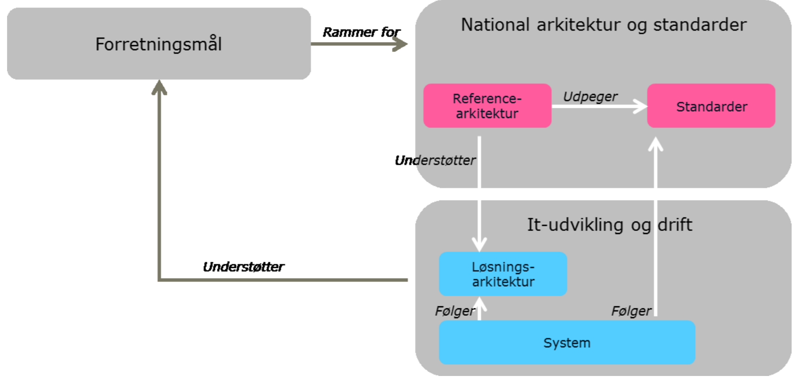

### 1.6 Målgruppe

Dette dokument har to målgrupper:

- Den ene målgruppe er strategiske beslutningstagere inden for digitalisering
og it, typisk digitaliseringschefer, it-chefer, afdelings- og kontorchefer og andre med rollen som systemejer.
- Den anden målgruppe er projektledere, arkitekter og udviklere hos myndigheder, virksomheder og leverandører, der har til opgave at kravspecificere og
designe løsninger, hvor der indgår eller anvendes tværoffentlig brugerstyring.

### 1.7 Publicering og relaterede dokumenter

Referencearkitekturen publiceres på arkitektur.digst.dk, hvor man kan finde beslægtede dokumenter vedrørende brugerstyring, herunder relaterede standarder
mv.

### 1.8 Læsevejledning

Afsnit 1-5 bør læses af alle.
Afsnit 2 giver en introduktion til brugerstyringsdomænet og kan springes over af
læsere med kendskab til domænet og dets begreber.
Afsnit 6-10 henvender sig særligt til løsningsarkitekter.

I referencearkitekturen anvendes nogle begreber, som her beskrives for at lette
læsningen.

| Begreb                       | Forklaring                                                                                                                                                                      |
|------------------------------|---------------------------------------------------------------------------------------------------------------------------------------------------------------------------------|
| Entitet                      | Et subjekt/en bruger som skal have adgang til en tjeneste. I denne version betragtes kun fysiske personer, som evt. kan være associeret med en juridisk person, som en entitet. |
| (elektronisk) identitet, eID | En digital persona repræsenteret ved et sæt af attributter                                                                                                                      |
| Det fællesoffentlige eID     | En elektronisk identitet, et eID, der svarer til det nuværende NemID.                                                                                                           |
| Forretningstjeneste          | En tjeneste der løser et forretningsmæssigt behov, fx en borgerrettet selvbetjeningsløsning.                                                                                    |

Begreber uddybes i referencearkitekturens bilag A (ordliste). Øvrige begreber der
introduceres, forklares undervejs.

*Afsnit 1. Indledning*
Giver et samlet overblik over dokumentet inkl. resumé, formål, scope, metode
og anvendelse.

*Afsnit 2. Beskrivelse af brugerstyringsdomænet*
Beskrivelse af domænet, herunder de centrale opgaver: registrering, autentifikation, billetudstedelse, adgangspolitik og adgangskontrol.

*Afsnit 3. Forretningsmæssige behov*
En gennemgang af de forretningsbehov der danner grundlag for udarbejdelsen af
referencearkitekturen.
- Behov hos personer – både som borgere og medarbejdere
- Behov hos virksomheder og myndigheder som brugerorganisationer og arbejdsgivere
- Behov hos virksomheder og myndigheder som tjenesteudbydere og som
udbydere af brugerstyringstjenester.

*Afsnit 4. Principper*
Dette afsnit formulerer rammer for de egenskaber, som fremtidige løsninger
inden for offentlig brugerstyring skal have. Disse rammer skal sikre, at alle de
forskellige løsninger der er behov for, samlet set bringer brugerstyring i Danmark frem mod de mål og de gevinster, den nationale strategi for brugerstyring
fastlægger. Rammerne formuleres som principper, som alle projekter og programmer skal orientere sig efter og enten følge eller forklare.

*Afsnit 5. Begrebsmodel*
I dette afsnit beskrives en terminologi og en begrebsmodel for brugerstyring.
Begrebsmodellen er på et generelt og overordnet konceptuelt niveau. Dvs. at den
ikke er bundet til en bestemt type organisation, anvendelse eller implementering.

*Afsnit 6. Byggeblokke*
I dette afsnit beskrives de byggeblokke, der skal være til stede for at kunne realisere de løsninger, der lægges op til med referencearkitekturen.

*Afsnit 7. Processer*
Dette afsnit viser med nogle eksempler, hvordan tjenesternes interfaces kan benyttes til understøttelse af forskellige typiske brugssituationer.

*Afsnit 8. Teknisk arkitektur*
Dette afsnit beskriver den systemtekniske målarkitektur, de væsentligste komponenter og anbefalede standarder.

*Afsnit 9. Implementering*
Dette afsnit beskriver konkret, hvordan referencearkitekturen implementeres, og
der fastlægges krav og anbefalinger.

**Figurernes farvekoder**
I referencearkitekturen indgår en række figurer. I disse indgår både brugerstyringsdomænets elementer og sammenhænge med andre domæner. I figurerne er
brugerstyringsdomænets elementer vist med rødt og andre domæners elementer
med blåt.

**Sprog**
Der anvendes som hovedregel danske ord, men der henvises også til de engelske
ord for at skabe sammenhæng til internationale begreber på brugerstyringsområdet.

### 1.9 Definitioner og begreber
Se Afsnit 4 og Bilag A: Ordliste

## 2. Beskrivelse af brugerstyringsdomænet

>Brugerstyring dækker opgaver og funktioner i forbindelse med håndtering af brugere i forhold til digitale løsninger. Det inkluderer oprettelse,
ændring og nedlæggelse af entiteter (personer, organisationer, tjenester
eller ting) i brugerstyringssystemer, tilknytning af akkreditiver og rettigheder til brugere og tildeling af adgang til ressourcer, typisk itsystemer. Brugerstyring er en fælles betegnelse for, hvordan en organisation fastlægger, håndterer og teknologisk sikrer, at kun brugere med de
rigtige akkreditiver og karakteristika får adgang, og alle andre afvises.

Figuren herunder viser de væsentligste elementer i brugerstyring (røde kasser) og
de aktører, der er omfattet af eller anvender brugerstyring (blå kasser).
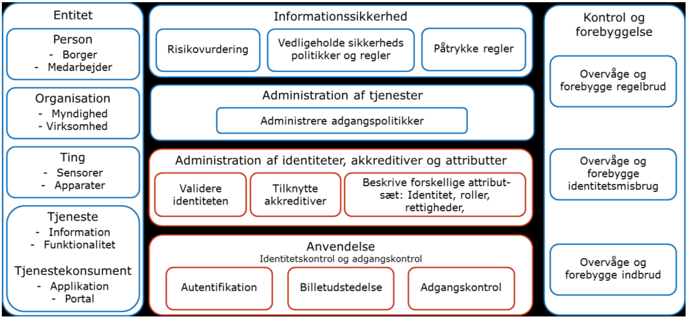

Informationssikkerhed (øverste niveau i midten) forvaltes af de dele af organisationen, der kan afgøre, hvilke risici organisationen vil gardere sig imod og på
hvilket niveau.

Administration (konfigurering) af tjenester (næstøverste niveau i midten) omfatter udarbejdelse og vedligeholdelse af adgangspolitikker for tjenester i overensstemmelse med informationssikkerhedspolitikkerne. Adgangspolitikkerne anvendes til at specificere, hvilke informationer som en entitet skal møde op med for
at blive lukket ind gennem adgangskontrollen. Dette anvendes i forbindelse med
registrering af entiteters rettigheder i næste niveau. Administration (konfigurering) af entiteters karakteristika (tredje niveau i midten)
anvendes til at give en entitet en konkret elektronisk identitet med de akkreditiver og det attributsæt, som giver adgang til en konkret tjeneste.  

Anvendelsesniveauet (nederste niveau i midten) gennemfører sikringen af, at
entiteten er den, vedkommende giver sig ud for at være (autentifikation). Der
udstedes en adgangsbillet, så informationen kan overføres til tjenesten. Derudover udføres adgangskontrol, hvor det afgøres om de attributter, som karakteriserer brugeren, er dem, der giver adgang til en tjenestes funktionaliteter og informationer.

En tjeneste og et it-system er i denne kontekst synonymer for det samme: et
stykke it, der kan levere informationer og funktionaliteter. Et stykke it, der optræder som leverandør, kaldes en tjeneste. Et stykke it, der optræder som den
bruger, der efterspørger informationer og funktionalitet, kaldes en tjenestekonsument. Det samme stykke it kan optræde både som leverandør (være en tjeneste) og i sin udførelse af tjenesten optræde som bruger (være en tjenestekonsument) over for andre tjenester.

Rækkefølgen i gennemgangen af elementerne svarer til rækkefølgen i mange –
men ikke alle – forløb i brugerstyring. I figuren er funktionerne beskrevet som
opdelt på flere aktører, men en aktør kan også udføre flere eller alle funktioner.

### 2.1 Informationssikkerhed

Fastlæggelse af niveau for og håndtering af informationssikkerhed skal foretages
af alle offentlige organisationer og tage udgangspunkt i ISO/IEC 27001-
standarden for styring af informationssikkerhed. Dette skal ske gennem et ledelsessystem for informationssikkerhed (Information Security Management System,
ISMS). Digitaliseringsstyrelsen har udarbejdet vejledninger, værktøjer og skabeloner hertil, som er placeret her: http://www.digst.dk/Informationssikkerhed. Se
også ’Vejledning vedrørende niveauer af autenticitetssikring’
(https://digitaliser.dk/resource/363424).

Hovedindholdet i ISO/IEC 27001 er, at niveau for og håndtering af informationssikkerhed tager udgangspunkt i en risikoanalyse. Organisationens ledelse fastlægger på baggrund af en risikovurdering et sikkerhedsniveau, som svarer til den
forretningsmæssige betydning af de informationer, som organisationen ejer, vedligeholder og har dataansvaret for, og de tjenester, som den stiller til rådighed for
andre organisationer af alle typer. Organisationen skal gennemføre en afbalanceret risiko- og konsekvensvurdering under hensyntagen til de økonomiske forhold
og herudfra fastlægge de

- retningslinjer
- forretningsgange og instrukser
- sikkerhedsforanstaltninger,

som beskytter organisationen på de risikoniveauer, der er valgt. De vil ofte være
forskellige, afhængigt af de konkrete informationer og tjenester.

I en tværoffentlig brugerstyring er det nødvendigt at koordinere risikovurderinger og valg af niveau for og håndtering af informationssikkerheden. Dette sker
ved udarbejdelse af et eller flere **trust frameworks.**

For at alle parter kan have tillid til hinanden, ekspliciterer, harmoniserer og standardiserer et trust framework forskellige aspekter af sikkerhed, herunder politikker, sikkerhedsmæssige tiltag og fælles sprog. Harmonisering og standardisering
er teoretisk set ikke en nødvendighed, men konsekvensen ved ikke at harmonisere og standardisere er, at kompleksiteten af kommunikationen mellem sikkerhedsdomæner bliver meget høj. Der skal indgås individuelle aftaler mellem parterne, og disse skal kende til hinandens politikker og arbejdsgange m.m. Et trust
framework er med til at reducere denne kompleksitet.

Et fællesoffentligt trust framework giver mulighed for:

- Sammenhængende løsninger på tværs af domæner via gensidig tillid
(sammenkobling af siloer).
- En fælles forståelse samt koordinering/governance af sikringsniveauer.
- Transparens gennem tydelig beskrivelse af krav til parterne og regler for
deres adfærd.
- En flerleverandørstrategi med mulighed for private aktører - hvor det er
ønskeligt og økonomisk fordelagtigt.
- På sigt at erstatte visse dele af OCES-certifikatpolitikkerne (krav til tjenesteyderne) og sikkerhedskrav i kontrakter (fællesoffentligt eID, p.t. NemID, NemLog-in mv.)
- Certificering, der er nødvendig for tilliden

National Standard for Identiteters Sikringsniveau (NSIS), der har afsæt i eIDASforordningen, er et dansk trust framework for identitetssikring. NSIS fastlægger
fire sikringsniveauer (”Begrænset”, ”Lav”, ”Betydeligt” og ”Høj”), hvoraf de tre
højeste niveauer modsvarer eIDAS-niveauerne (”Lav”, ”Betydelig” og ”Høj”).
Niveauerne dækker hele livscyklussen for elektroniske identiteter fra registrering
til arkivering/nedlæggelse.

Risikohåndtering bør ikke tage udgangspunkt i en konkret implementering af
akkreditiver, da disse kan ændres dynamisk. I stedet skal NSIS-sikringsniveauer
indgå ved risikohåndtering i et ledelsessystem for informationssikkerhed (et
ISMS), således at dataansvarlig forholder sig til, hvilket minimumsniveau der
kræves for adgang, oprettelse, opdatering og sletning af information. Dette niveau er så bestemmende for, hvilke akkreditiver der kan anvendes til at give adgang på et givet sikringsniveau.

### 2.2 Administration af elektronisk identitet, akkreditiver og attributter

National Standard for Identiteters Sikringsniveau (NSIS) omfatter registrering,
udstedelse og håndtering af elektroniske identiteter og udstedelse af akkreditiver.
Standarden fastlægger, hvorledes følgende processer skal foregå, for at et eID
kan være sikret på et af de fire sikringsniveauer:

- Ansøgning og registrering
- Verifikation af identitet
- Levering og aktivering af akkreditiver
- Suspendering, spærring og genaktivering
- Fornyelse og udskiftning.

I brugerstyring indgår, at personer (og andre entiteter) registrerer sig, tildeles en
eID, og at der udstedes akkreditiver. **Registreringen** af identiteten varetages af
registreringstjenesten, som også verificerer identiteten. Den elektroniske identitet
kan have forskellige sikringsniveauer i forhold til, hvor sikkert brugeres identitet
verificeres (eng: identity proofing) og det generelle sikkerhedsniveau for identitetsløsningen.

> Eksempel
>>Personer registrerer selv deres Facebook-identitet, mens NemID-identiteten kan registreres af Borgerservice. Personer kan også selv ansøge om NemID-identitet på NemID.nu. Det kræver, at de kan dokumentere deres identitet med fx kørekort eller pas

Efter oprettelse af den elektroniske identitet skal et **akkreditiv** (fx kodeord, PIN,
fingeraftryk) **tilknyttes** til identiteten. Akkreditiver anvendes til at bevise identiteten i modsætning til attributter, som beskriver identiteten. En akkreditivudsteder
skal dels sikre sammenhængen mellem akkreditiver og identitet og dels stå inde
for akkreditivets sikringsniveau. Akkreditivudstederen kan knytte allerede udstedte akkreditiver til identiteten eller udstede et nyt akkreditiv og tilknytte dette til
identiteten.

>Eksempel
>>Registreringen kan starte med valg af akkreditiv (fx en Yubikey), hvor personen efterfølgende knytter en identitet til akkreditivet, enten en nyoprettet identitet eller en allerede eksisterende identitet.
CPR-nummeret er en attribut, som desværre også er brugt som akkreditiv, dvs. som bevis
for identitet. Denne anvendelse af CPR-nummeret er imod regler fra CPR-kontoret, men
anvendes stadig i et vist omfang.
Udgangspunktet i beskrivelsen er, at brugerstyringstjenesten er en centralt placeret aktør
(som fx Facebook og NemID), men der er modeller, hvor denne funktion ligger hos brugeren
selv. Brugerstyringstjenester kan have forskellige tillidsniveauer knyttet til omfanget af audit
og kontrol med deres metoder.

I forbindelse med registreringen eller efter denne kan identitetens karakteristika
og egenskaber **beskrives i form af attributter** (fx køn, adresse, alder, et nummer i form af fx personalenummer). Dette varetages af en eller flere attributtjenester. Det er kombinationen af et validt akkreditiv og et antal attributter (et
attributsæt), der kan give adgang til en tjeneste. Det sker ved, at en billettjeneste udsteder en adgangsbillet (eng: Security Token), som skal præsenteres for tjenesten.

>Eksempel
>>Personer kan fx registrere alder og køn.
I NemID for borgere registreres attributter, der hentes fra CPR.
Der er mange eksempler på elektroniske identiteter, hvor attributter mere udtrykker personens ønsker om at præsentere sig end objektive forhold. Det sker fx på dating-sites.
Ved registreringer med høj kvalitet vil attributterne som hovedregel også beskrive entiteten
bag identiteten korrekt (alder og navn i den elektroniske identitet svarer til personens alder
og navn).

Registrering, akkreditivtilknytning og -udstedelse og attributbeskrivelse omfatter
også løbende administration af elektroniske identiteter, akkreditiver (der kan
være tidsbegrænsede), attributter (fx ændringer i funktioner og roller)og ophør af
identiteten med efterfølgende afkobling af attributter og dermed lukning af adgang og eventuel arkivering.

En entitet (fx en fysisk person) kan være repræsenteret i form af flere forskellige
elektroniske identiteter afhængig af kontekst, og en entitet kan have flere forskellige akkreditiver til at bevise sin elektroniske identitet.

Brugeren skal altid være oplyst om, hvilken elektronisk identitet vedkommende
agerer som.

>Eksempel
>>Registrering af erhvervsidentiteter i NemID foregår på flere forskellige måder:
1. Manuel registrering
En virksomheds brugeradministrator bestiller en NemID-medarbejdersignatur i medarbejdersignatur.dk. De nødvendige data indtastes.
2. Overførsel af data fra egen brugerstyring
En virksomheds brugeradministrator markerer i virksomhedens egen brugerstyring, at en
medarbejder skal have en NemID-medarbejdersignatur. Data overføres til NemID’s API.
3. Brug af NemID-privat med automatisk tilknytning til virksomhed
Fra februar 2017 kan ejere af personligt ejede virksomheder anvende deres NemID-privat i
forbindelse med deres virksomhed. Sammenknytningen af NemID-privat med virksomheden
sker på grundlag af Erhvervsstyrelsens registrering af ejeroplysninger i CVR.

### 2.3 Autentifikation

Autentifikation er de processer, hvor en entitet præsenterer sine akkreditiver, og
hvor en autentifikationstjeneste (ved login) dels garanterer, at de fremviste akkreditiver tilhører den entitet, de er udstedt til, og dels kontrollerer, hvilke sikringsniveauer registrering og akkreditivudstedelse er kendetegnet ved. Det aktuelle sikringsniveau er altid det laveste af de to konstaterede sikringsniveauer.

Opgaverne i forbindelse med autentifikation kan løses af flere aktører, som hver
løser en eller flere af opgaverne autentifikation, attributleverance og udstedelse af
adgangsbillet. Ved en sådan opdeling kan de aftagende tjenester lettere betjene
identiteter fra forskellige autentifikationstjenester gennem at anvende logintjenester og brokere, der afskærmer tjenesterne fra forskelligheder i formater eller
protokoller for akkreditiver og attributter. En sådan opdeling kan også facilitere,
at flere registreringstjenester, akkreditivtjeneste og autentifikationstjenester kan
samarbejde.

>Eksempler
>>I NemID-økosystemet løser NemID opgaven som registreringstjeneste, akkreditivtjeneste og
autentifikationstjeneste og medsender kun PID/RID (entydigt identifikationsnummer for
NemID-identiteten) samt eventuelt navn og e-mail samt CVR-nummer for NemIDmedarbejdersignaturer. Det anvendte format er XMLDSig.
En række private login-tjenester eller brokere tilbyder private tjenesteudbydere at supplere
med flere attributter.
NemLog-in tilføjer CPR-nummeret (ved opslag i PID/RID-CPR-tjeneste) og eventuelt rettighedsrelevante attributter og videresender data med OIOSAML-protokollen.
Modellen med login-tjenester/brokere mellem autentifikationstjenester og tjenester kendes
fra kredit- og betalingskort, hvor forretninger kan modtage betaling fra mange forskellige
kortudsteder, fordi det firma, der har opstillet kortterminalen, understøtter dette med en
grænseflade til forretningen.

En aktør, der udfører autentifikation, kaldes en autentifikationstjeneste i referencearkitekturen.

### 2.4 Autorisation
Ordet ”autorisation” bruges i brugerstyring om flere aspekter af det at have rettigheder til en tjeneste og til data i tjenesten:

- Det bruges om tildeling af rettigheder til en bruger (administration) i form af
fx en rolle eller en egenskab hos brugeren. Sprogligt formuleres det ofte, som
at brugeren er autoriseret til at tilgå en bestemt tjeneste.
- Det bruges i forbindelse med fastlæggelse af regler og politikker, der fastlægger betingelserne for, at en bruger må få adgang til en tjeneste. Sprogligt bliver begrebet ”Adgangspolitik” anvendt i nogle sammenhænge.
- Det bruges endeligt om de processer, der håndhæver, at kun de rette brugere
får adgang til en tjeneste i en konkret situation – altså adgangskontrol.

Den sædvanlige brug af ordet autorisation dækker således en række funktionaliteter, der udføres af forskellige aktører med forskellige formål, og som det derfor
er nyttigt at skille ad. I denne referencearkitektur anvendes derfor følgende termer i stedet for termen ”autorisation” med henblik på at opnå den størst mulige
præcision:

- Administration af en brugers rettigheder består i, at den elektroniske identitet
gives netop den attributbeskrivelse, en tjeneste kræver for at give adgang.
- Udstedelse af adgangsbillet med identitet, roller, dataafgrænsninger og andre
attributter betegnes med billetudstedelse.
- Fastlæggelse af adgangspolitikker og adgangsrettigheder betegnes adgangspolitik.
- Håndhævelse af adgangsrettigheder kaldes adgangskontrol.

Tjenesteudbydere udarbejder en adgangspolitik for tjenesten i overensstemmelse
med informationssikkerhedspolitikken. Den kan udmøntes konkret i en eller
flere adgangspolitikker, der beskriver, hvilke handlinger der må udføres i forhold
til tjenesten og på data i tjenesten givet et bestemt sikringsniveau og et eller flere
attributsæt. En entitet skal da møde op med:

- En eID, verificeret af et akkreditiv, hvor kombinationen af identitetens sikringsniveau og akkreditivets sikringsniveau modsvarer sikringsniveauet, tjenesten kræver.
- Det eller de attributsæt, som tjenesten kræver.

Entiteten eller brugeradministrationen i dennes brugerorganisation (hvis der er
tale om en medarbejder eller en bruger med anden tilknytning til en virksomhed
eller myndighed) registrerer brugerens adgangsrettigheder i form af rettighedsrelevante attributter, herunder attributsæt der beskriver organisatoriske roller(I overensstemmelse med NSIS’ definition opfattes en rolle som en eller flere attributter.)
. Jo
mere standardiserede adgangspolitikker er på tværs af tjenester, jo lettere er det
for brugere og brugerorganisationer at administrere rettigheder, der matcher
adgangspolitikkerne.

At få adgang til en tjeneste kræver derfor fælles forståelse hos tjenesteudbydere,
entiteter og brugerorganisationer af adgangspolitikkens indhold. Dette kan opnås
ved at strukturere beskrivelsen af adgangspolitikken, således at det er veldefineret, hvilke attributsæt en entitet skal møde op med for at få adgang. Et attributsæt kan defineres gennem en klassifikation, som er et lukket udfaldsrum af værdier. Et eksempel er en klassifikation, der kan udtrykke datas følsomhed, et andet
er lovhjemmel som fx KL’s Emnesystematik (KLE). Et tredje eksempel er klassifikationen af sikringsniveauer i National Standard for Identiteters Sikringsniveau (NSIS).
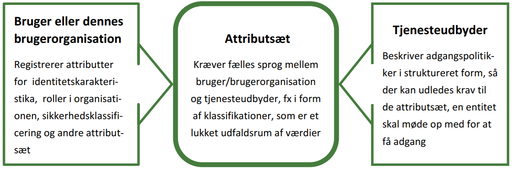

Attributter kan udtrykke roller som basis for adgangskontrol (Role Based Access
Control – RBAC), eller man kan arbejdet direkte med attributter (Attribute Based Access Control - ABAC). I begge tilfælde vil en fælles forståelse kunne udtrykkes med en klassifikation, der systematisk beskriver roller eller andre attributsæt, evt. i form af et hierarki.

Autorisation omfatter således administration af brugere, billetudstedelse og adgangskontrol ud fra en adgangspolitik, og resten af referencearkitekturen vil anvende disse begreber i stedet.

Når en entitet er blevet autentificeret, møder den op hos tjenesten med en adgangsbillet. Hvis der mangler nødvendige attributsæt i adgangsbilletten, kan der i
dette trin indhentes yderligere attributter fra fx en attributtjeneste. De attributter,
der eventuelt tilknyttes i denne del af processen, kan evt. hentes fra en anden
attributtjeneste, hvor disse attributter administreres med det eksplicitte formål at
administrere identitetens rettigheder, eller de kan hentes fra andre attributtjenester som fx sundhedsvæsenets autorisationsregister. Denne indsamling og berigelse af adgangsbilletter udføres typisk af en såkaldt Identitetsbroker (et eksempel på dette er NemLog-in).

**Adgangskontrol** består i, at tjenesteudbyderen validerer adgangsbilletten og
sikrer, at der kun gives adgang til funktionalitet og data i overensstemmelse med
billettens attributsæt. Herigennem håndhæver tjenesteudbyderen adgangskontrollen ud fra den definerede adgangspolitik. Der kan også på dette trin indhentes
yderligere attributter, og adgangskontrollen kan endvidere benytte parametre for
den aktuelle brugerkontekst (fx brugerens IP-adresse, tidspunktet på dagen, data
om brugerens enhed osv.) i beslutningen om adgang.

### 2.5 Arbejdsdeling i brugerstyring - føderationer

De funktioner der er beskrevet ovenfor, blev tidligere udført af den ansvarlige
for det enkelte system. Det er ikke effektivt for tjenester på internettet, og derfor
sker der en specialisering, hvor forskellige aktører udfører forskellige funktioner.
For at der kan ske en sådan specialisering og arbejdsdeling, er der opbygget regler og aftaler, der gør, at aktørerne kan have tillid til hinanden. De aktører som
indgår i et tillidsforhold, udgør **en føderation,** som bygger på et trust framework
eller aftaler mellem parter.

>Eksempel
>>Fx bygger anvendelsen af NemID på, at Digitaliseringsstyrelsen har udarbejdet regler for
sikkerhed (OCES-politikker) og overvåger, at disse efterleves. Det betyder, at de aktører der
anvender autentifikation med NemID, har tilstrækkelig tillid til brugernes identitet

Tillid er en altafgørende forudsætning for at etablere en fødereret brugerstyring.
Det gælder både i forhold til registreringen af identiteter og til brugen af identiteter.

Nedenstående tegning i figur 4 illustrerer den kæde af tillid, der skal være mellem
forskellige brugerstyringstjenester. Denne kæde skal være identificeret og beskrevet i en føderation, hvor der kan være en række brugerstyringstjenester involveret i føderationen. Man skal her være eksplicit om, hvilket sikringsniveau de enkelte enheder opererer på, for det vil være det laveste sikringsniveau i hele kæden, der er bestemmende for det samlede sikringsniveau. For enkelhed i illustrationen er der her tegnet en føderation med kun én af hver brugerstyringstjeneste
repræsenteret.

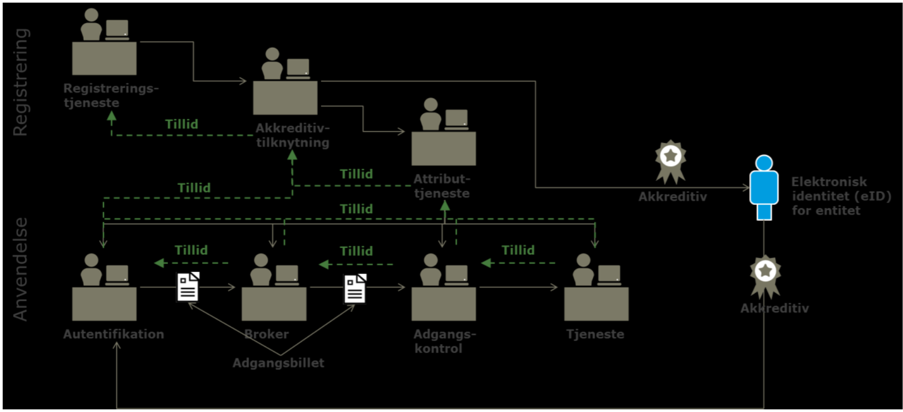

- Tjenesteudbyderen af forretningstjenesten skal have tillid til, at adgangskontrollen (engelsk: Policy Enforcement Point, PEP) kun videregiver entiteter,
hvis adgangsbillet matcher adgangspolitikken for forretningstjenesten. Tjenesteudbyderen varetager som hovedregel selv adgangskontrollen, men denne
funktion kan varetages af en ekstern tjeneste.
- Adgangskontrollen bygger på tillid til, at den adgangsbillet en broker har udstedt, er en korrekt overførsel og evt. omveksling af attributsæt for den eID,
der skal have adgang.
- Brokeren har tillid til, at autentifikationstjenesten på en sikker måde har kunnet fastslå brugerens identitet (autentificere vedkommende), og at de attributsæt identiteten møder op med, er tilknyttet identiteten.
- Autentifikationstjenesten har tillid til, at den akkreditivudsteder (eng: Credential Service Provider, CSP), der har tilknyttet og udstedt akkreditiverne, har
gjort det til de rette entiteter, nemlig de samme entiteter, som registreringstjenesten (eng: Registration Authority, RA) har identificeret og registreret
identiteten på.
- I den udstrækning, som tjenesteudbyderen, adgangskontrollen, brokeren eller
autentifikationstjenesten anvender et eller flere attributsæt, skal disse have tillid til de attributtjenester, som de anvender.
- Attributtjenester skal have tillid til, at den der har tilknyttet og udstedt akkreditiverne, har gjort det til de rette entiteter, nemlig de samme entiteter som
registreringstjenesten har identificeret og registreret identiteten på.
- Akkreditivudstederen har tillid til, at registreringstjenesten har kunnet foretage en sikker identifikation og registrering af entiteterne.
- Hele vejen gennem kæden skal der være tillid til den adgangsbillet (eng: Security Token), der udstedes af autentifikationstjenesten og beriges af brokere,
og som benyttes som billet med tidsbegrænset gyldighed til en eller flere tjenester – også når adgangsbilletter omveksles ved overgang mellem sektorer.

Adgangskontroller, brokere, autentifikationstjenester, attributtjenester, akkreditivtjenester og registreringstjenester betegnes samlet med termen ”brugerstyringstjenester”.

Så længe alle brugerstyringstjenester i tillidskæden ligger inden for egen organisation, kan organisationens egen governance sikre tillidskæden. Når en organisation vælger at uddelegere ansvaret for en eller flere brugerstyringstjenester, forudsætter det, at tillid er etableret gennem et trust framework omfattende bl.a. aftaler
og standarder. Tjenesteudbyder er nødt til at indgå en aftale med et trust
framework og dermed stole på alle de brugerstyringstjenester, der indgår i et givet trust framework. Dette inkluderer, om de modtagne adgangsbilletter teknisk
set er tilstrækkeligt robuste til, at man kan stole på informationen, når der autentificeres, eller når identiteten fastslås, eller når der udstedes adgangsbilletter på
grundlag af attributsæt. Brugerstyringstjenester i et trust framework skal kunne
dokumentere, at de er pålidelige, og at de sikrer, at opbevaret information om
elektroniske identiteter, akkreditiver og attributter ikke kan ændres af en ondsindet tredje part.

I en føderation mellem en række sektorer, der hver har deres sikkerhedsdomæner, skal tilliden udvides til at omfatte komponenter som autentifikationstjenester, attributtjenester og billettjenester fra alle involverede sektorer hos alle deltagere i føderationen. Desuden er det centralt at fastlægge de kombinationer af
brugerstyringstjenester, der giver et konkret sikringsniveau, og som alle i føderationen har tillid til. Det er nødvendigt helt specifikt at beskrive den datastrøm
gennem tjenesterne, der giver et bestemt sikringsniveau.

Føderation kræver desuden juridiske aftaler, som i sig selv danner grundlag for
tillid/trust og fastlægger ansvarsforhold.

### 2.6 Kontrol og forebyggelse
Kontrol og forebyggelse skal ske i alle systemer, både i organisationernes interne
applikationer, i forretningstjenester som stilles til rådighed eksternt, samt i brugerstyringstjenester. Aftaler om og standarder for kontrol og audits skal indgå i
føderationens grundlag.

Brugerstyringstjenester indgår som en del af sikkerheden i interne applikationer
og forretningstjenester og skal derfor kontrolleres i den sammenhæng. Brugerstyringstjenesterne skal desuden i meget høj grad selv gennemføre de kontroller og
forebyggelsestiltag, som er centrale for, at de kan levere sikkerhed (fortrolighed,
integritet (pålidelighed) og tilgængelighed) til tjenester. Dette beskrives herunder.

Staten har i december 2014 offentliggjort en strategi for cyber- og informationssikkerhed, som har til formål fremover at professionalisere statens arbejde med
informationssikkerhed og øge samfundets robusthed mod cyberangreb. Strategien omfatter 27 konkrete initiativer, der skal bidrage til at øge informationssikkerheden og styrke beskyttelsen mod cyberangreb.

Strategien sætter fokus på udfordringerne og skaber en klar retning for den
fremadrettede indsats. Truslerne på cyber- og informationssikkerhedsområdet er
dog en dynamisk størrelse, og der vil derfor løbende være fokus på effekten af de
27 initiativer. Strategien skal revideres i 2016-17, hvor der vil komme nye tiltag
og blive inddraget synspunkter på og viden om, hvad der vil være til gavn for
samfundet i det videre arbejde.

Strategien indeholder 27 initiativer på tværs af seks indsatsområder:

1. Professionalisering og styrket it-tilsyn
2. Klare krav til leverandører
3. Styrket cybersikkerhed og mere viden på området
4. Robust infrastruktur i energisektoren og telesektoren
5. Danmark som stærk international medspiller
6. Stærk efterforskning og klar information til borgere, virksomheder og myndigheder.

Med den stadigt stigende hackeraktivitet kloden over bliver arbejdet med at sikre
kvaliteten af kontrol og forebyggelse af sikkerhedsbrud mere og mere vigtigt.
Det skal ske i forbindelse med den registrering, autentifikation, billetudstedelse
og adgangskontrol, der er kernen i brugerstyring. Dermed er det også et emne
for informationssikkerhedspolitikken og dennes udmøntning i en tværgående
fællesoffentlig føderation.

Flere af de angreb mod organisationers it-infrastruktur som opleves, er rettet
mod at forfalske identiteter, akkreditiver og adgangsbilletter, eller at give sig ud
for at være den rette ihændehaver af identiteter, akkreditiver og adgangsbilletter.
Det centrale i forhold til brugerstyring er derfor hurtigt at kunne reagere ud fra
den mest aktuelle viden gennem sikkerhedsforanstaltninger. Andre angreb forsøger at begrænse tilgængeligheden gennem Distributed Denial of Service-angreb
mod kritiske elementer i it-infrastrukturen, herunder fællesoffentlige identitetssystemer. Center for Cybersikkerhed udsender jævnligt en opdatering af det aktuelle trusselsbillede for cyberangreb.

Opgaverne for brugerstyringstjenester i en tværgående fællesoffentlig føderation
er derfor dels hele tiden at være opdateret om sikkerhedshændelser, der omhandler forfalskning eller misbrug af identiteter, akkreditiver og adgangsbilletter, gennem abonnement på information om sikkerhedshændelser og deres imødegåelse.
Dels skal brugerstyringstjenesterne hurtigt rapportere om sikkerhedshændelser til
disse organisationer og om erfaringerne med at afbøde og bekæmpe angreb.

Til at støtte dette har staten samlet kræfterne i Center for Cybersikkerhed
(CFCS), og nogle private organisationer udstiller deres CERT eller CSIRTfunktion som fx TDC. Disse organisationer håndterer sikkerhedshændelser og
arbejder på at forebygge sikkerhedshændelser:

- Netsikkerhedstjenesten i CFCS rummer nu statens Computer Emergency
Response Team (CERT)
- NC3 er statens National Cyber Crime Center under Rigspolitiet
- DKCERT er Danmarks akademiske Computer Emergency Response Team
under Danish e-Infrastructure Cooperation (DeIC), der overvåger netsikkerheden på forskningsnettet
- Flere større virksomheder har deres eget computer security incident response
team (CSIRT), et synonym for CERT.

Der stilles desuden i højere grad krav om notifikation til relevante myndigheder i
forbindelse med sikkerhedshændelser. Fx skal tillidstjenesteudbydere, jf. eIDAS,
notificere Digitaliseringsstyrelsen, og, jf. den kommende persondataforordning,
skal dataansvarlig notificere Datatilsynet ved sikkerhedshændelser. Som led i et
beredskab skal man således sikre sig, at man kan informere de rette myndighed
inden for fastlagte tidsrammer.

Da sikkerheden i føderationer afhænger af, at alle deltagere vedligeholder de sikringsniveauer, de formidler, kan der udgå anbefalinger om sikkerhedstiltag fra
føderationen. En af de forebyggende aktiviteter, en tjenesteudbyder kan udføre,
er kontinuerligt at søge efter spor i sin logning af anmodninger om adgangskontrol. Det gøres ved at datamine logningen og finde mønstre, der indikerer forsøg
på omgåelse af sikkerhedsforanstaltninger. Der er desuden i 2016 opnået resultater gennem at anvende maskinlæring i datamining af logning af en tjenestes internettrafik, der giver gode forudsigelser af, om der er angreb på vej. I en tværgående fællesoffentlig føderation vil det være betimeligt at inspirere deltagerne til at
foretage datamining og dele resultaterne mellem organisationerne i føderationen.

Et andet væsentligt element i sikkerheden er, at alle processerne i administration
og vedligeholdelse af brugerstyring implementeres. Det gælder såvel entiteters
karakteristika gennem brugeres livscyklus som tjenesters adgangsrettigheder, når
tjenester videreudvikles. Entiteters livscyklus indeholder ændringer i registreringspraksis, i valg af anvendte akkreditiver og i beskrivelse af attributter, herunder roller og terminering af alle rettigheder for en bruger ved fx jobskifte, dødsfald og lign. I jo højere grad dette kan automatiseres, jo mere sikker er man på, at
ændringer og termineringer finder sted.

Tjenester gennemgår næsten altid en forandring, efterhånden som aktiviteterne,
tjenesten understøtter, udvikler sig. Det skal sikres, at disse nye faciliteter i tjenesterne også klassificeres i overensstemmelse med informationssikkerhedspolitikken, og at adgangskontrollen specificeres i overensstemmelse hermed. Her er det
nyttigt at specificere snitflader for tjenestens samspil med den brugeradministration, hvor entiteten tildeles de attributter, der skal give adgangen.

## 3. Forretningsmæssige behov
>Forretningsbehovene tager udgangspunkt i de udfordringer, offentlige
virksomheder fremover skal være i stand til at håndtere. Scopet for referencearkitekturen for brugerrettighedsstyring er især behov vedrørende
sammenhængende, effektive, sikre og brugervenlige løsninger på tværs af
domæner, nationalt og transnationalt.

Forretningsbehovene er i den tværoffentlige strategi for brugerstyring beskrevet
ud fra flere synsvinkler, idet interessenterne har flere roller, som har betydning
for behov:

- Behov hos personer – både som borgere og medarbejdere
- Behov hos virksomheder og myndigheder som brugerorganisationer og arbejdsgivere
- Behov hos virksomheder og myndigheder som tjenesteudbydere og som
udbydere af brugerstyringstjenester.

### 3.1 Personer – som borgere og som medarbejdere

Borgere og medarbejdere forventer først og fremmest, at tjenester er let tilgængelige – og herunder ikke mindst at obligatoriske systemer er så smarte, som teknologien tillader.

Mange personer har primært fokus på brugervenlighed og mindre på sikkerhed
og privacy. For disse personer skal der være mulighed for at vælge så meget brugervenlighed, som hensyn til lovgivning og sikkerhed tillader. Andre personer
har fokus på sikkerhed og privacy. For disse personer skal der være mulighed for
løsninger, hvor personen selv har en højere grad af kontrol over, hvilke data tjenester får adgang til og indsigt i, hvilke aktiviteter deres elektroniske identiteter
udfører, mulighed for anonymitet mv. Tilbud til brugerne skal dog til enhver tid
bygge på en høj sikkerhed, så borgernes data ikke kompromitteres.

Der lægges op til, at der fremover kan skabes medarbejder-eID med udgangspunkt i medarbejderes personlige borger-eID, hvilket er nyt i en dansk kontekst.
Mange medarbejdere kan i den forbindelse forventes at have opmærksomhed
omkring, hvorvidt de handler som medarbejder på vegne af virksomheden eller
som borger. Med andre ord kan det forventes, at medarbejdere har brug for et
klart billede af, at det ikke er dem personligt, men deres virksomhed, der er aktøren. Det gælder, uanset at der ageres på baggrund af et akkreditiv, som også kan
anvendes i en borgerkontekst og på baggrund af en virksomheds eID, der bygger
på en borger-eID.

Nogle medarbejdere anvender deres eID mange gange i løbet af en arbejdsdag.
For denne brugergruppe er det derfor væsentligt, at det er let og effektivt at anvende sit akkreditiv.

En del borgere har behov for at kunne give andre fuldmagt til at løse opgaver for
sig. For de borgere, som afgiver og får fuldmagt, er der behov for løsninger til at
administrere fuldmagter. Det tilsvarende gælder for samtykke.

I forhold til de konkrete løsninger har personerne behov for løsninger, der:
- Kan anvendes på forskellige typer udstyr
- Kan dække mange forskellige brugerkompetencer og behov
- Kan dække mange brugsscenarier, herunder også scenarier hvor tjenester
tilgås via systemer, ting eller apps.

#### 3.1.1 Privatlivsbeskyttelse
Det er helt centralt for realiseringen af en effektiv digitalisering, at brugerne har
tillid til infrastrukturen. Hvis brugerne mister tilliden til, at en løsning giver en
tilstrækkelig beskyttelse af deres persondata, vil der være risiko for, at de fravælger en given løsning og måske overgår til analog behandling eller helt fravælger
en serviceydelse. Der vil derfor være forretningsmæssige fordele ved at indtænke
privatlivsbeskyttelse i brugerstyringssystemer. Dette kan håndteres gennem et
struktureret privacy-program.
OECD har defineret otte basale principper for privatlivsbeskyttelse(Kan findes beskrevet hos OECD:
https://www.oecd.org/sti/ieconomy/oecdguidelinesontheprotectionofprivacyandtransborderflowsofpersonaldata.htm):

- Princippet om begrænset indsamling
- Princippet om datakvalitet
- Princippet om formålsspecificering
- Princippet om anvendelsesbegrænsning
- Princippet om datasikkerhed
- Princippet om åbenhed (transparens)
- Princippet om individets deltagelse
- Princippet om ansvarlighed (accountability).

Løsninger bør i design, udvikling, drift og vedligehold forholde sig til ovenstående.

I maj 2018 træder EU’s forordning om persondatabeskyttelse (GDPR) i kraft.
Denne stiller en række krav til persondatabeskyttelse, og en del af disse krav er
dækket, hvis man følger ovenstående basale principper. Dog er der konkrete krav
i GDPR, som skal indtænkes i løsninger, herunder:

- Privacy Impact Assessments
- Privacy-by-design og privacy-by-default
- Retten til at blive glemt
- Retten til dataportabilitet
- Retten til indsigt i egne data.

Selvom privatlivsbeskyttelse omfatter andet end informationssikkerhed, kan man
med fordel indbygge sit privacy-program i eksisterende ISMS, da mange kontroller er sammenfaldende.

### 3.2 Virksomheder og myndigheder som brugerorganisationer

Virksomheder og myndigheder har behov for nem og sikker adgang til eksterne
tjenester, både webbaserede og gennem lokale applikationer. Da der er mange –
og et stigende antal – eksterne tjenester, har virksomheder og myndigheder behov for at have ensartede metoder til at tilgå disse tjenester.

En situation, hvor hver tjeneste tildeler egne brugernavne og akkreditiver, vil
allerede nu være til stor ulempe for mange virksomheder, og dette problem vil
øges fremover, hvis der ikke sikres ensartede løsninger.

Mange meget små virksomheder og andre organisationer har brug for meget
enkle løsninger til autentifikation og signering, og i nogle tilfælde kan brugeradministration for en stor del automatiseres og dermed ikke optræde synligt for
virksomheden.

Små og mellemstore virksomheder, foreninger og anpartsselskaber med flere
medarbejdere har behov for enkel brugeradministration, hvor rettigheder set
med brugernes øjne administreres manuelt ét samlet sted for offentlige selvbetjeningsløsninger.

Større virksomheder har brug for forskellige løsninger, der både kan omfatte
manuel indtastning, digital provisionering og eventuelt føderering. Større virksomheder har egen brugerstyring, og de kan generelt have behov for god sammenhæng mellem deres egen brugerstyring og ekstern brugerstyring.

Nogle mellemstore og større brugerorganisationer har brug for en klar adskillelse
mellem borgerløsninger og medarbejderløsninger og for selv at kunne kontrollere de tekniske løsninger i sammenhæng med organisationens egen tekniske infrastruktur. De har behov for en høj grad af sammenhæng og effektivitet i administrationen af medarbejdernes elektroniske identiteter.

Der er generelt behov for en brugergrænseflade til administration, for digital
provisionering og for fødererede løsninger, hvor administration sker i egen brugerstyringsløsning. Set fra virksomhedernes synspunkt mangler der fælles tværgående løsninger for at administrere offentlige adgange.

Mange brugerorganisationer har behov for at få styr på deres mange forskellige
eksisterende løsninger (legacy) og ønsker at arbejde frem med større ensartethed,
sammenhæng og automatisering, eksempelvis automatisering ved begivenheder
som ansættelse, tildeling af identitet, roller og rettigheder, organisatorisk omplacering og fratrædelse. De har desuden behov for kontrol af medarbejdernes anvendelse af elektronisk identitet på virksomhedens vegne, da det både juridisk og
kommercielt kan være forpligtende for brugerorganisationen, hvad en medarbejder gør.

### 3.3 Virksomheder og myndigheder som tjenesteudbydere

Det er et fælles behov for tjenesteudbyderne at kunne modtage logins og adgangsbilletter på en standardiseret måde, og gerne så tjenesteudbyderne afskærmes fra ændringer på brugerstyringssiden.

En stor del af de offentlige tjenester rummer fortrolige data, som er dækket af
sikkerhedskrav i persondataloven, og som dermed skal anvende et eID med tilstrækkelig sikkerhed som fx NemID. Flertallet af offentlige tjenester har behov
for at kende borgerens CPR-nummer og i nogle tilfælde medarbejderens. Andre
offentlige tjenester (fx i forbindelse med renovation og lokalebestilling) har ikke
samme sikkerhedskrav og nøjes med mindre stærk identifikation og autentifikation end det nuværende NemID.

Forskellige sektorer har forskelligartede behov, eksempelvis:

- Myndigheder er omfattet af reglerne om partsrepræsentation, og deres tjenester skal derfor understøtte anvendelse af fuldmagt. Ellers skal myndigheden
etablere manuelle løsninger til partsrepræsentation.
- Tjenester i den finansielle sektor har stærke sikkerhedskrav, dels af hensynet
til de økonomiske risici, dels af hensyn til hvidvaskningsdirektivet.
- Tjenester i spilsektoren er forpligtet ved lov til at anvende stærk autentifikation samt at kontrollere, at identiteten ikke er omfattet af spærrelisten. Tjenesterne har ikke et behov for præcis identifikation med navn.
- En virksomhed som ”Den Blå Avis/DBA” har brug for at kunne garantere
mod svindel, hvilket de aktuelt håndterer ved, at sælgerne og køberne har en
NemID-identitet. DBA identificerer ikke personerne ved CPR, men anvender i stedet certifikatets PID, hvilket kan anses som en privacy-mæssig fordel.
- Regionerne har mange private aktører som medtjenesteudbydere.

En række tjenester har lavere sikkerhedskrav end ovennævnte, men har stadig
brug for sikker identifikation med færre oplysninger om brugeren. Det er fx ehandelstjenester, der har brug for at kende borgerens adresse eller tjenester, eller
der har brug for at kende brugerens alder (fx over/under 18 år). For disse tjenester er der økonomiske fordele ved kun at kende ikke-fortrolige data, da der i så
fald ikke skal anvendes ressourcer på at sikre fortrolige data.

Tjenesteudbydere har behov for adgang til eksterne identiteter og rettighedsrelevante attributter, så de ikke skal etablere egne brugerstyringsløsninger og drive og
supportere disse. Når man bygger en forretningstjeneste, er det dyrt selv at bygge
brugerstyring. Der er en god business case i at få det som en tjeneste eller som
koncepter.

Brugerne skal kunne autentificeres på flere sikringsniveauer svarende til tjenesternes behov for sikkerhed. Tjenesteudbyderne har for nogle tjenester behov
for at kunne sikre, at en bruger kun får adgang til ressourcer eller data, der relaterer til den enkelte brugers aktuelle opgave. Sundhedsdomænet har eksempelvis
behov for løsninger, der kan sikre, at kun sundhedspersonale, der reelt har en
relation til behandlingen af en patient, får adgang til patientdata (behandlerrelation).

Tjenesteudbydere har behov for kontrol med, hvem der har logget ind og udført
hvilke handlinger i tjenester.

Etablerede tjenester har behov for kontinuitet (bagudkompabilitet), idet der kan
være store omkostninger ved at ændre integrationer til tværgående brugerstyringsløsninger.

### 3.4 Internationale aspekter

Samspillet mellem brugere og tjenester på tværs af landegrænser vil i fremtiden
stille øgede krav til identitet og autentifikation i international sammenhæng, overførsel af attributter på tværs af lande og brugerstyringstjenester og signering på
tværs af landegrænser.

Dette behov har skabt en større og større grad af konsolidering af modelbegreber og regulering af brugerstyring og identitetshåndtering internationalt. I EUregi er der særligt gennem eIDAS-forordningen skabt øget mulighed for interoperabilitet på tværs af lande.

Som nævnt tidligere definerer eIDAS tre sikringsniveauer, ”Lav”, ”Betydelig”
og ”Høj”, der konkretiseres i den danske Nationale Standard for Identiteters
Sikringsniveau (NSIS).

eIDAS stiller desuden krav om, at hvis en myndighed stiller en digital service til
rådighed for borgerne og virksomhederne med anvendelse af en såkaldt notificeret eID-løsning, skal det være muligt at autentificere sig med notificerede eIDløsninger fra andre EU-lande med samme eller højere sikringsniveau.

Endelig indeholder eIDAS en række krav til såkaldte tillidstjenesteudbydere. Tillidstjenester omfatter:

- Certifikatudstedere, CA
- Tidsstemplingsservices
- Valideringtjenester for validering af elektroniske signaturer, elektroniske segl
og tidsstempler
- Tjenester til bevaring af signaturer, segl og certifikater
- Elektroniske registrerede leveringstjenester.

Ved etablering og drift af en identitetsinfrastruktur SKAL det vurderes, om man
er omfattet eIDAS som tillidstjenesteudbyder og i givet fald efterleve forordningens krav.

## 4. Principper

>Dette afsnit formulerer rammer for de egenskaber, som fremtidige løsninger inden for offentlig brugerstyring skal have. Formålet er at sikre, at
de forskellige løsninger samlet set bringer brugerstyring i Danmark frem
mod de mål og de gevinster, den nationale strategi for brugerstyring fastlægger. Rammerne formuleres som principper, som alle projekter og
programmer skal orientere sig efter og enten følge eller forklare.

Principperne konkretiseres med beskrivelse af rationale – hvilket mål og gevinst
princippet forfølger – og implikation – en instruktion i, hvad det konkret vil sige
at følge princippet. Hvis et projekt eller program mener, at det er for problematisk at følge princippet, skal projektet eller programmet forklare hvorfor, og tillige forklare hvordan man på længere sigt kan bringe løsningen inden for rammerne, som princippet angiver.
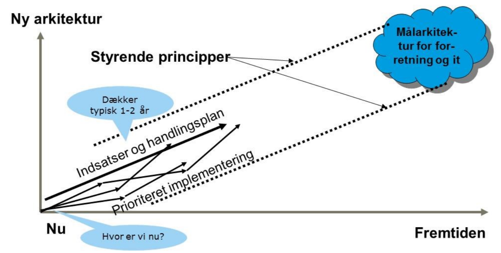

Referencearkitekturen for brugerstyring fastlægger følgende principper for at
styre frem mod en fælles forretnings- og it-arkitektur for det offentliges elektroniske identiteter, autentifikation og adgangskontrol. Som overordnet ramme for
disse principper ligger de ti tværoffentlige overordnede principper for forretnings- og it-arkitektur(http://arkitekturguiden.digitaliser.dk/principper/10-overordnede-principper)
, og hvad der står heri gentages ikke. Det skal her bemærkes, at disse principper opdateres som følge af arbejdet med hvidbogen for den
fællesoffentlige rammearkitektur, hvilket kan give anledning til ændringer i
kommende udgaver af denne referencearkitektur.

**Princip**

*Principper med brugerfokus:*

1. Brugerne oplever en sammenhængende adgangsstyring
2. Brugerstyringsløsninger udvikles med fokus på brugernes behov
3. Brugerstyringsløsninger respekterer brugernes privatliv

*Principper med teknisk fokus:*

4. Aktører indgår i føderationer baseret på tillid
5. Aktører i føderationer vurderer i deres styring af informationssikkerhed
samspillet med andre aktører
6. Administration af brugere flyttes så vidt muligt ud af fagapplikationer
7. Tjenesteudbyder (den dataansvarlige) har ansvaret for at håndhæve brugernes adgange

*Principper med udviklingsfokus*

8. Brugerstyring realiseres i løst koblede komponenter
9. Tværoffentlige brugerstyringsløsninger baseres på en kerne af fælles komponenter i samspil med øvrige komponenter i infrastrukturen
10. Tværoffentlig brugerstyring etableres i overensstemmelse med internationale standarder og løsninger

### 4.1 Princip: Brugerne oplever en sammenhængende adgangsstyring

Brugere vil i deres dialoger med offentlige myndigheder skulle betjene sig af en
række forskellige tjenester. Disse tjenester skal opleves sammenhængende, uanset
hvor mange tjenester eller myndigheder der er involveret.

*Rationale*

- Borgere og virksomheder vil opleve en bedre og mere gnidningsfri løsning af
deres opgaver, der kræver forretningsprocesser på tværs af organisationer og
sektorer. Dette vil medvirke til at fjerne en væsentlig barriere for udviklingen
mod fuld digitalisering, så digitale tjenester fungerer nemt og effektivt, uanset
hvilken situation man er i.
- For udviklings- og supportfunktioner betyder det, at de vil få mere tilfredse
brugere og fx færre supporthenvendelser fra brugere, der ikke kan finde ud af
at logge på.

*Implikationer*

- Brugere skal, hvor det er relevant, kunne afgive samtykke til, at deres oplysninger anvendes til angivne formål, og at oplysningerne er grundlag for handlinger inden for en føderation i forbindelse med brugerstyring.
- Brugerne skal kunne delegere fuldmagt til andre elektroniske identiteter og
have et samlet overblik over afgivne og modtagne fuldmagter på tværs af tjenester.
- Brugerne skal opleve en sammenhæng mellem autentifikation og evt. senere
signering.
- Brugerne skal opleve en sammenhængende administration af oprettelse af
brugere, administration af fuldmagter og administration af rettigheder.
- Brugerne skal i videst muligt omfang have brugergrænseflader, hvor krav til
sikkerhed og privacy forenes med krav om brugervenlighed.
- Brugerne skal tilbydes Single Sign-On i brugerforløb, der krydser flere tjenester.

>
>>Princippet om sammenhængende adgangsstyring for brugere SKAL efterkommes i fællesoffentlige løsninger, herunder det fællesoffentlige eID og NemLog-in samt af tjenester, der anvender disse. For øvrige BØR princippet efterkommes.

### 4.2 Princip: Brugerstyringsløsninger udvikles med fokus på brugernes behov

Brugerstyringsløsninger anvendes af mange forskellige borgere, medarbejdere,
virksomheder og myndigheder som brugerorganisationer og tjenesteudbydere.
Disse brugere har meget forskelligartede behov afhængig af brugssituationen, det
anvendte udstyr, virksomhedens karakter, størrelse og sikkerhedsbehov. Brugerstyringsløsningerne udvikles med henblik på at dække de forskellige brugeres
behov.

*Rationale*

- Målrettet dækning af forskellige behov øger brugertilfredshed og effektivitet.
- Innovation fordrer plads til forskellighed (inden for en veldefineret ramme).
- Brugere og tjenesteudbydere ønsker både lette løsninger, billige løsninger og
sikre løsninger. At tilbyde løsninger målrettet forskellige brugergruppers behov bidrager til at dialogen med det offentlige bliver nem og effektiv.

*Implikationer*

- Standarder og komponenter skal værre så fleksible, at de kan anvendes til
differentierede, målrettede løsninger, fx også mobile løsninger.
- Løsninger skal stadig overholde referencearkitekturen for brugerstyring, dvs.
respektere strukturen af tjenester og standarder for overførsel af informationer mellem tjenester.

>
>>Princippet om fokus på brugernes behov SKAL efterkommes i fællesoffentlige løsninger, herunder det fællesoffentlige eID og NemLog-in.
Princippet BØR efterkommes af tværoffentlige brugerstyringsløsninger.
Princippet BØR efterkommes af brugerrettede tjenester, der anvender ovenstående brugerstyringsløsninger.
For øvrige KAN princippet efterkommes.

### 4.3 Princip: Brugerstyringsløsninger respekterer brugernes privatliv

Fællesoffentlig brugerstyring indebærer, at information om brugerne lagres og
udveksles mellem registreringstjenester, autentifikationstjenester, attributtjenester, identitetsbrokere og tjenester. Brugerstyringsløsninger skal beskytte information om brugerne (fortrolighed) og indhente og udveksle så lidt information
som muligt (Data Minimisation).

*Rationale*

- Persondataloven og EU-forordningen om beskyttelse af personoplysninger
(GDPR) stiller en række krav til beskyttelse af borgernes privatliv (privacy).
- Brugernes privatliv respekteres ved, at brugerne kan se, hvad data bruges til
(transparens), og ved at brugerne skal kunne træffe valg (samtykke). Dette
understøtter, at personoplysninger kun videregives efter ”Data Minimisation”-princippet.
- Transparens styrker brugernes tillid til offentlige digitale tjenester.

*Implikationer*

- Registreringstjenester, autentifikationstjenester, attributtjenester og identitetsbrokere skal ikke registrere og videresende overflødige informationer om
brugerne.
- Danske offentlige tjenester må fortsat bruge CPR-nummeret, men skal overveje kun at anvende det, hvor det er nødvendigt.
- Det skal være tydeligt for brugeren, hvad oplysningerne anvendes til.
- En brugerstyringstjeneste bør vælge at give borgeren adgang til at se alle informationer og opdatere alle eller nogle af de informationer, som tjenesten
vedligeholder om brugeren.
- Brugeren bør have adgang til at få rettet unøjagtige eller fejlagtige persondata,
hvis der ikke er mulighed for selv at rette data.

>
>>Princippet om respekt for brugernes privatliv SKAL efterkommes i fællesoffentlige løsninger,
herunder det fællesoffentlige eID og NemLog-in.
For øvrige SKAL princippet efterkommes.

### 4.4 Princip: Aktører indgår i føderationer baseret på tillid og aftaler

Aktørerne bør overholde en række fælles standarder for identiteter, fælles sikkerhedspolitikker og aftaler, og tilbyde servicekald på tværs af føderationernes grænser, således at aktører i forskellige organisationer kan indgå i føderationer. I denne sammenhæng omfatter aktører både myndigheder og virksomheder i rollerne
som brugerorganisationer, tjenesteudbydere og udbydere af brugerstyringstjenester. Aktører kan også omfatte private tjenesteudbydere og brugerstyringstjenesteudbydere, såfremt de ansvarlige for føderationen vælger dette.

*Rationale*

- Gennem etablering af føderationer vil man over en årrække kunne fjerne
nogle stærke sikkerheds- og teknologiske barrierer for udnyttelse af digitalisering.
- Den fødererede model muliggør, at brugeradministrationen (oprettelse og
nedlæggelse af brugere samt tildeling af attributter) udføres lokalt i organisationens egen brugerstyringsløsning (fx Active Directory eller anden Identity
Management-løsning). Herved kan organisationer af en vis størrelse og modenhed vælge en løsning, så de undgår dobbelt vedligehold af de samme brugere, og administrationen sker tættest på brugerne med størst viden om deres
jobfunktioner og med størst sikkerhed for korrekthed og hurtig respons på
ændringer.
- En fødereret model gør det muligt for private aktører at indgå i eller i samspil
med offentlige føderationer, såfremt dette vælges af føderationen.

*Implikationer*

- En føderation definerer klart og entydigt såvel rammer som indhold af de
former for elektroniske identiteter, autentifikationer og adgangskontroller,
som en gensidig tillid baseres herpå. Det gælder både teknisk og organisatorisk.
- For føderationen defineres en styringsmodel (governance) for, hvorledes
føderationens rammer og indhold vedligeholdes, og for kvalitetskrav til og
ansvarsforpligtigelser hos de organisationers brugerstyringsadministration,
som indgår i føderationen.
- Der udarbejdes et trust framework med evt. akkreditering og certificering
baseret på en risikovurdering.
- Der udøves kontrol og defineres sanktionsmuligheder.

>
>>Princippet om føderationer baseret på tillid og aftaler BØR efterkommes i fællesoffentlige løsninger, herunder det fællesoffentlige eID og NemLog-in og i tværoffentlige brugerstyringsløsninger.
Princippet BØR efterkommes i tjenester, der anvender disse.
For øvrige KAN princippet efterkommes.

### 4.5 Princip: Aktører i føderationer vurderer i deres styring af informationssikkerhed samspillet med andre aktører

I brugerstyring, hvor opgaverne løses af forskellige aktører i føderationer, og
som bygger på en kæde af tillid og aftaler mellem parterne, er sikkerheden afhængig af den enkelte aktørs interne sikkerhed samt af sikkerheden i samspillet
mellem aktører.

*Rationale*

- Der er klare regler for den enkelte aktørs ansvar for sikkerheden, og tilsynet
hermed varetages af overliggende myndigheder og revision (fx Rigsrevisionen).
- Der er behov for præcisering af, hvilket ansvar for den enkelte aktør der følger af, at denne aktør er afhængig af og påvirker sikkerheden hos andre aktører.
- Der er behov for vurdering af samspillet mellem aktørerne i føderationer, fx
for hvordan sikkerhedsrisici og -hændelser skal formidles til andre aktører i
føderationer.

*Implikationer*

- De risici, der beror på arbejdsdeling mellem aktørerne, skal håndteres ved, at
hver enkelt aktør skal vurdere samspillet med andre aktører i sin sikkerhedsmæssige risikovurdering i henhold til fx ISO/IEC 27001.
- Aktører i føderationer skal i relevant omfang informere andre aktører i føderationen om risikovurderinger og sikkerhedshændelser.

>
>>Princippet om styring af informationssikkerhed i føderationer er en følge af ISO/IEC 27001,
ISO/IEC 27005, EU’s General Data Protection Regulation (GDPR) og den danske persondatalov
og SKAL efterkommes i fællesoffentlige løsninger, i tværoffentlige brugerstyringstjenester og i
tjenester, der anvender disse, samt i andre offentlige løsninger.

### 4.6 Princip: Administration af brugere flyttes så vidt muligt ud af fagapplikationer

Historisk har fagapplikationer, der anvendes på tværs, selv forvaltet brugeres
identiteter, akkreditiver og attributter med det resultat, at den samme bruger har
mange forskellige elektroniske identiteter og akkreditiver, og at disse identiteter
ikke kan anvendes på tværs af tjenester. Fagapplikationerne skal i stedet kunne
indgå i føderationer på tværs af organisationsenheder og myndigheder - og agere
som konsument af identitet leveret af andre.

*Rationale*

- Det giver mindre overlap, sub-optimering og dublering af løsninger, hvilket
sparer penge ved udvikling og drift af applikationerne og resulterer i mere effektive løsninger.
- Brugeradministrationen effektiviseres, idet brugerne ikke skal vedligeholdes
mange forskellige steder.
- Muliggør adgangsstyring på tværs af løsninger i de forskellige domæner.
- Sikkerheden øges, idet erfaringen er, at brugere der forlader en organisation,
sjældent får ændret status rettidigt og derfor bliver til en sårbarhed for den
organisation, vedkommende forlader. Et arbejdsophør kan automatisk udløse, at identiteten bliver suspenderet eller spærret, og at alle rettigheder bliver
blokeret for denne identitet.

*Implikationer*

- Brugernes identiteter, akkreditiver og attributter administreres ikke i de enkelte fagapplikationer. Information om identiteter og attributter leveres i stedet
til applikationen af identitetsbrokere i en adgangsbillet.
- Der skal etableres fællesoffentlige føderationer baseret på valg af fælles politikker, regler og obligatoriske standarder inden for et område, hvor dette giver gevinster.

>
>>Princippet om administration af brugere uden for fagapplikationer BØR efterkommes i fællesoffentlige løsninger, herunder Digital Post, i tværoffentlige brugerstyringstjenester og i tjenester, der anvender disse.
For øvrige KAN princippet efterkommes.

### 4.7 Princip: Tjenesteudbyder (den dataansvarlige) har ansvaret for at håndhæve brugernes adgange

De fælles elementer i brugerstyring forsyner en elektronisk identitet med attributter, der fremsendes til den tjeneste, som brugeren vil have adgang til. Det er tjenesteudbyder, der har ansvaret for at håndhæve brugeres adgange til tjenesten på
grundlag af information fra en identitetsbroker (og eventuelt supplerende lokale
attributter). Tjenesteudbyder har ansvaret for ud fra sin adgangspolitik at afgøre,
om brugeren får adgang.

*Rationale*

- Det er hos tjenesteudbyder, at viden om konsekvenserne af at give adgang
kan findes, og det er derfor tjenesteudbyder, der har ansvaret for at afgøre,
om der gives adgang.
- Det juridiske ansvar for at håndhæve adgangen til tjenesten ligger hos dens
ejer (den dataansvarlige, jf. fx persondataloven).

*Implikationer*

- Funktioner til styring af adgangskontrol skal bygges i sammenhæng med tjenesterne.
- Der kan inden for sikkerhedsdomæner være en gevinst i at vedligeholde fælles adgangspolitikker og i sammenhæng hermed et sæt fælles attributter på
tværs af aktører og tjenester i sikkerhedsdomænet.

>
>>Princippet om tjenesteudbyderes håndhævelse af brugeres adgang er en følge af krav i persondataloven om dataansvar, og derfor SKAL det efterkommes af alle med dataansvar for
fagapplikationer med persondata. Det BØR efterkommes af alle med dataansvar for fagapplikationer uden persondata.

### 4.8 Princip: Brugerstyring realiseres i løst koblede komponenter

Stadig flere løsninger for administration af elektroniske identiteter, autentifikation og adgangskontrol er præget af stigende arbejdsdeling og opdeling i løst koblede komponenter, der kan kombineres efter behov. De nødvendige aktiviteter
omkring identitet og adgangsstyring skal logisk opdeles i udstedelse af akkreditiver, autentifikation af en given identitet, adgangskontrol, vedligeholdelse af attributter og vedligeholdelse af brugeres identiteter og adgange. På sigt vil vi sandsynligvis se en yderligere opdeling.

*Rationale*

- Løst koblede, sammensatte komponenter og standarder for informationsoverførsler mellem de definerede rammer, som leverandører kan agere i. Dette giver større fleksibilitet og bedre udnyttelse af udvikling og innovation i
markedet, og aktørerne kan udnytte og udfolde det løsningsrum, som rammerne giver.
- En åben og modulær arkitektur giver mulighed for at udskifte/variere delløsninger, integrere nye teknologier og implementere ændrede regler og politikker. Dette leder til større agilitet og ændringsparathed.
- En opdeling i komponenter skal reducere den samlede kompleksitet af den
fællesoffentlige brugerstyring.

*Implikationer*

- En anvendelse af referencearkitekturen skal definere et overordnet sæt tjenester eller byggeblokke for brugerstyring og et antal områder for fællesoffentlige standarder for, hvordan disse udveksler adgangsbilletter og attributter.
Enhver løsning inden for brugerstyring skal tage udgangspunkt i disse tjenester og skal overholde disse standarder.
- Anvendelse af åbne, løst koblede komponenter håndteret af flere aktører
forudsætter, at der er tillid mellem parterne, jf. 4.4.
- Åbne, løst koblede komponenter implementeres, så brugerne får en sammenhængende brugeroplevelse.
- Standarderne for informationsoverførsler mellem de løst koblede komponenter tager udgangspunkt i internationalt anerkendte standarder inden for EU
eller globalt.

>
>>Princippet om løst koblede brugerstyringskomponenter SKAL efterkommes i fællesoffentlige
løsninger, herunder fællesoffentlige eID og NemLog-in. Princippet BØR efterkommes af tværoffentlige brugerstyringsløsninger.
For øvrige KAN princippet efterkommes.

### 4.9 Princip: Tværoffentlige brugerstyringsløsninger baseres på en kerne af fælles komponenter i samspil med øvrige komponenter i infrastrukturen

I opbygningen af en digital infrastruktur har det offentlige gentagne gange opnået gode resultater ved at gå sammen om at opbygge en fælles kerne, som fungerer i samspil med øvrige komponenter. Det gælder fx NemID, NemLog-in og
Datafordeleren der er fællesoffentlige, men det kan også gælde komponenter udviklet i en speciel kontekst som fx WAYF eller UNI-Login der indgår i et
samspil på tværs.

*Rationale*

- Infrastrukturløsninger kræver store investeringer og kan som oftest kun opbygges ved at flere parter går sammen.
- Der er besparelser ved at opbygge en kerne i fællesskab, som alle kan anvende, i stedet for at der udvikles flere komponenter, som delvist dækker samme
opgaver.
- En fælles kerne af infrastruktur og principper giver et operationelt grundlag
for at opbygge løsninger med den målsatte sammenhæng og kvalitet.

*Implikationer*

- Ambitioner og omfang af den fælles kerne skal aftales mellem de centrale
parter.
- Der er løbende behov for at tage stilling til balancen mellem den fælles kerne
og de decentrale elementer.

>
>>Princippet om brugerstyring baseret på fælles kerne i samspil med decentrale komponenter
SKAL efterkommes af alle fællesoffentlige løsninger. For de øvrige løsninger BØR princippet
efterkommes.

### 4.10 Princip: Tværoffentlig brugerstyring etableres i overensstemmelse med internationale standarder og løsninger

Tværoffentlig brugerstyring indgår i et samspil med det internationale på flere
måder. Flertallet af tekniske løsninger er udviklet i udlandet, og arkitekturer og
standarder er udviklet i internationale samarbejder. Dansk brugerstyring på tværs
skal så vidt muligt lægge sig tæt op ad den internationale udvikling, dog med en
konkret vurdering af, hvorvidt denne udvikling passer i en dansk sammenhæng

*Rationale*

- Anvendelse af standarder og løsninger med internationalt scope betyder bedre og billigere løsninger, der kan indgå i sammenhæng.
- Lokale brugerstyringsløsninger anvender generelt internationale produkter,
der efterlever internationale standarder, og internationalt baserede løsninger
og standarder vil derfor lette samspillet mellem det lokale og det tværgående.
- Fælles åbne standarder sikrer interoperabilitet.
- Der er generelt bedre adgang til leverandører og kompetencer på markedet,
når løsningerne baserer sig på anerkendte og udbredte standarder.
- Ved at basere sig på standarder, som andre også anvender, øges ’beredskabet’
omkring eventuelle problemer der skulle opstå med standarderne, f.eks. hvis
der bliver fundet sikkerhedshuller.

*Implikationer*

- Det skal altid undersøges, hvilke internationale standarder det er muligt at
anvende, evt. med dansk profilering.
- Danske profileringer bør begrænses til at dække forhold i økosystemet, som
er specifikt danske, og som ikke kan ændres til at følge internationale standarder (fx CPR-data).

>
>>Princippet om brugerstyring i overensstemmelse med internationale standarder og løsninger
BØR efterkommes i fællesoffentlige løsninger, i tværoffentlige brugerstyringsløsninger og i
tjenester, der anvender disse.  
For øvrige KAN princippet efterkommes

## 5. Begrebsmodel

>I dette afsnit beskrives en terminologi og begrebsmodel for brugerstyring. Begrebsmodellen er på et generelt og overordnet konceptuelt niveau. Dvs. at den ikke er bundet til en bestemt type person, organisation,
anvendelse eller implementering. Begrebsmodellen kan således danne
udgangspunkt for flere forskellige implementeringer

>
>>Begrebsmodellen SKAL anvendes i fællesoffentlige løsninger, i løsninger, der kommunikerer
mellem offentlige sektorer, og i tjenester, der anvender fællesoffentlige løsninger.
Begrebsmodellen KAN efterkommes af løsninger i offentlige sektorer.
Bruger man andre termer for begreberne inden for sin egen sektor, SKAL man kunne oversætte eller transformere disse entydigt til de autoritative termer, når man kommunikerer verbalt
eller digitalt på tværs af offentlige sektorer. Dette vil sikre bedre forståelse og kommunikation
mellem forskellige sektorer om brugerstyring uden at fratage dem retten til at beholde egne
velfungerende termer.

### 5.1 Terminologi i brugerstyring

I denne liste gives kun definitioner for de begreber, som referencearkitekturen
for brugerstyring autoritativt definerer, og som er markeret på figur 6 (nedenfor)
med røde rammer.

| Begreb(identisk med besrkivelserne i Bilag A: Ordliste) | Definition                                                                                                                                                                                                   | Eksempler                                                                                                                                                                                                                                                                                                                                                                                                                                                                                                                                                                                                                                                                                                                                                                                                                                                                                                                                                                                                                                    |
|---------------------------------------------------------|--------------------------------------------------------------------------------------------------------------------------------------------------------------------------------------------------------------|----------------------------------------------------------------------------------------------------------------------------------------------------------------------------------------------------------------------------------------------------------------------------------------------------------------------------------------------------------------------------------------------------------------------------------------------------------------------------------------------------------------------------------------------------------------------------------------------------------------------------------------------------------------------------------------------------------------------------------------------------------------------------------------------------------------------------------------------------------------------------------------------------------------------------------------------------------------------------------------------------------------------------------------------|
| Entitet                                                 | Noget værende, der kan have en identitet.                                                                                                                                                                    | En person (borger, medarbejder), organisation (myndighed, virksomhed, forening), ting (sensor, apparat) eller tjeneste (system, app, applikation, paskontor).                                                                                                                                                                                                                                                                                                                                                                                                                                                                                                                                                                                                                                                                                                                                                                                                                                                                                |
| Identitet (eID, elektronisk IDentitet)                  | En digital persona repræsenteret ved et sæt af attributter. En entitet kan have mere end en identitet. Anvendes også som synonym for elektronisk identitet.                                                  | Den repræsentation i et sæt attributter, som man giver en entitet gennem brugerstyring, er målrettet de tjenester, som entiteten skal have adgang til.                                                                                                                                                                                                                                                                                                                                                                                                                                                                                                                                                                                                                                                                                                                                                                                                                                                                                       |
| Akkreditiv                                              | Et elektronisk eller fysisk objekt/genstand, der kan anvendes til at gennemføre en autentifikation af en identitet. Også benævnt elektronisk identifikationsmiddel                                           | Et akkreditiv kan være et brugernavn, et brugernavn og password, en PIN-kode, et SmartCard, et certifikat, et (hardware) token, et fingeraftryk, et pas osv. Akkreditivet udstedes af en akkreditivtjeneste på baggrund af den foregående registrering af et eID. Akkreditivet kan også karakteriseres ved sikringsniveauer.                                                                                                                                                                                                                                                                                                                                                                                                                                                                                                                                                                                                                                                                                                                 |
| Attribut                                                | Karakteristika eller egenskaber ved en entitet. På engelsk betegnes attributter som claims.                                                                                                                  | Navn, adresse, køn, alder, PID, CPR-nummer, CVRnummer, EAN nummer, Serienummer, URL, titel, uddannelse, kompetencer, ansvarsområde, specifik funktion, rolle, specifik kvalitet, specifik information osv. Når man vil tilgå en tjeneste, samler man de attributter tilhørende den elektroniske identitet, som tjenestens adgangspolitik kræver for at give adgang, og udsteder en adgangsbillet. Attributter kan vedligeholdes i kataloger som fx LDAP og AD. De kan også vedligeholdes af en attributtjeneste eller tildeles af en akkreditivtjeneste, samtidig med at der udstedes et akkreditiv.                                                                                                                                                                                                                                                                                                                                                                                                                                         |
| Adgangsbillet                                           | Et elektronisk objekt, der beskriver attributter vedr. en identitet og er udstedt af en betroet tjeneste (identitetsbroker eller login-tjeneste). En adgangsbillet betegnes på engelsk som ”Security Token”. | For at opfylde adgangspolitikken for en tjeneste, skal der indhentes en eller flere adgangsbilletter hos brugerstyringstjenester, som tjenesten har tillid til. Dette foretages af en billettjeneste, der kan være en simpel funktion til håndtering af et login, der håndteres af autentifikationstjenesten, eller billetudstedelsen kan foretages af en identitetsbroker. Denne kan, baseret på en autentifikationstjenestes verificering af et eID, indsamle attributter fra flere attributtjenester, og identitetsbrokeren kan også omveksle attributter med samme betydning og sikringsniveau fra et protokolformat til et andet. Eksempelvis kan en borger få en SAML assertion (token) udstedt hos NemLog-in, der indeholder brugerens CPR-nummer, hvorefter borgeren kan få adgang til eksempelvis SKAT’s Tast Selv Borger-løsning. Her virker NemLog-in som en identitetsbroker. Et andet eksempel er en Kerberos Server, der udsteder ”tickets”, som giver brugere adgang til servere i et sikkerhedsdomæne (fx Active Directory). |
| Adgangspolitik                                          | En adgangspolitik beskriver betingelserne for at udføre en eller flere funktioner eller give adgang til alle informationer (data) eller en afgrænset mængde af informationer (data) i en tjeneste.           | En adgangspolitik for en tjeneste fastlægges af tjenesteudbyder, baseret på tjenesteudbyderens informationssikkerhedspolitik. En adgangspolitik har to repræsentationer: - En repræsentation i almindelig tekst beregnet på personer, der informerer om, hvilke attributsæt en entitet skal møde op med for at kunne få adgang til hvilke funktioner og informationer. - En repræsentation i struktureret format, der kan læses maskinelt af en tjeneste, der undersøger betingelserne til at få adgang til funktioner og informationer. Når en identitet møder op med en adgangsbillet, anvendes adgangspolitikken til at afgøre, om en identitet må udføre en specifik handling på et objekt, herunder hvilke specifikke data entiteten må få adgang til. Hvis ikke identitetens adgangsbillet indeholder attributter, der modsvarer, hvad adgangspolitikken kræver, giver adgangskontrollen ikke adgang.                                                                                                                                  |

### 5.2 Begrebsmodel og relationer i brugerstyring

Begrebsmodellen illustrerer begrebernes relationer til hinanden. De røde begreber er referencearkitekturens kernebegreber og defineres af denne. De anvendes
til at identificere og beskrive de centrale tjenester og roller, som er relevante i
referencearkitekturen. De blå begreber er i princippet eksterne i forhold til referencearkitekturen. De er med som (udvalgte eksempler på) støttebegreber, der
viser kontekst, relaterer til kernebegreberne og kan bruges til at pege på væsentlige støttetjenester.
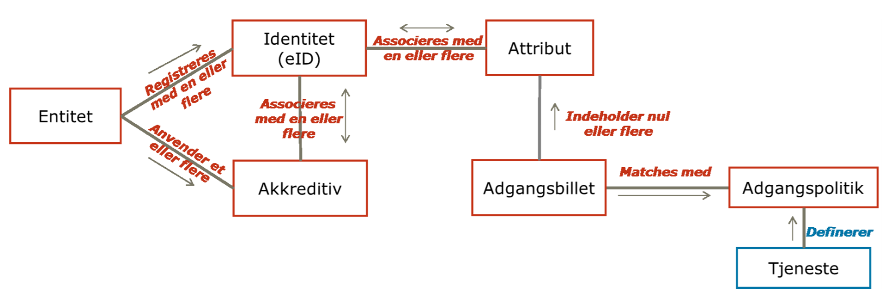

| Relation                                                                                                                 | Definition                                                                                                                                                                                                                                                                                                                                                                                                                                                                                                            |
|--------------------------------------------------------------------------------------------------------------------------|-----------------------------------------------------------------------------------------------------------------------------------------------------------------------------------------------------------------------------------------------------------------------------------------------------------------------------------------------------------------------------------------------------------------------------------------------------------------------------------------------------------------------|
| En entitet registres med en eller flere identiteter.                                                                     | En entitets eID fastlægges og valideres af en registreringstjeneste                                                                                                                                                                                                                                                                                                                                                                                                                                                   |
| En entitet tildeles et eller flere akkreditiver.                                                                         | En akkreditivtjeneste udstyrer entiteten med fysiske eller digitale objekter (pas, kørekort, brugernavn-kodeord, NemID), der verificerer identiteten over for den tjeneste, der forestår autentifikationen.                                                                                                                                                                                                                                                                                                           |
| En identitet kan associeres med (knyttes til) flere akkreditiver, og et akkreditiv kan associeres med flere identiteter. | Ved at koble identitet og akkreditiver løst kan identiteten være vedvarende over tid med mulighed for at skifte akkreditiv. Det giver også mulighed for, at brugeren kan indrullere flere akkreditiver som supplement til et udleveret akkreditiv (fx indrullere fingeraftryk).                                                                                                                                                                                                                                       |
| En identitet associeres med en eller flere attributter (claims) og en attribut kan associeres med flere identiteter.     | En identitet tilknyttes attributter, der karakteriserer den specifikke identitet, til brug for en tjenestes vurdering af, om tjenesten kan give denne identitet adgang. Et givet antal attributter hos en identitet skal matche adgangspolitikken hos tjenesten, for at tjenesten giver identiteten adgang.                                                                                                                                                                                                           |
| En adgangsbillet indeholder et eller flere sæt attributter.                                                              | En anmodning om adgang behandles af login-tjeneste eller identitetsbroker, som udsteder en adgangsbillet med en eller flere attributter, der beskriver identiteten.                                                                                                                                                                                                                                                                                                                                                   |
| En adgangsbillet matches med en adgangspolitik.                                                                          | Adgang gives af en tjeneste på grundlag af de attributter, der fremgår af adgangsbilletten, samt et tillidsforhold til den tjeneste, som har udstedt billetten. Adgangskontrollen følger tjenesteudbyderens vedtagne adgangspolitik for den pågældende tjeneste.                                                                                                                                                                                                                                                      |
| En tjeneste har en adgangspolitik.                                                                                       | En tjenesteudbyders tjeneste stiller funktionalitet og informationer (data) til rådighed, som er underlagt en adgangspolitik, der specificerer, hvilke attributter identiteten skal demonstrere for at få adgang til specifikke funktioner og informationer. Denne adgangspolitik fastlægger niveauet for funktionaliteters og informationers (datas) tilgængelighed og beskyttelse, herunder de sikringsniveau for identitet og akkreditiver, som tjenesten accepterer, og den kvalitet i attributter den forventer. |

Afsnit 12: Bilag C giver en begrundelse for valget af denne begrebsmodel

### 5.3 Brugerstyringens kontekst

Brugerstyring foregår i en kontekst, og for referencearkitekturen er der dele af
denne kontekst, som det er særlig vigtigt at være opmærksom på. Den ene er
informationssikkerhedspolitikken og registrering af sikkerhedshændelser, mens
den anden er, hvilke konkrete former som entiteter i en brugerstyring optræder
med. Kontekstens begreber er markeret med blåt og vil være defineret i andre
referencearkitekturer eller standarder.

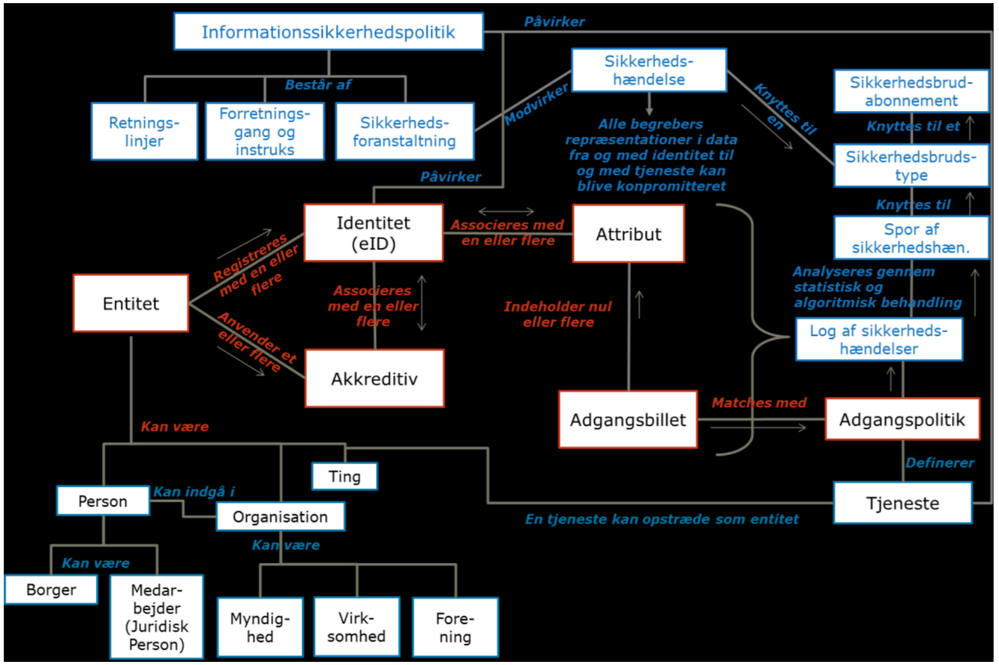

For denne kontekst beskrives relationerne til begrebsmodellen for brugerstyring.

| Relation                                                                                                                                  | Definition                                                                                                                                                                                                                                                                                                                |
|-------------------------------------------------------------------------------------------------------------------------------------------|---------------------------------------------------------------------------------------------------------------------------------------------------------------------------------------------------------------------------------------------------------------------------------------------------------------------------|
| En entitet kan være en person, en organisation, en ting eller en tjeneste.                                                                | Pr. 2016 er der udviklet en dansk eID-standard for borgere og personer (se NSIS), der bygger på eIDAS, og identiteter efter eIDAS skal respekteres af alle EU-lande. Dette rammeværk er endnu ikke udviklet for organisationer, ting eller tjenester. En tjeneste, der optræder som entitet, kaldes en tjenestekonsument. |
| En informationssikkerhedspolitik påvirker identitet og dens tilhørende akkreditiver og attributter.                                       | Politikkens retningslinjer, forretningsgange og instrukser og sikkerhedsforanstaltninger påtrykkes den konkrete specifikation af identitet, akkreditiv og attributter, således at sikkerhedshændelser forebygges.                                                                                                         |
| En informationssikkerhedspolitik påvirker hvilken adgangspolitik, der kan lægges for en tjeneste.                                         | Det er gennem anvendelse af informationssikkerhedspolitikken og tilhørende risikovurderinger, at en adgangspolitik kan fastlægges.                                                                                                                                                                                        |
| Log af sikkerhedshændelser foretages hver gang, der forsøges at forfalske autentifikation eller omgå adgangskontrol.                      | Alle begrebers repræsentationer i data fra og med identitet til og med tjeneste kan blive kompromitteret. En log registrerer alle trin i behandling af en identitets anmodning om en adgang.                                                                                                                              |
| Flere logs knyttes til et spor af en sikkerhedshændelse                                                                                   | Gennem statistisk og algoritmisk behandling findes mønstre i logs af sikkerhedshændelser, der giver et spor.                                                                                                                                                                                                              |
| En sikkerhedshændelse kan ske ved angreb på eller forvanskning af identitet, akkreditiv, attributsæt, adgangsbillet eller adgangskontrol. | Alle muligheder udnyttes af fjendtligtsindede. Overvåges og håndteres af organisationers Cyber Emergency Response Team (CERT), som for staten er placeret i Center for Cybersikkerhed.                                                                                                                                    |
| En sikkerhedshændelse knyttes til en sikkerhedstype.                                                                                      | En gruppering af sikkerhedshændelser                                                                                                                                                                                                                                                                                      |

## 6. Byggeblokke

>I dette afsnit beskrives de byggeblokke, der skal være til stede for at kunne realisere de løsninger, der lægges op til med referencearkitekturen.
Referencearkitekturen begrænser sig til at definere de tjenester, som forvalter referencearkitekturens begreber. Disse tjenester er markeret med
røde rammer nedenfor

De forretningsbehov der er beskrevet i afsnit **Fejl! Henvisningskilde ikke
fundet.,** og ovenstående principper peger entydigt frem mod en løst koblet, fødereret arkitektur. Her vil de enkelte tjenester/tjenesteudbydere håndhæve adgang baseret på forudgående (ekstern) registrering, attributbeskrivelse, autentifikation og billetudstedelse. Således vil de ikke selv skulle håndtere en registreringstjeneste, en attributtjeneste, en autentifikationstjeneste og en billettjeneste.
Der er derfor valgt en token-baseret model for adgangsstyring. Denne indebærer,
at entiteter efter autentifikation får udstedt en adgangsbillet (et såkaldt Security
Token) af en betroet komponent i infrastrukturen, der kan være en identetsbroker. Adgangsbilletten præsenteres herefter over for den tjeneste, som leverer data
eller funktionalitet, der ønskes adgang til. En adgangsbillet indeholder information om entitetens karakteristika og egenskaber i form af attributter og kan være
digitalt signeret af den betroede udsteder, så den ikke kan forfalskes eller manipuleres.
Valget af den token-baserede fødererede model er i tråd med alle nyere løsninger
og planlagte initiativer i de forskellige sektorer i Danmark såvel som internationalt. Fællesoffentlige løsninger inden for brugerstyring er baseret på en model og
standarder, der understøtter den, herunder OIOSAML-standarden. Således benytter eksempelvis NemLog-in, grunddataprogrammet, Borger.dk, Virk.dk,
Danmarks miljøportal, den fælleskommunale rammearkitektur og sundhedsområdet en token-baseret model.

>
>>Opbygning af brugerstyring med byggeblokkene Registrering af elektronisk identitet, Akkreditivtilknytning, Attributbeskrivelse, Autentifikation, Billetudstedelse og Adgangskontrol
BØR efterkommes i fællesoffentlige løsninger, i tværoffentlige brugerstyringsløsninger og i
tjenester, der anvender disse.  
Dette afsnit KAN efterkommes af andre løsninger i offentlige sektorer.

### 6.1 Administration af elektronisk identitet, Akkreditiver og Attributter

Følgende figur illustrerer de løst koblede byggeblokke for administration i brugerstyring, der udgør de centrale byggeblokke i den samlede arkitektur:

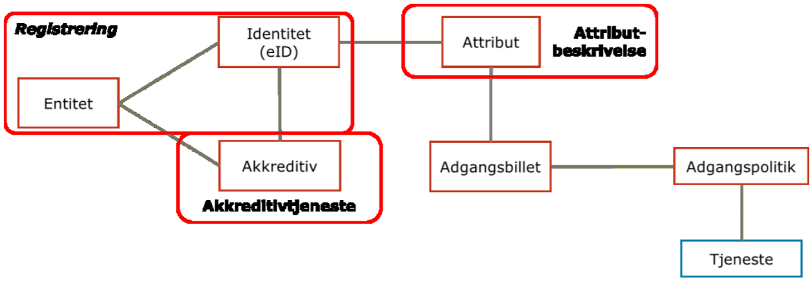

Byggeblokkene ”Registrering”, og ”Akkreditivtjeneste” er de tjenester, der registrerer entiteter, og de akkreditiver som anvendes til at validere identiteter. Attributter som beskriver identiteten, kan vedligeholdes af attributtjenester. Tabel 1
giver som overblik nogle eksempler.

Tabel 2. Eksempler på identifikatorer, akkreditiver og attributter for entiteter

|                   |                                                          | Atrributter                     |                                                |                                                                                |
|-------------------|----------------------------------------------------------|---------------------------------|------------------------------------------------|--------------------------------------------------------------------------------|
| **Entitet**           | **Akkreditiv**                                               | *Baseret på tal*                  | *Baseret på navne*                               | *Baseret på* klassifikationer                                                    |
| Person            | Kodeord, nøglekort, nøglefil, fingeraftryk, irisscanning | CPR-nr., administrativt CPR-nr. | Brugernavn, vanlig-navn, køn, alder, UNI*Login | Specialkonsulent, leder, administrator, kompetence, uddannelse, certificering. |
| Organisation      | Nøglefil                                                 | CVR-nr., EAN, SEnr.             | Vanlig-navn, logi, branchekode                 | Leverandør, rådgiver, kontrollant, certificering                               |
| Ting              | Nøglefil, token                                          | Serienummer, URL, Typenummer    | Funktion, RDF, OWL                             | Sensortype, triggertype, certificering                                         |
| Tjenestekonsument | Nøglefil (p.t. FOCES)                                    | P-nummer                        | RDF, OWL, funktionsnavn                        | FORM, opmærkning, funktionstype                                                |

Implementering af disse byggeblokke målrettes det eller de sikringsniveauer, som
informationssikkerhedspolitikken har fastlagt. Det udtrykkes fx af forskellen i
processen for at opnå et NemID eller et virksomhedscertifikat i forhold til at
opnå et brugernavn-kodeord til at tilgå sin virksomheds informationer. Grundet
tradition logger de fleste medarbejdere på deres organisations lokale netværk blot
med brugernavn-kodeord, men påtvinges så at skifte dette ofte, fx med tre måneders mellemrum.

Jo stærkere garanti for akkreditiv og attributter, som et valgt sikringsniveau kræver, jo stærkere skal kontrolfunktionerne omkring registreringen være.

Brugerstyringstjenesterne kan varetages af samme organisation, men kan i en
tværgående national føderation varetages af forskellige organisationer. Opdelingen kædes sammen med fællesoffentlige standardprotokoller for informationsudvekslingen. Da de forskellige standardsystemer, som anvendes af myndigheder
og virksomheder, ikke nødvendigvis har de fælles protokolstandarder indbygget,
kan dette løses af en broker, der foretager protokolkonvertering.

En særlig opmærksomhed skal gives vedligeholdelse af entiteters attributter gennem entiteternes livscyklus. Denne livscyklus indeholder ændringer i registreringspraksis, i valg af anvendte akkreditiver og i beskrivelse af attributter, herunder roller og terminering af alle rettigheder for en entitet ved fx jobskifte, dødsfald, konkurs, udskiftning, ændring eller nedlæggelse af tjeneste og lign.

Det gentages her, at denne referencearkitektur anvender følgende termer i stedet
for termen autorisation med henblik på at opnå den størst mulige præcision:

- Administration af en entitets rettigheder gennem associering af attributter.
- Udstedelse af adgangsbillet med identitet, roller, dataafgrænsninger og andre
attributter betegnes med *billetudstedelse.*
- Fastlæggelse af adgangspolitikker og adgangsrettigheder betegnes *adgangspolitik.*
- Håndhævelse af adgangsrettigheder kaldes *adgangskontrol.*

### 6.2 Registrering af elektronisk identitet

Byggeblokken ”Registreringstjeneste” har til opgave at foretage en tilknytning
mellem en entitet og en identitet og udføre dette efter National Standard for
Identiteters Sikringsniveauer (NSIS). NSIS fastlægger fire veldefinerede sikringsniveauer, som en tjenestes adgangskontrol kan tage udgangspunkt i, når de præsenteres for en autentificeret identitet. En entitet kan knyttes til flere identiteter.

En registreringstjeneste har ansvar for ikke blot at registrere entiteter første gang,
men også for at vedligeholde en entitets registrering i hele dets livscyklus. Dette
inkluderer nedlæggelse af identiteten, hvis entiteten ophører med at eksistere fx
ved død eller konkurs.

### 6.3 Akkreditivtjeneste

Gennem byggeblokken ”Akkreditivtjeneste” skabes en relation mellem en identitet og et akkreditiv, som garanterer nogle centrale karakteristika ved denne identitet, som udstederen af akkreditiver står inde for.

Det mest simple og udbredte akkreditiv er et kodeord knyttet til et navn, der
repræsenterer entiteten. For den offentlige administration har man defineret en
række offentlige certifikattyper baseret på den internationale X.509-standard, der
udnyttes til at validere, om identiteten i relation til den offentlige administration er en person (pt. POCES plus nøglekort i NemID), en organisation (pt. VOCES)
eller en tjeneste (pt. FOCES). Dette forventes ændret med næste generation af
national løsning for digital identitet og signatur.

Akkreditivtjenesten skaber i nogle tilfælde alene en tilknytning mellem en repræsentation af en identitet og et allerede eksisterende akkreditiv, mens der i andre
tilfælde udstedes et nyt akkreditiv, som knyttes til identiteten. Nogle akkreditivtjenester tilføjer også flere beskrivende attributter til identiteten.

Stærke akkreditiver med høje sikringsniveauer som fx certifikater udstedes af en
særlig akkreditivtjeneste (eng: CSP=Credential Service Provider), der har kompetencerne til at implementere disse sikringsniveauer. For den eksisterende implementering af den nationale eID kaldet NemID er Nets DanID A/S akkreditivtjeneste. Akkreditivtjenesten har også et vedligeholdelsesansvar for akkreditivets
livscyklus, idet akkreditiver kan have en tidsbegrænset varighed og kan blive
kompromitteret.

### 6.4 Attributbeskrivelse

I forbindelse med registrering og oprettelse af den elektroniske identitet vil der
typisk blive registreret en række beskrivende attributter. Attributterne beskriver
identiteten, f.eks. med identifikatorer (CPR eller brugernavn), navne, højde, øjenfarve eller andet, der knytter sig stærkt til entiteten. Der kan dog også registreres
andre typer attributter, der i sidste ende kan være adgangsgivende ift. tjenester,
f.eks. den eller de arbejdsfunktioner, som ledelsen i en virksomhed ønske at personen skal kunne optræde i, eller attributter vedrørende kompetencer eller andet.
Tilknytning af attributter til en elektronisk identitet kaldes i denne referencearkitektur for *attributbeskrivelse.*

Der kan være mange, der knytter attributter til identiteter. Nogle vil, som ovenfor nævnt, typisk blive tilknyttet i forbindelse med registrering og oprettelse af
den elektroniske identitet, mens andre kan komme til i senere processer, hvor
f.eks. brugeradministratorer tildeler ’roller’, vedligeholder eksisterende attributter
eller tilføjer nye attributter.

Indgår man i en føderation, kan der fastlægges attributter, som er særlig vigtige
for samspil mellem føderationens deltagere, og derfor tildeles af en attributtjeneste anerkendt inden for føderationen. Det samme kan gælde, hvis man ønsker, at
roller skal håndteres ens på tværs af en føderations deltagere. Inden for sundhedsområdet er det fx vigtigt, at visse roller – og dermed attributter – håndteres
ens på tværs af sundhedsaktører, der skal samarbejde om behandlingen af patienter.

Enheder, der leverer attributbeskrivelser, skal vælges og håndteres med en omhu,
der afspejler det sikringsniveau, som man ønsker, at attributterne skal matche. På
sundhedsområdet er det meget veldefineret, hvilken myndighed der må koble en persons identitet til forskellige autorisationer til at udføre sygepleje og lægebehandling. I andre sammenhænge kan man lade en virksomhed beskrive de roller,
som man som samarbejdspartner kan optræde i.

### 6.5 Anvendelse af brugerstyring

Følgende figur illustrerer de løst koblede byggeblokke for *anvendelse* af brugerstyring, der udgør de centrale byggeblokke i den samlede arkitektur:

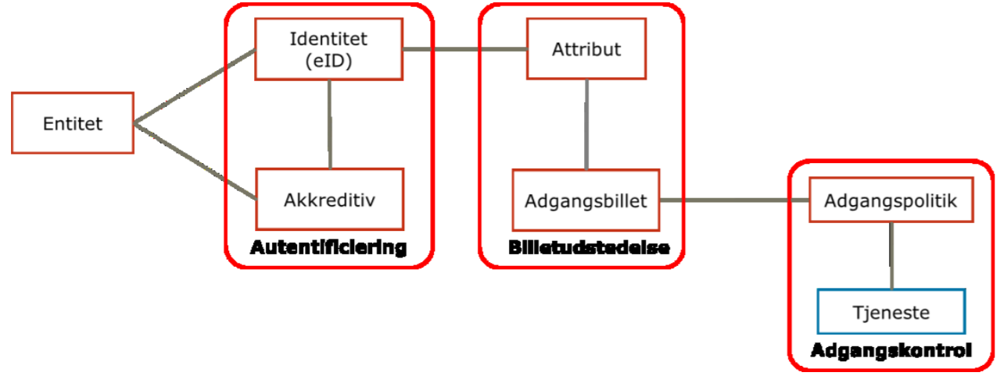

### 6.6 Autentifikation

Byggeblokken ”Autentifikation” er den tjeneste, der validerer en identitet på
baggrund af et akkreditiv. Autentifikation er baseret på brug af akkreditiver som
fx kodeord (noget kun entiteten ved), et token (noget kun entiteten har) eller
biometri (noget kun entiteten er eller gør). Tjenesten kan desuden levere identitetsattributter samt information om validiteten af identiteten til tjenesten Billetudstedelse, der danner adgangsbilletter (Security Tokens) med tidsbegrænset
gyldighed til en eller flere tjenester. Det er adgangsbilletten, der giver adgang til
tjenesten – ikke det akkreditiv, som er udstedt til bruger/serviceaftager.

Før tjenesteudbyderen giver adgang til en entitet, anvender tjenesteudbyderen en
autentifikationstjeneste til at validere entiteten. Tjenesteudbyderen kan anvende
autentifikationstjenesten direkte eller gennem tjenesten ”Billetudstedelse”, som
beskrives i næste afsnit.

Autentifikationen bygger på tillid til, at den akkreditivtjeneste, der har tilknyttet
og udstedt akkreditiverne, har gjort dette til de rette entiteter, nemlig de samme
entiteter som registreringstjeneste har identificeret og registreret identiteten på.

### 6.7 Billetudstedelse

Byggeblokken ”Billetudstedelse” er den del af brugerstyringen, som udsteder
adgangsbilletter (eng: Security Tokens) til tjenester på grundlag af autentifikationen, og tilføjer attributter, der fx udtrykker kendetegn, roller eller andre typer af
attributter som fx attributter, der beskriver en relation (“repræsenterer og er under instruks af CVR”, “arbejder på vegne af læge X”), eller attributter, der udtaler
sig mere specifikt om medarbejderens funktion (“arbejdsfunktion”, “rolle”).

Attributter kan stamme fra autentifikationstjenesten, fra attributtjenester eller fra
egne brugerstyringssystemer. Byggeblokken kan desuden tilbyde, at de udstedte
adgangsbilletter leveres i flere standardformater. Byggeblokken kan varetages af
en broker, der dels kan indsamle attributter fra forskellige attributtjenester, dels
kan omveksle attributformater, hvis en tjeneste kræver et bestemt format for
adgangsbilletten

I en føderation bygger tjenesten Billetudstedelse på tillid til føderationens registreringstjenester, akkreditivudstedere og attributtjenester. Autentifikationstjenestens tjek af akkreditivet sikrer, at det er den rette entitet, hvis identitet anmoder
om adgang. Den adgangsbillet, som Billetudstedelse udsteder, skal indeholde det
eller de attributter for denne konkrete identitet, som identiteten skal præsentere
for at komme igennem adgangskontrollen.

### 6.8 Adgangskontrol

Tjenesteudbyderen er den, der forvalter det juridiske ansvar for adgangen til de
informationer og funktioner, som tjenesteudbyderen udstiller.

Det sker på grundlag af:

- Adgangspolitikken for tjenesten.
- Adgangskontrollen, som er håndhævelsen af adgangspolitikker, når en bruger
anmoder om adgang.

Tjenesteudbyderen fastlægger en **adgangspolitik** på grundlag af sin sikkerhedspolitik med klassifikationer af sine informationer og funktioner på følgende parametre:

- *Fortrolighed*, at kun autoriserede personer har ret til at tilgå informationerne,
og informationerne skal kun være tilgængelige for autoriserede personer.
- *Integritet (pålidelighed),* at data er komplette, korrekte og opdaterede.
- *Tilgængelighed,* at det skal være muligt at tilgå systemer og data for autoriserede
personer, når dette er nødvendigt.

Tjenesteudbyderen skal ud fra sin adgangspolitik og en risikovurdering fastlægge,
hvilke sikringsniveauer og attributsæt, der giver adgang til hvilke informationer
og funktioner. Disse kan være udmøntet i et struktureret format, der kan læses maskinelt af en funktion, der undersøger betingelserne til at få adgang til tjenestens funktioner og informationer.

Beskrivelsen af adgangspolitikken er desuden grundlaget for brugerens eller brugerorganisationens administration af brugerens rettighedsrelevante attributter.
Tjenesteudbydere og brugere/brugerorganisationer skal derfor have fælles forståelse af adgangspolitikken. I en standard som WS-SecurityPolicy er der specificeret et sprog for at udtrykke en adgangspolitik. Dette giver en Billetudsteder
mulighed for maskinelt at spørge tjenesten, hvilken adgangspolitik der skal opfyldes for at få adgang til en bestemt funktion eller bestemte informationer.

Den løbende vedligeholdelse af den adgangspolitik, en given tjeneste kræver, er
omfattende, idet den skal realiseres for enhver tjeneste, som tjenesteudbyder
stiller til rådighed for brugere. Det samme gælder, hvilke akkreditiver og attributter der giver adgangsrettigheder til hvilke informationer og funktioner. De arbejdsprocesser, der foretager al denne vedligeholdelse, er i sin manuelle implementering meget ressourcekrævende. Der er derfor klare gevinster at hente gennem automatisering af administration i form af sparede manuelle ressourcer og
sikring af, at personer der forlader organisationen, eller organisationer der forlader føderationen, også meldes ud.

En udbredt model for adgangsrettigheder er rollebaseret adgangskontrol
(RBAC), hvor brugerorganisationen kan anvende egne organisatoriske roller i
forbindelse med adgangskontrol. I de seneste år har en ny model, attributbaseret
adgangskontrol (ABAC), vundet frem, hvor en regelmotor kan agere ud fra de
attributværdier, en tjeneste præsenteres for gennem adgangsbilletten.

I **Adgangskontrol** kontrolleres de attributsæt, som er indeholdt i den adgangsbillet, som brugeren medbringer fra Autentifikation og Billetudstedelse. Dette
attributsæt skal matche den definerede adgangspolitik for tjenesten for de funktioner og informationer, der ønskes adgang til. Ellers afvises det at give identiteten adgang. I tilfælde af at der er etableret Single Sign-On funktionalitet, kan
dette sæt af attributter (efter den initiale validering) repræsenteres af en session
cookie eller en OAuth token, der er udvekslet til at holde sessionen åben i en
bestemt tidsperiode.

Adgangskontrollen påhviler tjenesteudbyder. Dele af den kan løses af en fælles
byggeblok i referencearkitekturen.

### 6.9 Oversigt over byggeblokke i konteksten for brugerstyring

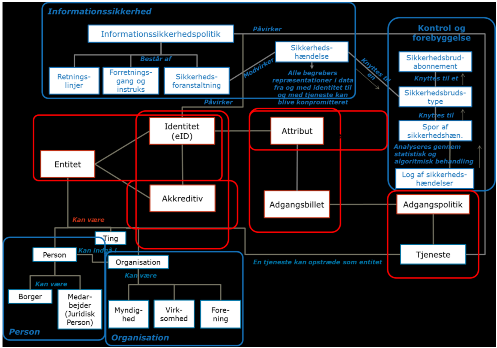

Byggeblokke i konteksten for brugerstyring er genstand for andre referencearkitekturer og standarder, så vi henviser til disse beskrivelser:

- *Informationssikkerhedspolitik* er beskrevet i ISO/IEC 27001, og der er vejledninger på Digitaliseringsstyrelsens hjemmeside.
- *Kontrol og forebyggelse* koordineres af Center for Cybersikkerhed, der udgiver
vejledninger og jævnligt opdaterer trusselsbilleder.
- *Organisation:* OIO Organisation er den fællesoffentlige standard for Organisation. Denne forventes revideret som led i digitaliseringsstrategien 2017-2020.
- *Person:* Her er CPR-version 1.1.0 den seneste fællesoffentlige standard.

## 7. Processer

> I dette afsnit vises med nogle få eksempler, hvordan byggeblokkenes
interfaces kan benyttes til understøttelse af forskellige typiske brugssituationer. Brugssituationerne beskrives ved hjælp af arbejdsgange.

De aktiviteter, der er skitseret i arbejdsgangene, er eksempler. Der kan være flere
eller færre aktiviteter, og rækkefølgen af disse kan i nogle tilfælde være en anden.
Det er arbejdsgangene i den enkelte myndighed, der afgør, hvilke konkrete aktiviteter en given arbejdsgang består af i praksis.

I de efterfølgende eksempler på arbejdsgange opererer hver aktør (myndighed,
leverandør af brugerstyringstjenester) i sin egen svømmebane. De forskellige
tjenester har desuden fået hver deres bane, hvor brugen af de forskellige interfaces vises. For overskuelighedens skyld er aktiviteternes brug af disse interfaces
vist som en direkte anvendelse af disse fra aktiviteterne. I praksis vil dette ofte
ske gennem forskellige tjenester, men da disse er mangfoldige og uden for denne
referencearkitekturs scope, er oversigten over arbejdsgange simplificeret ved, at
disse tjenester ikke vises i de følgende eksempler, jf. nedenstående figur.

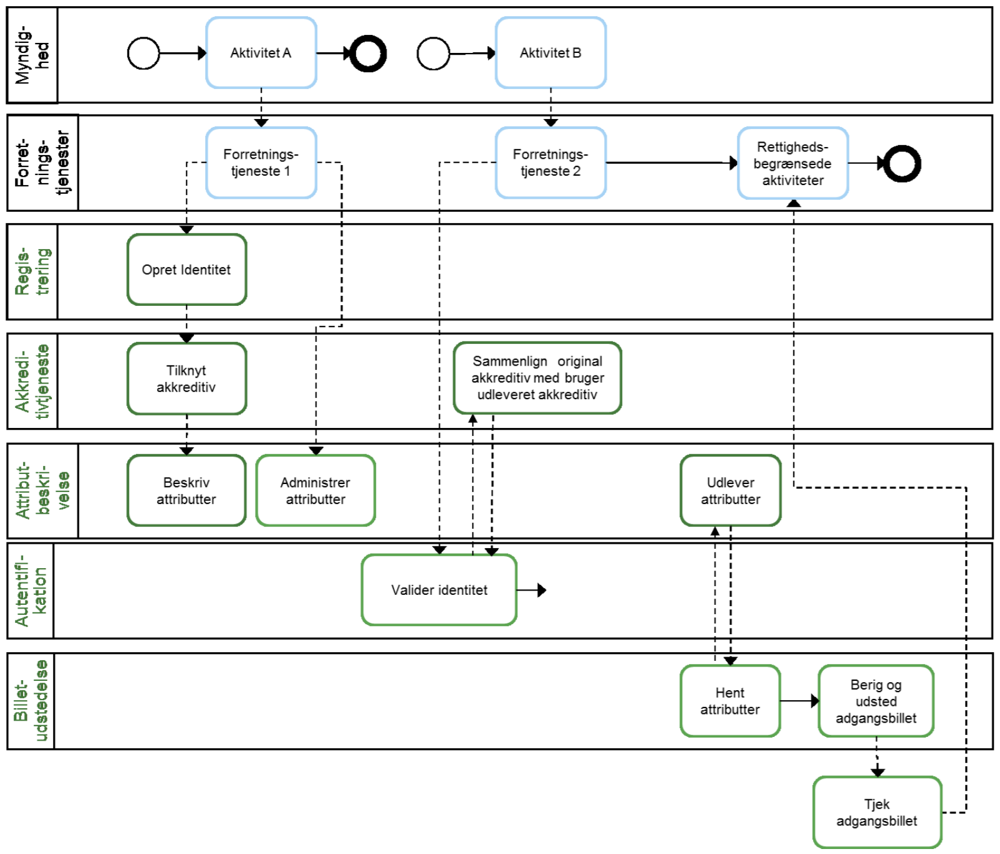

>
>> Den tekniske opbygning af brugerstyring med opdeling i klart adskilte delprocesser og arbejdsdeling mellem aktørerne i administrative processer og autentifikation, billetudstedelse og
adgangskontrol samt kontrol og rapportering BØR efterkommes i fællesoffentlige løsninger, i
tværoffentlige brugerstyringsløsninger og i tjenester, der anvender disse.  
Dette afsnit KAN efterkommes af løsninger i offentlige sektorer.

### 7.1 Administration af elektronisk identitet, akkreditiver og attributter

Processer i forbindelse med administration af eID, akkreditiver og attributter kan
gennemføres på forskellige måder og med forskellig sikkerhed for sammenhæng
mellem elektronisk identitet og en fysisk person eller anden entitet. Kravene på
forskellige sikringsniveauer (Levels of Assurance) beskrives normalt i et trust
framework, således at modtageren af en identitet kan matche dette mod deres
risikoniveauer.

De administrative processer kan gennemføres i et samlet forløb (som det beskrives her) eller i flere adskilte forløb. Enkelte processer kan gentages, fx kan brugeren få tilknyttet flere akkreditiver (fx et nyt smartcard) og flere attributter på et
senere tidspunkt.

**Registrering af elektronisk identitet** kan på lave sikringsniveauer ske ved, at
en person registrerer sig selv – og med data, der er valgt af personen selv eller
med de officielle data som navn og adresse fra CPR. Der er et tilsvarende behov
for registrering af organisationer og ting. Registrering af organisationer og ting
behandles dog ikke i denne her sammenhæng.

En myndighed kan registrere personen, verificere personens identitet (identity
proofing) og angive kvaliteten af registreringen, fx om registreringen er sket på
grundlag af fysisk fremmøde eller på anden måde.

En arbejdsgiver kan registrere sine medarbejdere i egne brugerstyringssystemer
eller i eksterne brugerstyringssystemer, fx i det fællesoffentlige eID og Miljøportalen. Det kan ske manuelt eller ved overførsel fra arbejdsgiverens eget brugerstyringssystem til det eksterne system.

En arbejdsgiver kan også registrere en tilknytning mellem sin virksomhed og en
given identitet, fx ved at en person med en given identitet (fra fx det fællesoffentlige eID eller Facebook) må udføre handlinger i virksomhedens systemer
eller for virksomheden.

For de mange virksomheder der er personligt ejede, kan tilknytningen mellem
virksomhed og en given identitet ske automatisk på grundlag af registreringer i
CVR-registret.

**Attributbeskrivelsen** er her beskrevet meget forenklet. Attributter for en identitet kan hentes fra eksterne kilder i forbindelse med registreringen (fx CPRoplysninger), kan registreres i forbindelse med registreringen, kan registreres i
brugerstyringssystemer eller i andre systemer. Attributter kan have forskellige
sikringsniveauer.

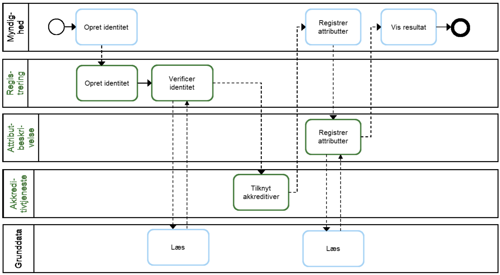

Processen for registrering af en elektronisk identitet foregår forenklet set gennem
følgende trin:

- En bruger opretter en identitet.
- Registreringstjenesten verificerer identiteten fx med hjælp fra grunddata samt
beviser leveret af ansøgeren (fx pas og kørekort). Disse grunddata kan desuden indgå i trinnet Registrer attributter.
- I akkreditivtjenesten kan der tilknyttes allerede anskaffede akkreditiver, eller
der kan udstedes og tilknyttes nye akkreditiver. Akkreditiver kan bestå af både digitalt information, som et X.509-certifikat, og fysisk information, som fx
et nøglekort.
- Aktøren registrerer de attributter, der er krævet/ønsket.
- Resultatet vises for brugeren.

En attribut kan være niveauet af registreringskvalitet og akkreditivets kvalitet, fx
efter National Standard for Identiteters Sikringsniveau (NSIS) eller eIDAS, der
har en model for fastlæggelse af niveauer af registreringskvalitet. Attributter kan
også være associeret til en rolle, som dermed kan kendes af adgangskontrollen.

### 7.2 Autentifikation

Når en bruger anmoder om adgang til en tjeneste, der ikke kræver et eller flere
attributsæt for at give adgang, aktiveres de ovenfor beskrevne tjenester i en proces, der typisk forløber, som illustreret i følgende figur:

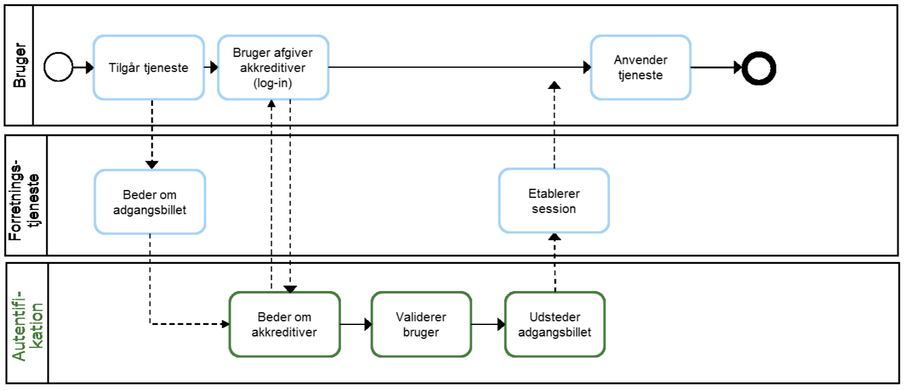

Processer i forbindelse med autentifikation kan gennemføres på forskellige måder og med forskellig sikkerhed for sammenhæng mellem elektronisk identitet og
de udstedte akkreditiver (sikringsniveauer).

Typisk skelnes der mellem, hvor stærke akkreditiver der anvendes, samt hvilke
kontroller der er tilknyttet selve autentifikationsprocessen. Login med et akkreditiv (1-faktor login) er oftest mindre stærk end med 2-faktor login. Login med
engangskodeord er oftest stærkere end med et statisk kodeord, som igen kan
være mere eller mindre stærkt, afhængigt af kodeordets længde. Login over en
krypteret kanal kan være stærkere end login over en ukrypteret kanal.

Autentifikationen kan som beskrevet ske ved, at tjenesten henvender sig direkte
til autentifikationstjenesten, men der kan også indgå flere aktører i processen,
som når både en broker (NemLog-in) og en autentifikationstjeneste indgår.

1. Brugeren tilgår (anmoder om adgang til) forretningstjenesten.
2. Forretningstjenesten anmoder evt. brugeren om at vælge, hvilken autentifikationstjeneste brugeren ønsker at benytte (fx WAYF, KOMBIT).
3. Forretningstjenesten anmoder autentifikationstjenesten om en adgangsbillet
(en token) til brug for login.
4. Autentifikationstjenesten beder brugeren om at præsentere akkreditiver.
5. Brugeren autentificerer sig over for autentifikationstjenesten.
6. Autentifikationstjenesten validerer brugerlogin.
7. Autentifikationstjenesten udsteder en adgangsbillet til tjenesten med brugerens identitet og eventuelle attributter.
8. Forretningstjenesten kontrollerer den udstedte adgangsbillet og etablerer evt.
en session med brugeren.
9. Brugeren kan anvende forretningstjenesten.

Forløbet i denne proces varierer afhængigt af brugertype og situation. I figuren
herover starter processen i forretningstjenesten, som re-dirigerer til autentifikationstjenesten. Hvis brugeren allerede har en session med autentifikationstjenesten, sker der ikke nødvendigvis fornyet login, men der udstedes en adgangsbillet
til den ny forretningstjeneste.

Ovenstående dækker både processer, hvor brugeren tilgår tjenesten i en browser
og fra en applikation. Der vil være forskelle i de tekniske implementeringer.

### 7.3 Billetudstedelse og Adgangskontrol

I denne proces kræver tjenestens adgangspolitik, at adgangsbilletten indeholder
bestemte attributsæt. Processerne i forbindelse med Billetudstedelse og Adgangskontrol tager derfor udgangspunkt i, at der er oprettet en identitet, som har
fået tilknyttet attributter, der matcher forretningstjenestes adgangspolitik. Efter
autentifikation skal identiteten derfor have udtrykt disse attributter i den adgangsbillet, som forretningstjenesten modtager.

Arbejdsdelingen mellem de forskellige aktører kan også være forskellig, hvilket
kan have betydning for, hvor attributter (fx rolle) hentes fra, og om fx adgangspolitikker håndteres af rettighedstjenesten eller forretningstjenesten. Det kan
også have betydning for, hvor aktørerne administrerer attributter.

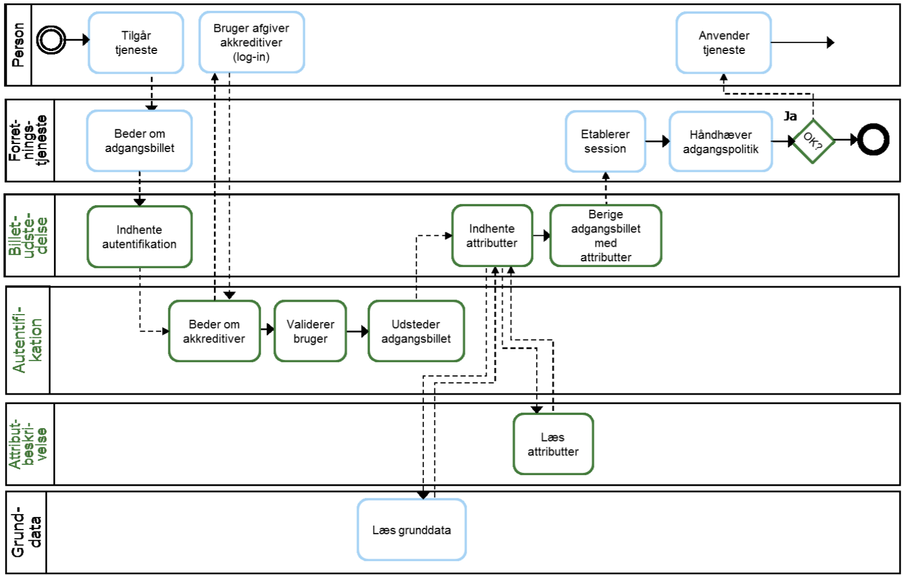

1. En person anmoder om at anvende en tjeneste hos en tjenesteudbyder.
2. Tjenesten beder derfor en Billetudstedelse (identitetsbroker) om en adgangsbillet. Identitetsbrokeren tager sig af at sikre gennemførsel af autentifikation,
indhente alle nødvendige attributter og udstede adgangsbilletten.
3. Autentifikationstjenesten verificerer brugerens akkreditiv gennem en autentifikationsproces. Kun hvis dette er korrekt, fortsættes, ellers afvises personen.
4. Autentifikationstjenesten udsteder herefter en adgangsbillet til identitetsbrokeren med de attributter for identiteten, som tjenesten kræver.
5. En eller flere grunddatatjenester leverer de fornødne attributter knyttet til
identiteten.
6. En eller flere attributtjenester leverer attributter knyttet til identiteten.
7. Billettjenesten beriger adgangsbilletten med attributter og udsteder denne til
forretningstjenesten.
8. Denne forretningstjeneste etablerer en session, som personen kan agere i
med disse rettigheder og attributter.
9. Forretningstjenesten håndhæver rettighederne i personens anvendelse af
forretningstjenesten.
10. Brugeren anvender forretningstjenesten.

### 7.4 Kontrol og rapportering

I eksemplet om Billetudstedelse og Adgangskontrol ovenfor skal alle brugerstyringstjenesterne for hver aktivitet logge resultatet af aktiviteten som adgangshændelser. Hvis man i brugerstyringstjenesterne konstaterer et sikkerhedsbrud,
logges det som en sikkerhedshændelse, og denne forsynes med tilstrækkelige
metadata til, at de tjenester der overvåger sikkerhedsbrud, kan anvende informationen og agere på den.

Sikkerhedsfunktionen hos udbydere af brugerstyringstjenester og forretningstjenester bør med passende mellemrum undersøge loggen af adgangshændelser for
spor af forsøg på sikkerhedsbrud som led i forebyggelse af sikkerhedsbrud, fx
gennem datamining-teknikker, herunder maskinlæring. Derigennem kan indbrudsforsøg afdækkes, og sikkerhedsforanstaltninger foretages og forebygges.
Dette rapporteres også som en type sikkerhedshændelse til føderationen og til
sikkerhedstjenester i føderationen. Samme sted kan tjenesteudbyderens sikkerhedsfunktion og udbyderne af brugerstyringstjenester hente de seneste erfaringer
med sikkerhedshændelser eller spor af sikkerhedshændelser og anvende dette i
deres forebyggende arbejde.

## 8. Teknisk arkitektur

>Dette afsnit beskriver det systemtekniske målbillede, de væsentligste
komponenter og standarder.

Det er kendetegnende for brugerstyringsområdet, at området er veludbygget med
en lang række føderationer, tekniske løsninger og standarder.

Der er derfor i forbindelse med referencearkitekturen behov for at etablere nye
tekniske løsninger på få, begrænsede områder, idet de enkelte komponenter i
målbilledet stort set er til stede. Der er fx behov for at etablere føderationer og
forbedre samspillet mellem føderationer.

Der forventes desuden en fortsat øget specialisering af funktioner i økosystemet,
hvilket kan føre til udvikling af nye standarder, til kommunikationen mellem
komponenter samt løbende tilpasning af eksisterende standarder.

### 8.1 Teknisk målarkitektur

>
>>Den tekniske målarkitektur BØR efterkommes i fællesoffentlige løsninger, i løsninger, der
kommunikerer mellem offentlige sektorer, og i tjenester, der anvender fællesoffentlige løsninger.  
Den tekniske målarkitektur KAN efterkommes af løsninger i offentlige sektorer.

Det systemtekniske målbillede viser, hvor validering af og data om brugere og
andre entiteter stilles til rådighed af brugerstyringstjenesterne til forretningsformål, ligesom de kan indgå i samspil med andre infrastrukturtjenester.

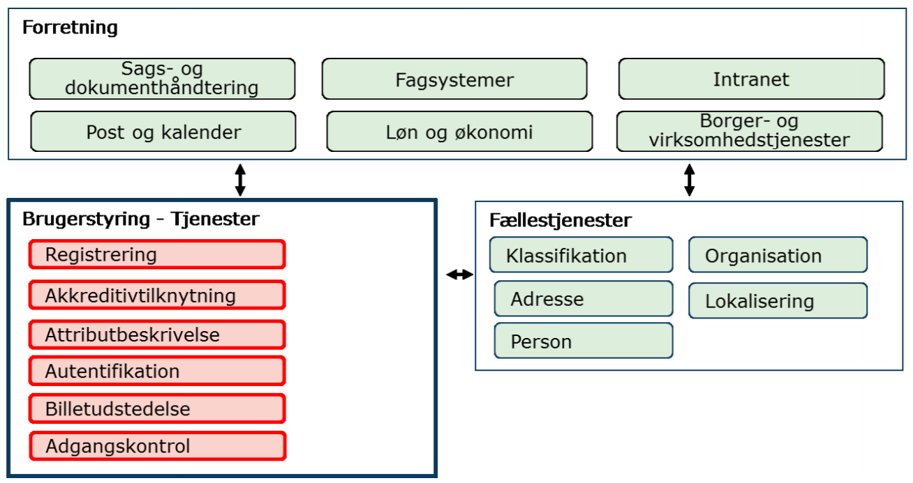

Brugerstyringstjenesterne skal gøre det muligt for forretningssystemerne at anvende og opdatere data om brugere til de mange forskellige formål, der er beskrevet ovenfor.

Brugerstyringstjenesterne kan indgå både i den enkelte organisations infrastruktur og i den nationale infrastruktur, hvor brugerstyringstjenesterne kan anvende
fx tjenester for Klassifikation og Organisation, og hvor andre infrastrukturtjenester kan anvende brugerstyringstjenesterne.

Det systemtekniske målbillede tager udgangspunkt i, at der implementeres snitflader baseret på åbne standarder i de enkelte brugerstyringssystemer og i de øvrige systemer, der skal anvende brugerstyringstjenester.

### 8.2 En målarkitektur med identitetsbrokere

>
>>Arkitektur med identitetsbrokere SKAL efterkommes i fællesoffentlige løsninger, mens øvrige
løsninger i offentlige sektorer BØR efterkomme ovenstående.

En login-tjeneste er en brugerstyringstjeneste, der foretager autentifikation af
brugere på vegne af forretningstjenester. Autentifikationen består som regel i at
verificere et akkreditiv evt. ved at kontakte en akkreditivudsteder, men man kan
også omveksle billetter, udstedt af andre login-tjenester (brokering). Ud over
autentifikation kan login-tjenesten indhente yderligere information om brugeren
hos attributtjenester, som indlejres i en billet, udstedt til forretningstjenesten. En
login-tjeneste kan evt. også danne en session med brugeren med henblik på at
etablere Single Sign-On.

En login-tjeneste kaldes også for en identitetsbroker. Ved at anvende en identitetsbroker opnår forretningstjenesten en løs kobling til brugerens akkreditiver og
hermed autentifikationstjenester. Forretningstjenesten skal blot forholde sig til, hvem brugeren er, og hvilke andre attributter (fx rettigheder) der står i billetten,
samt sikringsniveauet for autentifikationen (jf. NSIS), men ikke hvordan brugeren er logget ind og med hvilke akkreditiver. Dette betyder eksempelvis, at man
kan indføre nye typer akkreditiver eller nye snitflader til autentifikationstjenester
uden at påvirke forretningstjenesterne(Et eksempel på dette var indførslen af NemID Javascript-løsningen i 2014. Her skiftede NemLog-in fra Javaimplementeringen af NemID til JavaScript-implementeringen, og med ét slag var de over 200 offentlige tjenester tilsluttet
NemLog-in overgået til den nye teknologi – uden at ændre én linje kode selv.).

>
>>Identitetsbrokere BØR kommunikere sikringsniveauet (eng: Level of Assurance) for autentifikationen ved at indlejre en attribut i billetten, som angiver dette (hvor niveauet typisk er defineret i et trust framework som fx National Standard for Identiteters Sikringsniveau (NSIS)).
Dette gælder for fællesoffentlige løsninger og tværoffentlige brugerstyringsløsninger.

Et andet væsentligt aspekt af den løse kobling er, at forretningsapplikationen
ikke hårdkodes til at hente oplysninger om entiteterne bestemte steder, men i
stedet får dem leveret af infrastrukturen gennem den udstedte billet. Herved har
man frihed til at ændre i placeringen af attributter, uden at forretningstjenesterne
påvirkes.

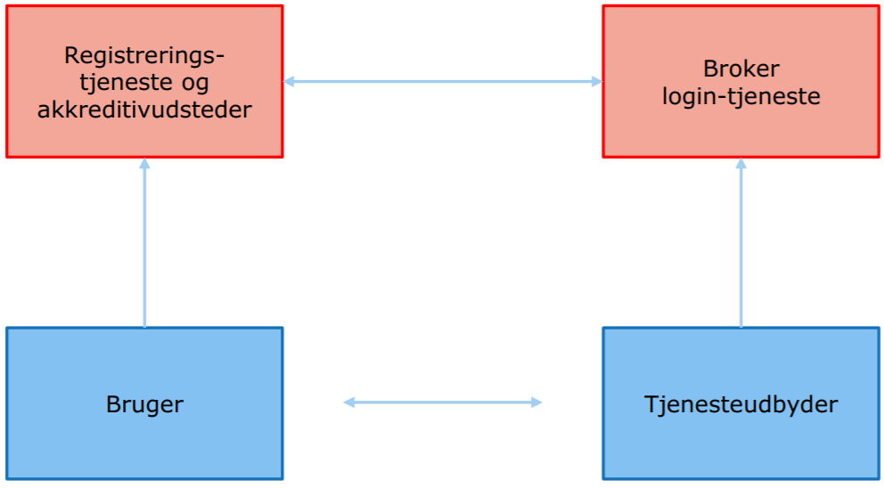

Denne model svarer til ”*four corner*”-modellen for betalingskortinfrastrukturen,
som vist på Figur 17 Arkitektur til betalingskortinfrastruktur, hvor kortholderen
(svarende til entiteten) forbindes til betalingsmodtager (svarende til tjenesteudbyder) gennem kortudsteder (svarende til registreringstjeneste og akkreditivudsteder) og kortindløser (svarerende til broker). Modellen har vist sig meget skalerbar i praksis, både i forhold til antallet af aktører og i forhold til transaktioner.

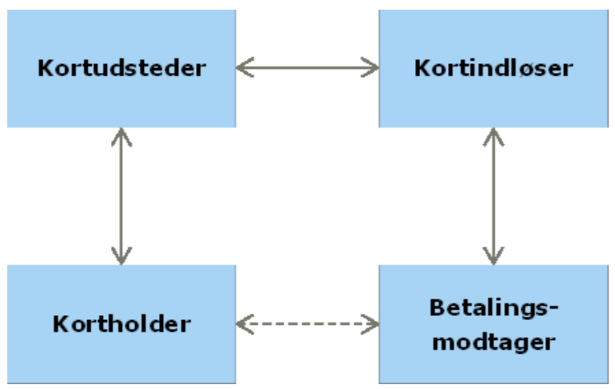

For langt hovedparten af offentlige tjenesteudbydere anvendes denne model,
som nævnt, allerede med NemLog-in som identitetsbroker. Ligeledes fungerer
sundhedsområdets SOSI STS som identitetsbroker.

Denne arkitekturmodel understøtter, at der er flere autentifikationstjenester, bl.a.
som følge af eIDAS-forordningens krav om gensidig anerkendelse af eID på
tværs af EU-landegrænser. STORK2-projektets arkitektur kan umiddelbart implementeres ved at indarbejde funktionalitet hos en broker til at modtage eID fra
andre EU-medlemsstater – en såkaldt eID-gateway. I Danmark er NemLog-in et
eksempel på en identitetsbroker, som benyttes mod alle offentlige nationale selvbetjeningsløsninger med behov for sikker identifikation, herunder løsninger på
portalerne borger.dk, virk.dk og sundhed.dk. NemLog-in understøtter p.t. kun
NemID som akkreditiv. Som andre eksempler kan nævnes Uni*Login, WAYF
og ContextHandleren, som implementeres i regi af den fælleskommunale infrastruktur.

Hvis en broker eller login-tjeneste understøtter flere forskellige autentifikationsmekanismer, KAN der være et element af brugerinteraktion, hvor brugeren vælger login-mekanisme. Et eksempel på dette findes i WAYF-løsningen, hvor brugeren normalt skal vælge, hvilken organisation han/hun tilhører for efterfølgende at autentificere mod dennes login-tjeneste, inden WAYF omveksler billetten
til forretningstjenesten.

Arkitekturmodellen betyder – som for betalingskort – at brugerne kan anvende
flere forskellige eID fra flere registreringstjenester, og hver eID kan have tilknyttet forskellige akkreditiver fra forskellige akkreditivudstedere. For tjenesterne
betyder det, at de kun skal have forbindelse til en identitetsbroker, som så håndterer forbindelsen til forskellige registreringstjenester og akkreditivudstedere.
Tjenesteudbyder behøver således ikke have kendskab til de enkelte registreringstjenester og akkreditivudstedere, men skal blot definere en politik for et ønsket
veldefineret sikringsniveau.

Anvendelse af en broker-baseret arkitektur åbner desuden mulighed for, at tjenesteudbydere kan få mere relevante og branchespecifikke attributter for den konkrete kontekst, uden at registreringstjenester og akkreditivudstedere skal akkumulere en lang række informationer om brugerne. Dette kendes allerede i dag fra
sundhedssektoren, hvor SOSI STS’erne fungerer som brokere og tilfører information om brugerne fra eksempelvis Sundhedsstyrelsens autorisationsregister.

Det er langt fra altid, at en rettighedstjeneste eller tjenesteudbyder har brug for
entydigt at kende identifikation af brugeren/serviceaftageren for at kunne afgøre
dennes adgang til en service. Ved et køb af billet til bus eller tog er der, som tidligere nævnt, et behov for at levere et bevis for betaling, men ikke nødvendigvis
for kundens identitet. Et andet eksempel er løsninger, der blot har brug for at
vide, om brugeren er myndig (alder>18) eller vedkommendes bopælskommune.
Her BØR login-tjenesten/identitetsbrokeren nøjes med at sende relevante attributter videre til tjenesten og ikke data, der afslører brugerens identitet. Dette
princip kaldes ofte for ”minimal disclosure” og er altså et udtryk for, at man af
hensyn til brugerens privatliv sender den minimale mængde af information, som
tjenesten har behov for.

I forhold til en infrastruktur med flere registreringstjenester og akkreditivudstedere vil anvendelse af identitetsbrokere skjule kompleksiteten for den enkelte
tjenesteudbyder. Anvendelse af en broker vil således minimere påvirkning af
tjenesteudbyder ved ændringer i form af teknologiskift hos de eksisterende autentifikationstjenester og etablering af nye autentifikationstjenester.

Samtidig vil en tjenesteudbyder have mulighed for at indgå aftale med flere brokere med henblik på at sikre størst mulig oppetid.

Det skal bemærkes, at en registreringstjeneste eller akkreditivudsteder kan operere som identitetsbroker, ligesom en større tjenesteudbyder kan etablere egen
broker-funktion. Endvidere kan brokere forbinde sig til andre brokere.

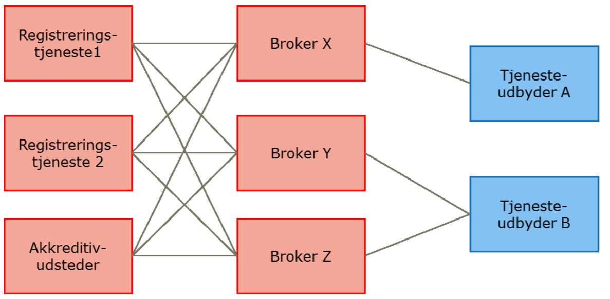

En brokerbaseret arkitektur kan indføres fleksibelt og gradvist, hvor tjenesteudbyder kan vælge at understøtte login og signering som en integreret del af egen tjeneste eller benytte en ekstern identitetsbroker. Introduktion af brokere kan
baseres på frivillighed og med tiltag, der fremmer overgang til brug af brokere,
herunder markedsføring af akkrediterings-/mærkningsordning af brokere. Alternativt kan der stilles krav om, at der benyttes en godkendt broker – fx indeholder
National Standard for Identiteters Sikringsniveau (NSIS) krav til identitetsbrokere på forskellige sikringsniveauer.

Modellen kan øge den samlede kompleksitet og dermed potentielt omkostninger
for den samlede infrastruktur. Modellen er til gengæld mere åben for konkurrence, og derfor vurderes det, at de samlede fællesoffentlige udgifter ikke vil overstige en model uden brokere.

### 8.3 Sikkerhed i den tværoffentlige brugerstyring

Referencearkitekturen beskriver en løst koblet arkitektur, hvor mange forskellige
aktører og løsninger skal arbejde sammen om en effektiv og sikker brugerstyring.
Dette indebærer en lang række fordele i forhold til fleksibilitet, arbejdsdeling mv.,
men gør det også mere kompliceret at få et overblik over det samlede sikkerhedsniveau. Som tidligere beskrevet, vil den enkelte tjenesteudbyder være afhængig af en række brugerstyringstjenester (fx udstedere af akkreditiver, logintjenester, identitetsbrokere, attributtjenester osv.). Et sikkerhedsbrud i én brugerstyringstjeneste eller forretningstjeneste kan i værste fald påvirke mange tjenester.
Det gælder både i forhold til fortrolighed, integritet og tilgængelighed. Dette er et
udtryk for det velkendte princip om, at en kæde ikke er stærkere end det svageste
led. Omvendt kan man ved at bygge nogle fælles brugerstyringstjenester opnå en
kritisk masse i udviklingen, og derved bygge dem stærkere end en enkelt udbyder
af en forretningstjeneste selv har ressourcer eller viden til at etablere.

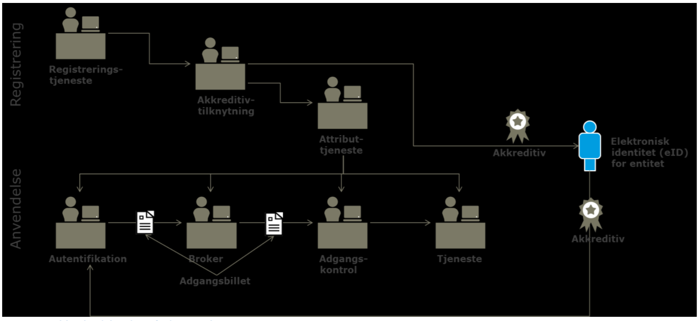

I en løst koblet og distribueret arkitektur er det derfor nødvendigt med fælles
rammer for sikkerhed, der definerer roller og ansvar for de forskellige komponenter. Disse spilleregler er grundlaget for tilliden mellem parterne i arkitekturen
og sikrer, at der ikke falder noget mellem to stole.

For *brugerstyringstjenester* som fx registreringstjenester, akkreditivudstedere, logintjenester/identitetsbrokere opstiller National Standard for Identiteters Sikringsniveau (NSIS) rammeværket en række sikkerhedskrav, knyttet til forskellige sikringsniveauer. Disse definerer et mål for kvaliteten af disse tjenester og har tilknyttet en række forskellige sikkerhedskrav samt krav til revision. For de løsninger, som udbydes fællesoffentligt (herunder det fællesoffentlige eID og NemLogin), fører Digitaliseringsstyrelsen endvidere et løbende tilsyn med leverandørerne
og følger op på løsningernes sikkerhedsniveau.

For *forretningstjenester* er det udgangspunktet, at myndighederne ud fra en risikovurdering selv skal beslutte deres sikkerhedsniveau, hvilket også ligger i rollen
som dataansvarlig i persondataloven. En sådan risikovurdering kan med fordel
tage udgangspunkt i metodikken, defineret i ISO/IEC 27005, og styringen af
informationssikkerhed kan med fordel tage afsæt i ISO/IEC 27001-standarden.
Behandler forretningstjenesten personoplysninger og indebærer behandlingen
sandsynligvis en høj risiko for fysiske personers rettigheder og frihedsrettigheder,
er der tillige behov for gennemførelse af en konsekvensanalyse vedrørende databeskyttelse (også kaldet *Privacy Impact Assessment*, PIA). Databeskyttelsesforordningen fra EU (GDPR) stiller krav til indholdet af en sådan vurdering (Artikel
35), samt hvornår Datatilsynet skal konsulteres. En skabelon til formålet kan
findes på Digitaliseringsstyrelsens hjemmeside(http://www.digst.dk/informationssikkerhed/Konsekvensvurdering-for-privatlivet). En sådan konsekvensanalyse kan
identificere behov for yderligere sikkerhedsforanstaltninger, der skal implementeres i tjenesten.

Både risikovurdering og PIA kan afdække krav til sikringsniveauet for de brugerstyringstjenester, som forretningstjenester benytter sig af – fx at brugerne skal
autentificeres i henhold til et bestemt sikringsniveau i henhold til NSISstandarden.

Derudover kan der i en fødereret infrastruktur være behov for at have fokus
særligt på tværgående aspekter, hvor kompromittering af én tjeneste kan påvirke
sikkerheden i en anden tjeneste:

- Når tjenester udstiller attributter eller andre stamdata, som bruges af andre
tjenester til at træffe beslutning om afgørelser eller adgange, er det essentielt
at afklare afhængigheder og forudsætninger. Et eksempel kunne være, at sårbarheder i et kildesystem kunne udnyttes til at få adgang til andre systemer
(fx at falske data, plantet i et pasregister, udnyttes til at skaffe et eID i en anden persons navn). Her er det relevant at foretage en tværgående risikovurdering og på forhånd klarlægge kvalitetskrav til de data, der anvendes, således at
integriteten af de samlede processer bevares.
- Ved servicekald mellem tjenester, der indgår i en samlet forretningsproces,
kan der være behov for at etablere og udveksle korrelations-ID'er, således at
det bliver muligt ved brug af logfiler at efterforske hændelsesforløb på tværs
af tjenester. Hvis hver tjeneste kun ser en lille delmængde af et hændelsesforløb, kan det være vanskeligt at opdage svindel.
- Hvis en tjeneste er afhængig af en anden tjeneste for kunne fungere, kan
manglende tilgængelighed, fx som følge af DDoS-angreb, give kaskadeeffekter på tværs af infrastrukturen.
- Hvis sikkerheden i en tjeneste er afhængig af kontrolmiljøet på slutbrugerens
enhed (fx en mobil enhed), kan der være særlige afhængigheder til den part,
der udleverer/kontroller slutbrugerenhederne.
- Hvis en tjenesteudbyder undlader at implementere logout i tjenesten, betyder
det, at en person med adgang til en brugers udstyr kan udnytte en session til
at tilgå denne eller en anden tjeneste og fx få adgang til eller ændre data i tjenester og i registreringer vedrørende personen.

>
>>Der er følgende krav til fællesoffentlige brugerstyringstjenester og forretningstjenester i den
fællesoffentlige føderation. Dette er begrundet i standarder i konteksten for brugerstyring:
ISO/IEC 27001, ISO/IEC 27005, EU’s General Data Protection Regulation (GDPR) og den danske persondatalov:  
- Tjenesteudbyder SKAL styre sikkerheden i egen tjeneste i forhold til fortrolighed, integritet og tilgængelighed.
- Tjenesteudbyder SKAL sikre, at udveksling af data (indgående og udgående) sker med
tilstrækkelig sikkerhed.
- Tjenesteudbyder SKAL gennemføre risikovurderinger af, hvordan tjenestens placering i
føderationen påvirker tjenestens sikkerhed – og hvordan tjenesten påvirker andre tjenesters sikkerhed og gennemføre de nødvendige tiltag.
- Tjenesteudbyder SKAL i relevant omfang informere andre aktører i føderationen om risikovurderinger og sikkerhedshændelser.  
Ovenstående regler SKAL følges af brugerstyringstjenester og forretningstjenester i andre
føderationer.

### 8.4 Standarder

Referencearkitekturen peger på, hvilke områder der skal være standarder for, at
referencearkitekturen fungerer.

I afsnit 0 er beskrivelse af standarder på de udpegede områder. En detaljeret
oversigt over obligatoriske og anbefalede standarder skal vedligeholdes på arkitekturguiden.digitaliser.dk

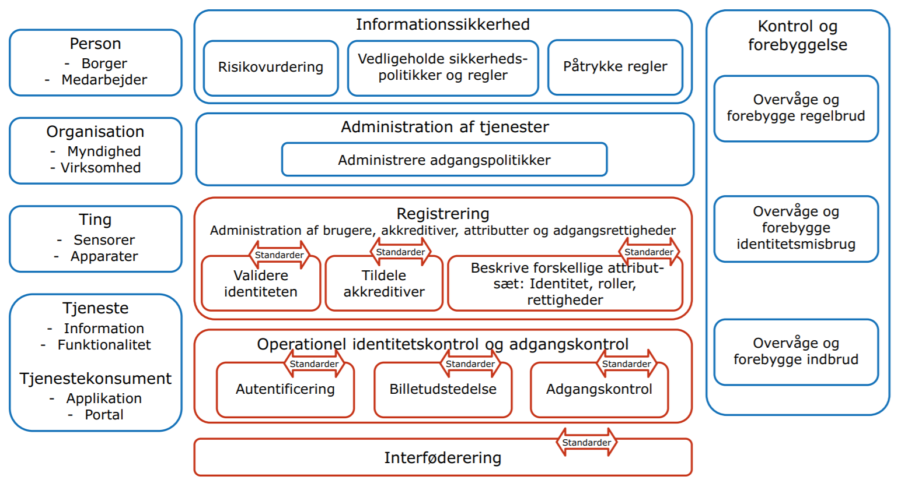
Note til figur: Pilene angiver områder for standarder

Der skal være **standarder for registrering af brugere, akkreditiver og attributter.** Disse standarder skal dække registreringskvaliteten (eIDAS, National
Standard for Identiteters Sikringsniveau (NSIS), ISO29115, Kantara Identity
Assurance Framework).

Der skal være **standarder for overførsel af data om autentificerede brugere**
mellem autentifikationstjenester, login-tjenester/brokere og tjenester (her bruges
i dag fx SAML2 mellem NemLog-in og tjenester).

Der er behov for **standarder i forbindelse med rettigheder og attributter.**
Det drejer sig dels om standarder til at kommunikere med attributtjenester
(SAML, OpenID Connect), dels at kommunikere mellem attributtjenester og
forretningstjenester (fx XACML). Et andet aspekt er standarder for at indhente
brugernes samtykke, når dette indgår i adgangsbeslutninger – her er UMA og
OAuth muligheder.

Der er behov for **standarder for kommunikation mellem føderationer.** Disse
skal identificeres og fastlægges i arbejdet med implementering af referencearkitekturen. Arbejdet i EU-regi (STORK og eIDAS) er baseret på SAML2-profiler.

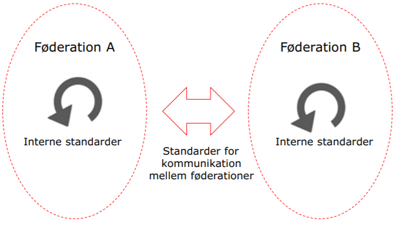

### 8.5 Interoperabilitet

Figuren herunder viser interoperabilitet for brugerrettighedsstyring iht. referencemodellen for interoperabilitet, som den er beskrevet i hvidbogen for fællesoffentlig rammearkitektur.

I takt med videreudvikling og konsolidering af området, kan denne figur opdateres og udstilles som en del dokumentationen af den fællesoffentlige rammearkitektur:

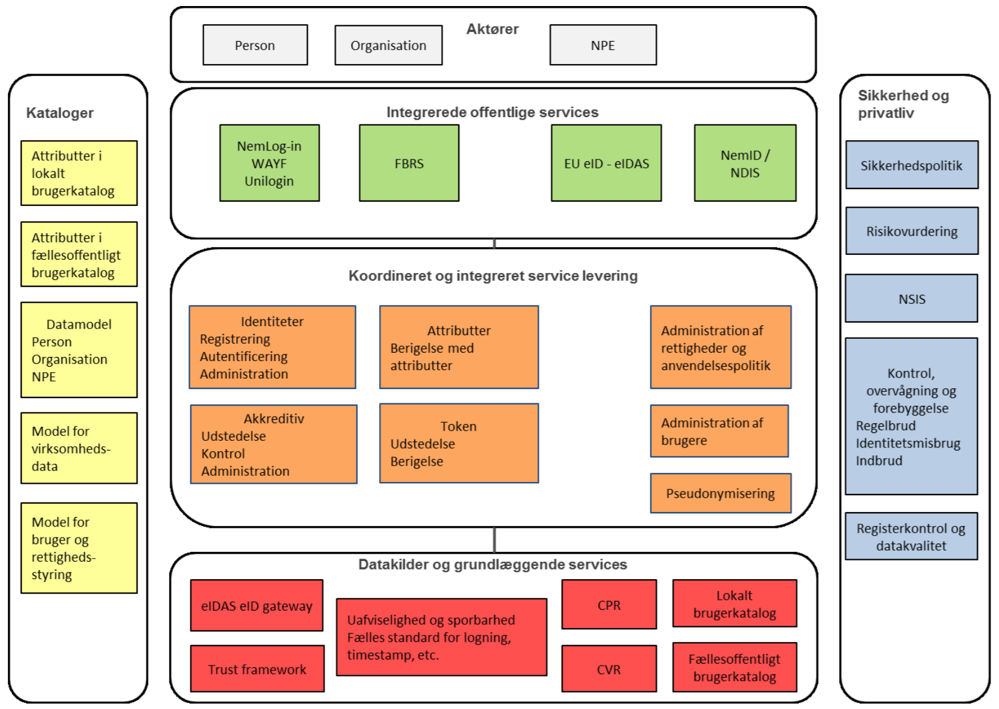

# II Implementering

## 9. Implementering

>I dette afsnit beskrives mere konkret, hvordan referencearkitekturen implementeres, og der fastlægges krav og anbefalinger. Først gennemgås de
administrative brugerstyringstjenester, registreringstjeneste, akkreditivtjeneste, attributtjenester, og hvordan de klassiske brugerkataloger er en
implementering af disse. Derefter gennemgås de brugerstyringstjenester,
der gennemfører anvendelsen af brugerstyring: autentifikation, logintjenester/identitetsbrokere og en fællesoffentlig løsning til fuldmagter.
Til sidst behandles brugerstyring for it-systemer i rollen som tjenestekonsumenter og for fysiske apparater og sensorer

### 9.1 Registrering af identiteter

Som tidligere beskrevet, kan processer i forbindelse med at registrere identitet
gennemføres på forskellige måder og med forskellig sikkerhed for sammenhæng
mellem elektronisk identitet og en fysisk person eller anden entitet. Kravene på
forskellige sikringsniveauer *(Levels of Assurance)* beskrives i et ”trust framework”,
således at modtageren af en identitet kan matche dette mod deres risikoniveauer.

#### 9.1.1 Standarder for registrering af identiteter

Der findes en lang forskellige og ukoordinerede mekanismer til registrering og
navngivning af elektroniske identiteter. Hvis behovet for en mere sammenhængende infrastruktur skal understøttes, skal der ske en højere grad af standardisering under hensyntagen til privatlivsbeskyttelse.

I referencearkitekturen for fællesoffentlig brugerstyring er National Standard for
Identiteters Sikringsniveau (NSIS) standarden fra Digitaliseringsstyrelsen den
fælles referenceramme, der beskriver krav til de forskellige sikringsniveauer. Det
skal bidrage til at sikre, at identiteterne er registreret med så høj kvalitet, at risiko
for misbrug af identiteter (herunder identitetstyveri) mindskes.

>
>>Brug af National Standard for Identiteters Sikringsniveau (NSIS) SKAL efterkommes i fællesoffentlige løsninger og løsninger, der kommunikerer mellem offentlige sektorer, og BØR efterkommes af løsninger i offentlige sektorer.
En identitetsløsning BØR fastlægge et krævet NSIS-sikringsniveau ”Begrænset”, ”Lav”, ”Betydelig” eller ”Høj” i forhold til anvendte akkreditiver og den samlede livscyklus. Dette muliggør
en lettere integration mellem systemer, idet sikringsniveauer er umiddelbart sammenlignelige.

Der vurderes ikke behov for yderligere rammesætning om registreringsprocesser.
Tværtimod er det hensigten i NSIS at åbne for et marked, hvor innovation og kreative løsninger kan opstå, blot de opfylder krav til de sikringsniveauer, de
påberåber sig, og at udbyderne af brugerstyringstjenester påtager sig det ansvar,
der er defineret i NSIS.

Der arbejdes fællesoffentligt med, hvordan der i praksis kan opnås de sikringsniveauer for registrering, som indgår i NSIS. Det sker i arbejdet med valide identiteter.

ETSI (European Telecommunications Standards Institute) har offentliggjort en
standard for certifikatprofiler, ETSI EN 319 412-1. I afsnit 5.1.3 og afsnit 5.1.4
indeholder standarden en semantik for navngivning af brugere (fysiske og juridiske) i et certifikat.

>
>>Ved udstedelse af certifikater BØR semantik fra ETSI EN 319 412-1 anvendes, og det skal
overvejes, om navngivning af brugere med fordel KAN genbruge denne semantik, også uden
for en certifikatkontekst. Dette gælder særligt i de situationer, hvor brugere skal kunne tilbydes certifikater til signering, hvorved navngivning er ens for en indledende autentifikation og
den efterfølgende signering.
Dansk Standard DS 844 er en alternativ standard for navngivning i certifikater. Denne SKAL
FORLADES i nye løsninger, da den ikke i tilstrækkelig grad er fremtidssikret i en international
sammenhæng.

### 9.2 Akkreditiver

Det væsentligste arkitekturprincip for akkreditiver er, at de er beskrevet på et
sikringsniveau i henhold til National Standard for Identiteters Sikringsniveau
(NSIS), og at de ikke er tæt bundet til brug i én forretningstjeneste, men gennem
en interoperabel sikkerhedsinfrastruktur, som principielt kan anvendes på tværs
af alle tjenester. Sagt på en anden måde: Integrationen mellem en forretningstjeneste og et akkreditiv BØR ske via en mellemliggende logintjeneste/identitetsbroker for løsninger, der kommunikerer mellem offentlige
sektorer.

De ovennævnte arkitekturprincipper sikrer en løs kobling og fleksibilitet, der
muliggør innovation som fx ibrugtagning af biometriske akkreditiver, uden at alle
forretningstjenesterne skal skrives om.

I referencearkitekturen er det centrale, at flere registreringstjenester og akkreditivudstedere, leveret af både offentlige og private aktører, kan sameksistere i det
digitale økosystem, og at forretningstjenester ikke bør være tæt forbundet til en
bestemt registreringstjeneste og en bestemt akkreditivudsteder, men kan acceptere adgang for brugere, uanset hvem der har registreret entiteten eller udstedt
entitetens akkreditiv. En forretningstjeneste skal således primært forholde sig til,
om entiteten er autentificeret på det krævede sikringsniveau, om udstederen af
adgangsbilletten er en kendt brugerstyringstjeneste på dette niveau(Som led i NSIS vil Digitaliseringsstyrelsen publicere anmeldte tillidstjenester på sin hjemmeside.) og inden for den aktuelle føderation, samt at brugeren i øvrigt opfylder adgangskravene (fx er
tildelt adgangsgivende roller til tjenesten).

>
>>Af hensyn til forsyningssikkerheden og grundlaget for digitaliseringen SKAL det
offentlige etablere mindst en generel registreringstjeneste og en generel akkreditivudsteder i økosystemet – samtidig med at der er åbnet for alternative løsninger.

Med National Standard for Identiteters Sikringsniveau (NSIS) som tillidsramme
og med eksistensen af standarder for attributter og protokoller vurderes det, at
rammebetingelserne herfor er til stede.

Der findes dog huller i landskabet af registreringstjenester og akkreditivtjenester
– særligt for børn og unge under 15 år, som p.t. ikke har nogen sikre id-løsninger
(på NSIS niveau 3 eller højere). Der findes et initiativ i Digitaliseringsstrategien,
som skal analysere mulighederne for sikre id-løsninger til børn. I forbindelse
med implementering af en kommende løsning vil det være relevant, at denne
udstilles gennem NemLog-in, UNI-Login eller andre identitetsbrokere.

>
>>Understøttelse af notificerede eID-løsninger fra andre EU-lande SKAL ske gennem
national eID-Gateway, der stilles til rådighed af Digitaliseringsstyrelsen. Løsninger, der skal servicere andre EU-borgere, SKAL afsøge muligheden for at anvende
eID-Gateway’en til dette formål.

### 9.3 Attributter

Som tidligere nævnt, spiller attributter en vigtig rolle i brugerstyringen, dels som
grundlag for beskrivelse af brugerne og deres kontekst, dels som grundlag for
håndhævelse af adgangskontrol.

Nedenfor er givet eksempler på forskellige, vigtige kategorier af såvel identitetsattributter som beskrivende attributter:

- Identitetsattributter, der er specifikke karakteristika ved den fysiske entitet (fx
navn, adresse, CPR-nummer).
- Andre attributter om entiteten (fødselsdag, øjenfarve, biometri).
- Tildelte/udstedte identifikationsnumre/registreringsnøgler (fx CVR-nummer,
PID-, RID- eller FID-numre) eller tjenestespecifikke pseudonymer.
- Attributter, der beskriver relationer (repræsenterer virksomhed xyz).
- Rettighedsrelevante attributter (roller, rettigheder eller indhold af dataafgrænsninger, autorisation af læge/sygeplejerske/o.m.a for sundhedsprofessionelle).
- Kontekstafhængige attributter for en autentifikation (IP-adresse, devicetype,
tidspunkt for login).
- Fuldmagter eller samtykker udtrykt som attributter.
Nogle attributter fastlægges i forbindelse med den indledende entitetsregistrering, mens andre etableres på andre tidspunkter af andre end en registreringstjeneste – eksempelvis i forbindelse med, at en brugeradministrator tildeler rettigheder, eller en attributtjeneste gør det på vegne af en føderation.

Der er vigtigt, at den fulde livscyklus for attributter håndteres, idet de kan ændre
sig over tid. Det skal med andre ord være muligt dynamisk at tilføje attributter
eller ændre deres værdier. Historisk har det eksempelvis vist sig problematisk at
anvende X.509-certifikater til attributformidling, fordi et certifikat ikke kan ændres – og derfor skal der udstedes et nyt, hvis de underliggende attributter ændres.

I forbindelse med adgangskontrol af attributter i forretningstjenester er det vigtigt at forholde sig til attributternes kvalitet. Dette gælder særligt, når attributter
anvendes som grundlag for beslutninger om adgang til følsomme data. I dag er
der kun fælles rammer for visse attributters kvalitet – fx CPR-nummeret, CVRnumre eller de identitetsattributter, der håndteres gennem sikringsniveauerne i
National Standard for Identiteters Sikringsniveau (NSIS). Da attributter sædvanligvis er stabile over tid, er det ofte tilstrækkeligt at kende kvaliteten af attributter
ved en tjenestes etablering og ved dialog med attributtjenesten at sikre sig, at der
informeres ved ændringer i kvaliteten.

>
>>Attributtjenester BØR udstille deklaration af kvaliteten af attributter, således at tjenester, der
anvender attributter, har den nødvendige information om kvalitet.
>>>Fællesoffentlige brugerstyringstjenester og forretningstjenester i fællesoffentlige føderationer,
der anvender attributter, SKAL vurdere, om kvaliteten af attributter svarer til tjenestens behov.

I det fremadrettede arbejde med fællesoffentlig brugerstyring er der behov for at
analysere videre i forhold til, på hvilke områder der er behov for fælles standarder for attributters kvalitet. Attributter defineres ofte inden for en bestemt sektor, men der kunne fællesoffentligt godt være mening i at specificere fælles mekanismer til at udtrykke og formidle kvalitetsinformation, så dette kan udveksles
på en interoperabel måde.

Forskellige forretningstjenester har behov for at *modtage* bestemte attributter for
at kunne fungere, mens forskellige login-tjenester/identitetsbrokere og attributtjenester kan *levere* forskellige sæt af attributter for bestemte entiteter. Disse sæt af
attributter kan beskrives eksplicit som en del af snitfladen, så sikkerhedsinfrastrukturen kan foretage en automatisk orkestrering.

Eksempelvis kan en identitetsbroker evaluere tjenestens attributbehov og herefter kontakte et antal andre login-tjenester/identitetsbrokere og supplerende attributtjenester, som tilsammen kan levere de ønskede attributter, hvorefter brokeren udsteder en samlet adgangsbillet mod tjenesten med foreningsmængden af
attributter.

I den nuværende fællesoffentlige brugerstyringsinfrastruktur er der en begrænset
dynamik i orkestreringen af attributter, og det er fx ikke direkte muligt at tilkoble
en ny ekstern attributtjeneste til NemLog-in (kræver udvikling). Det kan derfor i det videre arbejde være relevant at se på mulighederne for en mere dynamisk
håndtering af attributter, som følger ovennævnte arkitekturprincipper. Desuden
kan det være relevant at give personbrugerne transparens og medejerskab for
deres attributter, fx ved at etablere en brugerprofilside på NemLog-in eller borger.dk, hvor brugerne kan se (og for visse indtaste/rette) attributter samt styre
præferencer for deling af attributter mellem tjenester.

Endelig er der en fællesoffentlig udfordring i håndtering af CPR-nummerattributten. Mange forretningstjenester har en hård binding til dennes nuværende
form, hvilket gør det vanskeligt at skifte den ud, grundet det kommende udløb af
numre.

>
>>Nye forretningstjenester (og moderniseringer af eksisterende) tjenester, der anvender fællesoffentlige løsninger, BØR benytte et design, hvor CPR-nummeret kan skifte form, uden at tjenestens forretningslogik bryder sammen.

### 9.4 Brugerkataloger

Et brugerkatalog indeholder informationer om et sæt af brugeridentiteter(Evt. både personbrugere og tjenestekonsumenter.), typisk
i form af attributter og i mange tilfælde også akkreditiver for en brugerkonto. Et
velkendt eksempel er *LDAP Directories* (som fx Active Directory), der både udstiller services til brugerautentifikation og til at hente attributter og har en veldefineret administrationsstruktur.

Brugerkataloger etableres i mange kontekster som fx:

- Et brugerkatalog til en bestemt applikation (applikationens brugerdatabase).
- Et brugerkatalog for en organisation eller virksomhed.
- Brugerkataloger knyttet til et bestemt domæne (fx som i UNI•Login).
- Fællesoffentlige brugerkataloger (fx brugerdatabasen i NemLogin/Brugeradministration (FBRS)).

Traditionelt har *enterprise directories* været en del af centralnervesystemet i større
virksomheders systeminfrastrukturer, og i de senere år er der opstået en stigende
tendens til at etablere brugerkataloger i skyen med henblik på at understøtte økosystemet af cloud-applikationer.

I referencearkitekturen indgår brugerkataloger ikke som selvstændige tjenester,
men de udstilles gennem veldefinerede snitflader som logintjenester/identitetsbrokere eller attributtjenester med henblik på at etablere den
ønskede løse kobling. Brugerkataloger opfattes med andre ord som en privat
implementering af disse typer af tjenester, og der bør ikke i udgangspunktet skabes tætte koblinger til brugerkataloger gennem brug af deres leverandørspecifikke snitflader. En tydelig tendens mod den mere løst koblede model kan observeres med Active Directory, hvor man for år tilbage ofte koblede organisationer
sammen via proprietære mekanismer, der kunne forbinde AD’er. I dag anvendes
i langt højere grad *Federation Services,* hvor sammenkoblingen sker via føderationsprotokoller som SAML.

Referencearkitekturen kommer ikke med specifikke anbefalinger til, hvilke brugerkataloger der skal etableres – men fokuserer hovedsageligt på, hvordan de
udstilles. Behov for brugerkataloger vil således i høj grad afhænge af lokale forhold, herunder behov for organiseringen af brugeradministration.

Som en god praksis (og som det fremgår af Princip: Administration af brugere
flyttes så vidt muligt ud af fagapplikationer) bør brugere i en organisation i udgangspunktet oprettes i så få brugerkataloger som muligt med henblik på at effektivisere brugeradministrationen og sikre et centralt overblik. Dette gælder
løsninger, der finansieres og fungerer inden for den offentlige sektor.

Som eksempel på mitigering af problemstillingen med mange brugerkataloger,
etablerer mange organisationer såkaldte Identity Management-løsninger, som kan
skabe sammenhæng mellem mange brugerkataloger gennem processer, teknisk
provisionering og adapters. Herved kan man oprette, administrere og nedlægge
brugere centralt og automatisk få de nødvendige opdateringer kommunikeret til
applikationer og infrastruktur. Dette er dog i mange sammenhænge udtryk for
applikationernes manglende modenhed inden for brugerstyring (de fastholder et
lokalt brugerkatalog som deres eneste verdensbillede), og løsningen med provisionering og applikationsspecifikke adapters fastholder den tætte binding frem for
at løse det underliggende problem og skabe en åben, løst koblet arkitektur.

I den fællesoffentlige brugerstyring findes et centralt brugerkatalog for virksomheder i form af NemLog-in/Brugeradministration (FBRS). Hensigten med dette
er at garantere danske virksomheder adgang til mindst et brugerkatalog, da særligt mindre virksomheder ikke kan forventes selv at kunne etablere en sådan infrastruktur. I dag er brug af dette brugerkatalog påtvunget ved administration af
medarbejderes rettigheder i offentlige indberetningsløsninger, men i næste generation fællesoffentlig brugerstyring forventes dette at blive et frit valg – så større
virksomheder kan vælge at bruge deres eget lokale brugerkatalog, også i forbindelse med administration af adgang til offentlige løsninger.

### 9.5 Autentifikation

Autentifikation er de processer, hvor en entitet præsenterer sine akkreditiver, og
hvor en autentifikationstjeneste (ved login) dels garanterer, at de fremviste akkreditiver tilhører den entitet, de er udstedt til, dels kontrollerer, hvilke sikringsniveauer registrering og akkreditivudstedelse er kendetegnet ved. Det aktuelle
sikringsniveau er altid det laveste af de to konstaterede sikringsniveauer.

Det centrale i referencearkitekturen i forhold til autentifikation er dels at fastlægge standarder for overførsel af akkrediterede entiteter til en tjenesteudbyder og
mellem autentifikationstjenester, login-tjenester/brokere og forretningstjenester,
dels at autentifikationen kan være en del af en login-tjeneste/identitetsbroker.

#### 9.5.1 Standarder for overførsel af autentificerede brugere

>
>>I dag anvender NemID XMLDSig i forbindelse med autentifikation, hvor særligt det indlejrede
OCES-certifikat er kilde til attributter om brugeren. XMLDSig BØR FORLADES fremadrettet og
ikke danne grundlag for en fødereret løsning, idet der findes protokoller, der i højere grad er
velegnede til dette formål.

NemLog-in anvender den fællesoffentlige OIOSAML-profil af SAML 2.0-
standarden til overførsel af data om autentificerede brugere til tjenesteudbydere,
som er tilsluttet NemLog-in. Profilen understøtter scenariet, hvor en personbruger via en browser logger på en webapplikation. Til repræsentation af roller og
rettigheder i SAML Assertions benyttes søsterprofilen OIO Basic Privilege Profile. Ud over NemLog-in er OIOSAML og OIO Basic Privilege Profile grundlaget
for en række løsninger i specifikke domæner som fx systemerne til adgangsstyring i den fælleskommunale rammearkitektur. Hensigten med OIOSAML er at
sikre interoperabilitet gennem fastlåsning af visse valg i SAML – men samtidig
åbne for, at specifikke sektorer kan definere deres egne underprofiler ved fx at
definere domænespecifikke attributter.

>
>>OIOSAML og OIO Basic Privilege Profile har status af anbefalede fællesoffentlige standarder og
BØR som minimum følges, når der er behov for håndtering af eksterne brugere i webapplikationer. Dette gælder for fællesoffentlige løsninger og tjenester, der anvender fællesoffentlige
løsninger.

Der er tale om modne standarder med en stor udbredelse i den offentlige sektor.
Her kan det bemærkes, at OIOSAML specificerer udvekslingsmekanismen (protokollen), men er åben for tilføjelse af sektorspecifikke attributter. Et eksempel
på dette er sundhedsområdets underprofiler.

Som supplement til OIOSAML findes OpenID Connect-standarden samt
OAuth 2.0, der begge er internationale, åbne standarder med en vis markedsudbredelse. OpenID Connect kan løse de samme use cases som SAML 2.0, men
benytter mere moderne teknologier, som bl.a. er velegnede i forbindelse med
apps på mobile enheder. Der findes endnu ingen fællesoffentlige profiler af
OpenID Connect eller OAuth 2.0. Det skal endvidere bemærkes, at en brugerautentifikation i disse standarder kan anvende SAML, så derfor kan eksisterende
løsninger sameksistere (indpakkes i) de nye standarder. OpenID Connect har
status af kommende standard, som på sigt forventes at supplere eller tage over
efter SAML.

>
>>For fællesoffentlig infrastruktur BØR standarden OpenID Connect på kort til mellemlangt sigt
tilbydes som et supplement til SAML 2.0 services, således at de forretningstjenester, der har
behov for det, kan udnytte de nye muligheder – men uden at alle tvinges til det.

Indtil der er etableret fællesoffentlige profiler af OpenID Connect, er der dog en
vis risiko for, at forskellige parters implementeringer ikke vil være interoperable
eller have samme sikkerhedsniveau, hvilket kan give udfordringer i tværgående
sammenhænge. OpenID Connect er en profil af OAuth 2.0, og denne profil
*anbefales* i stedet for brug af den rene OAuth 2.0-standard, da OpenID Connect i
højere grad er kompatibel med referencearkitekturens principper om føderering.

Herudover kan det nævnes, at Microsoft og IBM har udviklet hhv. UProve og
IdentityMixer, som er protokoller med særlige privacy-egenskaber. Anvendelse af
disse teknologier er beskrevet i diskussionspapiret ”Nye Digitale Sikkerhedsmodeller”(https://digitaliser.dk/resource/781482)
 fra IT- og Telestyrelsen som et alternativt og innovativt bud på, hvordan
en sikkerhedsarkitektur kan designes. Ingen af disse teknologier har endnu vundet markedsudbredelse (ikke engang i de respektive leverandørers egne produkter), og de BØR derfor endnu IKKE anvendes til andet end specialsituationer,
som ikke kan løses med andre mere mainstream teknologier.

Kantara har defineret en protokol for administration af rettigheder kaldet User
Managed Access (UMA). Denne har støtte fra en lang række internationale aktører (bl.a. Google), men har endnu ikke vundet markedsudbredelse. Ud fra en
modenhedsbetragtning er UMA endnu ikke en anbefalet standard, men blot en
kommende standard, som bør følges tæt i den fællesoffentlige brugerstyring. I
givet fald er UMA interessant som en model for at give slutbrugerne kontrol
med adgangen til deres ressourcer, og den bør derfor i de kommende år overvejes i forbindelse med løsninger til fuldmagter og samtykker.

### 9.6 Login-tjenester/Identitetsbrokere

En login-tjeneste/identitetsbroker er en tjeneste, der på vegne af forretningstjenester foretager en eller flere brugerstyringstjenester:

- Autentifikationen gennem at verificere et akkreditiv evt. ved at kontakte en
akkreditivudsteder og herfra modtage en adgangsbillet.
- Omveksle adgangsbilletter, udstedt af andre login-tjenester/identitetsbrokere.
- Indhente yderligere information om brugeren hos attributtjenester og berige
adgangsbilletten.
- Evt. danne en session med brugeren med henblik på at etablere Single SignOn.

Der er en række udfordringer, der skal håndteres i forbindelse med anvendelse af
identitetsbrokere.

I forhold til en model, hvor tjenesteudbydere er koblet direkte til registreringstjenester og akkreditivudstedere, er der med introduktion af brokeren endnu en
part, der kan påvirke den samlede oppetid for tjenesteudbyderen i negativ retning. Den enkelte tjenesteudbyder kan mitigere risikoen ved at indgå aftale med
flere brokere, som illustreret for tjenesteudbyder B i Figur 18 Arkitektur med
flere registreringstjenester, en akkreditivudsteder og brokere.

Der skal etableres en forretningsmodel, der understøtter anvendelse af brokerfunktion. Forretningsmodellen skal gerne gøre det fordelagtigt for registreringstjenester, akkreditivudstedere og brokere at indgå aftaler og skal desuden minimere risikoen for udnyttelse af en dominerende stilling på markedet for hhv.
registreringstjenester, akkreditivudstedere og brokere. National Standard for
Identiteters Sikringsniveau (NSIS) rammeværket indeholder, som nævnt, krav til
sikkerhed og revision for identitetsbrokere, der kan regulere de sikkerhedsmæssige aspekter.

>
>>For at opnå en sikker og omkostningseffektiv integration for tjenesteudbydere og for at understøtte konkurrencen på markedet SKAL en identitetsbroker som minimum udstille en eller flere
veldefinerede, åbne og standardiserede interfaces til tjenesteudbydere. Dette kan typisk være
et SAML2 (som kendes fra NemLog-in) og/eller OpenID Connect.
>>>Tilsvarende SKAL der stilles veldefinerede interfaces til rådighed for digital signering

I den tværoffentlige brugerstyringsinfrastruktur er der fortsat behov for en identitetsbroker. Denne opgave løses i dag af NemLog-in, som er implementeret for
det offentlige af Digitaliseringsstyrelsen.

>
>>Der SKAL fortsat være en broker som NemLog-in i den fællesoffentlige brugerstyringsinfrastruktur.

I andre sektorer er der tilsvarende brokere. Det er fx SOSI STS’er i sundhedssektoren, og WAYF i uddannelses- og forskningssektoren. For andre sektorer er
bestemmelserne om brokere vejledende.

#### 9.6.1 Standarder for kommunikation mellem føderationer

Ved kommunikation mellem føderationer (interføderation) benyttes normalt de
samme standarder/protokoller som inden for et domæne (fx SAML eller WSTrust), og der vurderes generelt ikke at være væsentlige behov for yderligere
standardisering på området. Som eksempel kan nævnes, at EU-føderationen i
regi af eIDAS baseres på en SAML-profil.

De primære udfordringer ved interføderation opstår, når hvert domæne har etableret egne domænespecifikke attributter, domænepolitikker eller har egne sikringsniveauer, der ikke er kompatible. Her kan NSIS (og eIDAS) løse udfordringen med fælles sikringsniveauer, mens der ikke findes generelle standarder for
oversættelse mellem domæners attributter og politikker. Et første skridt i den
retning kunne være at etablere fælles vokabularer (fx i stil med OIO Organisation
og *ISA Core Vocabularies*(http://ec.europa.eu/isa/ready-to-use-solutions/core-vocabularies_en.htm) som findes i EU-regi). Dette arbejde har dog mere karakter af datastandardisering og semantiske modeller og vurderes ikke nødvendigvis som hjemmehørende under brugerstyringsarbejdet

### 9.7 Fælles løsning til fuldmagter

En fælles løsning til digitale fuldmagter gør det muligt for borgere og virksomheder at lade en repræsentant agerer på deres vegne i en onlinetjeneste. Dette
muliggør både at yde god digital service, som tager hensyn til it-svage borgere, og
samtidig at fx forvaltningslovens krav til partsrepræsentation kan opfyldes.

Hovedfunktionerne i en digital fuldmagtsløsning er:

- Funktionalitet til digital afgivelse af fuldmagt gennem et selvbetjeningsforløb
(inkl. udpegning af modtager, indhold af fuldmagt, gyldighedsperiode og signering af fuldmagt).
- Funktionalitet til at få overblik over afgivne og modtagne fuldmagter.
- Funktionalitet til at tilbagekalde en fuldmagt.
- Funktionalitet for en tjeneste til at definere de ”fuldmagtspakker”, som beskriver indholdet af de fuldmagter, der kan afgives til tjenesten (fx roller til
tjenesten).
- Funktionalitet til, at en betroet medarbejder kan indtaste en fuldmagt på vegne af en (it-svag) borger – fx på baggrund af en underskrevet papirblanket.
- Integration med identitetsbrokere, så fuldmagter kan indlejres i udstedte adgangsbilletter til tjenester.
- API’er for tjenester til at batch-hente fuldmagter.

En fællesoffentlig løsning er i dag etableret i regi af NemLog-in, kaldet ’Digital
Fuldmagt’. Løsningen findes i to forskellige varianter, der er målrettet til forskellige brugssituationer:

- En løsning til Erhvervsfuldmagt i NemLog-in/Brugeradministration (FBRS).
- En løsning til Borgerfuldmagt (selvstændig brugergrænseflade).

For begge løsningers vedkommende vil afgivelse af en fuldmagt resultere i, at
adgangsbilletten tilhørende identiteten for repræsentanten markeres, at der er
delegeret en rettighed (privilegie) fra fuldmagtsgiver. Digitale fuldmagter udmøntes med andre ord som en delegering af rettigheder til en tjeneste, udtrykt som
attributter i en adgangsbillet – og dermed benytter de grundlæggende byggeblokke, der allerede findes i arkitekturen. Herved er det væsentligt lettere for tjenester
at tage fuldmagtsfunktionaliteten i brug, idet eksisterende grænseflader og integrationer med NemLog-in genanvendes. Konkret består disse i OIOSAMLprofilen, og delegeringen udtrykkes via OIO Basic Privilege Profile.

I den nuværende løsning vil en fuldmagt bestå i en delegering af en statisk rolle i
en tjeneste, som fx kunne være ”se sag”, ”indsend ansøgning”, ”ansøg om tilskud” etc. Der er p.t. ikke mulighed for at udtrykke dataafgrænsninger i kombination med rollen, hvilket kunne udtrykke mere finkornede og præcise fuldmagter (fx ”se sagsnr. AZ-7291”). Fuldmagtløsningen skal med andre ord også respektere dataafgrænsninger, som beskrevet i afsnittet om adgangskontrol. Dette
er dog et identificeret videreudviklingsønske, som forventes at blive realiseret
med videreudviklingen under næste generation NemLog-in.

Endelig kan det nævnes, at den nuværende fuldmagtsløsning i regi af NemLog-in
hidtil har været frivillig at anvende for offentlige tjenester. Denne referencearkitektur skærper dette til et ”bør”.

>
>>I henhold til arkitekturprincipperne om at genbruge løsninger og anvende fælles
standarder BØR fuldmagtsløsningen anvendes for borgerrettede løsninger, der
finansieres og fungerer inden for den offentlige sektor.

Dette sikrer genbrug, strømlining af infrastrukturen og ensartet brugeroplevelse
og giver borgere og virksomheder mulighed for at få en central indgang til alle
deres fuldmagter på tværs af tjenester. Dette vil formentlig indebære, at NemLog-in’s fuldmagtsløsning videreudvikles funktionelt, så behov i langt de fleste
sektorer og løsninger kan understøttes.

### 9.8 Brugerstyring for tjenestekonsumenter og fysiske apparater og sensorer

Hovedparten af ovenstående beskrivelser adresserer brugerstyring for personbrugere, dvs. fysiske personer eller fysiske personer associeret med en juridisk
person. Dette område har været første bastion i arbejdet med fællesoffentlig brugerstyring, men der er i stigende grad behov for at løse de samme udfordringer i
forbindelse med systembrugere – altså entiteter, der repræsenterer et it-system,
der optræder som tjenestekonsument, og som tilhører en organisation eller en
person.

Eksempler på dette kan være server-til-server kommunikation mellem myndigheder, apps eller rige klienter, der kalder et API på vegne af en bruger (fx tilgår
brugerens profil og data), telemedicinsk udstyr installeret i en patients hjem, der
indrapporterer måleværdier, eller fjernstyring af kontrolenheder i energisektoren.

Dette område er karakteriseret ved en stor diversitet i behov og muligheder – og
mangel på fælles standarder og løsninger på tværs. Der eksisterer således standarder og løsninger inden for specifikke områder, men ikke nogen universelle,
der dækker bredt. Som eksempel kan nævnes, at National Standard for Identiteters Sikringsniveau (NSIS) standarden ud fra betragtninger om lav modenhed på
området eksplicit har fravalgt at behandle identiteter for systemer og enheder og
alene fokusere på personbrugere. Nedenfor gives et overblik over de væsentligste
løsninger og standarder, og der peges på områder, der bør arbejdes videre med i
den videre proces.

Den klassiske tilgang for sikring af systemkommunikation har været at sikre
punkt-til-punkt forbindelser med X.509-certifikater, passwords, SSH-nøgler etc. afhængigt af den valgte kommunikationsprotokol. Det er eksempelvis muligt i
den nuværende fællesoffentlige eID-infrastruktur at få udstedt OCES-funktionseller virksomhedscertifikater og benytte dem til system-til-system kommunikation ved at udveksle den offentlige nøgle med modparten. Dette giver en simpel
og isoleret løsning for en konkret integration, men kan i større infrastrukturer
hurtigt lede til et ustruktureret og uhåndterbart virvar af punkt-til-punkt sikringer, som ingen har overblik over, og som er usammenhængende og ufleksibelt i
forhold til ændringer i infrastrukturen. Uden videre tiltag og en fælles arkitektur
er der derfor stor risiko for fragmentering og mangel på sammenhæng og interoperabilitet.

#### 9.8.1 Standarder for identitetsbaserede webservices

Der er fællesoffentligt specificeret en række standarder, omhandlende identitetsbaserede webservices. Disse standarder kan eksempelvis benyttes, når en tjenestekonsument skal anmode om et Security Token på vegne af en bruger, som
herefter benyttes til at autorisere et kald til en webservice i et andet domæne. Et
eksempel kan være, at en bruger logger ind på en webportal, som herefter har
brug for at hente data om brugeren hos en anden tjenesteudbyder

>
>>Profilerne for identitetsbaserede webservices(https://digitaliser.dk/resource/526486) består af:
- OIO WS-Trust Profile (profil til at anmode om Security Token).
- OIO WS-Trust Deployment Profile (profil til at anmode om Security Token).
- OIO Profile for Identity Tokens (profil for token udformning i webservice-kald).
- OIO Bootstrap Token Profile (profil for veksling af Web SSO session til token ifm. systemkald).
- Liberty Basic SOAP Binding (profil af WS-Security til sikring af SOAP-baserede webservice-kald med SAML Token).
- OIO IDWS Rest Profile (profil til sikring af REST-baserede webservice-kald med SAML
Token).
For disse standarder gælder, at de BØR følges ved etablering af system-til-system kommunikation, hvor kaldet sikres med en adgangsbillet (et Security Token) i henhold til denne referencearkitekturs principper, frem for en punkt-til-punkt integration. Dette gælder for fællesoffentlige løsninger og løsninger, der kommunikerer mellem offentlige sektorer.

Disse profiler er endvidere suppleret med open sourcereferenceimplementeringer i Java og .Net for at lette udbredelsen.

Profilerne er i dag implementeret i NemLog-in gennem udstilling af en Security
Token Service. Underprofiler af disse er endvidere specificeret inden for sundhedsdomænet samt den fælleskommunale rammearkitektur.

Sundhedsområdet benytter samme arkitekturprincipper og har defineret egne
SAML-baserede standarder, suppleret med egne STS’er deployet i domænet. Det
overordnede princip i OIO IDWS-modellen er at anvende en fødereret og token-baseret model for systemer på samme måde som for personbrugere. En Security Token Service udfylder samme rolle for systemer som en SAML Identity Provider udfylder for personer (autentifikation og udstedelse af adgangsbillet).
Endvidere kan man med identitetsbaserede webservices opnå, at et system (fx
server eller rig klient) kan agere på vegne af en person, der er logget ind på systemet. Dette er fx relevant, når en bruger logger ind på en portal, som herefter
har brug for at kontakte en tredje tjeneste for at tilgå brugerens data.

I grunddataprogrammet har man valgt en fælles, tværgående sikkerhedsmodel,
baseret på udstedelse af Security Tokens for de services, der muliggør opdatering
af registre. Dette giver en struktureret model på tværs af programmet frem for et
virvar af punkt-til-punkt integrationer, baseret på certifikater. Modellen er baseret på, at myndighederne registrerer deres opdateringsservices i NemLog-in med
tilhørende roller, og at såkaldte systembrugerklienter kan blive tildelt rettigheder
til disse services. Efter tildelingen kan en systembrugerklient anmode NemLogin’s STS om en adgangsbillet til en service, hvor rollerne så vil fremgå af adgangsbilletten.

>
>>Kommunikation til/fra webservices med følsomt indhold, der ønskes sikret med Security Tokens, BØR baseres på profilerne Liberty Basic SOAP Binding (dennes efterfølger OIO IDWS
SOAP Binding) eller OIO IDWS Rest Profile ved ekstern kommunikation over internettet.

På mobile enheder er der ofte behov for at kunne autorisere en app til at kunne
agere på brugerens vegne. Der findes endnu ingen fællesoffentlige standarder på
dette område, men der tegner sig alligevel en række mønstre og best practices,
baseret på anvendelse af OAuth 2.0 samt OpenID Connect standarderne. Det
grundlæggende princip i disse er, at brugeren via en mobil browser sendes til en
autorisationsserver, hvor brugeren logger ind og bekræfter, at app’en må tilgå
brugerens data og ressourcer. Herefter udstedes en adgangsbillet til app’en, som
herefter kan anvendes til at autorisere kald til webservices. Her skal bemærkes, at
brugerautentifikationen (indlejret i OAuth eller OpenID Connect) sagtens kan
være baseret på SAML2.0, hvorfor den eksisterende infrastruktur kan genanvendes. Digitaliseringsstyrelsen har i 2011 udgivet en vejledning til OAuth 2.0(https://digitaliser.dk/resource/1246357), der
viser hvordan standarden kan anvendes. Det ventes endvidere, at der i videreudviklingen af NemLog-in vil blive etableret bedre understøttelse af mobile enheder via andre protokoller end SAML.

Et eksempel på, hvordan et udbredt mønster for autorisering af en app med
OpenID Connect kunne se ud i fremtiden i en fællesoffentlig kontekst, er illustreret nedenfor i Figur :

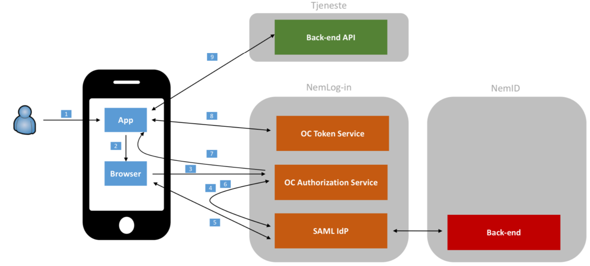

Der er identificeret følgende emner til det videre arbejde med fællesoffentlig
brugerstyring, hvor entiteten er en tjenestekonsument eller et fysisk apparat eller
sensor:

- Fællesoffentlige profiler af nye standarder som OAuth 2.0/OpenID Connect
og -mønstre for håndtering af apps via disse.
- Understøttelse af nye profiler via services i infrastrukturen (primært NemLog-in).
- Etablering af brugergrænseflade for brugerne, der giver overblik over, hvilke
apps de har autoriseret til hvad (inkl. mulighed for at tilbagetrække autorisation).
- Videre analyser i forhold til Internet of Things, herunder om app-modeller
kan bruges, eller der skal udvikles separate løsninger for disse enheder.
- Videre analyser i forhold til anvendelse af den nuværende PKI-infrastruktur
for IoT (herunder FOCES/VOCES-certifikater i særlige profiler, målrettet
specifikke sektorer).

Det skal bemærkes, at visse sektorer har helt specielle krav, der bedst opfyldes
med højere grad af decentralisering. Elsektoren baserer eksempelvis den kommende sikring og brugerstyring af enheder på standarderne IEC 61850 og IEC
62351, der anvender punkt-til-punkt forbindelse ved brug af X.509v3. Det kan
med rimelighed antages, at resten af forsyningssektoren vil kunne anvende samme model som elsektoren.

# III Bilag

## 10. Bilag A: Ordliste

Nedenstående liste forklarer betydningen af de væsentligste ord og begreber, der
indgår i den tværoffentlige referencearkitektur for brugerstyring.

Ord, der er markeret med *kursiv*, er ord, hvor definitionen kan findes på ordlisten.

| Term                                                        | Beskrivelse                                                                                                                                                                                                                                                                                                                                                                                                                                                                                                                                                                                                                                                                                                                                                                                                                                                                                                                                                                                                                                                                                                                                                                                                                                                                                      | Kilde Jf. Referenceliste nedenfor tabellen                                                  |
|-------------------------------------------------------------|--------------------------------------------------------------------------------------------------------------------------------------------------------------------------------------------------------------------------------------------------------------------------------------------------------------------------------------------------------------------------------------------------------------------------------------------------------------------------------------------------------------------------------------------------------------------------------------------------------------------------------------------------------------------------------------------------------------------------------------------------------------------------------------------------------------------------------------------------------------------------------------------------------------------------------------------------------------------------------------------------------------------------------------------------------------------------------------------------------------------------------------------------------------------------------------------------------------------------------------------------------------------------------------------------|---------------------------------------------------------------------------------------------|
| 1-faktor login                                              | *Autentifikation* (login) med 1 akkreditiv (login-faktor), typisk adgangskode                                                                                                                                                                                                                                                                                                                                                                                                                                                                                                                                                                                                                                                                                                                                                                                                                                                                                                                                                                                                                                                                                                                                                                                                                    | Datatilsynet, Flere faktorer i login                                                        |
| 2-faktor login                                              | *Autentifikation* (login) med 2 akkreditiver (login-faktorer), typisk adgangskode og fx nøglekort, smartcard eller lignende                                                                                                                                                                                                                                                                                                                                                                                                                                                                                                                                                                                                                                                                                                                                                                                                                                                                                                                                                                                                                                                                                                                                                                      | Datatilsynet, Flere faktorer i login                                                        |
| Access Control                                              | Se *adgangskontrol*.                                                                                                                                                                                                                                                                                                                                                                                                                                                                                                                                                                                                                                                                                                                                                                                                                                                                                                                                                                                                                                                                                                                                                                                                                                                                             |                                                                                             |
| Adgangsbillet                                               | Et elektronisk objekt (security token), der dokumenterer en anmodning (en samling af claims) fra en *bruger.*  For at opfylde *adgangspolitikken* for en tjeneste, skal der indhentes et eller flere adgangsbilletter hos udstedere, som tjeBilag_D_nesten har tillid til.  Eksempelvis kan en borger få en SAML assertion (token) udstedt hos NemLogin, der indeholder brugerens CPR nummer, hvorefter borgeren kan få adgang til eksempelvis SKAT’s Tast Selv Borger løsning.   Et andet eksempel er en Kerberos Server, der udsteder ”tickets”, som giver brugere adgang til servere i et sikkerhedsdomæne (f.eks. Active Directory).   Ofte er adgangsbilletter kryptografisk beskyttede, dels så modtageren kan verificere udstederens identitet, dels med henblik på at beskytte tokenet mod manipulation / fabrikation.                                                                                                                                                                                                                                                                                                                                                                                                                                                                   | IT- & Telestyrelsen, Begrebsmodel til brugerstyring                                         |
| Adgangskontrol                                              | Proces i en tjeneste, der afgør hvilke funktioner og data en bruger får adgang til på baggrund af brugerens attributter og tjenestens sikkerhedspolitik.                                                                                                                                                                                                                                                                                                                                                                                                                                                                                                                                                                                                                                                                                                                                                                                                                                                                                                                                                                                                                                                                                                                                         | National Standard for Identiteters Sikringsniveauer (NSIS)                                  |
| Adgangspolitik                                              | En adgangspolitik definerer kriterierne for at få adgang til en it service. En adgangspolitik beskriver hvilke attributter (eng: *claims*), der skal demonstreres, samt hvilke *tokenudstedere* man har tillid til kan udtale sig autoritativt om de enkelte attributter (*claims*) (via claimspolitikker). Er en del af *informationssikkerhedspolitikken*.                                                                                                                                                                                                                                                                                                                                                                                                                                                                                                                                                                                                                                                                                                                                                                                                                                                                                                                                     | IT- & Telestyrelsen, Begrebsmodel til brugerstyring                                         |
| Adgangsrettighed                                            | Rettighed der tildeles en *bruger* eller *brugerrolle* og som derved giver indehaveren adgang til at udføre en eller flere funktioner i et it-system. Adgangsrettigheder anvendes til at afgøre om en bruger må udføre en specifik handling på et objekt. Rettigheder kan udtrykkes som attributter (rettighedsrelevante attributter).                                                                                                                                                                                                                                                                                                                                                                                                                                                                                                                                                                                                                                                                                                                                                                                                                                                                                                                                                           | IT- & Telestyrelsen, Begrebsmodel til brugerstyring                                         |
| Administration af elektronisk/digital identitet             | I virksomheder vil der typisk være behov for at administrere medarbejdernes elektroniske/digitale identiteter og de rettigheder (privilegier) medarbejderen oppebærer med den digitale identitet.  Dette administreres typisk ved at tilknytte ’roller’ til identiteten. Hver rolle har et sæt rettigheder knyttet til sig og giver medarbejderen (it-brugeren) nogle privilegier ift. itsystemerne(I nogle tilfælde er der flere dimensioner i disse rolle-rettigheds modeller, f.eks. fagroller, systemroller, organisatoriske roller.). Tildeling af privilegier er et ledelsesansvar. Ledelsen vælger typisk at anvende medhjælpere til at foretage den faktiske administration af brugere (brugerstyringsfunktion).  Eksempler på privilegier, der kan tildeles en digital medarbejderidentitet (gennem roller): - Ordinationsret (kun til læger) - Ledelsesmyndighed - Rettigheder til fællesdrev                                                                                                                                                                                                                                                                                                                                                                                          | Lakeside, Region Midtjylland, Digital identitet – vigtige begreber og processer             |
| Akkreditiv                                                  | Se Elektronisk identifikationsmiddel                                                                                                                                                                                                                                                                                                                                                                                                                                                                                                                                                                                                                                                                                                                                                                                                                                                                                                                                                                                                                                                                                                                                                                                                                                                             |                                                                                             |
| Anmodning                                                   | Et *entitets* anmodning om adgang til en *tjeneste*. En anmodning (et *claim*) beskriver information, der skal demonstreres/godtgøres for at få adgang til et system eller en service. Ofte vil *claims* dække egenskaber ved brugeren eller rettighedsinformation om denne. Påstande, der er fremsat af det kaldende it system, er typisk relateret til it-sikkerhed, identitet (både bruger og it-system) og *adgangskontrol*.                                                                                                                                                                                                                                                                                                                                                                                                                                                                                                                                                                                                                                                                                                                                                                                                                                                                 | IT- & Telestyrelsen, Begrebsmodel til brugerstyring                                         |
| Anvendelse af elektronisk identitet                         | En bruger kan efter *indrullering* anvende sin digitale identitet på forskellig vis. Ofte vil anvendelsen bestå i at bevise sin identitet gennem *Autentifikation* (dvs. præsentation af *akkreditiver*), så en tjenesteudbyder efterfølgende kan give brugeren adgang til en digital tjeneste.  Nogle gange er det tilstrækkeligt at vise at brugeren er medarbejder i en given organisation for at få adgang til ittjenesten (f.eks. intranet), mens der andre gange kræves flere informationer om brugeren (f.eks. at vedkommende bestrider en bestemt arbejdsfunktion) for at kunne få adgang.  En særlig variant af identitetsbaseret tjeneste er administration af egen identitet. Det kan være simple ændringer i egen ’profil’, men kan også være mere komplekse handlinger. F.eks. er det for visse faggrupper i sundhedssektoren tilladt at anvende medhjælp. Administrationen af relationen mellem personen og disses medhjælpere kan evt. administreres af brugeren selv. Anvendelsesmuligheder - ”Login” hvilket typisk er oprettelsen af en *session* gennem *Autentifikation* - Præsentation af identitet - Uafviselig ”kvittering” for særlig ansvarspådragende handlinger - Administration af egen identitet (herunder bemyndigelse og *delegering*, ændring af *akkreditiver*) | Lakeside, Region Midtjylland, Digital identitet – vigtige begreber og processer             |
| Application Program Interface (API)                         | Typisk et programmeringsbibliotek, der stiller en række systemtekniske operationer til rådighed for programudviklere. De systemtekniske operationer har ofte en nær kobling til de funktionelle egenskaber, som it-brugere har behov for (i forskellige kontekst).                                                                                                                                                                                                                                                                                                                                                                                                                                                                                                                                                                                                                                                                                                                                                                                                                                                                                                                                                                                                                               | Fællesoffentlig eID i regionerne - Definition af begreber og termer                         |
| Assertion                                                   | En erklæring fra en verificerende enhed som indeholder verificeret identitets- og anden information (attributter) om en organisation, et system eller en person.                                                                                                                                                                                                                                                                                                                                                                                                                                                                                                                                                                                                                                                                                                                                                                                                                                                                                                                                                                                                                                                                                                                                 | NIST, Electronic Authentication Guideline                                                   |
| Attribut                                                    | Karakteristika eller egenskaber ved en Entitet. Dette kan fx være et brugernavn, et pseudonym, et CPR nummer, bopæl, rolle etc. Attributter kan også være egenskaber ved en identitet.                                                                                                                                                                                                                                                                                                                                                                                                                                                                                                                                                                                                                                                                                                                                                                                                                                                                                                                                                                                                                                                                                                           | National Standard for Identiteters Sikringsniveauer (NSIS)                                  |
| Attributtjeneste                                            | En organisation eller et system, der kan levere *attributter* om et system, en organisation eller en person til eksempelvis *login*-tjenester.                                                                                                                                                                                                                                                                                                                                                                                                                                                                                                                                                                                                                                                                                                                                                                                                                                                                                                                                                                                                                                                                                                                                                   | Fællesoffentlige brugerstyringsløsninger – En analyse af sikkerhedsstandarder og –løsninger |
| Autenticitetssikringsniveau                                 | Se *Sikringsniveau.*                                                                                                                                                                                                                                                                                                                                                                                                                                                                                                                                                                                                                                                                                                                                                                                                                                                                                                                                                                                                                                                                                                                                                                                                                                                                             |                                                                                             |
| Autentificering                                             | Se *Autentifikation.*                                                                                                                                                                                                                                                                                                                                                                                                                                                                                                                                                                                                                                                                                                                                                                                                                                                                                                                                                                                                                                                                                                                                                                                                                                                                            | Informationsordbogen Fællesoffentlig eID i regionerne - Definition af begreber og termer    |
| Autentifikation                                             | En proces som genkender og verificerer en identitet for en entitet på baggrund af tilhørende elektroniske identifikationsmidler. Ved dynamisk autentifikation forstås, at der anvendes kryptografiske eller andre teknikker til at skabe et bevis, der varierer mellem hver autentifikationsproces.                                                                                                                                                                                                                                                                                                                                                                                                                                                                                                                                                                                                                                                                                                                                                                                                                                                                                                                                                                                              | National Standard for Identiteters Sikringsniveauer (NSIS)                                  |
| Autorisation                                                | Ordet autorisation bruges i brugerstyring om flere aspekter af det at have rettigheder til at få adgang til en tjeneste og til data i tjenesten: • Det bruges om tildeling af rettigheder til en bruger i form af fx en rolle eller en egenskab hos brugeren. • Det bruges i forbindelse med fastlæggelse af regler og politikker for betingelserne for at en bruger må få adgang til en tjeneste. • Det bruges endeligt om de processer, der håndhæver, at de rette brugere får adgang til en tjeneste i en konkret situation (se fx http://nvlpubs.nist.gov/nistpubs/specialpublications/N IST.sp.800-162.pdf). I den tværoffentlige strategi og referencearkitektur for brugerstyring anvendes ordet autorisation ikke. I stedet anvendes begreberne Administration af en brugers rettigheder, Udstede adgangsbillet med attributter samt Fastlæggelse af adgangspolitikker og adgangsrettigheder – og Håndhævelse af rettigheder (*Adgangskontrol*).                                                                                                                                                                                                                                                                                                                                         | Informationsordbogen                                                                        |
| Avanceret elektronisk signatur                              | En *elektronisk signatur*, der opfylder kravene i artikel 26 i Forordning (EU) Nr. 910/2014: a) den er entydigt knyttet til underskriveren b) den kan identificere underskriveren c) den genereres ved hjælp af elektroniske signaturgenereringsdata, som underskriveren med en høj grad af tillid kan anvende og har fuld kontrol med, og d) den er knyttet til de data, som er underskrevet med den, på en sådan måde, at en hvilken som helst senere ændring af disse data kan opdages.                                                                                                                                                                                                                                                                                                                                                                                                                                                                                                                                                                                                                                                                                                                                                                                                       | EU 910/2014 Fællesoffentlig eID i regionerne - Definition af begreber og termer             |
| Billettjeneste                                              | Se *Tokenudsteder*                                                                                                                                                                                                                                                                                                                                                                                                                                                                                                                                                                                                                                                                                                                                                                                                                                                                                                                                                                                                                                                                                                                                                                                                                                                                               |                                                                                             |
| Bruger                                                      | En *entitet* (person, organisation, ting eller system), der kan anvende en *tjeneste*. Fysisk person eller it-system der anvender et it-system og vha. et *akkreditiv* identificerer sig over for et it-system. Bruger anvendes til at identificere en person eller et itsystem med et *akkreditiv* (eksempelvis med et medarbejder-certifikat) i forhold til en given service, der stilles til rådighed af et it-system. En fysisk person kan optræde som flere brugere – eksempelvis som privatperson og som ansat - med hver sit *akkreditiv*.                                                                                                                                                                                                                                                                                                                                                                                                                                                                                                                                                                                                                                                                                                                                                | IT- & Telestyrelsen, Begrebsmodel til brugerstyring                                         |
| Brugerorganisation                                          | En virksomhed eller myndighed, hvis medarbejdere anvender *tjenester.*  (Eller: En virksomhed eller myndighed med et CVRnummer, hvis medarbejdere anvender it-systemer, der er tilsluttet NemLog-in?)                                                                                                                                                                                                                                                                                                                                                                                                                                                                                                                                                                                                                                                                                                                                                                                                                                                                                                                                                                                                                                                                                            |                                                                                             |
| Brugerrolle                                                 | Rolle der udgøres af en eller flere *adgangsrettigheder* til et eller flere it-systemer, som en bloc tildeles til en bruger. Brugerroller anvendes til at afgøre, hvilke handlinger en bruger må udføre i et it-system. Brugerrollen fastlægger de *adgangsrettigheder*, som brugeren er tildelt. Brugere tilknyttes til roller og opnår *adgangsrettigheder* ved at være rolleindehaver. Brugerroller er grupperinger af *adgangsrettigheder*. Der er ikke nødvendigvis sammenfald mellem brugerroller og brugerens profession, stillingsbetegnelse mv.                                                                                                                                                                                                                                                                                                                                                                                                                                                                                                                                                                                                                                                                                                                                         | IT- & Telestyrelsen, Begrebsmodel til brugerstyring                                         |
| Brugerrollerestriktion                                      | En begrænsning som specificerer hvad en *brugerrolle* må bruges på. En brugerrollerestriktion er en aktør eksempelvis person, organisation eller it-system), som en brugers tildeling af en *brugerrolle* (*brugerrolletildeling*) begrænses til mht. anvendelse af *brugerrollen*.                                                                                                                                                                                                                                                                                                                                                                                                                                                                                                                                                                                                                                                                                                                                                                                                                                                                                                                                                                                                              | IT- & Telestyrelsen, Begrebsmodel til brugerstyring                                         |
| Brugerrolletildeling                                        | Angivelse af de *brugerroller* som en bruger er tildelt med tilhørende *brugerrollerestriktioner* attesteret gennem en brugerrolleattest. Brugerrolletildeling anvendes til at definere en brugers *brugerroller* med de begrænsninger (*brugerrollerestriktioner*), der måtte være i forhold til anvendelsen af brugerrollen.                                                                                                                                                                                                                                                                                                                                                                                                                                                                                                                                                                                                                                                                                                                                                                                                                                                                                                                                                                   | IT- & Telestyrelsen, Begrebsmodel til brugerstyring                                         |
| Brugerstyring                                               | Brugerstyring anvendes bredt i denne tværoffentlige strategi og referencearkitektur for brugerstyring. Det omfatter både *adgangskontrol* og administration af *brugere* og *adgangsrettigheder*, herunder det der på engelsk betegnes Credential and Identity Management (CIM), Identity Rights Management (IRM), Access Control (AC) og Identity and Access Management (IAM/IdAM). Brugerstyring dækker således opgaver i forbindelse med *indrullering, autentificering, autorisation*, osv                                                                                                                                                                                                                                                                                                                                                                                                                                                                                                                                                                                                                                                                                                                                                                                                   |                                                                                             |
| Certificate Authority (CA)                                  | En betroet enhed, der udsteder *certifikater* til identificerede og registrerede parter (se også *registreringsmyndighed*). Opgaverne og ansvarsområderne tilhørende en CA er opdelt i Identity Proofing Service (IPS) og *Credential Management Service (CMS)*. Se også *Identitetsgarant*.                                                                                                                                                                                                                                                                                                                                                                                                                                                                                                                                                                                                                                                                                                                                                                                                                                                                                                                                                                                                     |                                                                                             |
| Certifikat                                                  | En elektronisk attest, som angiver certifikatindehaverens offentlige nøgle sammen med supplerende information, og som entydigt knytter den offentlige nøgle til identifikation af certifikatindehaveren. Et certifikat skal signeres af et certificeringscenter (CA), som derved bekræfter certifikatets gyldighed.                                                                                                                                                                                                                                                                                                                                                                                                                                                                                                                                                                                                                                                                                                                                                                                                                                                                                                                                                                              | OCEScertifikatpolitikker                                                                    |
| Certifikatudbyder, Certifikatudsteder, Certificeringscenter | En fysisk eller juridisk person, der er bemyndiget til at generere, udstede og administrere *certifikater* (jf. *identitetsudbyder*). Se også *Certificate Authority*.                                                                                                                                                                                                                                                                                                                                                                                                                                                                                                                                                                                                                                                                                                                                                                                                                                                                                                                                                                                                                                                                                                                           | OCEScertifikatpolitikker                                                                    |
| Claim                                                       | Se *Anmodning.*                                                                                                                                                                                                                                                                                                                                                                                                                                                                                                                                                                                                                                                                                                                                                                                                                                                                                                                                                                                                                                                                                                                                                                                                                                                                                  |                                                                                             |
| Credential                                                  | Se *Akkreditiv.*                                                                                                                                                                                                                                                                                                                                                                                                                                                                                                                                                                                                                                                                                                                                                                                                                                                                                                                                                                                                                                                                                                                                                                                                                                                                                 |                                                                                             |
| Credential Management Service                               | Myndighed, der varetager vedligeholdelse af *certifikater*, dvs. udstedelse og tilbagetrækning (revokering). I *OCES*infrastrukturen er det muligt at placere udvalgte dele af denne myndigheds ansvarsområder hos en *LRA (Local Registration Authority)* i fysisk nærhed af en organisatorisk enhed. Dette kan eksempelvis foregå ude i de enkelte regioner, så proceduren omkring udstedelse og vedligeholdelse af *certifikater* simplificeres.                                                                                                                                                                                                                                                                                                                                                                                                                                                                                                                                                                                                                                                                                                                                                                                                                                              | Fællesoffentlig eID i regionerne - Definition af begreber og termer                         |
| Credential Service Provider (CSR)                           | Se *Identitetsgarant.*                                                                                                                                                                                                                                                                                                                                                                                                                                                                                                                                                                                                                                                                                                                                                                                                                                                                                                                                                                                                                                                                                                                                                                                                                                                                           |                                                                                             |
| Delegering                                                  | Omhandler personers adgang til at benytte medhjælp, dvs. under ansvar og efter instruktion og under tilsynspligt uddelegere nogle af den uddelegerendes rettigheder. Karakteristisk for delegering er, at der er tale om en person, der instruerer en anden i at handle på sine vegne. Med delegeringen følger en pligt til at instruere og kontrollere. Der stilles derfor krav om, at man skal kunne se, hvem der handler på hvis vegne ved centrale opslag.                                                                                                                                                                                                                                                                                                                                                                                                                                                                                                                                                                                                                                                                                                                                                                                                                                   | Fællesoffentlig eID i regionerne - Definition af begreber og termer                         |
| Digital identitet                                           | Digital (elektronisk) identitet anvendes om den digitale repræsentation af en *entitet* (fx person eller virksomhed). Dette svarer til *eID*. Se også *Identitet.*                                                                                                                                                                                                                                                                                                                                                                                                                                                                                                                                                                                                                                                                                                                                                                                                                                                                                                                                                                                                                                                                                                                               | Informationsordbogen                                                                        |
| Digital Signatur                                            | Anvendes om første generation af offentlige *certifikater* til elektronisk service (OCES). Et matematisk skema til at bevise autenticiteten af en digital besked eller dokument. Digitale signaturer dannes ved brug af asymmetrisk kryptering og hashfunktioner. Anvendes ikke synonymt med eSignatur.                                                                                                                                                                                                                                                                                                                                                                                                                                                                                                                                                                                                                                                                                                                                                                                                                                                                                                                                                                                          | Informationsordbogen                                                                        |
| eIDAS                                                       | Electronic identification and trust services. EU-forordningen om elektronisk identifikation og tillidstjenester til brug for elektroniske transaktioner.                                                                                                                                                                                                                                                                                                                                                                                                                                                                                                                                                                                                                                                                                                                                                                                                                                                                                                                                                                                                                                                                                                                                         | eIDAS                                                                                       |
| Elektronisk Identitet, eID                                  | Se *Digital Identitet.*                                                                                                                                                                                                                                                                                                                                                                                                                                                                                                                                                                                                                                                                                                                                                                                                                                                                                                                                                                                                                                                                                                                                                                                                                                                                          |                                                                                             |
| Elektronisk signatur                                        | Data i elektronisk form, der er vedhæftet eller logisk tilknyttet andre data i elektronisk form, og som anvendes af underskriveren til at skrive under med.                                                                                                                                                                                                                                                                                                                                                                                                                                                                                                                                                                                                                                                                                                                                                                                                                                                                                                                                                                                                                                                                                                                                      | EU 910/2014 Fællesoffentlig eID i regionerne - Definition af begreber og termer             |
| Elektronisk identifikationsmiddel                           | Et elektronisk eller fysisk objekt/genstand, der kan anvendes til at gennemføre en autentifikation af en identitet. Eksempler kan være brugernavn/kodeord, et NemID nøglekort, et certifikat med tilhørende privat nøgle, et SAML token etc. Se også Akkreditiv                                                                                                                                                                                                                                                                                                                                                                                                                                                                                                                                                                                                                                                                                                                                                                                                                                                                                                                                                                                                                                  | National Standard for Identiteters Sikringsniveauer (NSIS)                                  |
| Elektronisk signaturgenereringssystem                       | Konfigureret software eller hardware, der bruges til at generere en elektronisk signatur.                                                                                                                                                                                                                                                                                                                                                                                                                                                                                                                                                                                                                                                                                                                                                                                                                                                                                                                                                                                                                                                                                                                                                                                                        | EU 910/2014 Fællesoffentlig eID i regionerne - Definition af begreber og termer             |
| eID-tjeneste                                                | En betroet tjeneste, som leverer en eller flere af de processer, som er underlagt krav i [NSIS]. Dette kan fx være identitetssikring, udstedelse af elektroniske identifikationsmidler eller drift af en broker. Bemærk, at eIDAS reguleringen bruger det komplementerende begreb ”tillidstjeneste” om tjenester involveret i udstedelse af digitale signaturer/certifikater, validering af certifikaters gyldighed og tidsstempling.                                                                                                                                                                                                                                                                                                                                                                                                                                                                                                                                                                                                                                                                                                                                                                                                                                                            | National Standard for Identiteters Sikringsniveauer (NSIS)                                  |
| Entitet                                                     | Et subjekt / en bruger som skal have adgang til en tjeneste. I denne standard betragtes kun fysiske personer, som evt. kan være associeret med en juridisk person som en entitet.                                                                                                                                                                                                                                                                                                                                                                                                                                                                                                                                                                                                                                                                                                                                                                                                                                                                                                                                                                                                                                                                                                                | National Standard for Identiteters Sikringsniveauer (NSIS)                                  |
| eSignatur                                                   | eSignatur defineres som data i elektronisk form, der er logisk forbundet med andre elektroniske data, som autentificerer den, der signerer. En ”avanceret” signatur er en eSignatur, der kan identificere den, som signerer. Anvendes primært om begrebet elektronisk underskrift og i begrænset omfang om en specifik elektronisk underskrift. *<Vi har flere forskellige signaturord (eSignatur, Elektronisk signatur, Avanceret elektronisk signatur, Digital Signatur, Signatur). Vi skal have et overblik så vi kan se hvilke der er synomyner og hvilke der adskiller sig. Et aspekt er at digital signatur er certifikatbaseret, mens en elektronisk signatur er enhver form for elektronisk version, fx en indscannet underskrift eller en underskrift på en skærm.*                                                                                                                                                                                                                                                                                                                                                                                                                                                                                                                     | http://ec.europa.eu/digitalagenda/en/trustservices-and-eid                                  |
| FOCES                                                       | OCES *certifikat* udstedt til en "funktion" eller et system i en virksomhed. Disse *certifikater* kan anvendes til at autentificere systemet, oprette sikre kommunikationskanaler (f.eks. via SSL/TLS eller HTTPS) eller digital signering af indhold, der sendes fra systemet til et andet system. I modsætning til signaturer, der baseres på *VOCES certifikater*, har signaturen dog ingen juridisk legitimitet ift. virksomheden som juridisk person. Signaturer fra FOCES *certifikater* bruges derfor typisk som sikkerhed for at det pågældende *system* har sendt det pågældende indhold.                                                                                                                                                                                                                                                                                                                                                                                                                                                                                                                                                                                                                                                                                               | Fællesoffentlig eID i regionerne - Definition af begreber og termer                         |
| Forretningstjeneste                                         | En tjeneste, der løses et forretningsmæssigt behov, fx en borgerrettet selvbetjeningsløsning.                                                                                                                                                                                                                                                                                                                                                                                                                                                                                                                                                                                                                                                                                                                                                                                                                                                                                                                                                                                                                                                                                                                                                                                                    |                                                                                             |
| Fuldmagt                                                    | Et almindeligt aftaleretligt begreb, hvor man som myndig person kan udstyre en anden med fuldmagt til at handle på sine vegne. Karakteristisk for en fuldmagt er, at det er en person, der giver en anden fuldmagt til at handle på sine vegne og repræsentere vedkommende. Omfanget af fuldmagten afhænger af, hvad der står i den/hvad personen har sagt/gjort.                                                                                                                                                                                                                                                                                                                                                                                                                                                                                                                                                                                                                                                                                                                                                                                                                                                                                                                                | Fællesoffentlig eID i regionerne - Definition af begreber og termer                         |
| Forretningsgang og instruks                                 | Fremgangsmåde og regler for valg i en sikkerhedspolitik                                                                                                                                                                                                                                                                                                                                                                                                                                                                                                                                                                                                                                                                                                                                                                                                                                                                                                                                                                                                                                                                                                                                                                                                                                          |                                                                                             |
| Føderation                                                  | En række organisationer, der har indbyrdes tillid til hinanden omkring *autentificering* af brugere. Indenfor en føderation kan en bruger autentificere sig overfor en lokal autoritet og derefter anvende sin identitet i tjenester udbudt af de andre organisationer uden at skulle autentificere sig igen. Eksempler: En samling *sikkerhedsdomæner*, der har tillid til services ved hinanden. En sammenslutning af et givent nummer af Service Providers og *Identitetsudbydere*.                                                                                                                                                                                                                                                                                                                                                                                                                                                                                                                                                                                                                                                                                                                                                                                                           | Fællesoffentlig eID i regionerne - Definition af begreber og termer                         |
| Identifikation                                              | En proces hvor identiteten af en entitet fastlægges, og hvor attributter eller dele heraf (fx navn og CPR nummer eller tilknytning til juridisk person) efterprøves. Kaldes også for identitetssikring eller identity proofing på engelsk                                                                                                                                                                                                                                                                                                                                                                                                                                                                                                                                                                                                                                                                                                                                                                                                                                                                                                                                                                                                                                                        | National Standard for Identiteters Sikringsniveauer (NSIS)                                  |
| Identitet                                                   | En digital persona repræsenteret ved et sæt af attributter. Anvendes også som synonym for *Elektronisk Identitet*.                                                                                                                                                                                                                                                                                                                                                                                                                                                                                                                                                                                                                                                                                                                                                                                                                                                                                                                                                                                                                                                                                                                                                                               | National Standard for Identiteters Sikringsniveauer (NSIS)                                  |
| Identitetsgarant                                            | Den organisation, der udsteder *akkreditiver* og på anmodning (ved login) garanterer, at de fremviste *akkreditiver* tilhører den *entitet*, de er udstedt til. Samme organisation kan varetage registrering af identitet (UK) eller bygge på autoritativt *identitetsregister*, fx CPR, CVR eller virksomheders identitetsregistre (AD). Samme organisation kan varetage *verifikation* eller bygge på andres *verifikation* (i DK banker og borgerservicecentre).                                                                                                                                                                                                                                                                                                                                                                                                                                                                                                                                                                                                                                                                                                                                                                                                                              |                                                                                             |
| Identitetsregister                                          | En funktion/register, der registrerer information om entiteter (fx borgere). Dette kan fx være CPR-registret og CVR-registret som eksempler blandt flere registre.                                                                                                                                                                                                                                                                                                                                                                                                                                                                                                                                                                                                                                                                                                                                                                                                                                                                                                                                                                                                                                                                                                                               | National Standard for Identiteters Sikringsniveauer (NSIS)                                  |
| Identitetsudbyder, Identity Provider (IdP)                  | En organisation eller et system, der verificerer en brugers eller et systems identitet på baggrund af brugerens (eller systemets) besiddelse og kontrol over *akkreditiver* udstedt af en CSP som *IdP*’en har tillid til. Dertil udsteder organisationen *akkreditiver* til *entiteter* og indestår for deres identitet over for enheder, der forespørger. Det kan både dække over identitetsgarant og *log-in-tjeneste*.                                                                                                                                                                                                                                                                                                                                                                                                                                                                                                                                                                                                                                                                                                                                                                                                                                                                       | Informationsordbogen NIST, Electronic Authentication Guideline                              |
| Identity Relationship Management                            | En variant af brugerstyring, hvor vægten lægges på relationer mellem entiteter og håndteringen heraf. Er fremkommet som følge af behovet for at kunne håndtere relationerne mellem personer og de mange enheder, der vil blive sluttet til internettet (internet of things).                                                                                                                                                                                                                                                                                                                                                                                                                                                                                                                                                                                                                                                                                                                                                                                                                                                                                                                                                                                                                     | Kantara, Identity Relationship Management                                                   |
| Identity Token                                              | Et *sikkerheds token* der indeholder digitale informationer om en 'identitet' (omtales ofte som 'principals'). Identity tokens er typisk XML-baserede elementer, der er udstedt og digitalt signeret af en *STS (Security Token Service)*.                                                                                                                                                                                                                                                                                                                                                                                                                                                                                                                                                                                                                                                                                                                                                                                                                                                                                                                                                                                                                                                       | Fællesoffentlig eID i regionerne - Definition af begreber og termer                         |
| IdP                                                         | Se *Identitetsudbyder.*                                                                                                                                                                                                                                                                                                                                                                                                                                                                                                                                                                                                                                                                                                                                                                                                                                                                                                                                                                                                                                                                                                                                                                                                                                                                          |                                                                                             |
| Indrullering                                                | Indrullering er den proces, en person gennemgår for at få oprettet en elektronisk identitet. I processen skal personen identitetssikres i passende omfang, f.eks. ved personligt fremmøde og fremvisning af tidligere udstedte *akkreditiver* (pas, kørekort).  Styrken af identitetssikringen af personen er et af grundelementerne i den såkaldte ”Level of Assurance” (LoA), dvs. den grad af tillid, der kan haves til den fysiske identitet, der er koblet til en elektronisk identitet. Resultatet af en indrullering er dels en elektronisk identitet koblet til den fysiske bruger, dels nye *akkreditiver* der efterfølgende kan anvendes til at autentificere relationen mellem den fysiske bruger og den digitale identitet.  Handlinger ved indrullering:  - Registrering af identiteten - Identifikation (”Identity proofing”) - Udstedelse af *akkreditiver* (f.eks. *certifikat* og nøglekort) - Aktivering af identiteten (har typisk til formål at sikre sole *control*)                                                                                                                                                                                                                                                                                                        | Lakeside, Region  Midtjylland, Digital identitet –  vigtige begreber  og processer          |
| Informationssikkerhedspolitik                               | Det overordnede dokument, som underskrives af ledelsen, og som udstikker de overordnede krav og målsætninger, som skal gælde for en organisations håndtering af informationssikkerhed Består af retningslinjer, forretningsgang og instruks og sikkerhedsforanstaltninger.                                                                                                                                                                                                                                                                                                                                                                                                                                                                                                                                                                                                                                                                                                                                                                                                                                                                                                                                                                                                                       | Informationssikkerhedspolitik  : Digitaliseringsstyrelsen                                   |
| Local Registration Authority                                | Se *Signaturadministrator*.                                                                                                                                                                                                                                                                                                                                                                                                                                                                                                                                                                                                                                                                                                                                                                                                                                                                                                                                                                                                                                                                                                                                                                                                                                                                      |                                                                                             |
| Login                                                       | Den proces, hvor en person præsenterer sine *akkreditiver* for at bevise sin identitet. Se også *autentificering*.                                                                                                                                                                                                                                                                                                                                                                                                                                                                                                                                                                                                                                                                                                                                                                                                                                                                                                                                                                                                                                                                                                                                                                               | Informationsordbogen                                                                        |
| Login-faktor                                                | Se *akkreditiv.*                                                                                                                                                                                                                                                                                                                                                                                                                                                                                                                                                                                                                                                                                                                                                                                                                                                                                                                                                                                                                                                                                                                                                                                                                                                                                 |                                                                                             |
| Login-tjeneste                                              | De tjenester, der indestår for brugeres identitet over for tjenesteudbydere og herunder leverer identitetsrelaterede *attributter (primære attributter)*.                                                                                                                                                                                                                                                                                                                                                                                                                                                                                                                                                                                                                                                                                                                                                                                                                                                                                                                                                                                                                                                                                                                                        |                                                                                             |
| LRA                                                         | Se *Signaturadministrator.*                                                                                                                                                                                                                                                                                                                                                                                                                                                                                                                                                                                                                                                                                                                                                                                                                                                                                                                                                                                                                                                                                                                                                                                                                                                                      |                                                                                             |
| MOCES                                                       | OCES *certifikat* udstedt til en medarbejder i en virksomhed. *Certifikatet* attesterer at en person er identificeret af ledelsen (eller en af ledelsen udpeget administrator) og at personen er tilknyttet virksomheden.                                                                                                                                                                                                                                                                                                                                                                                                                                                                                                                                                                                                                                                                                                                                                                                                                                                                                                                                                                                                                                                                        | Fællesoffentlig eID i regionerne - Definition af begreber og termer                         |
| NemID                                                       | Bruges både som den nuværende og kommende/næste generation NemID, uanset navnet på en kommende NemID-løsning.                                                                                                                                                                                                                                                                                                                                                                                                                                                                                                                                                                                                                                                                                                                                                                                                                                                                                                                                                                                                                                                                                                                                                                                    |                                                                                             |
| NemID Privat                                                | Bruges til de løsninger, der retter sig specifikt til private borgere.                                                                                                                                                                                                                                                                                                                                                                                                                                                                                                                                                                                                                                                                                                                                                                                                                                                                                                                                                                                                                                                                                                                                                                                                                           |                                                                                             |
| NemID til erhverv                                           | Bruges til de løsninger, der omfatter virksomheder bredt, dvs. *MOCES, VOCES, FOCES* etc. *MOCES*= medarbejder-OCES *VOCES*=virksomheds-OCES *FOCES*= funktions-OCES *OCES= Offentlige certifikater til elektroniske services.*                                                                                                                                                                                                                                                                                                                                                                                                                                                                                                                                                                                                                                                                                                                                                                                                                                                                                                                                                                                                                                                                  |                                                                                             |
| NemIDmedarbejdersignatur                                    | NemID til medarbejdere i virksomheder og myndigheder. Bruges både som den nuværende og kommende NemIDmedarbejdersignatur, uanset om en kommende løsning kun omfatter *eID* eller både *eID* og *eSignatur*.                                                                                                                                                                                                                                                                                                                                                                                                                                                                                                                                                                                                                                                                                                                                                                                                                                                                                                                                                                                                                                                                                      |                                                                                             |
| Nøgle                                                       | De tal, der står på nøglekortet til NemID, og som skal indtastes i forbindelse med anvendelse af nøglekort                                                                                                                                                                                                                                                                                                                                                                                                                                                                                                                                                                                                                                                                                                                                                                                                                                                                                                                                                                                                                                                                                                                                                                                       |                                                                                             |
| Nøglefil                                                    | Angiver en af de specifikke løsninger for NemID til erhverv, hvor *certifikat* og tilhørende private nøgle gemmes i en fil beskyttet med brugerens adgangskode. Nøglefile kan anvendes til både *MOCES, VOCES* og *FOCES*.                                                                                                                                                                                                                                                                                                                                                                                                                                                                                                                                                                                                                                                                                                                                                                                                                                                                                                                                                                                                                                                                       |                                                                                             |
| OCES                                                        | Se Offentlige *Certifikater* til Elektroniske Services                                                                                                                                                                                                                                                                                                                                                                                                                                                                                                                                                                                                                                                                                                                                                                                                                                                                                                                                                                                                                                                                                                                                                                                                                                           |                                                                                             |
| Offentlige Certifikater til Elektroniske Services           | Offentlige *Certifikater* til Elektroniske Services. Det danske fællesoffentlige system til elektronisk id og digitale signaturer.                                                                                                                                                                                                                                                                                                                                                                                                                                                                                                                                                                                                                                                                                                                                                                                                                                                                                                                                                                                                                                                                                                                                                               | Fællesoffentlig eID i regionerne - Definition af begreber og termer                         |
| PDP                                                         | Se Policy Decision Point                                                                                                                                                                                                                                                                                                                                                                                                                                                                                                                                                                                                                                                                                                                                                                                                                                                                                                                                                                                                                                                                                                                                                                                                                                                                         |                                                                                             |
| PEP                                                         | Se Policy Enforcement Point                                                                                                                                                                                                                                                                                                                                                                                                                                                                                                                                                                                                                                                                                                                                                                                                                                                                                                                                                                                                                                                                                                                                                                                                                                                                      |                                                                                             |
| PKI                                                         | Se Public Key Infrastructure.                                                                                                                                                                                                                                                                                                                                                                                                                                                                                                                                                                                                                                                                                                                                                                                                                                                                                                                                                                                                                                                                                                                                                                                                                                                                    |                                                                                             |
| Policy Decision Point                                       | En funktion, som bestemmer om adgang er tilladt eller ej.                                                                                                                                                                                                                                                                                                                                                                                                                                                                                                                                                                                                                                                                                                                                                                                                                                                                                                                                                                                                                                                                                                                                                                                                                                        | California - Identity and Access Management (IdAM) Reference Architecture (RA)              |
| Policy Enforcement Point                                    | En enhed, der styrer (håndhæver) adgang til en service baseret på verificerede *attributter* og afgørelser om overholdelse af *adgangspolitikker*. The code that actually enforces authorization rules.                                                                                                                                                                                                                                                                                                                                                                                                                                                                                                                                                                                                                                                                                                                                                                                                                                                                                                                                                                                                                                                                                          | California - Identity and Access Management (IdAM) Reference Architecture (RA)              |
| Primære attributter                                         | De kontekstafhængige *attributter*, der er besluttet i infrastrukturen, og som beskriver *entiteten*. Antal og art af attributter fastlægges ud fra lovgivningsmæssige rammer (fx Persondataloven) og beslutninger ud fra tekniske og økonomiske præmisser.  Eksempler på primære attributter:  • NemID (Der kunne være tjenester, der alene har brug for et ”ja/nej” til dette spørgsmål. Det kan leveres i form af et tjenesteudbyderspecifikt PID.) • PID (Løsningen giver mulighed for at garantere at der er tale om en garanteret identitet – men identiteten kan kun afsløres ved problemer. Det kan være i form af et persistent eller tjenesteudbyderspecifikt PID) • Alder, Navn, Adresse/virksomhedens adresse, CPRnummer, Statsborgerskab, Stilling / rolle, mv.                                                                                                                                                                                                                                                                                                                                                                                                                                                                                                                     |                                                                                             |
| Privat nøgle                                                | Den private nøgle er et centralt element i en *public keyinfrastructure (PKI)* og svarer til definitionen af signaturgenereringsdata i *eIDAS*-forordningen.                                                                                                                                                                                                                                                                                                                                                                                                                                                                                                                                                                                                                                                                                                                                                                                                                                                                                                                                                                                                                                                                                                                                     |                                                                                             |
| Protokol                                                    | En formel specifikation af hvordan enheder interagerer. På de lavere niveauer specificerer protokoller elektriske og fysiske standarder for netværk, rækkefølge af signaler / bits i en transmission, fejlhåndtering (f.eks. retransmission) mm.. På højere niveauer specificerer protokoller karaktersæt, syntaks af beskeder, beskedsekvenser mm.                                                                                                                                                                                                                                                                                                                                                                                                                                                                                                                                                                                                                                                                                                                                                                                                                                                                                                                                              | http://da.wikipedia.org/wiki/Protokol_(edb)                                                 |
| Provisionering                                              | Bruger provisionering henviser til skabelse/oprettelse, vedligeholdelse og deaktivering af bruger objekter og *akkreditiver* og *attributter* for brugere, da de eksisterer i flere ét eller flere systemer, registre eller appikationer, i modsætning til automatiseret eller interaktive forretningsprocesser. Se også indrullering.                                                                                                                                                                                                                                                                                                                                                                                                                                                                                                                                                                                                                                                                                                                                                                                                                                                                                                                                                           | http://en.wikipedia.org/wiki/Provisioning, afsnit 3. User provisioning                      |
| Public Key Infrastructure                                   | PKI er en teknologi til udstedelse, administration og brug af digitale *certifikater*. Den Digitale Signatur er en PKI tofaktor sikkerhedsarkitektur (kendskab til kodeord samt besiddelse af en fysisk enhed, f.eks. en *nøglefil* eller et nøglekort), der administreres på nationalt hold af en OCES-operatør.                                                                                                                                                                                                                                                                                                                                                                                                                                                                                                                                                                                                                                                                                                                                                                                                                                                                                                                                                                                | Fællesoffentlig eID i regionerne - Definition af begreber og termer                         |
| RA                                                          | Se *Registration Authority.*                                                                                                                                                                                                                                                                                                                                                                                                                                                                                                                                                                                                                                                                                                                                                                                                                                                                                                                                                                                                                                                                                                                                                                                                                                                                     |                                                                                             |
| Registration Authority                                      | Se *Registreringsmyndighed* og *Identitetsgarant*                                                                                                                                                                                                                                                                                                                                                                                                                                                                                                                                                                                                                                                                                                                                                                                                                                                                                                                                                                                                                                                                                                                                                                                                                                                |                                                                                             |
| Registrering                                                | Registrering af en entitet, af attributter og akkreditiver. Omfatter bl.a. indrullering                                                                                                                                                                                                                                                                                                                                                                                                                                                                                                                                                                                                                                                                                                                                                                                                                                                                                                                                                                                                                                                                                                                                                                                                          |                                                                                             |
| Registreringsmyndighed, Registreringsenhed                  | Den organisation, som registrerer en *entitet* og verificerer den identitet (fx med hjælp fra identitetspapirer). De står dermed inde for identitet af og oplysninger (*attributter*) om den part, der skal modtage et akkreditiv. Samme organisation kan varetage registrering af identitet (UK) eller bygge på autoritativt *identitetsregister*, fx CPR, CVR eller virksomheders identitetsregistre (AD)                                                                                                                                                                                                                                                                                                                                                                                                                                                                                                                                                                                                                                                                                                                                                                                                                                                                                      |                                                                                             |
| Ressource                                                   | Se *Tjeneste*                                                                                                                                                                                                                                                                                                                                                                                                                                                                                                                                                                                                                                                                                                                                                                                                                                                                                                                                                                                                                                                                                                                                                                                                                                                                                    |                                                                                             |
| Retningslinjer                                              | Guide i form af anvisninger, eksempler og principper i en *informationssikkerhedspolitik*                                                                                                                                                                                                                                                                                                                                                                                                                                                                                                                                                                                                                                                                                                                                                                                                                                                                                                                                                                                                                                                                                                                                                                                                        |                                                                                             |
| Rettighed                                                   | Se *Adgangsrettighed*                                                                                                                                                                                                                                                                                                                                                                                                                                                                                                                                                                                                                                                                                                                                                                                                                                                                                                                                                                                                                                                                                                                                                                                                                                                                            |                                                                                             |
| Rettighedsstyring                                           | Se *Autorisation.*                                                                                                                                                                                                                                                                                                                                                                                                                                                                                                                                                                                                                                                                                                                                                                                                                                                                                                                                                                                                                                                                                                                                                                                                                                                                               |                                                                                             |
| Rolle                                                       | En *entitet* (typisk en it-bruger) kan optræde i forskellige situationer eller sammenhænge, der gør at samme identitet skal have forskellige rettigheder og/eller respons. Roller er typisk knyttet til forskellige arbejdsfunktioner. Se *brugerrolle*.                                                                                                                                                                                                                                                                                                                                                                                                                                                                                                                                                                                                                                                                                                                                                                                                                                                                                                                                                                                                                                         | Fællesoffentlig eID i regionerne - Definition af begreber og termer                         |
| Samtykke                                                    | At en person indvilliger i, at oplysninger, der vedrører pågældende selv, må læses og bruges af en anden part. Karakteristisk for et samtykke er således, at det afgives af en person vedrørende et specifikt forhold, og at personen skal kunne overskue konsekvenserne af sit samtykke.  I Persondataloven dækker begrebet samtykke, at *”den registrerede indvilger i, at oplysninger, der vedrører den pågældende selv, gøres til genstand for behandling”*. Forvaltningsloven har bestemmelser om, at videregivelse af oplysninger (og dermed til at en anden myndighed kan se oplysningerne) kræver borgerens samtykke.  I Sundhedsloven dækker begrebet både samtykke til behandling og samtykke til videregivelse af oplysninger til at andre sundhedspersoner og til at indhente oplysninger ved opslag i sundhedsregistre.                                                                                                                                                                                                                                                                                                                                                                                                                                                             | Redigeret efter Fællesoffentlig eID i regionerne - Definition af begreber og termer         |
| Security token                                              | Se *Adgangsbillet.*                                                                                                                                                                                                                                                                                                                                                                                                                                                                                                                                                                                                                                                                                                                                                                                                                                                                                                                                                                                                                                                                                                                                                                                                                                                                              |                                                                                             |
| Security Token Service (STS)                                | En it-tjeneste i infrastrukturen, som udsteder *"security tokens"*. Disse *"tokens"* indeholder typisk informationer om brugeren som *STS* tjenesten har kontrolleret og som den modtagende part dermed kan stole på. Se også tokenudsteder                                                                                                                                                                                                                                                                                                                                                                                                                                                                                                                                                                                                                                                                                                                                                                                                                                                                                                                                                                                                                                                      | Fællesoffentlig eID i regionerne - Definition af begreber og termer                         |
| Sekundære attributter                                       | De attributter ud over de *primære attributter*, som tjenesteudbydere har brug for om *entiteterne* i forbindelse med tjenesten (indkomst, helbred mv) Eksempler på sekundære attributter: • Spærreliste ifm. spil – erhverv (Spiludbydere skal tjekke at spillere ikke er tilmeldt til spærrelisten. En tjeneste, der giver besked om over/under 18 bør set fra spiludbydernes side også indeholde status i forhold til spærrelisten.) • Indkomst - offentlig (Personlig indkomst, fx fra eIndkomst) • Sundhedsdata – offentlig (Fx fra praktiserende læge) • Rettighedsdata – erhverv og offentlig (Data om rolle, gruppe mv, der har relevans for tildeling af rettigheder. Fx *attributter* fra NemLog-in Brugeradministration. Fx *fuldmagt* (som delvist kan komme fra NemLogin *Fuldmagt*.)                                                                                                                                                                                                                                                                                                                                                                                                                                                                                               |                                                                                             |
| Service                                                     | Se *Tjeneste.*                                                                                                                                                                                                                                                                                                                                                                                                                                                                                                                                                                                                                                                                                                                                                                                                                                                                                                                                                                                                                                                                                                                                                                                                                                                                                   |                                                                                             |
| Serviceaftager                                              | Den organisation eller person eller det system, der anvender en service. Se også afsnit 1.4.2 Requesters and Providers.                                                                                                                                                                                                                                                                                                                                                                                                                                                                                                                                                                                                                                                                                                                                                                                                                                                                                                                                                                                                                                                                                                                                                                          | W3C, Web Services Architecture, Working Group Note                                          |
| Serviceudbyder                                              | Den organisation eller person eller det system, der udbyder en service. Se også afsnit 1.4.2 Requesters and Providers                                                                                                                                                                                                                                                                                                                                                                                                                                                                                                                                                                                                                                                                                                                                                                                                                                                                                                                                                                                                                                                                                                                                                                            | W3C, Web Services Architecture, Working Group Note                                          |
| Session                                                     | En tidsmæssig og systemorienteret ramme, indenfor hvilken en entitets digitale identitet er autentificeret, og kan tilgå et system eller sæt af systemer. En session oprettes typisk i forbindelse med autentifikationshandlingen, f.eks. ved login til et fagsystem eller en portalløsning, under betingelse af at brugerens identitet kan autentificeres af det tilhørende autentifikationsmodul.                                                                                                                                                                                                                                                                                                                                                                                                                                                                                                                                                                                                                                                                                                                                                                                                                                                                                              | Fællesoffentlig eID i regionerne - Definition af begreber og termer                         |
| Signatur                                                    | Signatur anvendes som udgangspunkt om en *avanceret elektronisk signatur* som defineret i eIDAS-forordningen. Dog anvendes begrebet ”digital signatur” som betegnelse for første generation af OCES-infrastrukturen.                                                                                                                                                                                                                                                                                                                                                                                                                                                                                                                                                                                                                                                                                                                                                                                                                                                                                                                                                                                                                                                                             | eIDAS                                                                                       |
| Signaturadministrator                                       | Virksomheders administrator af NemID til medarbejdere                                                                                                                                                                                                                                                                                                                                                                                                                                                                                                                                                                                                                                                                                                                                                                                                                                                                                                                                                                                                                                                                                                                                                                                                                                            | OCES certifikatpolitik                                                                      |
| Sikkerhedsdomæne                                            | Omgivelser defineret af sikkerhedsmodeller og en sikkerhedsarkitektur, der rummer en række it-ressourcer og systemer, der er autoriseret til at få adgang til *ressourcerne*.                                                                                                                                                                                                                                                                                                                                                                                                                                                                                                                                                                                                                                                                                                                                                                                                                                                                                                                                                                                                                                                                                                                    | Network Working Group, Request for Comments 2828                                            |
| Sikkerhedsforanstaltning                                    | De kontroller som indføres for at undgå, at der indtræffer *sikkerhedshændelser.* Administrative procedurer eller tekniske opsætninger                                                                                                                                                                                                                                                                                                                                                                                                                                                                                                                                                                                                                                                                                                                                                                                                                                                                                                                                                                                                                                                                                                                                                           | Informationssikkerhedspolitik  : Digitaliseringsstyrelsen                                   |
| Sikkerhedshændelse                                          | Alle hændelser, der påvirker informationssikkerheden. Fjendtlige angreb, identitetstyveri, indbrud, forvanskning af information, informationstyveri, hacking                                                                                                                                                                                                                                                                                                                                                                                                                                                                                                                                                                                                                                                                                                                                                                                                                                                                                                                                                                                                                                                                                                                                     | Informationssikkerhedspolitik : Digitaliseringsstyrelsen                                    |
| Sikkerhedstype                                              | Gruppering af sammenlignelige sikkerhedshændelser Denial Of Service, Man in the Middle, identitetstyveri, indbrud, forvanskning af information, informationstyveri                                                                                                                                                                                                                                                                                                                                                                                                                                                                                                                                                                                                                                                                                                                                                                                                                                                                                                                                                                                                                                                                                                                               | Informationssikkerhedspolitik : Digitaliseringsstyrelsen                                    |
| Sikringsniveau                                              | Graden af tillid til en påstået identitet (på engelsk ”Level of Identity Assurance”) og ofte også benævnt autenticitetsniveau. Defineres i dette dokument som fire niveauer, der stiller krav til de forskellige delprocesser i forbindelse med udstedelse og anvendelse af elektroniske identifikationsmidler.                                                                                                                                                                                                                                                                                                                                                                                                                                                                                                                                                                                                                                                                                                                                                                                                                                                                                                                                                                                  | National Standard for Identiteters Sikringsniveauer (NSIS)                                  |
| Sole Control                                                | Et begreb fra *MOCES*-certifikatpolitikken, hvor der i afsnit 7.2.8 bl.a. står følgende  *"Certifikatholders private nøgle må ikke kunne anvendes, uden at certifikatholderen i hvert tilfælde har autoriseret anvendelsen, således at certifikatholderen opretholder enekontrol over sin private nøgle."*  I den engelske tekst anvendes "sole control" som oversættelse af "enekontrol".                                                                                                                                                                                                                                                                                                                                                                                                                                                                                                                                                                                                                                                                                                                                                                                                                                                                                                       | Fællesoffentlig eID i regionerne - Definition af begreber og termer                         |
| STORK2                                                      | Forkortelse af Secure idenTity acrOss boRders linKed 2.0. Et EU-projekt, der har til formål at skabe et fælles elektronisk identifikations- og autentifikationsområde.                                                                                                                                                                                                                                                                                                                                                                                                                                                                                                                                                                                                                                                                                                                                                                                                                                                                                                                                                                                                                                                                                                                           |                                                                                             |
| STS                                                         | Se *Security Token Service*.                                                                                                                                                                                                                                                                                                                                                                                                                                                                                                                                                                                                                                                                                                                                                                                                                                                                                                                                                                                                                                                                                                                                                                                                                                                                     |                                                                                             |
| Tjeneste                                                    | Data eller system der stilles til rådighed for relevante entiteter, der i henhold til en politik har ret til adgang. Kan også betegnes som service og ressource, og omfatte data, information, applikationer, systemer, mv.                                                                                                                                                                                                                                                                                                                                                                                                                                                                                                                                                                                                                                                                                                                                                                                                                                                                                                                                                                                                                                                                      | W3C, Web Services Architecture, Working Group Note, afsnit 2.3.2.10 Service                 |
| Tjenesteudbyder (TU)                                        | En part der stiller en IT tjeneste til rådighed for brugere. For offentlige tjenester er den udbydende offentlige part dataansvarlig. Den offentlige part kan bruge en ekstern leverandør til at tilvejebringe IT-tjenesten i praksis, men denne leverandør bliver ikke dermed til tjenesteudbyder i denne forstand af begrebet.                                                                                                                                                                                                                                                                                                                                                                                                                                                                                                                                                                                                                                                                                                                                                                                                                                                                                                                                                                 |                                                                                             |
| Token                                                       | Se *Adgangsbillet.*                                                                                                                                                                                                                                                                                                                                                                                                                                                                                                                                                                                                                                                                                                                                                                                                                                                                                                                                                                                                                                                                                                                                                                                                                                                                              |                                                                                             |
| Tokenudsteder                                               | En tokenudsteder er en tjeneste (drevet af en organisation), som udtaler sig om *claims* for brugere. Tokenudstedere er betroede tjenester, der ved noget om brugerne, således at it-services ikke behøver det.                                                                                                                                                                                                                                                                                                                                                                                                                                                                                                                                                                                                                                                                                                                                                                                                                                                                                                                                                                                                                                                                                  | IT- & Telestyrelsen, Begrebsmodel til brugerstyring                                         |
| Trust framework                                             | For at alle parter i en *føderation* har tillid til hinanden er det en fordel at eksplicitere, harmonisere og standardisere forskellige aspekter af sikkerhed, herunder politikker, sikkerhedsmæssige tiltag og fælles sprog. Det sker ved udarbejdelse af et såkaldt trust framework. Et trust framework rummer et sæt af retningslinjer og procedurer m.v., som parterne, der anvender trust frameworket kan acceptere at overholde, så der etableres gensidig tillid. Trust frameworket fastsætter egenskaber som kvaliteten af udstedelsesprocessen af digitale identiteter, sikkerheden omkring opbevaring og transmission af identiteter, samt krav til selve autentifikationsfasen hos den enkelte IdP. For at trust frameworket har en værdi er det essentielt med bedømmelse og kontrol af de enkelte parters overholdelse af fremsatte retningslinjer og specifikationer. Dette kræver en organisation omkring trust frameworket.                                                                                                                                                                                                                                                                                                                                                      | Fællesoffentlige brugerstyringsløsninger – En analyse af sikkerhedsstandarder og –løsninger |
| Validering                                                  | Den proces, der kontrollerer og bekræfter korrektheden og gyldigheden af en elektronisk identitet, en signatur, et elektronisk segl, mv.                                                                                                                                                                                                                                                                                                                                                                                                                                                                                                                                                                                                                                                                                                                                                                                                                                                                                                                                                                                                                                                                                                                                                         | EU 910/2014 Fællesoffentlig eID i regionerne - Definition af begreber og termer             |
| Verifikation                                                | Den proces, med hvilken en *identitetsgarant eller en registreringsmyndighed* med tilstrækkelig information sikrer, at en person er entydigt og korrekt identificeret.                                                                                                                                                                                                                                                                                                                                                                                                                                                                                                                                                                                                                                                                                                                                                                                                                                                                                                                                                                                                                                                                                                                           |                                                                                             |
| VOCES                                                       | OCES *certifikat* udstedt til en virksomhed. Se også *FOCES.*                                                                                                                                                                                                                                                                                                                                                                                                                                                                                                                                                                                                                                                                                                                                                                                                                                                                                                                                                                                                                                                                                                                                                                                                                                    | Fællesoffentlig eID i regionerne - Definition af begreber og termer                         |

**Referenceliste:**

California - Identity and Access Management (IdAM) Reference Architecture
(RA), 2014
http://ocio.ca.gov/ea/docs/Identity-and-Access-Management-IdAM-V1.pdf

Datatilsynet, Flere faktorer i login
http://www.datatilsynet.dk/fileadmin/user_upload/dokumenter/Publikationer/ST1.pdf

eIDAS, EU-forordningen om elektronisk identifikation og tillidstjenester til brug
for elektroniske transaktioner
http://ec.europa.eu/dgs/connect/en/content/electronic-identification-and-trust-services-eidas-regulatory-environmentand-beyond

EU 910/2014. Europa-Parlamentets og Rådets forordning (EU) nr. 910/2014 af
23. juli 2014 om elektronisk identifikation og tillidstjenester
http://eur-lex.europa.eu/legal-content/DA/TXT/?uri=CELEX:32014R0910

Fællesoffentlige brugerstyringsløsninger – En analyse af sikkerhedsstandarder og
–løsninger
http://www.google.dk/url?sa=t&rct=j&q=&esrc=s&frm=1&source=web&cd=1&cad=rja&uact=8&ved=0CCEQFjAA&url=http%3A%2F%2Fwww.kl.dk%2FImageVaultFiles%2Fid_67589%2Fcf_202%2FBilag_5_-_Udkast_til_rapporten_F-llesoffentlige_br.PDF&ei=LsevVM3yN4iGzAPtILwDA&usg=AFQjCNFV8hOc84wyml5TG5GfHYAv0BvbAw&bvm=bv.83339334,d.bGQ

Fællesoffentlig eID i regionerne - Definition af begreber og termer
http://lionel.lakeside.dk/twiki/bin/view/Main/EIDBegrebsListe

Informationsordbogen
www.informationsordbogen.dk
ISO/IEC 24760, A framework for identity management
http://www.iso.org/iso/iso_catalogue/catalogue_tc/catalogue_detail.htm?csnumber=57914

IT- & Telestyrelsen, Begrebsmodel til brugerstyring, Version 1.1, 2010
http://www.digst.dk/~/media/Files/NemLogin/Begrebsmodel_til_brugerstyring_-_Version_1_11.ashx

Kantara, Identity Relationship Management
https://kantarainitiative.org/irmpillars/

Lakeside, Region Midtjylland, Digital identitet – vigtige begreber og processer,
2014
*Grundlaget for eID i regionerne – Bilag 7: Digital identitet – vigtige begreber og processer*

National Standard for Identiteters Sikringsniveauer (NSIS)
Forventes publiceret primo 2017

Network Working Group, Request for Comments 2828
http://www.ietf.org/rfc/rfc2828.txt

NIST, Electronic Authentication Guideline
http://csrc.nist.gov/publications/nistpubs/800-63-1/SP-800-63-1.pdf

OCES-certifikatpolitikker
https://www.nemid.nu/dk-da/digital_signatur/oces-standarden/oces-certifikatpolitikker/

W3C, Web Services Architecture, Working Group Note, 11 February 2004
http://www.w3.org/TR/ws-arch/

## 11. Bilag B: Oversigt over kilder og baggrundsmateriale

Nedenstående liste viser det baggrundsmateriale, der indgår i udarbejdelsen af
den tværoffentlige referencearkitektur for identitets- og rettighedsstyring.

| Kilde                                                                                    | Materiale                                                                                                                                                                                                                                                                                                                 |
|------------------------------------------------------------------------------------------|---------------------------------------------------------------------------------------------------------------------------------------------------------------------------------------------------------------------------------------------------------------------------------------------------------------------------|
| California, Department of Technology                                                     | Identity and Access Management (IdAM) Reference Architecture (RA) 02-01-2014 http://ocio.ca.gov/ea/docs/Identity-and-Access-Management-IdAM-V1.pdf                                                                                                                                                                        |
| Digitaliseringsstyrelsen                                                                 | CIDR – borger.dk http://digitaliser.dk/group/2289910                                                                                                                                                                                                                                                                      |
| Digitaliseringsstyrelsen                                                                 | Digitaliseringsstyrelsens anbefalinger for brug af standarder for identitetsog rettighedsstyring som f.eks. OIO Web SSO Profile 2.0.6 (også kendt som OIOSAML 2.0) http://www.digst.dk/Arkitektur-og-standarder/Standardisering/Standarderfor-serviceorienteret-infrastruktur/Standarder-og-anbefalinger-forbrugerstyring |
| Digitaliseringsstyrelsen                                                                 | Forslag til fælles sikkerhedsmodel for Grunddataprogrammet - 2014-06-19                                                                                                                                                                                                                                                   |
| Digitaliseringsstyrelsen                                                                 | Fuldmagtsrapport 2012. Fuldmagt, partsrepræsentation og samtykke. Behov og løsningsmuligheder, Rambøll for Digitaliseringsstyrelsen 2012                                                                                                                                                                                  |
| Digitaliseringsstyrelsen                                                                 | National Standard for Identiteters Sikringsniveauer (NSIS) Forventes publiceret primo 2017                                                                                                                                                                                                                                |
| Digitaliseringsstyrelsen                                                                 | Persongrunddata-rapporten                                                                                                                                                                                                                                                                                                 |
| eIDAS                                                                                    | European Commission, Electronic identification and trust services http://ec.europa.eu/dgs/connect/en/content/electronic-identification-andtrust-services-eidas-regulatory-environment-and-beyond                                                                                                                          |
| Initiativ 3.4 i den Nationale Strategi for Digitalisering af Sundhedsvæsenet 2013 – 2017 | Fællesoffentlige brugerstyringsløsninger – En analyse af sikkerhedsstandarder og –løsninger                                                                                                                                                                                                                               |
| IT- & Telestyrelsen                                                                      | Den fællesoffentlige begrebsmodel til brugerstyring, der er udgivet af ITog Telestyrelsen. http://www.digst.dk/Loesninger-oginfrastruktur/NemLogin/~/media/Files/NemLogin/Begrebsmodel_til_brugerstyring_-_Version_1_11.ashx                                                                                              |
| IT- & Telestyrelsen                                                                      | Nye digitale sikkerhedsmodeller- et oplæg til diskussion. Januar 2011                                                                                                                                                                                                                                                     |
| Kantara                                                                                  | Kantara Initiative accelerates identity services markets by developing innovations and programs to support trusted on-line transactions. The membership of Kantara Initiative includes international communities, industry, research & education, and government stakeholders. http://kantarainitiative.org               |
| KOMBIT                                                                                   | Adgangsstyring i Rammearkitekturen - 22-03-2013 (kravspecifikation)                                                                                                                                                                                                                                                       |
| KOMBIT                                                                                   | Introduktion til Adgangsstyring https://sharekomm.kombit.dk/P024/Delte%20dokumenter/Introduktion%20til%20Adgangsstyring.pdf                                                                                                                                                                                               |
| Miljøportalen                                                                            | Analyse af anvendelse af NemLog-in som brugerstyringsløsning???                                                                                                                                                                                                                                                           |
| National Sundheds-it                                                                     | Referencearkitektur for Informationssikkerhed, september 2013 http://www.ssi.dk/Sundhedsdataogit/National%20Sundhedsit/~/media/Indhold/DK%20-%20dansk/Sundhedsdata%20og%20it/NationalSundhedsIt/Standardisering/Referencearkitektur%20for%20informationssikkerhed%20v%20%201%200%20nyt%20layout.ashx                      |
| NIST                                                                                     | Electronic Authentication Guideline http://nvlpubs.nist.gov/nistpubs/SpecialPublications/NIST.SP.800-63-2.pdf                                                                                                                                                                                                             |
| Thomas Gundel                                                                            | Fællesoffentlig brugerstyring - arkitekturtegninger 30-10-2013                                                                                                                                                                                                                                                            |
| Thomas Gundel                                                                            | Fællesoffentligt Trust Framework - Indledende overvejelser                                                                                                                                                                                                                                                                |
| Uni-login                                                                                | UNI•Login Adgangskontrol http://www.stil.dk/~/media/UNIC/Filer/Publikationer/Tekniske%20vejledninger/uni-login-adgangskontrol.pdf                                                                                                                                                                                         |
| US Army                                                                                  | Identity and Access Management (IdAM) Reference Architecture (RA) - 07- 05-2014 http://ciog6.army.mil/Portals/1/Architecture/2014/20140507-US_Army_IdAM_Reference_Architecture_V3-0.pdf                                                                                                                                   |
| WAYF                                                                                     | Introducing transparency in hub-and-spoke federation architectures using SAML2 authentication request scoping elements http://www.wayf.dk/wayfweb/artikler_og_notater_attchmt/2010_09_01_TNC_article_SAML2-scoping.pdf                                                                                                    |
| Økonomistyrelsen                                                                         | Anbefalinger til retningslinjer for tværoffentlig brugerstyring – roadmap og koncept 1.0                                                                                                                                                                                                                                  |

## 12. Bilag C: Baggrund for valg af relationen entitet-elektronisk identitet

**Om relationen entitet – elektronisk identitet**
De grundlæggende begreber i brugerstyring bygger på eIDAS-forordningen inkl.
gennemførselsforordning (EU) 2015/1502 og National Standard for Identiteters
Sikringsniveau (NSIS), som er en dansk konkretisering af forordningen.

I disse defineres følgende begreber:

- »Entitet«: Et subjekt/en bruger, som skal have adgang til en tjeneste.
- »[Elektronisk] Identitet«: En digital persona, repræsenteret ved et sæt af attributter, forkortes eID.
- »Elektronisk identifikationsmiddel«: Et elektronisk eller en fysisk objekt/genstand, der kan anvendes til at gennemføre en autentificering af en
identitet. ”Elektronisk identifikationsmiddel” kaldes herefter ”akkreditiv”.

Det betyder, at de fleste personer i dag har en række elektroniske identiteter:

- NemID-borger med attributter som PID og navn
- Identitet hos arbejdsgiver, typisk med akkreditiverne brugernavn og kodeord
og attributter som navn, organisatorisk enhed
- Identitet hos Uni*Login
- Identitet hos Facebook
- Identitet hos Google
- Identitet hos en række andre tjenester.

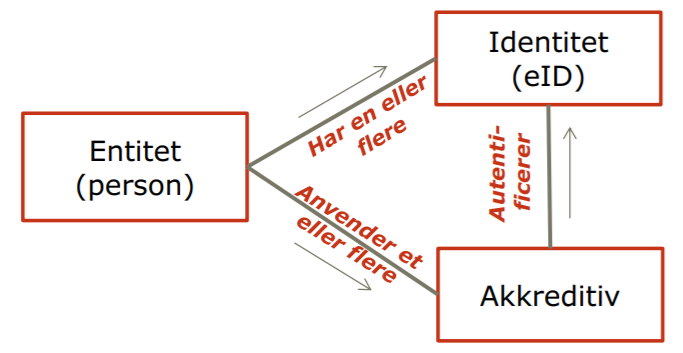

Der er mange tiltag for at reducere antallet af identiteter, fx ved at flere tjenester tilbyder, at man kan bruge sin Facebook-identitet eller Google-identitet.

Et andet tiltag er NemID, som er etableret med henblik på anvendelse i stort set alle offentlige tjenester og hos bankerne. NemID kan også bruges hos mange private tjenester, fx pensionskasser, forsikringsselskaber, fagforeninger mv.

**Om relationen entitet – elektronisk identitet i fællesoffentlig brugerstyring**

I fællesoffentlig brugerstyring har der indtil nu været arbejdet med, at en entitet kan have flere elektroniske identiteter:

- En privat NemID
- En eller flere NemID Erhverv tilknyttet forskellige virksomheder.

Særligt for små erhvervsdrivende har det været utilfredsstillende at skulle håndtere to eller flere akkreditiver som følge af den nuværende models stærke binding mellem identiteter og akkreditiver, som er implementeret i NemID. Derfor har der i næste generation NemID været arbejdet med at finde løsninger på dette. Der har været to grundlæggende modeller til overvejelse for fællesoffentlige løsninger og dermed for NDIS:

- En løsning med kun en identitet pr. entitet
- En løsning med flere identiteter pr. entitet.

**En løsning med kun en identitet pr. entitet**

I denne løsning er der kun en identitet pr. entitet. Identiteten karakteriseres ved attributter. Nogle er tæt knyttet til den fysiske person som fx navn, adresse og CPR. Andre attributter udtrykker de rettigheder, som identiteten tildeles til at tilgå funktioner eller informationer. Skal entiteten tilgå løsninger som borger og som ejer af virksomhed eller medarbejder, udtrykkes det ved forskellige sæt af attributter.

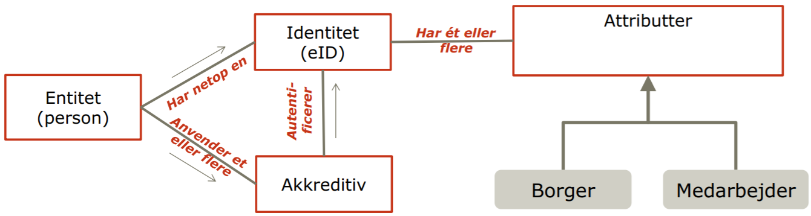

Fordelene ved denne model:

• Den enkelte person skal kun have en elektronisk identitet og dermed et NemID.
• Forskellige attributsæt for personrettigheder karakteriserer de rettigheder, som en person har, når de optræder i forskellige kontekster; det man også kan kalde roller.

Ulemperne ved denne model:

• For en række personer vil det være en ulempe kun at have en elektronisk identitet, fx hvis personen arbejder for mange virksomheder, så det kan være vanskeligt at skelne mellem rollerne, hvis det er den samme funktion og dermed det samme attributsæt, personen har.
• Alle tjenester skal fra implementeringstidspunktet kunne understøtte, at valg af identitet kun sker gennem at registrere en og kun en NemID og ikke kan ske på anden måde.
• Der kan ikke vælges at danne identiteter med tilhørende akkreditiver, der kan afspejle virksomheders forskellige ønsker til fx sikringsniveau eller funktionalitet, fx som i sundhedssektoren, hvor der ønskes akkreditiver, der kan anvendes i klinisk kontekst.

**En løsning med flere identiteter pr. entitet**

I denne løsning kan hver entitet have flere elektroniske identiteter til fællesoffentlig brugerstyring. Skal entiteten tilgå løsninger som borger og som ejer af virksomhed eller medarbejder, sker det med forskellige identiteter. Nu er det identitetsattributter, der adskiller, om det er en identitet for en borger eller en medarbejder.

Løsningen svarer til den model, der anvendes i det nuværende NemID (i 2016).

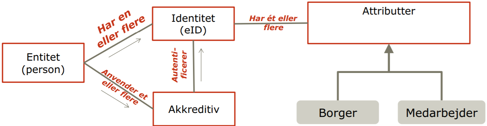

For at løsningen med flere identiteter pr. entitet tilgodeser brugerbehov, kan modellen implementeres, så en entitet kan anvende sit akkreditiv (fx NemIDnøglekortet) til flere identiteter.

Det sker på to måder:

11. For borgere, der er ejere af enkeltmandsvirksomheder eller er tegningsberettigede, kan det offentlige tilbyde brug af borgerakkreditiver i forbindelse med erhvervsidentiteten.
- Konceptuelt sker det ved, at en elektronisk identitet (erhvervsidentiteten)
dannes på grundlag af en anden elektronisk identitet (borgeridentiteten).
Fx en ny virksomhedsejer med automatisk CVR-opmærkning. Identiteten
kan bevares over tid eller være dynamisk.
- Denne løsning implementeres fra februar 2017 i fællesoffentlig brugerstyring.
12. Der dannes en separat erhvervsidentitet med egne attributter. Denne erhvervsidentitet bevares over tid, uafhængigt af akkreditiver. Det betyder, at
der kan skiftets akkreditiv, uden at der skal administreres en ny identitet med
tilhørende rettigheder.

For virksomheder betyder modellen, at de kan vælge mellem borgerens akkreditiver eller at foranledige brug af en erhvervsidentitet med akkreditiver med andre styrker. Virksomheder kan skifte mellem alternativerne løbende og stadig bevare samme erhvervsidentitet. Løsningen muliggør, at både borger og virksomhed kan vælge, om borgeridentiteten kan anvendes til erhvervsformål. Løsningen kan implementeres med begge valgmuligheder eller således, at kun den ene part (fx virksomheden) kan vælge.

## 13. Bilag D: Liste over krav (SKAL, BØR,KAN)

| 5. Begrebsmodel | Fællesoffentlige løsninger | Tværoffentlige brugerstyringsløsninger | Tjenester der anvender disse | Andre offentlige løsninger |
|---------------------------------------------------------------------------------------------------------------------------------------------------------------------------------------------------------------------------------------------------------------------------------------------------------------------------------------------------------------------------------------------------------------------------------------------------------------------------------------------------------------------------------------------------------------------------------------------------------------------------------------------------------------------------------------------------------------------------------------------------------------------------------------------------------------------------------------------------------------------------------------------------------------------------------------------------------------------------------------------------------------|----------------------------|----------------------------------------|------------------------------|----------------------------|
| Begrebsmodellen SKAL anvendes i fællesoffentlige løsninger, i løsninger der kommunikerer mellem offentlige sektorer og i tjenester der anvender fællesoffentlige løsninger. Begrebsmodellen KAN efterkommes af løsninger i offentlige sektorer. Bruger man andre termer for begreberne inden for sin egen sektor, SKAL man kunne oversætte eller transformere disse entydigt til de autoritative termer, når man kommunikerer verbalt eller digitalt på tværs af offentlige sektorer. Dette vil sikre bedre forståelse og kommunikation mellem forskellige sektorer om brugerstyring uden at fratage dem retten til at beholde egne velfungerende termer | SKAL | KAN | N/A | N/A |
| **6. Byggeblokke** |  |  |  |  |
| Opbygning af brugerstyring med byggeblokkene Registrering af elektronisk identitet, Akkreditivtilknytning, Attributbeskrivelse, Autentifikation, Billetudstedelse og Adgangskontrol BØR efterkommes i fællesoffentlige løsninger, i tværoffentlige brugerstyringsløsninger og i tjenester, der anvender disse. Dette afsnit KAN efterkommes af andre løsninger i offentlige sektorer | BØR | BØR | BØR | KAN |
| **7. Processer** |  |  |  |  |
| Den tekniske opbygning af brugerstyring med opdeling i klart adskilte delprocesser og arbejdsdeling mellem aktørerne i administrative processer og autentifikation, billetudstedelse og adgangskontrol samt kontrol og rapportering BØR efterkommes i fællesoffentlige løsninger, i tværoffentlige brugerstyringsløsninger og i tjenester der anvender disse. Dette afsnit KAN efterkommes af løsninger i offentlige sektorer | BØR | BØR | BØR | KAN |
| **8 Teknisk arkitektur**  **8.1 Teknisk målarkitektur** |  |  |  |  |
| Den tekniske målarkitektur BØR efterkommes i fællesoffentlige løsninger, i løsninger der kommunikerer mellem offentlige sektorer og i tjenester der anvender fællesoffentlige løsninger. Den tekniske målarkitektur KAN efterkommes af løsninger i offentlige sektorer | BØR | BØR | BØR | KAN |
| **8.2 En målarkitektur med identitetsbrokere** |  |  |  |  |
| Arkitektur med identitetsbrokere SKAL efterkommes i fællesoffentlige løsninger, mens øvrige løsninger i offentlige sektorer BØR efterkomme ovenstående. | SKAL | BØR | BØR | BØR |
| Identitetsbrokere BØR kommunikere sikringsniveauet (eng: Level of Assurance) for autentifikationen ved at indlejre en attribut i billetten, som angiver dette (hvor niveauet typisk er defineret i et trust framework som fx National Standard for Identiteters Sikringsniveau (NSIS)). Dette gælder for fællesoffentlige løsninger og tværoffentlige brugerstyringsløsninger. | BØR | BØR | N/A | N/A |
| **8.3 Sikkerhed i den tværoffentlige brugerstyring** |  |  |  |  |
| Der er følgende krav til fællesoffentlige brugerstyringstjenester og forretningstjenester i den fællesoffentlige føderation. Dette er begrundet i standarder i konteksten for brugerstyring: ISO/IEC 27001, ISO/IEC 27005, EU’s General Data Protection Regulation (GDPR) og den danske persondatalov:    - Tjenesteudbyder SKAL styre sikkerheden i egen tjeneste i forhold til fortrolighed, integritet og tilgængelighed    - Tjenesteudbyder SKAL sikre, at udveksling af data (indgående og udgående) sker med tilstrækkelig sikkerhed    - Tjenesteudbyder SKAL gennemføre risikovurderinger af, hvordan tjenestens placering i føderationen påvirker tjenestens sikkerhed   – og hvordan tjenesten påvirker andre tjenesters sikkerhed og gennemføre de nødvendige tiltag   - Tjenesteudbyder SKAL i relevant omfang informere andre aktører i føderationen om risikovurderinger og sikkerhedshændelser.     Ovenstående regler SKAL følges af brugerstyringstjenester og forretningstjenester i andre føderationer.  | SKAL | SKAL | SKAL | SKAL |

| 9 Implementering 9.1 Registrering af identiteter 9.1.1 Standarder for registrering af identiteter | Fællesoffentlige løsninger | Tværoffentlige brugerstyringsløsninger | Tjenester der anvender disse | Andre offentlige løsninger |
|-------------------------------------------------------------------------------------------------------------------------------------------------------------------------------------------------------------------------------------------------------------------------------------------------------------------------------------------------------------------------------------------------------------------------------------------------------------------------------------------------------------------------------------------------------------------------------------------------------------------------------------------------------------------------------------------------------------------------------------------------------------------------------------------------------------------------------------------------------------------------------------------------------------------------------------------------------------------------------------------------------------------------------------------------------------------------------------------------------------------------------------------------------------------------------------------------------------------------------------------------------------------------------|----------------------------|----------------------------------------|------------------------------------------------------|----------------------------|
| Brug af National Standard for Identiteters Sikringsniveau (NSIS) SKAL efterkommes i fællesoffentlige løsninger og i løsninger, der anvender disse. En identitetsløsning BØR fastlægge et krævet NSIS sikringsniveau ”Begrænset”, ”Lav”, ”Betydelig” eller ”Høj” i forhold til anvendte akkreditiver og den samlede livscyklus. Dette muliggør en lettere integration mellem systemer, idet sikringsniveauer er umiddelbart sammenlignelige. | SKAL | BØR | SKAL | BØR |
| Ved udstedelse af certifikater BØR semantik fra ETSI EN 319412-1 anvendes og det skal overvejes om navngivning af brugere med fordel KAN genbruge denne semantik også uden for en certifikat-kontekst. Dette gælder særligt i de situationer, hvor brugere skal kunne tilbydes certifikater til signering, hvorved navngivning er ens for en indledende autentifikation og den efterfølgende signering. | BØR | KAN | KAN | KAN |
| Dansk Standard DS 844 er en alternativ standard for navngivning i certifikater. Denne SKAL FORLADES i nye løsninger, da den ikke i tilstrækkelig grad er fremtidssikret i en international sammenhæng. | SKAL FORLADES | SKAL FORLADES | SKAL FORLADES | SKAL FORLADES |
| **9.2 Akkreditiver** |  |  |  |  |
| Af hensyn til forsyningssikkerheden og grundlaget for digitaliseringen, SKAL det offentlige etablere mindst én generel registreringstjeneste og én generel akkreditivudsteder i økosystemet – samtidig med at der er åbent for alternative løsninger. | SKAL | N/A | N/A | N/A |
| Understøttelse af notificerede eID-løsninger fra andre EUlande SKAL ske gennem national eID Gateway, der stilles til rådighed af Digitaliseringsstyrelsen. Løsninger, der skal servicere andre EU-borgere, SKAL afsøge muligheden for at anvende eID Gateway’en til dette formål. | SKAL |  | SKAL (Løsninger, der skal servicere andre EUborgere) | N/A |
| **9.3 Attributter** |  |  |  |  |
| Attributtjenester BØR udstille deklaration af kvaliteten af attributter, således at tjenester, der anvender attributter, har den nødvendige information om kvalitet. | BØR | BØR | BØR | BØR |
| Fællesoffentlige brugerstyringstjenester og forretningstjenester i fællesoffentlige føderationer, der anvender attributter SKAL vurdere om kvaliteten af attributter svarer til tjenestens behov. | SKAL | SKAL | SKAL | SKAL |
| Nye forretningstjenester (og moderniseringer af eksisterende) tjenester, der anvender fællesoffentlige løsninger, BØR benytte et design, hvor CPR-nummeret kan skifte form uden at tjenestens forretningslogik bryder sammen. | BØR | BØR | BØR | BØR |
| **9.4 Brugerkataloger** |  |  |  |  |
| **9.5 Autentifikation**  **9.5.1 Standarder for overførsel af autentificerede brugere** |  |  |  |  |
| I dag anvender NemID XMLDSig i forbindelse med autentifikation, hvor særligt det indlejrede OCES certifikat er kilde til attributter om brugeren. XMLDSig BØR FORLADES fremadrettet og ikke danne grundlag for en fødereret løsning, idet der findes protokoller, der i højere grad er velegnede til dette formål. | SKAL FORLADES | SKAL FORLADES | SKAL FORLADES | SKAL FORLADES |
| OIOSAML og OIO Basic Privilege Profile har status af anbefalede fællesoffentlige standarder og BØR som minimum følges, når der er behov for håndtering af eksterne brugere i web applikationer. Dette gælder for fællesoffentlige løsninger og tjenester der anvender fællesoffentlige løsninger | BØR | BØR | BØR | KAN |
| For fællesoffentlig infrastruktur BØR standarden OpenID Connect på kort til mellemlang sigt tilbydes som et supplement til SAML 2.0 services, således at de forretningstjenester, der har behov for det, kan udnytte de nye muligheder – men uden at alle tvinges til det. | BØR | KAN | KAN | KAN |
| **9.6 Login tjenester/Identitetsbrokere** |  |  |  |  |
| For at opnå en sikker og omkostningseffektiv integration for tjenesteudbydere og for at understøtte konkurrencen på markedet, SKAL en identitetsbroker som minimum udstille en eller flere veldefinerede åbne og standardiserede interfaces til tjenesteudbydere. Dette kan typisk være et SAML2 (som kendes fra NemLog-in) og/eller OpenID Connect. | SKAL | KAN | KAN | KAN |
| Tilsvarende SKAL der stilles veldefinerede interfaces til rådighed for digital signering. | SKAL | KAN | KAN | KAN |
| Der SKAL fortsat være en broker som NemLog-in i den fællesoffentlige brugerstyringsinfrastruktur. | SKAL | N/A | N/A | N/A |
| **9.6.1 Standarder for kommunikation mellem føderationer** |  |  |  |  |
| **9.7 Fælles løsning til fuldmagter** |  |  |  |  |
| I henhold til arkitekturprincipperne om at genbruge løsninger og anvende fælles standarder, BØR, fuldmagtsløsningen anvendes for borgerrettede løsninger, der finansieres og fungerer inden for den offentlige sektor. | N/A | BØR | BØR | BØR |
| **9.8 Brugerstyring for tjenestekonsumenter og fysiske apparater og sensorer**  **9.8.1 Standarder for identitetsbaserede web services** |  |  |  |  |
| Profilerne for identitetsbaserede web services(https://digitaliser.dk/resource/526486) består af: OIO WS-Trust Profile (profil til at anmode om security token) OIO WS-Trust Deployment Profile (profil til at anmode om security token) OIO Profile for Identity Tokens (profil for token udformning i web service kald) OIO Bootstrap Token Profile (profil for veksling af Web SSO session til token ifm. systemkald) Liberty Basic SOAP Binding (profil af WS-Security til sikring af SOAP-baserede web service kald med SAML Token) OIO IDWS Rest Profile (profil til sikring af REST-baserede web service kald med SAML Token) For disse standarder gælder, at de BØR følges ved etablering af system-til-system kommunikation, hvor kaldet sikres med en adgangsbillet (et security token) i henhold til denne referencearkitekturs principper, frem for en punkt-til-punkt integration. Dette gælder for fællesoffentlige løsninger og løsninger, der kommunikerer mellem offentlige sektorer. Kommunikation til fra/web services med følsomt indhold, der ønskes sikret med security tokens, BØR baseres på profilerne Liberty Basic SOAP Binding (dennes efterfølger OIO IDWS SOAP Binding) eller OIO IDWS Rest Profile ved ekstern kommunikation over Internettet. | BØR | BØR | BØR | BØR |
