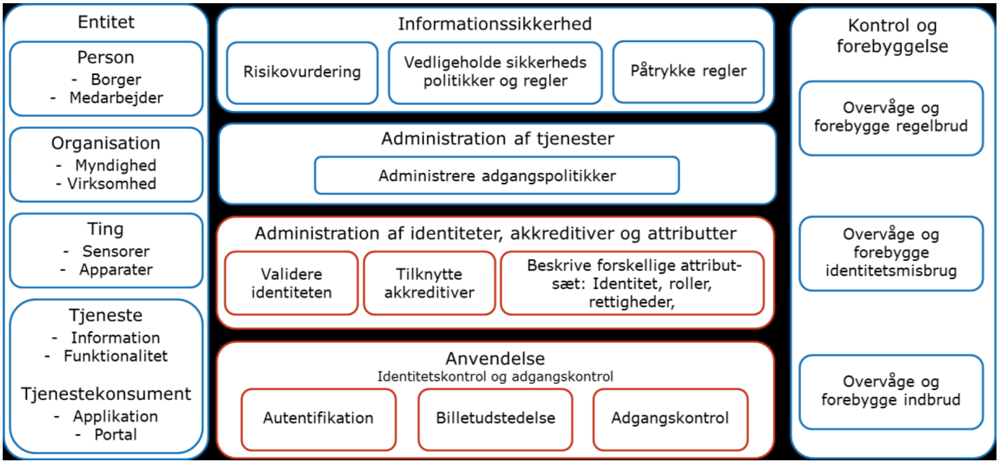

# Fællesoffentlig referencearkitektur for brugerstyring
Brugere fuldmagter, delegering, rettigheder og adgangskontrol

# I Referencearkitektur

## 1. Indledning

### 1.1 Formål og scope
Denne referencearkitektur er udarbejdet i sammenhæng med den fællesoffentlige
strategi for brugerstyring og for at understøtte implementeringen af Den fællesoffentlige digitaliseringsstrategi 2016-2020. Målet er, at referencearkitekturen skal
fungere som et teknisk pejlemærke for udvikling af brugerstyringsløsninger generelt i den offentlige sektor. Dermed har den en tæt relation til den fællesoffentlige
rammearkitektur affødt af Digitaliseringsstrategiens initiativ 8.1, som indtil videre
er kommet til udtryk i ”En digitalt sammenhængende offentlig sektor: Hvidbog
om arkitektur for digitalisering”.

Den fællesoffentlige referencearkitektur for brugerstyring skal målrette, strukturere og prioritere indsatsen for at skabe sammenhængende, effektive, sikre og
brugervenlige løsninger på tværs af domæner, nationalt og transnationalt. Fokus
er således på det tværgående, dvs. adgang til tjenester på tværs af organisationer,
herunder føderering på tværs af sikkerhedsdomæner med gensidig tillid via trust
frameworks. Brugeren i brugerstyring er en entitet, der kan være en person, en
organisation, en ting, et system eller en tjeneste.

Scope for strategi og referencearkitektur for brugerstyring er offentlige tjenesteudbydere, men referencearkitekturen kan også anvendes af private. Fokus er på
brugerstyring i forhold til offentlige tjenester – herunder adgang på tværs for
såvel borgere som offentlige og private brugerorganisationer.

Scope omfatter også rollen som leverandør af brugerstyringstjenester (registreringstjenester, akkreditivtjenester, autentifikationstjenester, identitetsbrokere,
attributtjenester mv.) i forhold til offentlige tjenester med både offentlige og private leverandører. Det omfatter desuden private virksomheders mulighed for at
anvende bruger- og rolledata og login-systemer.

Scope omfatter både brugeradministration og adgangskontrol, herunder det der
på engelsk betegnes Credential and Identity Management (CIM), Identity Rights
Management (IRM), Access Control (AC) og Identity and Access Management
(IAM/IdAM).

Den foreliggende udgave af referencearkitekturen for brugerstyring behandler
ikke de særlige aspekter ved ting, tjenester og systemer, og dermed er NonPerson Entities (NPE) ikke i scope for nuværende udgave.

Parallelt med arbejdet på referencearkitekturen er der igangsat analyser af hhv.
fuldmagt og samtykke, med henblik på at afdække behov og muligheder inden
for disse områder. Dermed er disse heller ikke i scope for nærværende udgave af
referencearkitekturen.

Referencearkitekturens formål er at skabe en arkitekturmæssig ramme for, hvordan man skal indrette løsninger, så systemer understøttet af en sikkerhedsløsning
kan kommunikere med systemer og tjenester understøttet af en anden sikkerhedsløsning. Herved bliver interoperabilitet lettere at etablere og drive, så brugerne undgår at skulle logge på flere gange, og så oplysninger om brugere ikke
skal vedligeholdes flere steder.

### 1.2 Resumé

De senere års udvikling på brugerstyringsområdet har medført, at der er etableret
en række løsninger i samarbejde mellem interessenter. Disse løsninger sikrer
sammenhæng inden for afgrænsede delområder, men der findes ikke en overordnet sammenhæng i initiativer og løsninger.

Situationen er i dag præget af, at der er flere forholdsvis ukoordinerede løsninger
(NemID/NemLog-in, SOSI-STS på sundhedsområdet, KOMBITs brugerstyring, WAYF på undervisningsområdet, Miljøportalen m.fl.). Der findes ikke den
sammenhængende tværoffentlige strategi og governance, der i stigende grad efterlyses fra flere sektorer. Der er overlap, sub-optimering og dublering af løsninger med økonomiske konsekvenser. Der er stor usikkerhed hos myndigheder i
forbindelse med it-investeringer – særligt i forbindelse med udbud, hvor der er
brug for at kravspecificere løsninger, der skal kunne holde fem til seks år. Her er
der behov for at kende retningen, man skal orientere sig imod.

Formålet med referencearkitekturen er således at skabe **rammer** for brugerstyring og dermed skabe grundlag for, at parterne kan udvikle brugerstyring på
tværs.

Brugerstyring dækker opgaver og funktioner i forbindelse med håndtering af
brugere i forhold til digitale løsninger, som kan opdeles i administrative funktioner og adgangskontrol. De administrative funktioner omfatter oprettelse, ændring og nedlæggelse af brugere i brugerstyringssystemer, tilknytning af akkreditiver til brugere og tilknytning af rettigheder til brugere.

Hovedaktiviteterne i **administration i brugerstyring (adm., brugeradm.)** er
følgende:
- **Registrering** af entiteters elektroniske identiteter (eID) og den løbende vedligeholdelse heraf.
- **Akkreditivtilknytning** af akkreditiver til et eller flere eID og den løbende
vedligeholdelse heraf. Akkreditivet anvendes af entiteten til at bevise sin identitet over for en tjeneste, man vil have adgang til.
- **Attributbeskrivelse** af karakteristika ved entiteten, som en tjeneste kræver
for at give adgang, og den løbende vedligeholdelse heraf. Det er fx rettighedsrelevante attributter i form af roller og/eller andre attributter, der udtrykker kvaliteter ved entiteten, som en tjeneste forlanger at kende for at give
adgang.

Hovedaktiviteterne i **anvendelse af brugerstyring (anv.)** er følgende:
- **Autentifikation** af entiteten, der ønsker adgang til tjenester, dvs. validering
af entitetens identitet på grundlag af de fremviste akkreditiver.
- **Billetudstedelse,** der på grundlag af den autentificerede eID udsteder en
adgangsbillet (eng: Security Token) med det sæt attributter, som tjenesten
kræver for at give adgang. I denne proces kan der ske en veldefineret og entydig omveksling mellem tekniske formater for akkreditiver eller attributter,
således at tjenesten er i stand til at læse adgangsbilletten. Har entiteten ikke
fået tildelt de nødvendige beskrivende attributter i det rette format, vil entiteten ikke opnå adgang hos tjenesten.
- **Adgangskontrol,** som er håndhævelse af en tjenestes adgangspolitik. Det
styrer, hvilke handlinger entiteten må udføre på en tjeneste, eller hvilke informationer entiteten må få adgang til på grundlag af den adgangsbillet, entiteten møder op med.

Har en brugeradministration udstyret en entitet med det akkreditiv og den attributbeskrivelse, en tjeneste kræver, vil anvendelse af brugerstyring give adgang til
tjenestens ressourcer, typisk i form af funktioner eller informationer i itsystemer.

Referencearkitekturen for brugerstyring fastlægger en række principper for at
styre frem mod en fælles forretnings- og it-arkitektur for det offentliges elektroniske identiteter, akkreditiver, attributbeskrivelser, autentifikation, billetudstedelse og adgangskontrol:

#### Principper

*Principper med brugerfokus:*
1. Brugerne oplever en sammenhængende adgangsstyring
2. Brugerstyringsløsninger udvikles med fokus på brugernes behov
3. Brugerstyringsløsninger respekterer brugernes privatliv
Principper med teknisk fokus:
4. Aktører indgår i føderationer baseret på tillid
5. Aktører i føderationer vurderer i deres styring af informationssikkerhed
samspillet med andre aktører
6. Administration af brugere flyttes så vidt muligt ud af fagapplikationer
7. Tjenesteudbyder (den dataansvarlige) har ansvaret for at håndhæve brugernes adgange

*Principper med udviklingsfokus*
8. Brugerstyring realiseres i løst koblede komponenter
9. Tværoffentlige brugerstyringsløsninger baseres på en kerne af fælles komponenter i samspil med øvrige komponenter i infrastrukturen
10. Tværoffentlig brugerstyring etableres i overensstemmelse med internationale standarder og løsninger

Forretningsbehov og ovenstående principper peger entydigt frem mod en løst
koblet, fødereret arkitektur, hvor de enkelte tjenester/tjenesteudbydere håndhæver adgang baseret på forudgående (ekstern) autentifikation og således ikke selv
håndterer administration af brugere, anvendersystemer og rettigheder.

Der er derfor valgt en token-baseret model for adgangsstyring. Denne indebærer,
at brugere og systemer efter autentifikation får udstedt en adgangsbillet, et såkaldt Security Token, af en betroet komponent i infrastrukturen. Adgangsbilletten præsenteres herefter over for den tjeneste, som leverer data eller funktionalitet, der ønskes adgang til. En adgangsbillet indeholder information om brugerens
eller en tjenestekonsuments identitet, om brugerens karakteristika i form af attributter samt tildelte adgangsrettigheder. Den kan desuden være digitalt signeret af
den betroede udsteder, så den ikke kan forfalskes eller manipuleres.

Digitalisering kræver informationssikkerhed, og brugerstyring er et af midlerne til
at sikre det valgte niveau af informationssikkerhed. Deraf følger, at det er en
forudsætning, at brugerstyring har et tilstrækkeligt højt sikkerhedsniveau både for
de enkelte komponenter i brugerstyring og for de samlede brugerstyringsløsninger.

I referencearkitekturen fastlægges en række standarder for registrering af brugere,
akkreditiver og attributter. Der er behov for standarder for overførsel af data om
autentificerede brugere mellem autentifikationstjenester, login-tjenester/brokere
og tjenester. Der er behov for standarder i forbindelse med rettighedsrelevante
attributter, og der er behov for standarder for kommunikation mellem føderationer. Dette behandles i afsnit 9.6.1.

### 1.3 Hvad er en referencearkitektur
En referencearkitektur giver både myndigheder og virksomheder fælles pejlemærker for fremadrettet udvikling i forbindelse med videreudvikling og nyanskaffelser. Med denne referencearkitektur gælder det for både virksomheder og
myndigheder i deres forskellige roller:
- som brugerorganisationer og arbejdsgivere
- som tjenesteudbydere og udbydere af brugerstyringstjenester.

En referencearkitektur er en fælles referenceramme for den måde, der bygges
løsninger på inden for et specifikt område. Den beskriver de forretningsmæssige
visioner og mål, og den fastlægger principper og begreber. Den beskriver, hvordan man kan realisere de egenskaber, som der er behov for både på forretningsniveau og på teknisk niveau.

En referencearkitektur er en beskrivelse på konceptuelt og logisk niveau. Referencearkitekturen for brugerstyring er styrende for arbejdet med tværoffentlig
brugerstyring og kan ligeledes være vejledende for arbejdet med brugerstyring i
sektorer, myndigheder og virksomheder. Dette er specificeret gennem anvendelse af termerne SKAL, BØR, KAN, hvis betydning er fastlagt i afsnit 1.3.1.

#### 1.3.1 Referencearkitekturen er både vejledende og regelsættende
Referencearkitekturen er som fælles referenceramme styrende for arbejdet med
tværoffentlig brugerstyring og kan ligeledes være vejledende for arbejdet med
brugerstyring i sektorer, myndigheder og virksomheder.

På nogle områder indeholder referencearkitekturen krav og anbefalinger:
- Afsnit angivet med “SKAL” er krav, som skal efterkommes af offentlige
myndigheder i Danmark.
- Afsnit angivet med “BØR” er anbefalinger, som bør efterkommes af offentlige myndigheder, men der er ikke krav om det. Efterkommer man det ikke,
SKAL man give en begrundelse for ikke at gøre det ud fra et ”følg eller forklar”-princip.
- Afsnit angivet med ”KAN” er vejledende, som myndighederne kan efterkomme efter behov.

Referencearkitekturens krav og anbefalinger gælder, når der er tale om nyudvikling eller større ændringer. Der kan være andre regelsæt, der kræver bagudrettede
ændringer

Der vil være forskelle med hensyn til, hvem et SKAL/BØR/KAN gælder for.
Referencearkitekturen skelner mellem følgende:
- **Fællesoffentlige løsninger.** Det er løsninger, der er finansieret og specificeret gennem en fællesoffentlig aftale fx det fællesoffentlige eID (pt. NemID),
NemLog-in og Digital Post.
- **Tværoffentlige brugerstyringsløsninger.** Det er løsninger, der anvendes af
flere myndigheder og er finansieret på anden måde end gennem fællesoffentlig aftale fx Uni*Login, Miljøportalen, WAYF, Kommunerne, Sundhed.
- **Tjenester der anvender fællesoffentlige og tværoffentlige løsninger,** og
som er rettet mod borgere og virksomheder som slutbrugere. Eksempler er
borger.dk, virk.dk, sundhed.dk og kommunale tjenester.
- **Løsninger der finansieres og fungerer inden for en offentlig sektor.** Det
omfatter både løsninger til brugerstyring i myndigheder og fx fagsystemer i
myndigheder.

For hvert afsnit angives en af følgende formuleringer:

- Dette afsnit SKAL/BØR/KAN efterkommes i fællesoffentlige løsninger.
- Dette afsnit SKAL/BØR/KAN efterkommes i tværoffentlige brugerstyringsløsninger.
- Dette afsnit SKAL/BØR/KAN efterkommes i tjenester, der anvender
fællesoffentlige og tværoffentlige løsninger.
- Dette afsnit BØR/KAN efterkommes af løsninger i offentlige sektorer.

Referencearkitekturen vil give status for standarder mv. På arkitekturguiden.digitaliser.dk vil der være oplysninger om konkrete standarder, efterhånden som de beskrives og fastlægges.

### 1.4 Metoderamme

Denne version af referencearkitekturen anvender OIO Arkitekturmetoden (OIO
EA) som metoderamme.

Referencearkitekturen er generelt søgt udarbejdet således, at den er så konsistent
som muligt med andre fællesoffentlige arkitekturdokumenter og standarder udarbejdet i OIO-regi.

Referencearkitekturen bygger på etablerede fællesoffentlige arkitekturprincipper,
aftaler og retningslinjer vedrørende deling af data og anvendelse af åbne standarder.

Det bemærkes, at der i regi af Digitaliseringsstrategiens initiativ 8.1 pågår en opdatering af den fællesoffentlige rammearkitektur. Fremtidige udgaver af referencearkitekturen for brugerstyring vil blive koordineret med den fællesoffentlige
rammearkitektur og tage højde for andre relevante afhængigheder.

### 1.5 Anvendelse

Referencearkitekturen har overordnet set tre anvendelseskontekster: standardisering, løsningsprojekter og etablering af føderationer.

Referencearkitekturen skal anvendes til at udpege standarder, der understøtter
skabelsen af sammenhængende, effektive, sikre og brugervenlige løsninger på
tværs af sektorer, nationalt og transnationalt. Referencearkitekturen fokuserer på
at rammesætte, kravsætte og vejlede fællesoffentlige digitale løsninger, løsninger
mellem offentlige sektorer, løsninger for tjenester, der skal anvende fællesoffentlige tjenester, og er vejledende for digitale løsninger inden for sektorer.

Referencearkitekturen skal understøtte udarbejdelse af løsningsarkitektur i konkrete projekter. Den kan anvendes i forbindelse med kravspecificering af løsninger, og den kan anvendes i forbindelse med specificering af standardiserede snitflader mellem systemer, der skal håndtere de enkelte tjenester i den tværoffentlige brugerstyring. Referencearkitekturen anviser ikke i detaljer, hvordan myndigheder og virksomheder skal bygge løsninger, men fastlægger rammer og standarder for løsninger.

Referencearkitekturen definerer, hvad en føderation omhandler i rammerne af
brugerstyring, og den beskriver de opgaver, en føderation løser i denne ramme. Etablering af en føderation sker gennem fastlæggelse af et aftalesæt mellem føderationens deltagere.

Referencearkitekturen kan anvendes i sammenhæng med andre fællesoffentlige
referencearkitekturer.
Generelt kan en referencearkitekturs rolle illustreres med følgende figur:

### 1.6 Målgruppe

Dette dokument har to målgrupper:

- Den ene målgruppe er strategiske beslutningstagere inden for digitalisering
og it, typisk digitaliseringschefer, it-chefer, afdelings- og kontorchefer og andre med rollen som systemejer.
- Den anden målgruppe er projektledere, arkitekter og udviklere hos myndigheder, virksomheder og leverandører, der har til opgave at kravspecificere og
designe løsninger, hvor der indgår eller anvendes tværoffentlig brugerstyring.

### 1.7 Publicering og relaterede dokumenter

Referencearkitekturen publiceres på arkitektur.digst.dk, hvor man kan finde beslægtede dokumenter vedrørende brugerstyring, herunder relaterede standarder
mv.

### 1.8 Læsevejledning

Afsnit 1-5 bør læses af alle.
Afsnit 2 giver en introduktion til brugerstyringsdomænet og kan springes over af
læsere med kendskab til domænet og dets begreber.
Afsnit 6-10 henvender sig særligt til løsningsarkitekter.

I referencearkitekturen anvendes nogle begreber, som her beskrives for at lette
læsningen.

| Begreb                       | Forklaring                                                                                                                                                                      |
|------------------------------|---------------------------------------------------------------------------------------------------------------------------------------------------------------------------------|
| Entitet                      | Et subjekt/en bruger som skal have adgang til en tjeneste. I denne version betragtes kun fysiske personer, som evt. kan være associeret med en juridisk person, som en entitet. |
| (elektronisk) identitet, eID | En digital persona repræsenteret ved et sæt af attributter                                                                                                                      |
| Det fællesoffentlige eID     | En elektronisk identitet, et eID, der svarer til det nuværende NemID.                                                                                                           |
| Forretningstjeneste          | En tjeneste der løser et forretningsmæssigt behov, fx en borgerrettet selvbetjeningsløsning.                                                                                    |

Begreber uddybes i referencearkitekturens bilag A (ordliste). Øvrige begreber der
introduceres, forklares undervejs.

*Afsnit 1. Indledning*
Giver et samlet overblik over dokumentet inkl. resumé, formål, scope, metode
og anvendelse.

*Afsnit 2. Beskrivelse af brugerstyringsdomænet*
Beskrivelse af domænet, herunder de centrale opgaver: registrering, autentifikation, billetudstedelse, adgangspolitik og adgangskontrol.

*Afsnit 3. Forretningsmæssige behov*
En gennemgang af de forretningsbehov der danner grundlag for udarbejdelsen af
referencearkitekturen.
- Behov hos personer – både som borgere og medarbejdere
- Behov hos virksomheder og myndigheder som brugerorganisationer og arbejdsgivere
- Behov hos virksomheder og myndigheder som tjenesteudbydere og som
udbydere af brugerstyringstjenester.

*Afsnit 4. Principper*
Dette afsnit formulerer rammer for de egenskaber, som fremtidige løsninger
inden for offentlig brugerstyring skal have. Disse rammer skal sikre, at alle de
forskellige løsninger der er behov for, samlet set bringer brugerstyring i Danmark frem mod de mål og de gevinster, den nationale strategi for brugerstyring
fastlægger. Rammerne formuleres som principper, som alle projekter og programmer skal orientere sig efter og enten følge eller forklare.

*Afsnit 5. Begrebsmodel*
I dette afsnit beskrives en terminologi og en begrebsmodel for brugerstyring.
Begrebsmodellen er på et generelt og overordnet konceptuelt niveau. Dvs. at den
ikke er bundet til en bestemt type organisation, anvendelse eller implementering.

*Afsnit 6. Byggeblokke*
I dette afsnit beskrives de byggeblokke, der skal være til stede for at kunne realisere de løsninger, der lægges op til med referencearkitekturen.

*Afsnit 7. Processer*
Dette afsnit viser med nogle eksempler, hvordan tjenesternes interfaces kan benyttes til understøttelse af forskellige typiske brugssituationer.

*Afsnit 8. Teknisk arkitektur*
Dette afsnit beskriver den systemtekniske målarkitektur, de væsentligste komponenter og anbefalede standarder.

*Afsnit 9. Implementering*
Dette afsnit beskriver konkret, hvordan referencearkitekturen implementeres, og
der fastlægges krav og anbefalinger.

**Figurernes farvekoder**
I referencearkitekturen indgår en række figurer. I disse indgår både brugerstyringsdomænets elementer og sammenhænge med andre domæner. I figurerne er
brugerstyringsdomænets elementer vist med rødt og andre domæners elementer
med blåt.

**Sprog**
Der anvendes som hovedregel danske ord, men der henvises også til de engelske
ord for at skabe sammenhæng til internationale begreber på brugerstyringsområdet.

### 1.9 Definitioner og begreber
Se Afsnit 4 og Bilag A: Ordliste

## 2. Beskrivelse af brugerstyringsdomænet

>Brugerstyring dækker opgaver og funktioner i forbindelse med håndtering af brugere i forhold til digitale løsninger. Det inkluderer oprettelse,
ændring og nedlæggelse af entiteter (personer, organisationer, tjenester
eller ting) i brugerstyringssystemer, tilknytning af akkreditiver og rettigheder til brugere og tildeling af adgang til ressourcer, typisk itsystemer. Brugerstyring er en fælles betegnelse for, hvordan en organisation fastlægger, håndterer og teknologisk sikrer, at kun brugere med de
rigtige akkreditiver og karakteristika får adgang, og alle andre afvises.

Figuren herunder viser de væsentligste elementer i brugerstyring (røde kasser) og
de aktører, der er omfattet af eller anvender brugerstyring (blå kasser).

Informationssikkerhed (øverste niveau i midten) forvaltes af de dele af organisationen, der kan afgøre, hvilke risici organisationen vil gardere sig imod og på
hvilket niveau.

Administration (konfigurering) af tjenester (næstøverste niveau i midten) omfatter udarbejdelse og vedligeholdelse af adgangspolitikker for tjenester i overensstemmelse med informationssikkerhedspolitikkerne. Adgangspolitikkerne anvendes til at specificere, hvilke informationer som en entitet skal møde op med for
at blive lukket ind gennem adgangskontrollen. Dette anvendes i forbindelse med
registrering af entiteters rettigheder i næste niveau. Administration (konfigurering) af entiteters karakteristika (tredje niveau i midten)
anvendes til at give en entitet en konkret elektronisk identitet med de akkreditiver og det attributsæt, som giver adgang til en konkret tjeneste.  

Anvendelsesniveauet (nederste niveau i midten) gennemfører sikringen af, at
entiteten er den, vedkommende giver sig ud for at være (autentifikation). Der
udstedes en adgangsbillet, så informationen kan overføres til tjenesten. Derudover udføres adgangskontrol, hvor det afgøres om de attributter, som karakteriserer brugeren, er dem, der giver adgang til en tjenestes funktionaliteter og informationer.

En tjeneste og et it-system er i denne kontekst synonymer for det samme: et
stykke it, der kan levere informationer og funktionaliteter. Et stykke it, der optræder som leverandør, kaldes en tjeneste. Et stykke it, der optræder som den
bruger, der efterspørger informationer og funktionalitet, kaldes en tjenestekonsument. Det samme stykke it kan optræde både som leverandør (være en tjeneste) og i sin udførelse af tjenesten optræde som bruger (være en tjenestekonsument) over for andre tjenester.

Rækkefølgen i gennemgangen af elementerne svarer til rækkefølgen i mange –
men ikke alle – forløb i brugerstyring. I figuren er funktionerne beskrevet som
opdelt på flere aktører, men en aktør kan også udføre flere eller alle funktioner.

### 2.1 Informationssikkerhed

Fastlæggelse af niveau for og håndtering af informationssikkerhed skal foretages
af alle offentlige organisationer og tage udgangspunkt i ISO/IEC 27001-
standarden for styring af informationssikkerhed. Dette skal ske gennem et ledelsessystem for informationssikkerhed (Information Security Management System,
ISMS). Digitaliseringsstyrelsen har udarbejdet vejledninger, værktøjer og skabeloner hertil, som er placeret her: http://www.digst.dk/Informationssikkerhed. Se
også ’Vejledning vedrørende niveauer af autenticitetssikring’
(https://digitaliser.dk/resource/363424).

Hovedindholdet i ISO/IEC 27001 er, at niveau for og håndtering af informationssikkerhed tager udgangspunkt i en risikoanalyse. Organisationens ledelse fastlægger på baggrund af en risikovurdering et sikkerhedsniveau, som svarer til den
forretningsmæssige betydning af de informationer, som organisationen ejer, vedligeholder og har dataansvaret for, og de tjenester, som den stiller til rådighed for
andre organisationer af alle typer. Organisationen skal gennemføre en afbalanceret risiko- og konsekvensvurdering under hensyntagen til de økonomiske forhold
og herudfra fastlægge de

- retningslinjer
- forretningsgange og instrukser
- sikkerhedsforanstaltninger,

som beskytter organisationen på de risikoniveauer, der er valgt. De vil ofte være
forskellige, afhængigt af de konkrete informationer og tjenester.

I en tværoffentlig brugerstyring er det nødvendigt at koordinere risikovurderinger og valg af niveau for og håndtering af informationssikkerheden. Dette sker
ved udarbejdelse af et eller flere **trust frameworks.**

For at alle parter kan have tillid til hinanden, ekspliciterer, harmoniserer og standardiserer et trust framework forskellige aspekter af sikkerhed, herunder politikker, sikkerhedsmæssige tiltag og fælles sprog. Harmonisering og standardisering
er teoretisk set ikke en nødvendighed, men konsekvensen ved ikke at harmonisere og standardisere er, at kompleksiteten af kommunikationen mellem sikkerhedsdomæner bliver meget høj. Der skal indgås individuelle aftaler mellem parterne, og disse skal kende til hinandens politikker og arbejdsgange m.m. Et trust
framework er med til at reducere denne kompleksitet.

Et fællesoffentligt trust framework giver mulighed for:

- Sammenhængende løsninger på tværs af domæner via gensidig tillid
(sammenkobling af siloer).
- En fælles forståelse samt koordinering/governance af sikringsniveauer.
- Transparens gennem tydelig beskrivelse af krav til parterne og regler for
deres adfærd.
- En flerleverandørstrategi med mulighed for private aktører - hvor det er
ønskeligt og økonomisk fordelagtigt.
- På sigt at erstatte visse dele af OCES-certifikatpolitikkerne (krav til tjenesteyderne) og sikkerhedskrav i kontrakter (fællesoffentligt eID, p.t. NemID, NemLog-in mv.)
- Certificering, der er nødvendig for tilliden

National Standard for Identiteters Sikringsniveau (NSIS), der har afsæt i eIDASforordningen, er et dansk trust framework for identitetssikring. NSIS fastlægger
fire sikringsniveauer (”Begrænset”, ”Lav”, ”Betydeligt” og ”Høj”), hvoraf de tre
højeste niveauer modsvarer eIDAS-niveauerne (”Lav”, ”Betydelig” og ”Høj”).
Niveauerne dækker hele livscyklussen for elektroniske identiteter fra registrering
til arkivering/nedlæggelse.

Risikohåndtering bør ikke tage udgangspunkt i en konkret implementering af
akkreditiver, da disse kan ændres dynamisk. I stedet skal NSIS-sikringsniveauer
indgå ved risikohåndtering i et ledelsessystem for informationssikkerhed (et
ISMS), således at dataansvarlig forholder sig til, hvilket minimumsniveau der
kræves for adgang, oprettelse, opdatering og sletning af information. Dette niveau er så bestemmende for, hvilke akkreditiver der kan anvendes til at give adgang på et givet sikringsniveau.

### 2.2 Administration af elektronisk identitet, akkreditiver og attributter

National Standard for Identiteters Sikringsniveau (NSIS) omfatter registrering,
udstedelse og håndtering af elektroniske identiteter og udstedelse af akkreditiver.
Standarden fastlægger, hvorledes følgende processer skal foregå, for at et eID
kan være sikret på et af de fire sikringsniveauer:

- Ansøgning og registrering
- Verifikation af identitet
- Levering og aktivering af akkreditiver
- Suspendering, spærring og genaktivering
- Fornyelse og udskiftning.

I brugerstyring indgår, at personer (og andre entiteter) registrerer sig, tildeles en
eID, og at der udstedes akkreditiver. **Registreringen** af identiteten varetages af
registreringstjenesten, som også verificerer identiteten. Den elektroniske identitet
kan have forskellige sikringsniveauer i forhold til, hvor sikkert brugeres identitet
verificeres (eng: identity proofing) og det generelle sikkerhedsniveau for identitetsløsningen.

> Eksempel
>>Personer registrerer selv deres Facebook-identitet, mens NemID-identiteten kan registreres af Borgerservice. Personer kan også selv ansøge om NemID-identitet på NemID.nu. Det kræver, at de kan dokumentere deres identitet med fx kørekort eller pas

Efter oprettelse af den elektroniske identitet skal et **akkreditiv** (fx kodeord, PIN,
fingeraftryk) **tilknyttes** til identiteten. Akkreditiver anvendes til at bevise identiteten i modsætning til attributter, som beskriver identiteten. En akkreditivudsteder
skal dels sikre sammenhængen mellem akkreditiver og identitet og dels stå inde
for akkreditivets sikringsniveau. Akkreditivudstederen kan knytte allerede udstedte akkreditiver til identiteten eller udstede et nyt akkreditiv og tilknytte dette til
identiteten.

>Eksempel
>>Registreringen kan starte med valg af akkreditiv (fx en Yubikey), hvor personen efterfølgende knytter en identitet til akkreditivet, enten en nyoprettet identitet eller en allerede eksisterende identitet.
CPR-nummeret er en attribut, som desværre også er brugt som akkreditiv, dvs. som bevis
for identitet. Denne anvendelse af CPR-nummeret er imod regler fra CPR-kontoret, men
anvendes stadig i et vist omfang.
Udgangspunktet i beskrivelsen er, at brugerstyringstjenesten er en centralt placeret aktør
(som fx Facebook og NemID), men der er modeller, hvor denne funktion ligger hos brugeren
selv. Brugerstyringstjenester kan have forskellige tillidsniveauer knyttet til omfanget af audit
og kontrol med deres metoder.

I forbindelse med registreringen eller efter denne kan identitetens karakteristika
og egenskaber **beskrives i form af attributter** (fx køn, adresse, alder, et nummer i form af fx personalenummer). Dette varetages af en eller flere attributtjenester. Det er kombinationen af et validt akkreditiv og et antal attributter (et
attributsæt), der kan give adgang til en tjeneste. Det sker ved, at en billettjeneste udsteder en adgangsbillet (eng: Security Token), som skal præsenteres for tjenesten.

>Eksempel
>>Personer kan fx registrere alder og køn.
I NemID for borgere registreres attributter, der hentes fra CPR.
Der er mange eksempler på elektroniske identiteter, hvor attributter mere udtrykker personens ønsker om at præsentere sig end objektive forhold. Det sker fx på dating-sites.
Ved registreringer med høj kvalitet vil attributterne som hovedregel også beskrive entiteten
bag identiteten korrekt (alder og navn i den elektroniske identitet svarer til personens alder
og navn).

Registrering, akkreditivtilknytning og -udstedelse og attributbeskrivelse omfatter
også løbende administration af elektroniske identiteter, akkreditiver (der kan
være tidsbegrænsede), attributter (fx ændringer i funktioner og roller)og ophør af
identiteten med efterfølgende afkobling af attributter og dermed lukning af adgang og eventuel arkivering.

En entitet (fx en fysisk person) kan være repræsenteret i form af flere forskellige
elektroniske identiteter afhængig af kontekst, og en entitet kan have flere forskellige akkreditiver til at bevise sin elektroniske identitet.

Brugeren skal altid være oplyst om, hvilken elektronisk identitet vedkommende
agerer som.

>Eksempel
>>Registrering af erhvervsidentiteter i NemID foregår på flere forskellige måder:
1. Manuel registrering
En virksomheds brugeradministrator bestiller en NemID-medarbejdersignatur i medarbejdersignatur.dk. De nødvendige data indtastes.
2. Overførsel af data fra egen brugerstyring
En virksomheds brugeradministrator markerer i virksomhedens egen brugerstyring, at en
medarbejder skal have en NemID-medarbejdersignatur. Data overføres til NemID’s API.
3. Brug af NemID-privat med automatisk tilknytning til virksomhed
Fra februar 2017 kan ejere af personligt ejede virksomheder anvende deres NemID-privat i
forbindelse med deres virksomhed. Sammenknytningen af NemID-privat med virksomheden
sker på grundlag af Erhvervsstyrelsens registrering af ejeroplysninger i CVR.

### 2.3 Autentifikation

Autentifikation er de processer, hvor en entitet præsenterer sine akkreditiver, og
hvor en autentifikationstjeneste (ved login) dels garanterer, at de fremviste akkreditiver tilhører den entitet, de er udstedt til, og dels kontrollerer, hvilke sikringsniveauer registrering og akkreditivudstedelse er kendetegnet ved. Det aktuelle sikringsniveau er altid det laveste af de to konstaterede sikringsniveauer.

Opgaverne i forbindelse med autentifikation kan løses af flere aktører, som hver
løser en eller flere af opgaverne autentifikation, attributleverance og udstedelse af
adgangsbillet. Ved en sådan opdeling kan de aftagende tjenester lettere betjene
identiteter fra forskellige autentifikationstjenester gennem at anvende logintjenester og brokere, der afskærmer tjenesterne fra forskelligheder i formater eller
protokoller for akkreditiver og attributter. En sådan opdeling kan også facilitere,
at flere registreringstjenester, akkreditivtjeneste og autentifikationstjenester kan
samarbejde.

>Eksempler
>>I NemID-økosystemet løser NemID opgaven som registreringstjeneste, akkreditivtjeneste og
autentifikationstjeneste og medsender kun PID/RID (entydigt identifikationsnummer for
NemID-identiteten) samt eventuelt navn og e-mail samt CVR-nummer for NemIDmedarbejdersignaturer. Det anvendte format er XMLDSig.
En række private login-tjenester eller brokere tilbyder private tjenesteudbydere at supplere
med flere attributter.
NemLog-in tilføjer CPR-nummeret (ved opslag i PID/RID-CPR-tjeneste) og eventuelt rettighedsrelevante attributter og videresender data med OIOSAML-protokollen.
Modellen med login-tjenester/brokere mellem autentifikationstjenester og tjenester kendes
fra kredit- og betalingskort, hvor forretninger kan modtage betaling fra mange forskellige
kortudsteder, fordi det firma, der har opstillet kortterminalen, understøtter dette med en
grænseflade til forretningen.

En aktør, der udfører autentifikation, kaldes en autentifikationstjeneste i referencearkitekturen.

### 2.4 Autorisation
Ordet ”autorisation” bruges i brugerstyring om flere aspekter af det at have rettigheder til en tjeneste og til data i tjenesten:

- Det bruges om tildeling af rettigheder til en bruger (administration) i form af
fx en rolle eller en egenskab hos brugeren. Sprogligt formuleres det ofte, som
at brugeren er autoriseret til at tilgå en bestemt tjeneste.
- Det bruges i forbindelse med fastlæggelse af regler og politikker, der fastlægger betingelserne for, at en bruger må få adgang til en tjeneste. Sprogligt bliver begrebet ”Adgangspolitik” anvendt i nogle sammenhænge.
- Det bruges endeligt om de processer, der håndhæver, at kun de rette brugere
får adgang til en tjeneste i en konkret situation – altså adgangskontrol.

Den sædvanlige brug af ordet autorisation dækker således en række funktionaliteter, der udføres af forskellige aktører med forskellige formål, og som det derfor
er nyttigt at skille ad. I denne referencearkitektur anvendes derfor følgende termer i stedet for termen ”autorisation” med henblik på at opnå den størst mulige
præcision:

- Administration af en brugers rettigheder består i, at den elektroniske identitet
gives netop den attributbeskrivelse, en tjeneste kræver for at give adgang.
- Udstedelse af adgangsbillet med identitet, roller, dataafgrænsninger og andre
attributter betegnes med billetudstedelse.
- Fastlæggelse af adgangspolitikker og adgangsrettigheder betegnes adgangspolitik.
- Håndhævelse af adgangsrettigheder kaldes adgangskontrol.

Tjenesteudbydere udarbejder en adgangspolitik for tjenesten i overensstemmelse
med informationssikkerhedspolitikken. Den kan udmøntes konkret i en eller
flere adgangspolitikker, der beskriver, hvilke handlinger der må udføres i forhold
til tjenesten og på data i tjenesten givet et bestemt sikringsniveau og et eller flere
attributsæt. En entitet skal da møde op med:

- En eID, verificeret af et akkreditiv, hvor kombinationen af identitetens sikringsniveau og akkreditivets sikringsniveau modsvarer sikringsniveauet, tjenesten kræver.
- Det eller de attributsæt, som tjenesten kræver.

Entiteten eller brugeradministrationen i dennes brugerorganisation (hvis der er
tale om en medarbejder eller en bruger med anden tilknytning til en virksomhed
eller myndighed) registrerer brugerens adgangsrettigheder i form af rettighedsrelevante attributter, herunder attributsæt der beskriver organisatoriske roller(I overensstemmelse med NSIS’ definition opfattes en rolle som en eller flere attributter.)
. Jo
mere standardiserede adgangspolitikker er på tværs af tjenester, jo lettere er det
for brugere og brugerorganisationer at administrere rettigheder, der matcher
adgangspolitikkerne.

At få adgang til en tjeneste kræver derfor fælles forståelse hos tjenesteudbydere,
entiteter og brugerorganisationer af adgangspolitikkens indhold. Dette kan opnås
ved at strukturere beskrivelsen af adgangspolitikken, således at det er veldefineret, hvilke attributsæt en entitet skal møde op med for at få adgang. Et attributsæt kan defineres gennem en klassifikation, som er et lukket udfaldsrum af værdier. Et eksempel er en klassifikation, der kan udtrykke datas følsomhed, et andet
er lovhjemmel som fx KL’s Emnesystematik (KLE). Et tredje eksempel er klassifikationen af sikringsniveauer i National Standard for Identiteters Sikringsniveau (NSIS).

Attributter kan udtrykke roller som basis for adgangskontrol (Role Based Access
Control – RBAC), eller man kan arbejdet direkte med attributter (Attribute Based Access Control - ABAC). I begge tilfælde vil en fælles forståelse kunne udtrykkes med en klassifikation, der systematisk beskriver roller eller andre attributsæt, evt. i form af et hierarki.

Autorisation omfatter således administration af brugere, billetudstedelse og adgangskontrol ud fra en adgangspolitik, og resten af referencearkitekturen vil anvende disse begreber i stedet.

Når en entitet er blevet autentificeret, møder den op hos tjenesten med en adgangsbillet. Hvis der mangler nødvendige attributsæt i adgangsbilletten, kan der i
dette trin indhentes yderligere attributter fra fx en attributtjeneste. De attributter,
der eventuelt tilknyttes i denne del af processen, kan evt. hentes fra en anden
attributtjeneste, hvor disse attributter administreres med det eksplicitte formål at
administrere identitetens rettigheder, eller de kan hentes fra andre attributtjenester som fx sundhedsvæsenets autorisationsregister. Denne indsamling og berigelse af adgangsbilletter udføres typisk af en såkaldt Identitetsbroker (et eksempel på dette er NemLog-in).

**Adgangskontrol** består i, at tjenesteudbyderen validerer adgangsbilletten og
sikrer, at der kun gives adgang til funktionalitet og data i overensstemmelse med
billettens attributsæt. Herigennem håndhæver tjenesteudbyderen adgangskontrollen ud fra den definerede adgangspolitik. Der kan også på dette trin indhentes
yderligere attributter, og adgangskontrollen kan endvidere benytte parametre for
den aktuelle brugerkontekst (fx brugerens IP-adresse, tidspunktet på dagen, data
om brugerens enhed osv.) i beslutningen om adgang.

### 2.5 Arbejdsdeling i brugerstyring - føderationer

De funktioner der er beskrevet ovenfor, blev tidligere udført af den ansvarlige
for det enkelte system. Det er ikke effektivt for tjenester på internettet, og derfor
sker der en specialisering, hvor forskellige aktører udfører forskellige funktioner.
For at der kan ske en sådan specialisering og arbejdsdeling, er der opbygget regler og aftaler, der gør, at aktørerne kan have tillid til hinanden. De aktører som
indgår i et tillidsforhold, udgør **en føderation,** som bygger på et trust framework
eller aftaler mellem parter.

>Eksempel
>>Fx bygger anvendelsen af NemID på, at Digitaliseringsstyrelsen har udarbejdet regler for
sikkerhed (OCES-politikker) og overvåger, at disse efterleves. Det betyder, at de aktører der
anvender autentifikation med NemID, har tilstrækkelig tillid til brugernes identitet

Tillid er en altafgørende forudsætning for at etablere en fødereret brugerstyring.
Det gælder både i forhold til registreringen af identiteter og til brugen af identiteter.

Nedenstående tegning i figur 4 illustrerer den kæde af tillid, der skal være mellem
forskellige brugerstyringstjenester. Denne kæde skal være identificeret og beskrevet i en føderation, hvor der kan være en række brugerstyringstjenester involveret i føderationen. Man skal her være eksplicit om, hvilket sikringsniveau de enkelte enheder opererer på, for det vil være det laveste sikringsniveau i hele kæden, der er bestemmende for det samlede sikringsniveau. For enkelhed i illustrationen er der her tegnet en føderation med kun én af hver brugerstyringstjeneste
repræsenteret.

- Tjenesteudbyderen af forretningstjenesten skal have tillid til, at adgangskontrollen (engelsk: Policy Enforcement Point, PEP) kun videregiver entiteter,
hvis adgangsbillet matcher adgangspolitikken for forretningstjenesten. Tjenesteudbyderen varetager som hovedregel selv adgangskontrollen, men denne
funktion kan varetages af en ekstern tjeneste.
- Adgangskontrollen bygger på tillid til, at den adgangsbillet en broker har udstedt, er en korrekt overførsel og evt. omveksling af attributsæt for den eID,
der skal have adgang.
- Brokeren har tillid til, at autentifikationstjenesten på en sikker måde har kunnet fastslå brugerens identitet (autentificere vedkommende), og at de attributsæt identiteten møder op med, er tilknyttet identiteten.
- Autentifikationstjenesten har tillid til, at den akkreditivudsteder (eng: Credential Service Provider, CSP), der har tilknyttet og udstedt akkreditiverne, har
gjort det til de rette entiteter, nemlig de samme entiteter, som registreringstjenesten (eng: Registration Authority, RA) har identificeret og registreret
identiteten på.
- I den udstrækning, som tjenesteudbyderen, adgangskontrollen, brokeren eller
autentifikationstjenesten anvender et eller flere attributsæt, skal disse have tillid til de attributtjenester, som de anvender.
- Attributtjenester skal have tillid til, at den der har tilknyttet og udstedt akkreditiverne, har gjort det til de rette entiteter, nemlig de samme entiteter som
registreringstjenesten har identificeret og registreret identiteten på.
- Akkreditivudstederen har tillid til, at registreringstjenesten har kunnet foretage en sikker identifikation og registrering af entiteterne.
- Hele vejen gennem kæden skal der være tillid til den adgangsbillet (eng: Security Token), der udstedes af autentifikationstjenesten og beriges af brokere,
og som benyttes som billet med tidsbegrænset gyldighed til en eller flere tjenester – også når adgangsbilletter omveksles ved overgang mellem sektorer.

Adgangskontroller, brokere, autentifikationstjenester, attributtjenester, akkreditivtjenester og registreringstjenester betegnes samlet med termen ”brugerstyringstjenester”.

Så længe alle brugerstyringstjenester i tillidskæden ligger inden for egen organisation, kan organisationens egen governance sikre tillidskæden. Når en organisation vælger at uddelegere ansvaret for en eller flere brugerstyringstjenester, forudsætter det, at tillid er etableret gennem et trust framework omfattende bl.a. aftaler
og standarder. Tjenesteudbyder er nødt til at indgå en aftale med et trust
framework og dermed stole på alle de brugerstyringstjenester, der indgår i et givet trust framework. Dette inkluderer, om de modtagne adgangsbilletter teknisk
set er tilstrækkeligt robuste til, at man kan stole på informationen, når der autentificeres, eller når identiteten fastslås, eller når der udstedes adgangsbilletter på
grundlag af attributsæt. Brugerstyringstjenester i et trust framework skal kunne
dokumentere, at de er pålidelige, og at de sikrer, at opbevaret information om
elektroniske identiteter, akkreditiver og attributter ikke kan ændres af en ondsindet tredje part.

I en føderation mellem en række sektorer, der hver har deres sikkerhedsdomæner, skal tilliden udvides til at omfatte komponenter som autentifikationstjenester, attributtjenester og billettjenester fra alle involverede sektorer hos alle deltagere i føderationen. Desuden er det centralt at fastlægge de kombinationer af
brugerstyringstjenester, der giver et konkret sikringsniveau, og som alle i føderationen har tillid til. Det er nødvendigt helt specifikt at beskrive den datastrøm
gennem tjenesterne, der giver et bestemt sikringsniveau.

Føderation kræver desuden juridiske aftaler, som i sig selv danner grundlag for
tillid/trust og fastlægger ansvarsforhold.

### 2.6 Kontrol og forebyggelse
Kontrol og forebyggelse skal ske i alle systemer, både i organisationernes interne
applikationer, i forretningstjenester som stilles til rådighed eksternt, samt i brugerstyringstjenester. Aftaler om og standarder for kontrol og audits skal indgå i
føderationens grundlag.

Brugerstyringstjenester indgår som en del af sikkerheden i interne applikationer
og forretningstjenester og skal derfor kontrolleres i den sammenhæng. Brugerstyringstjenesterne skal desuden i meget høj grad selv gennemføre de kontroller og
forebyggelsestiltag, som er centrale for, at de kan levere sikkerhed (fortrolighed,
integritet (pålidelighed) og tilgængelighed) til tjenester. Dette beskrives herunder.

Staten har i december 2014 offentliggjort en strategi for cyber- og informationssikkerhed, som har til formål fremover at professionalisere statens arbejde med
informationssikkerhed og øge samfundets robusthed mod cyberangreb. Strategien omfatter 27 konkrete initiativer, der skal bidrage til at øge informationssikkerheden og styrke beskyttelsen mod cyberangreb.

Strategien sætter fokus på udfordringerne og skaber en klar retning for den
fremadrettede indsats. Truslerne på cyber- og informationssikkerhedsområdet er
dog en dynamisk størrelse, og der vil derfor løbende være fokus på effekten af de
27 initiativer. Strategien skal revideres i 2016-17, hvor der vil komme nye tiltag
og blive inddraget synspunkter på og viden om, hvad der vil være til gavn for
samfundet i det videre arbejde.

Strategien indeholder 27 initiativer på tværs af seks indsatsområder:

1. Professionalisering og styrket it-tilsyn
2. Klare krav til leverandører
3. Styrket cybersikkerhed og mere viden på området
4. Robust infrastruktur i energisektoren og telesektoren
5. Danmark som stærk international medspiller
6. Stærk efterforskning og klar information til borgere, virksomheder og myndigheder.

Med den stadigt stigende hackeraktivitet kloden over bliver arbejdet med at sikre
kvaliteten af kontrol og forebyggelse af sikkerhedsbrud mere og mere vigtigt.
Det skal ske i forbindelse med den registrering, autentifikation, billetudstedelse
og adgangskontrol, der er kernen i brugerstyring. Dermed er det også et emne
for informationssikkerhedspolitikken og dennes udmøntning i en tværgående
fællesoffentlig føderation.

Flere af de angreb mod organisationers it-infrastruktur som opleves, er rettet
mod at forfalske identiteter, akkreditiver og adgangsbilletter, eller at give sig ud
for at være den rette ihændehaver af identiteter, akkreditiver og adgangsbilletter.
Det centrale i forhold til brugerstyring er derfor hurtigt at kunne reagere ud fra
den mest aktuelle viden gennem sikkerhedsforanstaltninger. Andre angreb forsøger at begrænse tilgængeligheden gennem Distributed Denial of Service-angreb
mod kritiske elementer i it-infrastrukturen, herunder fællesoffentlige identitetssystemer. Center for Cybersikkerhed udsender jævnligt en opdatering af det aktuelle trusselsbillede for cyberangreb.

Opgaverne for brugerstyringstjenester i en tværgående fællesoffentlig føderation
er derfor dels hele tiden at være opdateret om sikkerhedshændelser, der omhandler forfalskning eller misbrug af identiteter, akkreditiver og adgangsbilletter, gennem abonnement på information om sikkerhedshændelser og deres imødegåelse.
Dels skal brugerstyringstjenesterne hurtigt rapportere om sikkerhedshændelser til
disse organisationer og om erfaringerne med at afbøde og bekæmpe angreb.

Til at støtte dette har staten samlet kræfterne i Center for Cybersikkerhed
(CFCS), og nogle private organisationer udstiller deres CERT eller CSIRTfunktion som fx TDC. Disse organisationer håndterer sikkerhedshændelser og
arbejder på at forebygge sikkerhedshændelser:

- Netsikkerhedstjenesten i CFCS rummer nu statens Computer Emergency
Response Team (CERT)
- NC3 er statens National Cyber Crime Center under Rigspolitiet
- DKCERT er Danmarks akademiske Computer Emergency Response Team
under Danish e-Infrastructure Cooperation (DeIC), der overvåger netsikkerheden på forskningsnettet
- Flere større virksomheder har deres eget computer security incident response
team (CSIRT), et synonym for CERT.

Der stilles desuden i højere grad krav om notifikation til relevante myndigheder i
forbindelse med sikkerhedshændelser. Fx skal tillidstjenesteudbydere, jf. eIDAS,
notificere Digitaliseringsstyrelsen, og, jf. den kommende persondataforordning,
skal dataansvarlig notificere Datatilsynet ved sikkerhedshændelser. Som led i et
beredskab skal man således sikre sig, at man kan informere de rette myndighed
inden for fastlagte tidsrammer.

Da sikkerheden i føderationer afhænger af, at alle deltagere vedligeholder de sikringsniveauer, de formidler, kan der udgå anbefalinger om sikkerhedstiltag fra
føderationen. En af de forebyggende aktiviteter, en tjenesteudbyder kan udføre,
er kontinuerligt at søge efter spor i sin logning af anmodninger om adgangskontrol. Det gøres ved at datamine logningen og finde mønstre, der indikerer forsøg
på omgåelse af sikkerhedsforanstaltninger. Der er desuden i 2016 opnået resultater gennem at anvende maskinlæring i datamining af logning af en tjenestes internettrafik, der giver gode forudsigelser af, om der er angreb på vej. I en tværgående fællesoffentlig føderation vil det være betimeligt at inspirere deltagerne til at
foretage datamining og dele resultaterne mellem organisationerne i føderationen.

Et andet væsentligt element i sikkerheden er, at alle processerne i administration
og vedligeholdelse af brugerstyring implementeres. Det gælder såvel entiteters
karakteristika gennem brugeres livscyklus som tjenesters adgangsrettigheder, når
tjenester videreudvikles. Entiteters livscyklus indeholder ændringer i registreringspraksis, i valg af anvendte akkreditiver og i beskrivelse af attributter, herunder roller og terminering af alle rettigheder for en bruger ved fx jobskifte, dødsfald og lign. I jo højere grad dette kan automatiseres, jo mere sikker er man på, at
ændringer og termineringer finder sted.

Tjenester gennemgår næsten altid en forandring, efterhånden som aktiviteterne,
tjenesten understøtter, udvikler sig. Det skal sikres, at disse nye faciliteter i tjenesterne også klassificeres i overensstemmelse med informationssikkerhedspolitikken, og at adgangskontrollen specificeres i overensstemmelse hermed. Her er det
nyttigt at specificere snitflader for tjenestens samspil med den brugeradministration, hvor entiteten tildeles de attributter, der skal give adgangen.

## 3. Forretningsmæssige behov
>Forretningsbehovene tager udgangspunkt i de udfordringer, offentlige
virksomheder fremover skal være i stand til at håndtere. Scopet for referencearkitekturen for brugerrettighedsstyring er især behov vedrørende
sammenhængende, effektive, sikre og brugervenlige løsninger på tværs af
domæner, nationalt og transnationalt.

Forretningsbehovene er i den tværoffentlige strategi for brugerstyring beskrevet
ud fra flere synsvinkler, idet interessenterne har flere roller, som har betydning
for behov:

- Behov hos personer – både som borgere og medarbejdere
- Behov hos virksomheder og myndigheder som brugerorganisationer og arbejdsgivere
- Behov hos virksomheder og myndigheder som tjenesteudbydere og som
udbydere af brugerstyringstjenester.

### 3.1 Personer – som borgere og som medarbejdere

Borgere og medarbejdere forventer først og fremmest, at tjenester er let tilgængelige – og herunder ikke mindst at obligatoriske systemer er så smarte, som teknologien tillader.

Mange personer har primært fokus på brugervenlighed og mindre på sikkerhed
og privacy. For disse personer skal der være mulighed for at vælge så meget brugervenlighed, som hensyn til lovgivning og sikkerhed tillader. Andre personer
har fokus på sikkerhed og privacy. For disse personer skal der være mulighed for
løsninger, hvor personen selv har en højere grad af kontrol over, hvilke data tjenester får adgang til og indsigt i, hvilke aktiviteter deres elektroniske identiteter
udfører, mulighed for anonymitet mv. Tilbud til brugerne skal dog til enhver tid
bygge på en høj sikkerhed, så borgernes data ikke kompromitteres.

Der lægges op til, at der fremover kan skabes medarbejder-eID med udgangspunkt i medarbejderes personlige borger-eID, hvilket er nyt i en dansk kontekst.
Mange medarbejdere kan i den forbindelse forventes at have opmærksomhed
omkring, hvorvidt de handler som medarbejder på vegne af virksomheden eller
som borger. Med andre ord kan det forventes, at medarbejdere har brug for et
klart billede af, at det ikke er dem personligt, men deres virksomhed, der er aktøren. Det gælder, uanset at der ageres på baggrund af et akkreditiv, som også kan
anvendes i en borgerkontekst og på baggrund af en virksomheds eID, der bygger
på en borger-eID.

Nogle medarbejdere anvender deres eID mange gange i løbet af en arbejdsdag.
For denne brugergruppe er det derfor væsentligt, at det er let og effektivt at anvende sit akkreditiv.

En del borgere har behov for at kunne give andre fuldmagt til at løse opgaver for
sig. For de borgere, som afgiver og får fuldmagt, er der behov for løsninger til at
administrere fuldmagter. Det tilsvarende gælder for samtykke.

I forhold til de konkrete løsninger har personerne behov for løsninger, der:
- Kan anvendes på forskellige typer udstyr
- Kan dække mange forskellige brugerkompetencer og behov
- Kan dække mange brugsscenarier, herunder også scenarier hvor tjenester
tilgås via systemer, ting eller apps.

#### 3.1.1 Privatlivsbeskyttelse
Det er helt centralt for realiseringen af en effektiv digitalisering, at brugerne har
tillid til infrastrukturen. Hvis brugerne mister tilliden til, at en løsning giver en
tilstrækkelig beskyttelse af deres persondata, vil der være risiko for, at de fravælger en given løsning og måske overgår til analog behandling eller helt fravælger
en serviceydelse. Der vil derfor være forretningsmæssige fordele ved at indtænke
privatlivsbeskyttelse i brugerstyringssystemer. Dette kan håndteres gennem et
struktureret privacy-program.
OECD har defineret otte basale principper for privatlivsbeskyttelse(Kan findes beskrevet hos OECD:
https://www.oecd.org/sti/ieconomy/oecdguidelinesontheprotectionofprivacyandtransborderflowsofpersonaldata.htm):

- Princippet om begrænset indsamling
- Princippet om datakvalitet
- Princippet om formålsspecificering
- Princippet om anvendelsesbegrænsning
- Princippet om datasikkerhed
- Princippet om åbenhed (transparens)
- Princippet om individets deltagelse
- Princippet om ansvarlighed (accountability).

Løsninger bør i design, udvikling, drift og vedligehold forholde sig til ovenstående.

I maj 2018 træder EU’s forordning om persondatabeskyttelse (GDPR) i kraft.
Denne stiller en række krav til persondatabeskyttelse, og en del af disse krav er
dækket, hvis man følger ovenstående basale principper. Dog er der konkrete krav
i GDPR, som skal indtænkes i løsninger, herunder:

- Privacy Impact Assessments
- Privacy-by-design og privacy-by-default
- Retten til at blive glemt
- Retten til dataportabilitet
- Retten til indsigt i egne data.

Selvom privatlivsbeskyttelse omfatter andet end informationssikkerhed, kan man
med fordel indbygge sit privacy-program i eksisterende ISMS, da mange kontroller er sammenfaldende.

### 3.2 Virksomheder og myndigheder som brugerorganisationer

Virksomheder og myndigheder har behov for nem og sikker adgang til eksterne
tjenester, både webbaserede og gennem lokale applikationer. Da der er mange –
og et stigende antal – eksterne tjenester, har virksomheder og myndigheder behov for at have ensartede metoder til at tilgå disse tjenester.

En situation, hvor hver tjeneste tildeler egne brugernavne og akkreditiver, vil
allerede nu være til stor ulempe for mange virksomheder, og dette problem vil
øges fremover, hvis der ikke sikres ensartede løsninger.

Mange meget små virksomheder og andre organisationer har brug for meget
enkle løsninger til autentifikation og signering, og i nogle tilfælde kan brugeradministration for en stor del automatiseres og dermed ikke optræde synligt for
virksomheden.

Små og mellemstore virksomheder, foreninger og anpartsselskaber med flere
medarbejdere har behov for enkel brugeradministration, hvor rettigheder set
med brugernes øjne administreres manuelt ét samlet sted for offentlige selvbetjeningsløsninger.

Større virksomheder har brug for forskellige løsninger, der både kan omfatte
manuel indtastning, digital provisionering og eventuelt føderering. Større virksomheder har egen brugerstyring, og de kan generelt have behov for god sammenhæng mellem deres egen brugerstyring og ekstern brugerstyring.

Nogle mellemstore og større brugerorganisationer har brug for en klar adskillelse
mellem borgerløsninger og medarbejderløsninger og for selv at kunne kontrollere de tekniske løsninger i sammenhæng med organisationens egen tekniske infrastruktur. De har behov for en høj grad af sammenhæng og effektivitet i administrationen af medarbejdernes elektroniske identiteter.

Der er generelt behov for en brugergrænseflade til administration, for digital
provisionering og for fødererede løsninger, hvor administration sker i egen brugerstyringsløsning. Set fra virksomhedernes synspunkt mangler der fælles tværgående løsninger for at administrere offentlige adgange.

Mange brugerorganisationer har behov for at få styr på deres mange forskellige
eksisterende løsninger (legacy) og ønsker at arbejde frem med større ensartethed,
sammenhæng og automatisering, eksempelvis automatisering ved begivenheder
som ansættelse, tildeling af identitet, roller og rettigheder, organisatorisk omplacering og fratrædelse. De har desuden behov for kontrol af medarbejdernes anvendelse af elektronisk identitet på virksomhedens vegne, da det både juridisk og
kommercielt kan være forpligtende for brugerorganisationen, hvad en medarbejder gør.

### 3.3 Virksomheder og myndigheder som tjenesteudbydere

Det er et fælles behov for tjenesteudbyderne at kunne modtage logins og adgangsbilletter på en standardiseret måde, og gerne så tjenesteudbyderne afskærmes fra ændringer på brugerstyringssiden.

En stor del af de offentlige tjenester rummer fortrolige data, som er dækket af
sikkerhedskrav i persondataloven, og som dermed skal anvende et eID med tilstrækkelig sikkerhed som fx NemID. Flertallet af offentlige tjenester har behov
for at kende borgerens CPR-nummer og i nogle tilfælde medarbejderens. Andre
offentlige tjenester (fx i forbindelse med renovation og lokalebestilling) har ikke
samme sikkerhedskrav og nøjes med mindre stærk identifikation og autentifikation end det nuværende NemID.

Forskellige sektorer har forskelligartede behov, eksempelvis:

- Myndigheder er omfattet af reglerne om partsrepræsentation, og deres tjenester skal derfor understøtte anvendelse af fuldmagt. Ellers skal myndigheden
etablere manuelle løsninger til partsrepræsentation.
- Tjenester i den finansielle sektor har stærke sikkerhedskrav, dels af hensynet
til de økonomiske risici, dels af hensyn til hvidvaskningsdirektivet.
- Tjenester i spilsektoren er forpligtet ved lov til at anvende stærk autentifikation samt at kontrollere, at identiteten ikke er omfattet af spærrelisten. Tjenesterne har ikke et behov for præcis identifikation med navn.
- En virksomhed som ”Den Blå Avis/DBA” har brug for at kunne garantere
mod svindel, hvilket de aktuelt håndterer ved, at sælgerne og køberne har en
NemID-identitet. DBA identificerer ikke personerne ved CPR, men anvender i stedet certifikatets PID, hvilket kan anses som en privacy-mæssig fordel.
- Regionerne har mange private aktører som medtjenesteudbydere.

En række tjenester har lavere sikkerhedskrav end ovennævnte, men har stadig
brug for sikker identifikation med færre oplysninger om brugeren. Det er fx ehandelstjenester, der har brug for at kende borgerens adresse eller tjenester, eller
der har brug for at kende brugerens alder (fx over/under 18 år). For disse tjenester er der økonomiske fordele ved kun at kende ikke-fortrolige data, da der i så
fald ikke skal anvendes ressourcer på at sikre fortrolige data.

Tjenesteudbydere har behov for adgang til eksterne identiteter og rettighedsrelevante attributter, så de ikke skal etablere egne brugerstyringsløsninger og drive og
supportere disse. Når man bygger en forretningstjeneste, er det dyrt selv at bygge
brugerstyring. Der er en god business case i at få det som en tjeneste eller som
koncepter.

Brugerne skal kunne autentificeres på flere sikringsniveauer svarende til tjenesternes behov for sikkerhed. Tjenesteudbyderne har for nogle tjenester behov
for at kunne sikre, at en bruger kun får adgang til ressourcer eller data, der relaterer til den enkelte brugers aktuelle opgave. Sundhedsdomænet har eksempelvis
behov for løsninger, der kan sikre, at kun sundhedspersonale, der reelt har en
relation til behandlingen af en patient, får adgang til patientdata (behandlerrelation).

Tjenesteudbydere har behov for kontrol med, hvem der har logget ind og udført
hvilke handlinger i tjenester.

Etablerede tjenester har behov for kontinuitet (bagudkompabilitet), idet der kan
være store omkostninger ved at ændre integrationer til tværgående brugerstyringsløsninger.

### 3.4 Internationale aspekter

Samspillet mellem brugere og tjenester på tværs af landegrænser vil i fremtiden
stille øgede krav til identitet og autentifikation i international sammenhæng, overførsel af attributter på tværs af lande og brugerstyringstjenester og signering på
tværs af landegrænser.

Dette behov har skabt en større og større grad af konsolidering af modelbegreber og regulering af brugerstyring og identitetshåndtering internationalt. I EUregi er der særligt gennem eIDAS-forordningen skabt øget mulighed for interoperabilitet på tværs af lande.

Som nævnt tidligere definerer eIDAS tre sikringsniveauer, ”Lav”, ”Betydelig”
og ”Høj”, der konkretiseres i den danske Nationale Standard for Identiteters
Sikringsniveau (NSIS).

eIDAS stiller desuden krav om, at hvis en myndighed stiller en digital service til
rådighed for borgerne og virksomhederne med anvendelse af en såkaldt notificeret eID-løsning, skal det være muligt at autentificere sig med notificerede eIDløsninger fra andre EU-lande med samme eller højere sikringsniveau.

Endelig indeholder eIDAS en række krav til såkaldte tillidstjenesteudbydere. Tillidstjenester omfatter:

- Certifikatudstedere, CA
- Tidsstemplingsservices
- Valideringtjenester for validering af elektroniske signaturer, elektroniske segl
og tidsstempler
- Tjenester til bevaring af signaturer, segl og certifikater
- Elektroniske registrerede leveringstjenester.

Ved etablering og drift af en identitetsinfrastruktur SKAL det vurderes, om man
er omfattet eIDAS som tillidstjenesteudbyder og i givet fald efterleve forordningens krav.

## 4. Principper

>Dette afsnit formulerer rammer for de egenskaber, som fremtidige løsninger inden for offentlig brugerstyring skal have. Formålet er at sikre, at
de forskellige løsninger samlet set bringer brugerstyring i Danmark frem
mod de mål og de gevinster, den nationale strategi for brugerstyring fastlægger. Rammerne formuleres som principper, som alle projekter og
programmer skal orientere sig efter og enten følge eller forklare.

Principperne konkretiseres med beskrivelse af rationale – hvilket mål og gevinst
princippet forfølger – og implikation – en instruktion i, hvad det konkret vil sige
at følge princippet. Hvis et projekt eller program mener, at det er for problematisk at følge princippet, skal projektet eller programmet forklare hvorfor, og tillige forklare hvordan man på længere sigt kan bringe løsningen inden for rammerne, som princippet angiver.

Referencearkitekturen for brugerstyring fastlægger følgende principper for at
styre frem mod en fælles forretnings- og it-arkitektur for det offentliges elektroniske identiteter, autentifikation og adgangskontrol. Som overordnet ramme for
disse principper ligger de ti tværoffentlige overordnede principper for forretnings- og it-arkitektur(http://arkitekturguiden.digitaliser.dk/principper/10-overordnede-principper)
, og hvad der står heri gentages ikke. Det skal her bemærkes, at disse principper opdateres som følge af arbejdet med hvidbogen for den
fællesoffentlige rammearkitektur, hvilket kan give anledning til ændringer i
kommende udgaver af denne referencearkitektur.

**Princip**

*Principper med brugerfokus:*

1. Brugerne oplever en sammenhængende adgangsstyring
2. Brugerstyringsløsninger udvikles med fokus på brugernes behov
3. Brugerstyringsløsninger respekterer brugernes privatliv

*Principper med teknisk fokus:*

4. Aktører indgår i føderationer baseret på tillid
5. Aktører i føderationer vurderer i deres styring af informationssikkerhed
samspillet med andre aktører
6. Administration af brugere flyttes så vidt muligt ud af fagapplikationer
7. Tjenesteudbyder (den dataansvarlige) har ansvaret for at håndhæve brugernes adgange

*Principper med udviklingsfokus*

8. Brugerstyring realiseres i løst koblede komponenter
9. Tværoffentlige brugerstyringsløsninger baseres på en kerne af fælles komponenter i samspil med øvrige komponenter i infrastrukturen
10. Tværoffentlig brugerstyring etableres i overensstemmelse med internationale standarder og løsninger

### 4.1 Princip: Brugerne oplever en sammenhængende adgangsstyring

Brugere vil i deres dialoger med offentlige myndigheder skulle betjene sig af en
række forskellige tjenester. Disse tjenester skal opleves sammenhængende, uanset
hvor mange tjenester eller myndigheder der er involveret.

*Rationale*

- Borgere og virksomheder vil opleve en bedre og mere gnidningsfri løsning af
deres opgaver, der kræver forretningsprocesser på tværs af organisationer og
sektorer. Dette vil medvirke til at fjerne en væsentlig barriere for udviklingen
mod fuld digitalisering, så digitale tjenester fungerer nemt og effektivt, uanset
hvilken situation man er i.
- For udviklings- og supportfunktioner betyder det, at de vil få mere tilfredse
brugere og fx færre supporthenvendelser fra brugere, der ikke kan finde ud af
at logge på.

*Implikationer*

- Brugere skal, hvor det er relevant, kunne afgive samtykke til, at deres oplysninger anvendes til angivne formål, og at oplysningerne er grundlag for handlinger inden for en føderation i forbindelse med brugerstyring.
- Brugerne skal kunne delegere fuldmagt til andre elektroniske identiteter og
have et samlet overblik over afgivne og modtagne fuldmagter på tværs af tjenester.
- Brugerne skal opleve en sammenhæng mellem autentifikation og evt. senere
signering.
- Brugerne skal opleve en sammenhængende administration af oprettelse af
brugere, administration af fuldmagter og administration af rettigheder.
- Brugerne skal i videst muligt omfang have brugergrænseflader, hvor krav til
sikkerhed og privacy forenes med krav om brugervenlighed.
- Brugerne skal tilbydes Single Sign-On i brugerforløb, der krydser flere tjenester.

>
>>Princippet om sammenhængende adgangsstyring for brugere SKAL efterkommes i fællesoffentlige løsninger, herunder det fællesoffentlige eID og NemLog-in samt af tjenester, der anvender disse. For øvrige BØR princippet efterkommes.

|| Princippet om sammenhængende adgangsstyring for brugere SKAL efterkommes i fællesoffentlige løsninger, herunder det fællesoffentlige eID og NemLog-in samt af tjenester, der anvender disse. For øvrige BØR princippet efterkommes. |
|---|-------------------------------------------------------------------------------------------------------------------------------------------------------------------------------------------------------------------------------------|
